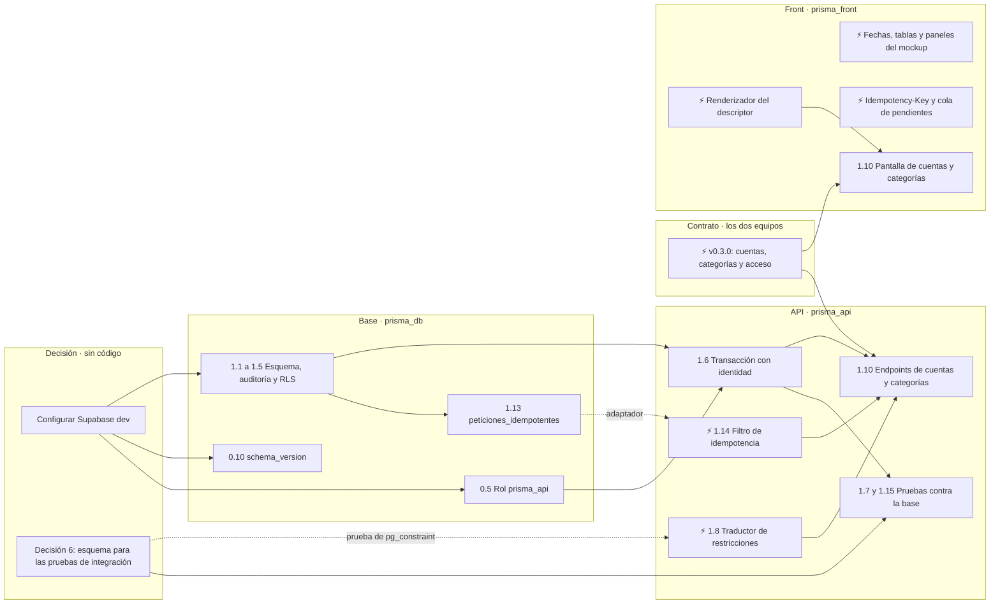

# Tareas de PRISMA

Lo hecho y lo pendiente, con los números de tarea del
[plan de desarrollo](docs/08-plan-de-desarrollo.md). El plan dice **qué** hay que hacer y **por
qué**; este archivo dice **en qué va**. Si discrepan sobre qué hay que hacer, manda el plan.

**Actualizado:** 16/09/2026 · **En curso:** cierre del Sprint 0 y arranque del Sprint 1

| Marca | Significa |
|---|---|
| `[x]` | Hecha y verificada: pruebas en verde y commit en `main` |
| `[ ]` | Pendiente |
| ⚡ | **Paralelizable ya:** no espera a nada que esté pendiente |
| 🔒 | Bloqueada por lo que dice al lado |
| ✏️ | Escrita pero sin verificar: SQL que todavía no corrió contra ninguna base |
| ⏭️ | Movida a otro sprint |

Cada tarea lleva su **carril**, que dice dónde se hace:

| Carril | Dónde | Quién |
|---|---|---|
| **API** | `prisma_api`, en `repositories/backend-api` | Equipo API |
| **Base** | `prisma_db`, en `repositories/backend-db` | Equipo API |
| **Front** | `prisma_front`, en `repositories/frontend-flutter` | Equipo Front |
| **Contrato** | `contrato/` de este repositorio | Los dos equipos, con revisión cruzada |
| **Decisión** | Sin código | Quien dirige el proyecto, o Gerencia |

---

## 1. Qué se puede hacer en paralelo ahora mismo

**Cuatro carriles pueden avanzar a la vez sin esperarse.** Solo el de la base está detenido, y lo
destraba una configuración, no una línea de código.

| Carril | Puede arrancar ya ⚡ | Espera a | Destraba |
|---|---|---|---|
| **Front** | El renderizador del descriptor contra `GET /formularios/{nombre}`, que ya existe. Fechas («14 sep 2026, 3:42 p. m.») y porcentajes como los arma el mockup. Tablas y paneles de confirmación en línea. `Idempotency-Key` en `cliente_api.dart` y la cola de pendientes | Nada: todo va contra el contrato v0.2.0 y la API simulada | La pantalla de 1.10 y las del Sprint 3 |
| **API** | El traductor restricción → código de 1.8. La parte HTTP del filtro de idempotencia de 1.14 —cabecera obligatoria, huella, `40901` y `40902`— contra un puerto con un doble en memoria | La base, para el adaptador de 1.14 y la prueba de `pg_constraint` de 1.8. **La transacción que comparten la clave y el efecto se diseña con 1.13, no antes** | 1.10 y 1.15 |
| **Contrato** | Acordar en `openapi.json` los endpoints de cuentas y categorías (1.10) y los de acceso (Sprint 2), y etiquetar v0.3.0. Hoy el contrato solo tiene `/formularios/{nombre}` y `/version` | La revisión de los dos equipos (21 §6.3) | La API y el front de 1.10 y del Sprint 2 |
| **Base** 🔒 | — | Supabase dev configurado | 0.5, 0.10 y casi todo el Sprint 1 |
| **Decisión** | Configurar Supabase dev, la decisión 6 y las licencias | — | La base y las pruebas de integración |

### Para destrabar, en orden de lo que más libera

- [ ] **Configurar el proyecto dev de Supabase** · Decisión — guardar la contraseña de la base;
      iniciar sesión con `npx supabase login` y enlazar `prisma_db` con `npx supabase link` (el CLI
      se descarga la primera vez); y llenar `backend-api/.env` a partir de `.env.ejemplo` con la
      conexión, que nunca se sube. Destraba 0.5, 0.10 y el carril de la base.
- [ ] **Decisión 6** · Decisión — cómo consiguen la API y su integración continua el esquema de
      `prisma_db` para las pruebas de integración: una etiqueta de `prisma_db`, un submódulo o una
      imagen de PostgreSQL con el esquema. Destraba 1.7, la prueba de 1.8 y 1.15. Dato útil: los
      ejecutores de GitHub Actions sí tienen Docker, aunque la máquina de desarrollo no.
- [ ] **Contrato v0.3.0** · Contrato — destraba 1.10 y el Sprint 2 en los dos lados.
- [ ] **Una sola licencia** · Decisión — este repositorio y el front están con AGPL-3.0; la API y
      la base, con GPL-3.0.

---

## 2. Sprint 0 · proyectos, ambientes y contrato

- [x] **0.1** Proyecto `prisma_api`: Java 25, Spring Boot 4 y Gradle, con el esqueleto hexagonal · API
- [x] **0.2** Regla de frontera con ArchUnit en la integración continua · API
- [x] **0.3** Proyecto `prisma_front` en Flutter, web por defecto · Front
- [ ] **0.4** Los cuatro proyectos de Supabase · Decisión — dev ya existe y falta configurarlo; qa,
      uat y prod se crean antes de promover, y uat y prod son de pago
- [ ] 🔒 **0.5** Rol `prisma_api` sin `BYPASSRLS`, sin `SUPERUSER` y sin ser dueño de las tablas ·
      Base — espera a Supabase dev
- [x] **0.6** Secretos fuera del repositorio: variables de entorno en la API y `--dart-define` en el
      front · API, Front
- [x] **0.7** Integración continua por proyecto: formato, análisis, pruebas y compilación · API, Front
- [ ] ⏭️ **0.8** Imagen de la API arrancando en los ambientes → Sprint 9
      ([ADR-026](docs/adr/ADR-026-railway-al-final.md)). El `Dockerfile` ya existe y la integración
      continua lo construye en cada push a `main` · API
- [ ] ⏭️ **0.9** Entrega a dev al fusionar → Sprint 9 ([ADR-026](docs/adr/ADR-026-railway-al-final.md)) ·
      API, Front
- [ ] 🔒 **0.10** SemVer y migraciones con `schema_version` · Base — el SemVer ya está en
      `build.gradle.kts` y en `pubspec.yaml`; falta la tabla `schema_version`, que espera a Supabase dev
- [x] **0.11** `GET /version`: versión de la API, del esquema y ambiente · API
- [x] **0.12** Insignia `v0.1.0 · Desarrollo` en el pie de la barra lateral y franja de ambiente · Front
- [x] **0.13** El front comprueba el MAJOR de la API y bloquea con la pantalla del mockup · Front
- [x] **0.14** Sobre `{status, mensaje, data}` en toda respuesta, también en los errores · API
- [x] **0.15** Catálogo único de códigos de cinco dígitos · API, Contrato
- [x] **0.16** Prueba C-03: el catálogo contra el código fuente, en los dos sentidos · API
- [x] **0.17** Descriptor de formulario generado del propio validador (RF-102) · API
- [x] **0.18** Swagger en `/docs` y prueba C-04 contra la copia fijada del contrato · API, Contrato

**Hecho fuera de la numeración:**

- [x] CORS con un origen por ambiente · API
- [x] Hilos virtuales de Java 25 en cada petición, vigilados por `HilosVirtualesTest` · API
- [x] Java 25, Gradle y Spring Boot 4 ([ADR-024](docs/adr/ADR-024-java-25-y-gradle.md)) · API
- [x] Cuatro repositorios en GitHub, cada uno con su remoto
      ([ADR-025](docs/adr/ADR-025-cuatro-repositorios.md)); este, desde el 16/09/2026 · Decisión
- [x] Contrato v0.2.0 en `contrato/`, con su copia fijada en la API · Contrato
- [x] Alojamiento: Railway, al final del desarrollo ([ADR-026](docs/adr/ADR-026-railway-al-final.md)) · Decisión
- [x] **H0**: mockup confirmado por Gerencia el 16/09/2026 · Decisión

**H1:** la insignia y el sobre en toda respuesta ya se cumplen; el despliegue automático a dev
llega con el Sprint 9.

---

## 3. Sprint 1 · base, RLS, identidad e idempotencia

✏️ quiere decir que el SQL ya está en la migración inicial de `prisma_db`
(`20260915120000_esquema_inicial.sql`) pero nunca corrió contra una base: no cuenta como hecho
hasta aplicarlo y probarlo.

- [ ] ✏️🔒 **1.1** Esquema completo con restricciones con nombre explícito · Base — las 22 tablas
      están escritas; falta aplicarlas y revisar que toda restricción tenga nombre · espera a Supabase dev
- [ ] ✏️🔒 **1.2** Revocar `DELETE` y `TRUNCATE` · Base · espera a 1.1
- [ ] ✏️🔒 **1.3** Triggers de auditoría sobre las tablas de negocio · Base · espera a 1.1
- [ ] ✏️🔒 **1.4** `fn_es_gerencia` y políticas RLS · Base · espera a 1.1
- [ ] 🔒 **1.5** `FORCE ROW LEVEL SECURITY` en todas las tablas · Base — no está en la migración ·
      espera a 1.4
- [ ] 🔒 **1.6** Transacción por petición con `request.jwt.claims` y `SET LOCAL ROLE authenticated` ·
      API · espera a 0.5 y 1.4
- [ ] 🔒 **1.7** Prueba de permisos con sesión real, con y sin la comprobación de la API · API ·
      espera a 1.6 y a la decisión 6
- [ ] ⚡ **1.8** Traducción restricción → código del catálogo · API — el traductor puede empezar ya;
      su prueba de `pg_constraint` espera a 1.1 y a la decisión 6
- [x] **1.9** `Dinero` en Java y en Dart · API, Front — `Dinero.java` con sumas que fallan al
      desbordar, porcentaje `HALF_UP` y formato colombiano; en el front, un tipo sin operadores y su
      formato en `ui/formato/moneda.dart`. Pruebas con las cifras de los documentos 05 y 06,
      verificadas en negativo
- [ ] 🔒 **1.10** Cuentas y categorías: endpoints y pantalla (RF-97) · API, Front, Contrato ·
      espera al contrato v0.3.0, 1.6, 1.8 y 1.14
- [ ] ✏️🔒 **1.11** Semilla reproducible para dev y qa · Base — `seed.sql` ya existe · espera a 1.1
- [ ] 🔒 **1.12** Primera promoción de migraciones dev → qa · Base · espera al proyecto qa de Supabase
- [ ] 🔒 **1.13** Tabla `peticiones_idempotentes` · Base — no está en la migración · espera a Supabase dev
- [ ] ⚡ **1.14** Filtro de idempotencia · API — la parte HTTP puede empezar contra un puerto; la
      transacción con el efecto espera a 1.13
- [ ] 🔒 **1.15** Prueba de corte entre el efecto y la clave · API · espera a 1.14 y a la decisión 6
- [ ] 🔒 **1.16** Purga de claves vencidas a las 72 horas · API, Base · espera a 1.13

**El front del Sprint 1** ([21 §4.2](docs/21-trabajo-en-paralelo.md)). El plan no lo numera, pero
es lo que evita que el equipo Front se quede esperando:

- [ ] ⚡ Renderizador del descriptor de formulario (RF-102), contra `GET /formularios/{nombre}` · Front
- [ ] ⚡ `Idempotency-Key` en cada escritura: la genera el front cuando la persona decide la acción,
      no en cada reintento ([ADR-020](docs/adr/ADR-020-idempotencia.md)) · Front
- [ ] ⚡ Cola de pendientes con la clave guardada antes de enviar; es la base de 9.1 · Front
- [ ] ⚡ Sistema de diseño del mockup: tablas, paneles de confirmación en línea, fechas y
      porcentajes con formato colombiano · Front
- [x] Formato de dinero, `$1.350.784` y `−$1.255.000`, con la 1.9 · Front

---

## 4. Sprint 2 · acceso, usuarios, cargos y canal firmado

Empieza por el contrato de acceso (v0.3.0). Con eso firmado, los dos carriles corren a la vez: la
API contra la base y el front contra la API simulada.

- [ ] **2.1** Autenticación contra Supabase Auth desde la API, con el correo sintético en el servidor · API
- [ ] **2.2** Sesión de 30 días y enrutamiento según la navegación que dicta la API · API, Front
- [ ] ✏️ **2.3** Tabla `cargos` con semilla y RLS · Base — escrita en la migración inicial
- [ ] ✏️ **2.4** Tabla `usuarios` con `usuario`, `nombre_completo`, `cargo_id` y `tipo` · Base — escrita
      en la migración inicial
- [ ] ✏️ **2.5** Trigger `tg_proteger_ultima_gerencia` · Base — escrito en la migración inicial
- [ ] ⚡ **2.6** Pantalla de acceso y cambio obligatorio de contraseña · Front — contra el mockup y la
      API simulada, una vez firmado el contrato
- [ ] **2.7** Gestión de usuarios: crear, editar, desactivar con motivo y restablecer clave · API, Front
- [ ] **2.8** Catálogo de cargos · API, Front
- [ ] **2.9** Registro de cada inicio de sesión con fecha, dispositivo e IP · API, Base
- [ ] ⚡ **2.10** Panel «Acerca de» (RF-100) · Front, API
- [ ] 🔒 **2.11** La prueba de permisos del Sprint 1, también contra la base de qa · API · espera al
      proyecto qa de Supabase
- [ ] **2.12** Clave de firma de sesión, solo en memoria en el front · API, Front
- [ ] **2.13** Filtro de firma: HMAC, nonce y marca de tiempo (`40101` a `40103`) · API
- [ ] **2.14** Navegación dictada por la API (RF-103) · API, Front
- [ ] **2.15** Tabla única de usuarios activos y desactivados (RF-84 a RF-87) · API, Front
- [ ] **2.16** Bitácora de cambios y reversión sin borrar (RF-88, RF-89, RF-91) · Base, API, Front
- [ ] **2.17** Cambio de clave obligatorio al reactivar (RF-90) · API, Front
- [ ] **2.18** Vista previa de Operación para Gerencia (RF-92 a RF-94) · Front, API

---

## 5. Sprints 3 a 8 · funcionalidades en dos cadenas paralelas

**Con dos equipos, las dos cadenas corren a la vez y comparten lo mínimo**: cada una tiene sus
tablas y su rango de códigos ([21 §4.3](docs/21-trabajo-en-paralelo.md)). Con un solo equipo, el
orden es el de [08 §7](docs/08-plan-de-desarrollo.md).

### Cadena A · el dinero

**Sprint 3 · Movimientos**

- [ ] **3.1** Dominio `Movimiento`, tipos y su efecto sobre utilidad, caja y patrimonio
- [ ] **3.2** Caso de uso `RegistrarMovimiento` con doble fecha
- [ ] **3.3** Repositorio de movimientos contra PostgreSQL
- [ ] **3.4** Endpoints de movimientos con sus códigos del catálogo
- [ ] **3.5** Formulario de registro rápido para celular, pintado del descriptor
- [ ] **3.6** Foto del recibo comprimida, subida a través de la API
- [ ] **3.7** Transferencias entre cuentas
- [ ] **3.8** Listado con filtros
- [ ] **3.9** Anulación con motivo obligatorio
- [ ] **3.10** Corrección por contra-asiento
- [ ] **3.11** Marca de registro tardío
- [ ] **3.12** Saldos por cuenta

**Sprint 6 · Reportes y KPIs** — espera a que las dos cadenas tengan su primera versión en `main`
([21 §4.4](docs/21-trabajo-en-paralelo.md)); sin qa hasta el Sprint 9 por ADR-026

- [ ] **6.1** Utilidad causada, flujo de caja y caja libre
- [ ] **6.2** Pruebas con el ejemplo de septiembre completo
- [ ] **6.3** Dashboard con las tres cifras
- [ ] **6.4** Gráfico de 12 meses
- [ ] **6.5** Reporte mensual y anual con promedio de ganancias
- [ ] **6.6** Punto de equilibrio
- [ ] **6.7** Alertas: caja libre negativa, anticipos y pedidos estancados
- [ ] **6.8** Cierre mensual con snapshot inmutable
- [ ] **6.9** Inicio de solo consulta y su descarga en CSV o PDF (RF-95, RF-96)

**Sprint 7 · Capital, retiros y patrimonio**

- [ ] **7.1** Inversiones en activos
- [ ] **7.2** Aportes de capital
- [ ] **7.3** Pro-labore con justificación
- [ ] **7.4** Retiro con división automática en pro-labore y distribución
- [ ] **7.5** Cálculo de patrimonio
- [ ] **7.6** Alerta de descapitalización a 12 meses
- [ ] **7.7** Los cuatro sobres con historial
- [ ] **7.8** Panel de sobres: asignado contra usado

### Cadena B · el pedido

**Sprint 5 · Productos y costeo**

- [ ] **5.1** Dominio `Producto` y servicio `calcularMargenes`
- [ ] **5.2** Catálogo de productos y servicios
- [ ] **5.3** Costeo unitario: insumo, consumibles y minutos de trabajo
- [ ] **5.4** Costeo de bordado por tiempo de máquina
- [ ] **5.5** Historial de costos con fecha de vigencia
- [ ] **5.6** Margen por hora
- [ ] **5.7** Sugerencia de precio por margen objetivo
- [ ] **5.8** Costos y márgenes ocultos al tipo Operación: la API no los envía
- [ ] **5.9** Cuadro comparativo ordenable por margen por hora

**Sprint 4 · Pedidos y anticipos**

- [ ] **4.1** Dominio `Pedido`, estados y transiciones
- [ ] **4.2** Gestión de clientes
- [ ] **4.3** Pedido con líneas de producto
- [ ] **4.4** `CobrarAnticipo`: crea pasivo, no ingreso
- [ ] **4.5** Función en la base que entrega el pedido y causa la venta en una transacción
- [ ] **4.6** Listado ordenado por fecha con filtros
- [ ] **4.7** Resaltado de pedidos estancados
- [ ] **4.8** Factura adjunta al pedido
- [ ] **4.9** Cancelación con destino del anticipo

**Sprint 8 · Cotizador**

- [ ] **8.8** Cotizaciones y remisiones en PDF con logo
- [ ] **8.9** Validador de anticipo mínimo

### Amortiguador · Nómina

La toma el equipo que termine primero su cadena: es la funcionalidad más independiente del sistema.

- [ ] **8.1** Registro de empleadas
- [ ] **8.2** Liquidación de nómina en la base, descontando adelantos
- [ ] **8.3** Adelantos como cuenta por cobrar
- [ ] **8.4** Desprendible PDF con acceso restringido al propio
- [ ] **8.5** Simulador de capacidad de pago
- [ ] **8.6** Traducción a unidades de producto por vender
- [ ] **8.7** Horas pagadas contra horas facturadas
- [ ] **8.10** Importador de CSV con mapeo y reporte de errores — sin cadena asignada

---

## 6. Sprint 9 · promoción, PWA y endurecimiento

**No se parte: lo hacen los dos equipos juntos**, porque consiste en integrar y probar lo de todos.

- [ ] ⏭️ **0.8** Imagen de la API arrancando en los ambientes, en Railway
- [ ] ⏭️ **0.9** Entrega a dev al fusionar
- [ ] **9.1** PWA instalable y cola persistente con la clave guardada antes de enviar
- [ ] **9.2** Ambiente uat con datos anonimizados y su semilla
- [ ] **9.3** Promoción de uat a prod sin recompilar
- [ ] **9.4** Reversión ensayada en qa, con el tiempo medido
- [ ] **9.5** Prueba de permisos con sesión real en los cuatro ambientes
- [ ] **9.6** Pruebas de extremo a extremo de los flujos críticos en qa
- [ ] **9.7** Rendimiento en celular real con 4G
- [ ] **9.8** Repaso de secretos: nada en los repositorios y `service_role` solo en migraciones
- [ ] **9.9** El front rechaza de verdad un MAJOR de API distinto
- [ ] **9.10** Etiquetar `1.0.0` del front y de la API
- [ ] **9.11** Swagger detrás de autenticación en prod

---

## 7. Decisiones pendientes

| # | Decisión | Quién | Bloquea | Estado |
|---|---|---|---|---|
| 1 | Dónde se aloja la API | Quien dirige | 0.8 | ✅ Railway, al final ([ADR-026](docs/adr/ADR-026-railway-al-final.md)) |
| 2 | Dónde se publica el front web | Quien dirige | 0.9 | ✅ Railway, al final ([ADR-026](docs/adr/ADR-026-railway-al-final.md)) |
| 3 | Los cuatro proyectos de Supabase y el pago de uat y prod | Quien dirige crea; Gerencia paga | 0.4 | 🟡 dev creado; faltan qa, uat y prod |
| 4 | PostgreSQL para desarrollar sin Docker | Quien dirige | 0.5, 0.10 y Sprint 1 | ✅ El proyecto dev de Supabase, mientras Docker no arranque |
| 5 | Remotos de los repositorios | Quien dirige | Integración continua | ✅ Los cuatro en GitHub |
| 6 | Cómo consiguen la API y su CI el esquema de `prisma_db` para las pruebas de integración | Equipo API | 1.7, 1.8 y 1.15 | ⬜ |
| 7 | Quién está en cada equipo, y quién sabe Flutter y Java para revisar el contrato | Quien dirige | Trabajar con dos equipos | ⬜ |
| 8 | Contrato por etiqueta de git o como paquete publicado | Los dos equipos | El primer cambio de contrato | ⬜ El documento se inclina por la etiqueta |
| 9 | Quién desempata un cambio de contrato | Quien dirige | El primer desacuerdo | ⬜ |
| 10 | Supuestos S1 a S5 de [01 §6](docs/01-vision-y-alcance.md) | Gerencia | Sprint 1 | ⬜ Por confirmar; el mockup ya está confirmado |
| 11 | El dominio `prismamy.co`, del que dependen el correo sintético, `api.prismamy.co` y CORS | Gerencia | El primer usuario real, porque el correo sintético es fijo de por vida ([ADR-009](docs/adr/ADR-009-login-por-usuario.md)) | ⬜ |
| 12 | Plazos de conservación y registro de bases de datos personales (Ley 1581) | Un abogado | Go-live | ⬜ |
| 13 | Qué objetivos nativos se publican | Gerencia | Nada hoy: no hay disparador | ⬜ |
| 14 | Una sola licencia para los cuatro repositorios | Quien dirige | Nada técnico | ⬜ AGPL-3.0 en este y en el front; GPL-3.0 en la API y la base |

**Lo que el modelo de datos todavía no define** ([04](docs/04-modelo-de-datos.md)):

- [ ] La variante del trigger de auditoría para `usuarios`, que detecta `desactivado_en` · Sprint 2
- [ ] El `CREATE TABLE` de `adjuntos` · Sprint 3, tarea 3.6
- [ ] El `CREATE TABLE` de `cotizaciones` y `cotizacion_lineas` · Sprint 8, tarea 8.8

---

## 8. A vigilar

- **Dinero con decimales en la frontera.** Cuando llegue el primer endpoint que recibe plata (1.10),
  comprobar con una prueba que un JSON con `1500.5` en un campo de dinero se rechaza y no se trunca
  a `1500` en silencio. ADR-003 exige rechazarlo, y la conversión de Jackson hay que verla, no
  suponerla.
- **La base de desarrollo es compartida.** Mientras dev sea el proyecto de Supabase en la nube,
  todos desarrollan contra la misma base, que es lo que [21 §6.4](docs/21-trabajo-en-paralelo.md)
  pide evitar. Con una persona no estorba; con dos equipos, cada quien necesita su PostgreSQL local.
- **Sin qa hasta el Sprint 9** ([ADR-026](docs/adr/ADR-026-railway-al-final.md)): mientras tanto,
  «terminado» es fusionado a `main` con la integración continua en verde.
- **El servicio de Railway conectado a `prisma_front`** intenta construir en cada push y falla,
  porque todavía no hay receta de construcción para Flutter. Conviene desconectarlo hasta el Sprint 9.
- **`dart.yml` del front** es la plantilla de GitHub y falla con Flutter. Se dejó a propósito; la
  integración continua de verdad es `ci.yml`.

## 9. Decisiones del Sprint 0 que conviene revisar

Las tomó quien construyó el Sprint 0, no quien dirige el proyecto:

- [ ] Los errores 405, 406 y 415 responden 400 con el código `40000`
- [ ] `@PendienteDeEmitir` marca en el catálogo los códigos que todavía nadie emite
- [ ] El catálogo de códigos va dentro del OpenAPI, en `x-prisma-codigos`
- [ ] La pantalla de versión incompatible tiene tres filas de versiones y no las dos del mockup
- [ ] Se siguió el texto del mockup y no el literal del escenario BDD-101-1

---

## Cómo se mantiene este archivo

- Una tarea se marca `[x]` cuando su commit está en `main` con la integración continua en verde. Lo
  escrito pero no probado lleva ✏️, no `[x]`.
- **Lo nuevo no entra aquí primero.** Una tarea que no está en el plan va al plan o, si es una idea
  para después, al [roadmap](docs/14-roadmap-e-ideas.md) (08 §6).
- Es un documento compartido, como todo `docs/`: lo actualizan los dos equipos.
