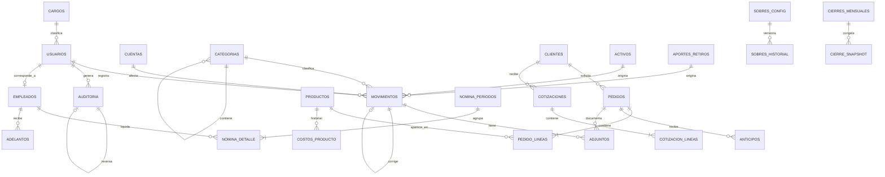

# 04 · Modelo de datos

Base de datos PostgreSQL sobre Supabase. **Solo escritura: nada se elimina jamás.**

---

## 1. Principios del modelo

| # | Principio | Implicación |
|---|---|---|
| 1 | **Nada se borra** | No existe `DELETE`. El permiso está revocado en el motor |
| 2 | **Toda fila es auditable** | Triggers escriben quién, cuándo, desde dónde y qué cambió |
| 3 | **Dinero en enteros** | `BIGINT` de pesos colombianos. Nunca `NUMERIC` ni `FLOAT` |
| 4 | **Doble fecha** | `fecha_movimiento` (real) y `creado_en` (digitación) |
| 5 | **Zona horaria fija** | Todo `TIMESTAMPTZ` se opera en `America/Bogota` |
| 6 | **Permisos en la base** | Row Level Security por tipo de usuario en cada tabla |
| 7 | **El anticipo es pasivo** | Tabla propia, no una columna de ingreso |

---

## 2. Diagrama entidad–relación



---

## 3. Catálogo de entidades

| # | Tabla | Propósito | Sensible |
|---|---|---|:---:|
| 1 | `usuarios` | Personas con acceso, su tipo y su cargo | ✅ |
| 2 | `cuentas` | Efectivo, Nequi, Daviplata, bancos | |
| 3 | `categorias` | Árbol de categorías de ingreso y gasto | |
| 4 | `movimientos` | Libro único de todo lo que entra y sale | ✅ |
| 5 | `adjuntos` | Fotos y PDF asociados a movimientos o pedidos | |
| 6 | `clientes` | Datos de contacto e historial | ✅ |
| 7 | `pedidos` | Encabezado del pedido o factura | |
| 8 | `pedido_lineas` | Detalle de productos, cantidades y precios | |
| 9 | `anticipos` | Pasivo por pedidos no entregados | |
| 10 | `productos` | Catálogo de productos y servicios | |
| 11 | `costos_producto` | Historial de costos y precios | ✅ |
| 12 | `cotizaciones` | Cotizaciones emitidas | |
| 13 | `cotizacion_lineas` | Detalle de la cotización | |
| 14 | `activos` | Inversiones en equipos y herramientas | ✅ |
| 15 | `aportes_retiros` | Capital que entra y sale de la propiedad | ✅ |
| 16 | `prolabore_config` | Sueldo mensual definido para la gerencia | ✅ |
| 17 | `empleados` | Personal contratado | ✅ |
| 18 | `nomina_periodos` | Períodos liquidados | ✅ |
| 19 | `nomina_detalle` | Liquidación por empleada y período | ✅ |
| 20 | `adelantos` | Adelantos como cuenta por cobrar | ✅ |
| 21 | `sobres_config` | Porcentajes de los 4 sobres | ✅ |
| 22 | `cierres_mensuales` | Snapshot inmutable de cada mes cerrado | ✅ |
| 23 | `auditoria` | Bitácora de todos los cambios | ✅ |
| 24 | `cargos` | Catálogo de cargos del negocio, administrado por Gerencia | |

*Sensible = el acceso a la tabla está restringido por Row Level Security (§7). En la mayoría eso
significa «solo Gerencia», pero no en todas: en `usuarios`, `empleados`, `nomina_periodos`,
`nomina_detalle` y `adelantos` cada persona alcanza **su propia fila y nada más**; `clientes` lo
lee y lo crea cualquiera, porque sin cliente no hay pedido (CU-05); y `movimientos` lo lee todo
el mundo, porque los dos tipos registran el día a día. La regla de cada tabla está en el §7.*

`cargos` va al final de la lista para no renumerar las 23 entidades anteriores. En el esquema
SQL sí aparece antes de `usuarios`, porque `usuarios` la referencia.

---

## 4. Esquema SQL

### 4.1 Tipos y convenciones comunes

```sql
CREATE EXTENSION IF NOT EXISTS citext;   -- requerido por usuarios.usuario

CREATE TYPE tipo_usuario    AS ENUM ('gerencia', 'operacion');
CREATE TYPE tipo_movimiento AS ENUM ('ingreso','gasto','transferencia','inversion',
                                     'aporte','retiro_prolabore','retiro_distribucion',
                                     'anticipo_recibido','adelanto_empleada');
CREATE TYPE estado_pedido   AS ENUM ('cotizado','en_proceso','parcial','entregado','cancelado');
CREATE TYPE tipo_item       AS ENUM ('producto','servicio');

-- Columnas de anulación presentes en TODAS las tablas de negocio
--   anulado_en           TIMESTAMPTZ
--   anulado_por          UUID REFERENCES usuarios(id)
--   anulado_motivo       TEXT
--   anulado_dispositivo  TEXT
--   anulado_ip           INET
```

El ENUM antes se llamaba `rol_usuario`. Se renombró a `tipo_usuario` para que el vocabulario
del código coincida con el del negocio y deje de competir con la palabra «rol», que ahora se
confundiría con el **cargo**. Los dos valores siguen siendo exactamente los mismos.

> **El tipo dice qué puede ver. El cargo dice qué hace.** El tipo (`usuarios.tipo`) es lo que
> evalúa Row Level Security: es autoridad. El cargo (`usuarios.cargo_id`) es descriptivo y
> **nunca decide un permiso**.

`CITEXT` es el tipo de `usuarios.usuario` y viene de una extensión, no del núcleo de
PostgreSQL: sin `CREATE EXTENSION IF NOT EXISTS citext;` la tabla no se crea.

> **Convención de dinero.** Toda columna monetaria es `BIGINT` y guarda **pesos enteros**.
> `1.500.000` se almacena como `1500000`. Nunca decimales: el peso colombiano no usa centavos
> en la práctica y los errores de redondeo de punto flotante se acumulan de forma invisible.

### 4.2 Cargos, usuarios y cuentas

```sql
CREATE TABLE cargos (
  id             UUID PRIMARY KEY DEFAULT gen_random_uuid(),
  nombre         TEXT NOT NULL UNIQUE,
  descripcion    TEXT,
  orden          SMALLINT NOT NULL DEFAULT 0,
  activo         BOOLEAN NOT NULL DEFAULT TRUE,
  creado_en      TIMESTAMPTZ NOT NULL DEFAULT NOW(),
  creado_por     UUID,   -- llave foránea a usuarios: se agrega más abajo
  anulado_en     TIMESTAMPTZ,
  anulado_por    UUID,   -- ídem
  anulado_motivo TEXT,
  CONSTRAINT anulacion_con_motivo
    CHECK (anulado_en IS NULL OR (anulado_por IS NOT NULL AND anulado_motivo IS NOT NULL)),
  CONSTRAINT desactivacion_con_motivo
    CHECK (activo OR anulado_en IS NOT NULL)
);
```

Un cargo **nunca se borra**: se desactiva con motivo, igual que el resto del modelo. Así los
usuarios históricos que lo tuvieron conservan sentido.

`cargos` tiene dos maneras de decir «inactivo»: `activo` y `anulado_en`. La restricción
`desactivacion_con_motivo` las amarra. Sin ella se podía apagar un cargo dejando `anulado_en`
vacío, y el `CHECK` de motivo —que solo se activa cuando hay `anulado_en`— no se enteraba: un
cargo desactivado sin explicación, justo lo que el modelo no permite en ninguna otra tabla.

`cargos` y `usuarios` se referencian mutuamente. Por eso `cargos` se crea **sin** las dos llaves
foráneas hacia `usuarios` y se agregan con `ALTER TABLE` en cuanto `usuarios` existe. Dejarlas
escritas dentro del `CREATE TABLE` hace fallar el script completo: en ese punto `usuarios`
todavía no está creada.

El catálogo arranca con seis cargos y Gerencia lo administra desde el sistema:

```sql
INSERT INTO cargos (nombre, descripcion, orden) VALUES
  ('Gerente',                  'Dirige el negocio y toma las decisiones financieras', 1),
  ('Empleada de producción',   'Estampado, corte, sublimación y terminado',           2),
  ('Domiciliaria',             'Entregas a cliente y mensajería',                     3),
  ('Asistente administrativa', 'Atención, cotizaciones y registro de movimientos',    4),
  ('Aprendiz SENA',            'Etapa productiva con apoyo en producción',            5),
  ('Contratista externo',      'Servicios puntuales facturados, sin nómina',          6);
```

```sql
CREATE TABLE usuarios (
  id                 UUID PRIMARY KEY REFERENCES auth.users(id),
  usuario            CITEXT NOT NULL UNIQUE
                       CHECK (usuario ~ '^[a-z0-9][a-z0-9._-]{2,19}$'),
  nombre_completo    TEXT NOT NULL CHECK (length(trim(nombre_completo)) >= 3),
  cargo_id           UUID REFERENCES cargos(id),
  tipo               tipo_usuario NOT NULL DEFAULT 'operacion',
  activo             BOOLEAN NOT NULL DEFAULT TRUE,
  debe_cambiar_clave BOOLEAN NOT NULL DEFAULT TRUE,
  ultimo_acceso      TIMESTAMPTZ,
  creado_en          TIMESTAMPTZ NOT NULL DEFAULT NOW(),
  creado_por         UUID REFERENCES usuarios(id),
  desactivado_en     TIMESTAMPTZ,
  desactivado_por    UUID REFERENCES usuarios(id),
  desactivado_motivo TEXT,
  CONSTRAINT desactivacion_con_motivo
    CHECK (activo OR (desactivado_en         IS NOT NULL
                      AND desactivado_por    IS NOT NULL
                      AND desactivado_motivo IS NOT NULL))
);

CREATE INDEX idx_usuarios_tipo ON usuarios (tipo) WHERE activo;

-- Ya existe `usuarios`: se cierran las dos llaves foráneas que quedaron pendientes en `cargos`.
ALTER TABLE cargos
  ADD CONSTRAINT cargos_creado_por_fkey  FOREIGN KEY (creado_por)  REFERENCES usuarios(id),
  ADD CONSTRAINT cargos_anulado_por_fkey FOREIGN KEY (anulado_por) REFERENCES usuarios(id);
```

La restricción exige también `desactivado_en`, no solo el motivo y el autor. Sin esa condición
se podía marcar a alguien inactivo sin dejar la hora, y una desactivación sin fecha no se puede
cruzar con la bitácora.

> **`desactivado_en / _por / _motivo` son el estado actual, no la historia.** Responden «¿por qué
> está inactiva **hoy**?». Al reactivar a alguien, las tres columnas se limpian y
> `debe_cambiar_clave` vuelve a `TRUE`. A primera vista parece que se pierde información, y no se
> pierde nada: la desactivación, con su fecha, su autor y su motivo, quedó escrita en `auditoria`,
> y de ahí no la borra nadie (§5.4). La ficha dice **cómo está** la persona; la bitácora dice
> **qué le ha pasado**. Quien mezcle las dos preguntas termina duplicando la historia en `usuarios`.

> **`CITEXT` y el `CHECK` no hacen lo mismo, y conviene saberlo.** `CITEXT` vuelve insensible a
> mayúsculas la comparación y el `UNIQUE`: `Maria` y `maria` no pueden coexistir, y buscar
> `Maria` al iniciar sesión encuentra la fila guardada como `maria`. El operador `~` del `CHECK`
> sí distingue mayúsculas —`citext` no lo redefine, se compara como texto plano—, así que
> `^[a-z0-9]…` obliga a **guardar** el usuario en minúsculas. Es lo que queremos, pero implica
> que la aplicación normaliza antes de insertar: si manda `Maria`, la fila se rechaza en vez de
> corregirse sola.

El orden de creación importa en dos sitios más del esquema, por cómo están escritas las tablas:
`movimientos.pedido_id → pedidos` (§4.3, pero `pedidos` se crea en §4.4) y
`pedido_lineas.producto_id → productos` (§4.4, pero `productos` se crea en §4.5). En el script
real esas dos llaves también se agregan con `ALTER TABLE` al final.

Qué cambió frente a la versión anterior y por qué:

| Antes | Ahora | Por qué |
|---|---|---|
| `nombre TEXT NOT NULL` | `nombre_completo TEXT NOT NULL` | El nombre completo es un dato distinto del usuario de acceso; el nombre a secas se confundía con el identificador |
| — | `usuario CITEXT UNIQUE` | Es con lo que se inicia sesión. `CITEXT` para que `Maria` y `maria` sean la misma persona |
| `rol rol_usuario` | `tipo tipo_usuario` | El vocabulario del código ahora coincide con el del negocio |
| — | `cargo_id UUID REFERENCES cargos(id)` | El cargo dentro de la operación |
| — | `debe_cambiar_clave` | Fuerza el cambio en el primer ingreso y tras un restablecimiento |
| — | `ultimo_acceso` | Permite a Gerencia ver quién dejó de entrar |
| — | `desactivado_en / _por / _motivo` | Un usuario no se borra: se desactiva con motivo |

**`usuarios` y `empleados` son tablas distintas, y eso es deliberado.**

| Tabla | Quién es | Puede no tener |
|---|---|---|
| `usuarios` | Quien **entra al sistema** | Estar en nómina (un contratista externo) |
| `empleados` | Quien **está en nómina** | Tener acceso (alguien que no usa el sistema) |

`empleados.usuario_id` las conecta cuando la misma persona es ambas cosas. El cargo vive en
`usuarios` porque describe a la persona dentro de la operación, no su liquidación; `empleados`
conserva lo suyo: salario, fecha de ingreso y horas mensuales.

> **Redundancia aceptada.** Si una empleada tiene acceso, su nombre aparece dos veces:
> `usuarios.nombre_completo` y `empleados.nombre`. Se acepta porque las dos tablas tienen
> ciclos de vida independientes. La fuente de verdad para la nómina es `empleados.nombre`;
> para la sesión, `usuarios.nombre_completo`.

```sql
CREATE TABLE cuentas (
  id            UUID PRIMARY KEY DEFAULT gen_random_uuid(),
  nombre        TEXT NOT NULL,
  tipo          TEXT NOT NULL CHECK (tipo IN ('efectivo','billetera','banco')),
  saldo_inicial BIGINT NOT NULL DEFAULT 0,
  orden         SMALLINT NOT NULL DEFAULT 0,
  creado_en     TIMESTAMPTZ NOT NULL DEFAULT NOW(),
  anulado_en    TIMESTAMPTZ,
  anulado_por   UUID REFERENCES usuarios(id),
  anulado_motivo TEXT,
  CONSTRAINT anulacion_con_motivo
    CHECK (anulado_en IS NULL OR (anulado_por IS NOT NULL AND anulado_motivo IS NOT NULL))
);

CREATE TABLE categorias (
  id            UUID PRIMARY KEY DEFAULT gen_random_uuid(),
  padre_id      UUID REFERENCES categorias(id),
  nombre        TEXT NOT NULL,
  naturaleza    TEXT NOT NULL CHECK (naturaleza IN ('ingreso','gasto')),
  es_fijo       BOOLEAN NOT NULL DEFAULT FALSE,
  creado_en     TIMESTAMPTZ NOT NULL DEFAULT NOW(),
  anulado_en    TIMESTAMPTZ,
  anulado_por   UUID REFERENCES usuarios(id),
  anulado_motivo TEXT
);
```

`es_fijo` marca las categorías de gasto fijo mensual (arriendo, servicios, internet), que se
usan para calcular la **caja libre**.

### 4.3 Movimientos — el libro único

```sql
CREATE TABLE movimientos (
  id                UUID PRIMARY KEY DEFAULT gen_random_uuid(),
  tipo              tipo_movimiento NOT NULL,
  valor             BIGINT NOT NULL CHECK (valor > 0),
  fecha_movimiento  DATE NOT NULL,
  cuenta_id         UUID NOT NULL REFERENCES cuentas(id),
  cuenta_destino_id UUID REFERENCES cuentas(id),
  categoria_id      UUID REFERENCES categorias(id),
  pedido_id         UUID REFERENCES pedidos(id),
  descripcion       TEXT,
  corrige_a_id      UUID REFERENCES movimientos(id),

  creado_por        UUID NOT NULL REFERENCES usuarios(id),
  creado_en         TIMESTAMPTZ NOT NULL DEFAULT NOW(),
  dispositivo       TEXT,
  ip                INET,

  anulado_en        TIMESTAMPTZ,
  anulado_por       UUID REFERENCES usuarios(id),
  anulado_motivo    TEXT,
  anulado_dispositivo TEXT,
  anulado_ip        INET,

  CONSTRAINT fecha_no_futura CHECK (fecha_movimiento <= CURRENT_DATE),
  CONSTRAINT transferencia_con_destino
    CHECK (tipo <> 'transferencia' OR cuenta_destino_id IS NOT NULL),
  CONSTRAINT anulacion_con_motivo
    CHECK (anulado_en IS NULL OR (anulado_por IS NOT NULL AND anulado_motivo IS NOT NULL))
);

CREATE INDEX idx_mov_fecha     ON movimientos (fecha_movimiento DESC)
  WHERE anulado_en IS NULL;
CREATE INDEX idx_mov_cuenta    ON movimientos (cuenta_id, fecha_movimiento DESC)
  WHERE anulado_en IS NULL;
CREATE INDEX idx_mov_tipo      ON movimientos (tipo, fecha_movimiento DESC)
  WHERE anulado_en IS NULL;
CREATE INDEX idx_mov_pedido    ON movimientos (pedido_id) WHERE pedido_id IS NOT NULL;
```

**El campo `tipo` es la clave de todo el modelo financiero.** Determina si el movimiento afecta
la utilidad, la caja, el patrimonio o ninguno:

| `tipo` | ¿Afecta utilidad? | ¿Afecta caja? | ¿Afecta patrimonio? |
|---|:---:|:---:|:---:|
| `ingreso` | ✅ sube | ✅ sube | ✅ sube |
| `gasto` | ✅ baja | ✅ baja | ✅ baja |
| `transferencia` | ❌ | ↔ neutra | ❌ |
| `inversion` | ❌ | ✅ baja | ❌ cambia forma |
| `aporte` | ❌ | ✅ sube | ✅ sube |
| `retiro_prolabore` | ✅ **baja** | ✅ baja | ✅ baja |
| `retiro_distribucion` | ❌ | ✅ baja | ✅ baja |
| `anticipo_recibido` | ❌ | ✅ sube | ❌ crea pasivo |
| `adelanto_empleada` | ❌ | ✅ baja | ❌ crea por cobrar |

> Esta tabla es la traducción exacta de las reglas RN-03 a RN-11. Cualquier duda sobre cómo
> registrar algo se responde aquí.

### 4.4 Pedidos, líneas y anticipos

```sql
CREATE TABLE clientes (
  id          UUID PRIMARY KEY DEFAULT gen_random_uuid(),
  nombre      TEXT NOT NULL,
  telefono    TEXT,
  correo      TEXT,
  notas       TEXT,
  creado_en   TIMESTAMPTZ NOT NULL DEFAULT NOW(),
  anulado_en  TIMESTAMPTZ,
  anulado_por UUID REFERENCES usuarios(id),
  anulado_motivo TEXT
);

CREATE TABLE pedidos (
  id                 UUID PRIMARY KEY DEFAULT gen_random_uuid(),
  numero             TEXT UNIQUE NOT NULL,
  cliente_id         UUID NOT NULL REFERENCES clientes(id),
  fecha_pedido       DATE NOT NULL,
  fecha_entrega_prev DATE,
  fecha_entrega_real DATE,
  estado             estado_pedido NOT NULL DEFAULT 'en_proceso',
  valor_total        BIGINT NOT NULL CHECK (valor_total > 0),
  costo_directo      BIGINT NOT NULL DEFAULT 0,
  anticipo_pct       SMALLINT NOT NULL DEFAULT 50 CHECK (anticipo_pct BETWEEN 0 AND 100),
  horas_trabajo      NUMERIC(6,2) NOT NULL DEFAULT 0,
  notas              TEXT,
  creado_por         UUID NOT NULL REFERENCES usuarios(id),
  creado_en          TIMESTAMPTZ NOT NULL DEFAULT NOW(),
  anulado_en         TIMESTAMPTZ,
  anulado_por        UUID REFERENCES usuarios(id),
  anulado_motivo     TEXT,
  CONSTRAINT entregado_con_fecha
    CHECK (estado <> 'entregado' OR fecha_entrega_real IS NOT NULL)
);

CREATE INDEX idx_pedidos_fecha  ON pedidos (fecha_pedido DESC) WHERE anulado_en IS NULL;
CREATE INDEX idx_pedidos_estado ON pedidos (estado, fecha_pedido DESC) WHERE anulado_en IS NULL;

CREATE TABLE pedido_lineas (
  id             UUID PRIMARY KEY DEFAULT gen_random_uuid(),
  pedido_id      UUID NOT NULL REFERENCES pedidos(id),
  producto_id    UUID NOT NULL REFERENCES productos(id),
  cantidad       INTEGER NOT NULL CHECK (cantidad > 0),
  precio_unitario BIGINT NOT NULL CHECK (precio_unitario >= 0),
  costo_unitario BIGINT NOT NULL DEFAULT 0,
  horas_unitarias NUMERIC(6,2) NOT NULL DEFAULT 0
);

CREATE TABLE anticipos (
  id            UUID PRIMARY KEY DEFAULT gen_random_uuid(),
  pedido_id     UUID NOT NULL REFERENCES pedidos(id),
  movimiento_id UUID NOT NULL REFERENCES movimientos(id),
  valor         BIGINT NOT NULL CHECK (valor > 0),
  fecha         DATE NOT NULL,
  devengado_en  DATE,
  anulado_en    TIMESTAMPTZ,
  anulado_por   UUID REFERENCES usuarios(id),
  anulado_motivo TEXT
);

CREATE INDEX idx_anticipos_pendientes ON anticipos (pedido_id)
  WHERE devengado_en IS NULL AND anulado_en IS NULL;
```

`devengado_en IS NULL` identifica los **anticipos por devengar**: la plata que está en la cuenta
pero todavía no es del negocio. Es el insumo directo del cálculo de caja libre.

### 4.5 Productos, costeo y cotizaciones

```sql
CREATE TABLE productos (
  id            UUID PRIMARY KEY DEFAULT gen_random_uuid(),
  nombre        TEXT NOT NULL,
  tipo          tipo_item NOT NULL DEFAULT 'producto',
  unidad        TEXT NOT NULL DEFAULT 'unidad',
  precio_actual BIGINT NOT NULL DEFAULT 0,
  activo        BOOLEAN NOT NULL DEFAULT TRUE,
  creado_en     TIMESTAMPTZ NOT NULL DEFAULT NOW(),
  anulado_en    TIMESTAMPTZ,
  anulado_por   UUID REFERENCES usuarios(id),
  anulado_motivo TEXT
);

CREATE TABLE costos_producto (
  id                 UUID PRIMARY KEY DEFAULT gen_random_uuid(),
  producto_id        UUID NOT NULL REFERENCES productos(id),
  vigente_desde      DATE NOT NULL,
  costo_insumo       BIGINT NOT NULL DEFAULT 0,
  costo_consumibles  BIGINT NOT NULL DEFAULT 0,
  minutos_trabajo    NUMERIC(6,2) NOT NULL DEFAULT 0,
  minutos_maquina    NUMERIC(6,2) NOT NULL DEFAULT 0,
  tarifa_hora        BIGINT NOT NULL DEFAULT 0,
  precio_venta       BIGINT NOT NULL DEFAULT 0,
  creado_por         UUID NOT NULL REFERENCES usuarios(id),
  creado_en          TIMESTAMPTZ NOT NULL DEFAULT NOW()
);

CREATE INDEX idx_costos_vigencia ON costos_producto (producto_id, vigente_desde DESC);
```

El costo unitario nunca se sobrescribe: cada cambio crea una fila nueva con su fecha de
vigencia. Así un pedido antiguo conserva el costo que tenía cuando se produjo.

`minutos_maquina` es lo que permite costear el **bordado** por tiempo de máquina en lugar de
por unidad de producto.

### 4.6 Inversiones, capital y pro-labore

```sql
CREATE TABLE activos (
  id              UUID PRIMARY KEY DEFAULT gen_random_uuid(),
  nombre          TEXT NOT NULL,
  fecha_compra    DATE NOT NULL,
  valor_compra    BIGINT NOT NULL CHECK (valor_compra > 0),
  vida_util_meses SMALLINT,
  movimiento_id   UUID REFERENCES movimientos(id),
  estado          TEXT NOT NULL DEFAULT 'en_uso',
  anulado_en      TIMESTAMPTZ,
  anulado_por     UUID REFERENCES usuarios(id),
  anulado_motivo  TEXT
);

CREATE TABLE aportes_retiros (
  id             UUID PRIMARY KEY DEFAULT gen_random_uuid(),
  clase          TEXT NOT NULL CHECK (clase IN ('aporte','prolabore','distribucion')),
  valor          BIGINT NOT NULL CHECK (valor > 0),
  fecha          DATE NOT NULL,
  movimiento_id  UUID NOT NULL REFERENCES movimientos(id),
  nota           TEXT,
  anulado_en     TIMESTAMPTZ,
  anulado_por    UUID REFERENCES usuarios(id),
  anulado_motivo TEXT
);

CREATE TABLE prolabore_config (
  id             UUID PRIMARY KEY DEFAULT gen_random_uuid(),
  vigente_desde  DATE NOT NULL,
  valor_mensual  BIGINT NOT NULL CHECK (valor_mensual >= 0),
  horas_mensuales NUMERIC(6,2) NOT NULL DEFAULT 0,
  justificacion  TEXT,
  creado_por     UUID NOT NULL REFERENCES usuarios(id),
  creado_en      TIMESTAMPTZ NOT NULL DEFAULT NOW()
);
```

`clase` separa los tres conceptos que hoy se confunden en uno solo: **aporte** de capital,
**pro-labore** (gasto) y **distribución** de utilidades (no gasto).

### 4.7 Personal y nómina

```sql
CREATE TABLE empleados (
  id               UUID PRIMARY KEY DEFAULT gen_random_uuid(),
  usuario_id       UUID UNIQUE REFERENCES usuarios(id),
  nombre           TEXT NOT NULL,
  documento        TEXT,
  fecha_ingreso    DATE NOT NULL,
  fecha_retiro     DATE,
  salario_acordado BIGINT NOT NULL CHECK (salario_acordado > 0),
  horas_mensuales  NUMERIC(6,2) NOT NULL DEFAULT 192,
  anulado_en       TIMESTAMPTZ,
  anulado_por      UUID REFERENCES usuarios(id),
  anulado_motivo   TEXT
);

CREATE TABLE nomina_periodos (
  id          UUID PRIMARY KEY DEFAULT gen_random_uuid(),
  anio        SMALLINT NOT NULL,
  mes         SMALLINT NOT NULL CHECK (mes BETWEEN 1 AND 12),
  cerrado_en  TIMESTAMPTZ,
  cerrado_por UUID REFERENCES usuarios(id),
  UNIQUE (anio, mes)
);

CREATE TABLE nomina_detalle (
  id                UUID PRIMARY KEY DEFAULT gen_random_uuid(),
  periodo_id        UUID NOT NULL REFERENCES nomina_periodos(id),
  empleado_id       UUID NOT NULL REFERENCES empleados(id),
  dias_trabajados   SMALLINT NOT NULL DEFAULT 30,
  salario_base      BIGINT NOT NULL,
  horas_extra       NUMERIC(6,2) NOT NULL DEFAULT 0,
  valor_horas_extra BIGINT NOT NULL DEFAULT 0,
  otros_devengados  BIGINT NOT NULL DEFAULT 0,
  adelantos_desc    BIGINT NOT NULL DEFAULT 0,
  otros_descuentos  BIGINT NOT NULL DEFAULT 0,
  neto_pagado       BIGINT NOT NULL,
  movimiento_id     UUID REFERENCES movimientos(id),
  creado_por        UUID NOT NULL REFERENCES usuarios(id),
  creado_en         TIMESTAMPTZ NOT NULL DEFAULT NOW(),
  UNIQUE (periodo_id, empleado_id)
);

CREATE TABLE adelantos (
  id             UUID PRIMARY KEY DEFAULT gen_random_uuid(),
  empleado_id    UUID NOT NULL REFERENCES empleados(id),
  movimiento_id  UUID NOT NULL REFERENCES movimientos(id),
  valor          BIGINT NOT NULL CHECK (valor > 0),
  fecha          DATE NOT NULL,
  descontado_en  UUID REFERENCES nomina_detalle(id),
  anulado_en     TIMESTAMPTZ,
  anulado_por    UUID REFERENCES usuarios(id),
  anulado_motivo TEXT
);

CREATE INDEX idx_adelantos_pendientes ON adelantos (empleado_id)
  WHERE descontado_en IS NULL AND anulado_en IS NULL;
```

`empleados.usuario_id` es `UNIQUE`. El diagrama del §2 dibuja `USUARIOS ||--o| EMPLEADOS`, o sea
«cero o una»; sin el `UNIQUE` el SQL permitía dos empleados colgados del mismo usuario y el
desprendible de nómina se le mostraba a la persona equivocada.

`descontado_en IS NULL` identifica los adelantos aún no descontados: la cuenta por cobrar viva.
El índice parcial garantiza que **un adelanto se descuente una sola vez** (RN-11).

### 4.8 Sobres y cierres

```sql
CREATE TABLE sobres_config (
  id                UUID PRIMARY KEY DEFAULT gen_random_uuid(),
  vigente_desde     DATE NOT NULL,
  pct_costo_directo SMALLINT NOT NULL,
  pct_gastos_fijos  SMALLINT NOT NULL,
  pct_reserva       SMALLINT NOT NULL,
  pct_retiro        SMALLINT NOT NULL,
  creado_por        UUID NOT NULL REFERENCES usuarios(id),
  creado_en         TIMESTAMPTZ NOT NULL DEFAULT NOW(),
  CONSTRAINT suma_cien CHECK (
    pct_costo_directo + pct_gastos_fijos + pct_reserva + pct_retiro = 100)
);

CREATE TABLE cierres_mensuales (
  id                 UUID PRIMARY KEY DEFAULT gen_random_uuid(),
  anio               SMALLINT NOT NULL,
  mes                SMALLINT NOT NULL CHECK (mes BETWEEN 1 AND 12),
  ingresos_causados  BIGINT NOT NULL,
  costos_directos    BIGINT NOT NULL,
  gastos_operativos  BIGINT NOT NULL,
  prolabore          BIGINT NOT NULL,
  nomina             BIGINT NOT NULL,
  utilidad_causada   BIGINT NOT NULL,
  flujo_caja         BIGINT NOT NULL,
  caja_libre_cierre  BIGINT NOT NULL,
  anticipos_abiertos BIGINT NOT NULL,
  cerrado_por        UUID NOT NULL REFERENCES usuarios(id),
  cerrado_en         TIMESTAMPTZ NOT NULL DEFAULT NOW(),
  UNIQUE (anio, mes)
);
```

La restricción `suma_cien` impide guardar una configuración de sobres que no reparta
exactamente el 100%. Los porcentajes son **parametrizables** y cada cambio crea una fila nueva
con su fecha de vigencia: el historial queda completo.

`cierres_mensuales` es el **snapshot inmutable** que garantiza RN-16: un movimiento registrado
tarde con fecha de un mes ya cerrado no altera el reporte histórico de ese mes.

---

## 5. Diseño de solo escritura

### 5.1 Revocación real del borrado

```sql
-- El rol de PostgreSQL de la aplicación NUNCA puede borrar. No es una convención
-- de código: es una restricción del motor de base de datos.
REVOKE DELETE ON ALL TABLES IN SCHEMA public FROM authenticated;
REVOKE TRUNCATE ON ALL TABLES IN SCHEMA public FROM authenticated;

ALTER DEFAULT PRIVILEGES IN SCHEMA public
  REVOKE DELETE, TRUNCATE ON TABLES FROM authenticated;
```

Aunque alguien escriba un `DELETE` por error, o intente ejecutarlo desde fuera de la
aplicación, PostgreSQL lo rechaza.

### 5.2 Anulación lógica con trazabilidad

| Campo | Contenido | Obligatorio |
|---|---|:---:|
| `anulado_en` | Fecha y hora exacta en America/Bogota | ✅ |
| `anulado_por` | Usuario que anuló | ✅ |
| `anulado_motivo` | Texto explicativo | ✅ |
| `anulado_dispositivo` | Navegador y equipo | ✅ |
| `anulado_ip` | Dirección de origen | ✅ |

La restricción `anulacion_con_motivo` de cada tabla hace imposible anular sin explicar por qué.

### 5.3 Corrección por contra-asiento

Un movimiento errado **no se edita**. Se crea uno nuevo que lo reversa:

```sql
INSERT INTO movimientos (tipo, valor, fecha_movimiento, cuenta_id,
                         categoria_id, descripcion, corrige_a_id, creado_por)
VALUES ('ingreso', 50000, CURRENT_DATE, :cuenta, :categoria,
        'Reversa de movimiento con valor equivocado', :movimiento_original, :usuario);
```

El original queda intacto para siempre. El historial cuenta la verdad de lo que pasó,
**incluidos los errores**, que es justamente lo que permite entender qué salió mal.

### 5.4 Auditoría por triggers

La bitácora **no la escribe la aplicación**. La escribe PostgreSQL, para que sea imposible
saltársela desde el código.

```sql
CREATE TABLE auditoria (
  id            BIGSERIAL PRIMARY KEY,
  tabla         TEXT NOT NULL,
  registro_id   UUID,
  accion        TEXT NOT NULL CHECK (accion IN (
                  'INSERT','UPDATE','ANULAR',
                  'inicio_sesion','cierre_sesion','inicio_sesion_fallido',
                  'usuario_creado','usuario_desactivado',
                  'clave_restablecida','clave_cambiada',
                  'cargo_creado','cargo_desactivado',
                  'usuario_reactivado','cambio_revertido')),   -- ver §5.7
  usuario_id    UUID,
  tipo          tipo_usuario,
  fecha_hora    TIMESTAMPTZ NOT NULL DEFAULT NOW(),
  dispositivo   TEXT,
  ip            INET,
  datos_antes   JSONB,
  datos_despues JSONB,
  revierte_a    BIGINT REFERENCES auditoria(id),   -- qué entrada deshace esta, §5.7
  CONSTRAINT reversion_con_origen
    CHECK ((accion = 'cambio_revertido') = (revierte_a IS NOT NULL))
);

CREATE INDEX idx_auditoria_registro ON auditoria (tabla, registro_id, fecha_hora DESC);
CREATE INDEX idx_auditoria_fecha    ON auditoria (fecha_hora DESC);
CREATE INDEX idx_auditoria_usuario  ON auditoria (usuario_id, fecha_hora DESC);

-- Único, no simplemente índice: una entrada se reversa una sola vez.
CREATE UNIQUE INDEX idx_auditoria_reversion ON auditoria (revierte_a)
  WHERE revierte_a IS NOT NULL;

CREATE OR REPLACE FUNCTION fn_auditar() RETURNS TRIGGER
LANGUAGE plpgsql SECURITY DEFINER SET search_path = public, pg_temp AS $fn$
DECLARE
  v_accion TEXT;
BEGIN
  IF TG_OP = 'INSERT' THEN
    v_accion := 'INSERT';
  ELSIF TG_OP = 'UPDATE'
        AND OLD.anulado_en IS NULL
        AND NEW.anulado_en IS NOT NULL THEN
    v_accion := 'ANULAR';
  ELSE
    v_accion := 'UPDATE';
  END IF;

  INSERT INTO auditoria (tabla, registro_id, accion, usuario_id, tipo,
                         dispositivo, ip, datos_antes, datos_despues)
  VALUES (
    TG_TABLE_NAME,
    COALESCE(NEW.id, OLD.id),
    v_accion,
    auth.uid(),
    (SELECT tipo FROM usuarios WHERE id = auth.uid()),
    current_setting('request.headers', true)::json ->> 'user-agent',
    inet_client_addr(),
    CASE WHEN TG_OP = 'INSERT' THEN NULL ELSE to_jsonb(OLD) END,
    to_jsonb(NEW)
  );

  RETURN NEW;
END;
$fn$;

CREATE TRIGGER tr_auditar_movimientos
  AFTER INSERT OR UPDATE ON movimientos
  FOR EACH ROW EXECUTE FUNCTION fn_auditar();
```

El mismo trigger se registra sobre `pedidos`, `anticipos`, `productos`, `costos_producto`,
`activos`, `aportes_retiros`, `prolabore_config`, `empleados`, `nomina_detalle`, `adelantos`,
`sobres_config`, `cierres_mensuales` y `cargos`.

> **`usuarios` necesita su propia variante del trigger.** `fn_auditar()` detecta la anulación
> mirando `anulado_en`, y `usuarios` desactiva con `desactivado_en`. Auditar `usuarios` con la
> función genérica falla.

Además de los cambios de fila, la bitácora registra los eventos de acceso y de administración
de personas:

| `accion` | Cuándo se registra |
|---|---|
| `inicio_sesion` | Alguien entra con usuario y contraseña correctos |
| `cierre_sesion` | Alguien cierra su sesión |
| `inicio_sesion_fallido` | Usuario inexistente, contraseña errada o usuario desactivado |
| `usuario_creado` | Gerencia crea una persona con acceso |
| `usuario_desactivado` | Gerencia desactiva a una persona, con motivo |
| `usuario_reactivado` | Gerencia reactiva a una persona desactivada, con motivo |
| `clave_restablecida` | Gerencia entrega una clave temporal a otra persona |
| `clave_cambiada` | La propia persona cambia su contraseña |
| `cargo_creado` | Gerencia agrega un cargo al catálogo |
| `cargo_desactivado` | Gerencia desactiva un cargo, con motivo |

`registro_id` admite `NULL` por culpa de `inicio_sesion_fallido`: si el usuario tecleado no
existe, no hay ninguna fila a la que apuntar.

Estos diez eventos **no los escribe un trigger de fila**. Un trigger de fila solo sabe decir
`INSERT`, `UPDATE` o `ANULAR`: no distingue si ese `UPDATE` fue una desactivación, una
reactivación o un restablecimiento de clave, y en un intento fallido no hay fila que mirar. Los
escribe una función `SECURITY DEFINER` que llama la aplicación, dentro de la misma transacción del
cambio. Tiene que ser así: en un intento fallido todavía no hay sesión abierta, y `auditoria`
tiene RLS sin política de `INSERT` (§7), de modo que un `INSERT` directo se rechaza.

`usuario_desactivado` y `usuario_reactivado` recorren el mismo camino y llenan las mismas
columnas. El porqué está en §5.7.

El valor restante de `accion`, `cambio_revertido`, también lo escribe esa función y se explica en
§5.7, junto con la reversión.

> **Un intento fallido jamás guarda la contraseña tecleada**, ni completa ni parcial. Guarda el
> usuario intentado, la fecha, el dispositivo y la IP, y nada más. Es RNF-18 y no admite
> excepciones: una bitácora con contraseñas adentro es peor que no tener bitácora.

### 5.5 Vistas limpias por defecto

```sql
CREATE VIEW v_movimientos AS
  SELECT * FROM movimientos WHERE anulado_en IS NULL;

CREATE VIEW v_pedidos AS
  SELECT * FROM pedidos WHERE anulado_en IS NULL;
```

La aplicación consulta **siempre** las vistas. El modo *ver anulados* consulta la tabla base,
está restringido al tipo Gerencia y se presenta visualmente diferenciado para que nunca se
confunda con la vista normal.

### 5.6 La bitácora de la pantalla es una vista, no una tabla nueva

La pantalla **Gestión de usuarios** muestra una bitácora de cambios: quién cambió qué, cuándo y
por qué. **No hay tabla nueva.** Todo eso ya está en `auditoria`, escrita por triggers y por la
función del §5.4. Una segunda tabla con lo mismo crearía dos verdades, y dos verdades terminan
contradiciéndose.

La bitácora es una **vista sobre `auditoria` filtrada por las tablas `usuarios` y `cargos`**:

```sql
CREATE VIEW v_bitacora_usuarios WITH (security_invoker = true) AS
SELECT a.id,
       a.fecha_hora,
       a.tabla,
       a.accion,
       a.registro_id,
       a.usuario_id              AS autor_id,
       autor.nombre_completo     AS autor,
       afectado.nombre_completo  AS sobre_quien,
       a.datos_antes,
       a.datos_despues,
       a.revierte_a,
       (rev.id IS NOT NULL)      AS revertida,
       rev.id                    AS revertida_por,
       rev.fecha_hora            AS revertida_en
FROM auditoria a
LEFT JOIN usuarios  autor    ON autor.id    = a.usuario_id
LEFT JOIN usuarios  afectado ON afectado.id = a.registro_id AND a.tabla = 'usuarios'
LEFT JOIN auditoria rev      ON rev.revierte_a = a.id
WHERE a.tabla IN ('usuarios', 'cargos')
ORDER BY a.fecha_hora DESC;
```

> **`WITH (security_invoker = true)` no es adorno.** Una vista normal se ejecuta con los permisos
> de su dueño, y el dueño de `auditoria` no pasa por RLS: la vista le entregaría la bitácora
> completa a cualquier sesión autenticada, Operación incluida, saltándose `aud_lectura` (§7). Con
> `security_invoker` la vista se evalúa con los permisos de quien pregunta y la política vuelve a
> mandar. Requiere PostgreSQL 15 o superior, que es lo que corre Supabase.

El `LEFT JOIN` contra `auditoria rev` es lo que marca una entrada como **Revertida**: está
revertida si existe otra entrada que la apunte con `revierte_a`. La marca **se deduce, no se
escribe**: la fila original no se toca ni para eso. El índice único del §5.4 garantiza que ese
`LEFT JOIN` no pueda duplicar la entrada, porque una entrada se reversa una sola vez.

Los eventos de acceso (`inicio_sesion`, `cierre_sesion`, `inicio_sesion_fallido`) se escriben con
`tabla = 'usuarios'`, así que también caen dentro de la vista. La pantalla filtra por `accion` y
enseña solo los cambios de administración; para revisar ingresos y fallos se consulta la misma
vista sin ese filtro.

`datos_antes` y `datos_despues` de `usuarios` no traen contraseñas: la tabla no tiene ninguna
columna de clave, el hash vive en `auth.users` (§4.2). La bitácora se puede mostrar completa sin
exponer un secreto, que es lo que exige RNF-18.

La vista no necesita `ENABLE ROW LEVEL SECURITY` —una vista no tiene RLS propia— y `auditoria`
sigue con la suya encendida desde el §7. El §3 tampoco cambia: `v_bitacora_usuarios` no es una
entidad nueva, es una forma de leer `auditoria`, la entidad 23.

### 5.7 Reactivar y revertir: escrituras compensatorias

Una persona desactivada se puede reactivar, y un cambio registrado se puede revertir. Ninguna de
las dos cosas borra ni edita nada. Son **escrituras compensatorias**: hermanas del contra-asiento
del §5.3 —el de CU-04 y RF-15—, aplicado a las personas en vez de a la plata.

> **Revertir es escribir un cambio nuevo que deshace el anterior, nunca borrar el registro del
> error.** Si se desactivó a la persona equivocada, la bitácora tiene que mostrar las dos cosas:
> que se desactivó y que se corrigió. Borrar la primera entrada convertiría la bitácora en un
> relato editable, y una bitácora editable no sirve para nada.

| Acción en la pantalla | Qué escribe en `usuarios` | Qué escribe en `auditoria` |
|---|---|---|
| Desactivar | `activo = FALSE` y las tres columnas de estado con fecha, autor y motivo | Fila `usuario_desactivado` |
| Reactivar | `activo = TRUE`, las tres columnas en `NULL` y `debe_cambiar_clave = TRUE` | Fila `usuario_reactivado` |
| Revertir una entrada | El `UPDATE` que deshace ese cambio | Fila `cambio_revertido` con `revierte_a` apuntando a la entrada original |

La reactivación se registra **igual que la desactivación**, con quién, cuándo, sobre quién y
motivo. Si solo se anotara una de las dos, la historia quedaría coja justo en el caso que más se
consulta: el de la persona que se fue y volvió.

```sql
-- Desactivar. El estado guarda quién, cuándo y por qué. La restricción
-- desactivacion_con_motivo (§4.2) exige las tres columnas: no hay desactivación muda.
UPDATE usuarios
   SET activo             = FALSE,
       desactivado_en     = NOW(),
       desactivado_por    = auth.uid(),
       desactivado_motivo = :motivo
 WHERE id = :usuario;

-- Reactivar. El estado vuelve a limpio; la historia queda intacta en auditoria.
UPDATE usuarios
   SET activo             = TRUE,
       desactivado_en     = NULL,
       desactivado_por    = NULL,
       desactivado_motivo = NULL,
       debe_cambiar_clave = TRUE
 WHERE id = :usuario;
```

`debe_cambiar_clave = TRUE` no es un detalle: quien vuelve después de meses no debe entrar con la
clave vieja, porque nadie sabe quién la conoció mientras tanto. La clave temporal se entrega en
persona, como en CU-31.

```sql
-- Revertir. Lo escribe la misma función SECURITY DEFINER del §5.4: `auditoria` no tiene
-- política de INSERT, de modo que un INSERT directo de la aplicación se rechaza.
INSERT INTO auditoria (tabla, registro_id, accion, usuario_id, tipo,
                       dispositivo, ip, revierte_a, datos_antes, datos_despues)
VALUES ('usuarios', :usuario_afectado, 'cambio_revertido', auth.uid(),
        (SELECT tipo FROM usuarios WHERE id = auth.uid()),
        :dispositivo, :ip, :entrada_original, :antes, :despues);
```

La restricción `reversion_con_origen` amarra las dos mitades: una fila `cambio_revertido` sin
`revierte_a` no entra, y ninguna otra acción puede traer `revierte_a`. Sin ella cabía una
reversión huérfana, que es una entrada que dice «se deshizo algo» sin decir qué.

**Que la entrada original no se pueda editar ni borrar no depende de la aplicación.** `auditoria`
tiene una sola política y es de `SELECT` (§7), así que un `UPDATE` sobre la bitácora se rechaza; y
`DELETE` está revocado en el motor (§5.1). La promesa de «nada se borra» la sostiene PostgreSQL.

Revertir una reversión es legal: la fila nueva apunta con `revierte_a` a la fila
`cambio_revertido` anterior y la cadena queda completa. El índice único impide revertir dos veces
la misma entrada, que es el camino corto a dos historias distintas del mismo hecho.

`clave_restablecida` es el único evento **no reversible**, y la razón es del modelo, no de la
pantalla: el sistema nunca guardó la contraseña anterior, solo su hash. No se puede deshacer lo
que no se guardó.

**Una reversión no puede dejar el sistema sin Gerencia, y no hace falta un guardián nuevo.** Toda
reversión sobre una persona aterriza como un `UPDATE` sobre `usuarios`, así que la atajan los dos
que ya existen (§7): `tg_proteger_ultima_gerencia` fila por fila y `tg_verificar_gerencia_restante`
al final de la sentencia. Revertir un `Tipo cambiado` que degradaría a la última Gerencia, o
revertir un `Usuario creado` desactivando a la última Gerencia, fallan con la misma excepción que
el botón de desactivar. Escribir la regla por segunda vez solo serviría para que las dos copias se
desincronizaran (RF-91).

El `UPDATE` sobre `usuarios` y el `INSERT` en `auditoria` van en **la misma transacción**. Si el
guardián dispara, se caen los dos: nunca queda anotada en la bitácora una reversión que no ocurrió.

---

## 6. Vistas de cálculo financiero

```sql
-- Saldo actual por cuenta
CREATE VIEW v_saldos_cuenta AS
SELECT c.id, c.nombre,
       c.saldo_inicial
       + COALESCE(SUM(CASE
           WHEN m.cuenta_id = c.id AND m.tipo IN
                ('ingreso','aporte','anticipo_recibido') THEN m.valor
           WHEN m.cuenta_id = c.id AND m.tipo IN
                ('gasto','inversion','retiro_prolabore',
                 'retiro_distribucion','adelanto_empleada','transferencia') THEN -m.valor
           WHEN m.cuenta_destino_id = c.id AND m.tipo = 'transferencia' THEN m.valor
           ELSE 0 END), 0) AS saldo
FROM cuentas c
LEFT JOIN v_movimientos m
       ON m.cuenta_id = c.id OR m.cuenta_destino_id = c.id
WHERE c.anulado_en IS NULL
GROUP BY c.id, c.nombre, c.saldo_inicial;

-- Anticipos por devengar: plata en la cuenta que aún no es del negocio
CREATE VIEW v_anticipos_por_devengar AS
SELECT COALESCE(SUM(a.valor), 0) AS total
FROM anticipos a
JOIN v_pedidos p ON p.id = a.pedido_id
WHERE a.devengado_en IS NULL
  AND a.anulado_en IS NULL
  AND p.estado IN ('en_proceso','parcial');
```

> Estas vistas existen para consulta y verificación. **El cálculo autoritativo vive en el
> dominio de TypeScript**, probado unitariamente (ver [`07-arquitectura.md`](07-arquitectura.md)
> §4). Tener dos implementaciones permite contrastarlas: si difieren, hay un error en alguna.

---

## 7. Seguridad por tipo de usuario (RLS)

```sql
ALTER TABLE usuarios         ENABLE ROW LEVEL SECURITY;
ALTER TABLE cargos           ENABLE ROW LEVEL SECURITY;
ALTER TABLE movimientos      ENABLE ROW LEVEL SECURITY;
ALTER TABLE aportes_retiros  ENABLE ROW LEVEL SECURITY;
ALTER TABLE nomina_detalle   ENABLE ROW LEVEL SECURITY;
ALTER TABLE costos_producto  ENABLE ROW LEVEL SECURITY;
ALTER TABLE auditoria        ENABLE ROW LEVEL SECURITY;

CREATE OR REPLACE FUNCTION fn_es_gerencia() RETURNS BOOLEAN
LANGUAGE sql STABLE SECURITY DEFINER SET search_path = public, pg_temp AS $fn$
  SELECT EXISTS (
    SELECT 1 FROM usuarios
     WHERE id = auth.uid() AND tipo = 'gerencia' AND activo
  );
$fn$;

-- Cada quien ve su propia ficha; Gerencia ve todas.
CREATE POLICY usuarios_lectura ON usuarios FOR SELECT
  USING (id = auth.uid() OR fn_es_gerencia());

-- Solo Gerencia crea usuarios.
CREATE POLICY usuarios_insercion ON usuarios FOR INSERT
  WITH CHECK (fn_es_gerencia());

-- Gerencia modifica cualquier ficha.
CREATE POLICY usuarios_actualizacion ON usuarios FOR UPDATE
  USING (fn_es_gerencia()) WITH CHECK (fn_es_gerencia());

-- Cada quien toca su propia ficha, y solo para dos cosas: marcar que ya cambió la clave
-- (CU-32) y sellar su último acceso (CU-28). Qué columnas puede mover lo decide el trigger
-- tg_congelar_ficha_propia, no esta política: RLS filtra filas, nunca columnas.
CREATE POLICY usuarios_actualizacion_propia ON usuarios FOR UPDATE
  USING      (id = auth.uid() AND activo)
  WITH CHECK (id = auth.uid() AND activo);

-- El catálogo de cargos lo lee todo el mundo y lo escribe solo Gerencia.
CREATE POLICY cargos_lectura  ON cargos FOR SELECT USING (TRUE);
CREATE POLICY cargos_escritura ON cargos FOR ALL
  USING (fn_es_gerencia()) WITH CHECK (fn_es_gerencia());

-- Movimientos: ambos tipos registran; solo Gerencia anula
CREATE POLICY mov_lectura   ON movimientos FOR SELECT USING (TRUE);
CREATE POLICY mov_insercion ON movimientos FOR INSERT WITH CHECK (creado_por = auth.uid());
CREATE POLICY mov_anulacion ON movimientos FOR UPDATE USING (fn_es_gerencia());

-- Retiros, pro-labore y costos: exclusivos de Gerencia
CREATE POLICY ret_solo_gerencia ON aportes_retiros FOR ALL
  USING (fn_es_gerencia()) WITH CHECK (fn_es_gerencia());
CREATE POLICY costos_solo_gerencia ON costos_producto FOR ALL
  USING (fn_es_gerencia()) WITH CHECK (fn_es_gerencia());

-- Nómina: Gerencia ve todo; Operación ve únicamente su propio desprendible
CREATE POLICY nom_lectura ON nomina_detalle FOR SELECT
  USING (
    fn_es_gerencia()
    OR empleado_id IN (SELECT id FROM empleados WHERE usuario_id = auth.uid())
  );
CREATE POLICY nom_escritura ON nomina_detalle FOR INSERT WITH CHECK (fn_es_gerencia());

-- Auditoría: solo Gerencia puede leerla, y nadie la modifica
CREATE POLICY aud_lectura ON auditoria FOR SELECT USING (fn_es_gerencia());
```

Las políticas de `usuarios` usan `fn_es_gerencia()` y no una subconsulta escrita a mano. No es
gusto: una política sobre `usuarios` que consulte `usuarios` se llama a sí misma y PostgreSQL la
rechaza con `infinite recursion detected in policy for relation "usuarios"`. La función corta el
ciclo porque es `SECURITY DEFINER` y su dueño es el dueño de la tabla, y el dueño de una tabla no
pasa por RLS. Son dos condiciones que hay que sostener: la crea el mismo rol dueño de `usuarios`,
y `usuarios` **no** lleva `FORCE ROW LEVEL SECURITY`. Con eso último la recursión vuelve.

> **Toda función `SECURITY DEFINER` lleva `SET search_path = public, pg_temp`.** Sin eso,
> cualquiera con permiso de crear objetos arma su propia tabla `usuarios`, la pone de primera en
> su `search_path` y hace que `fn_es_gerencia()` le conteste que sí. La función corre con los
> permisos del dueño, así que el engaño sale carísimo. Aplica a `fn_auditar()`, a
> `fn_es_gerencia()` y a los dos guardianes de abajo.

**Por qué `usuarios_actualizacion` lleva `WITH CHECK` además de `USING`.** Si se omite,
PostgreSQL reutiliza el `USING` como `WITH CHECK`, así que la política no queda abierta por ese
lado. El problema es otro y es peor: `fn_es_gerencia()` no mira la fila, solo mira quién
pregunta. Una política escrita así **nunca** puede impedir que alguien se cambie el `tipo`. El
comentario original decía «nadie cambia su propio tipo» y era falso: la política solo decide
quién puede ejecutar el `UPDATE`, no en qué puede convertir la fila. Lo escribimos explícito
para que se vea que la restricción de columnas no está ahí, sino en el trigger siguiente.

```sql
-- Operación puede tocar su propia ficha, pero solo dos columnas.
CREATE OR REPLACE FUNCTION fn_congelar_ficha_propia() RETURNS TRIGGER
LANGUAGE plpgsql SECURITY DEFINER SET search_path = public, pg_temp AS $fn$
BEGIN
  IF fn_es_gerencia() THEN
    RETURN NEW;
  END IF;
  IF (to_jsonb(NEW) - 'debe_cambiar_clave' - 'ultimo_acceso')
     IS DISTINCT FROM
     (to_jsonb(OLD) - 'debe_cambiar_clave' - 'ultimo_acceso') THEN
    RAISE EXCEPTION
      'Solo Gerencia cambia el tipo, el cargo, el usuario, el nombre o el estado de una ficha';
  END IF;
  RETURN NEW;
END;
$fn$;

CREATE TRIGGER tg_congelar_ficha_propia
  BEFORE UPDATE ON usuarios
  FOR EACH ROW EXECUTE FUNCTION fn_congelar_ficha_propia();
```

La comparación es una **lista blanca**: se le quitan al `jsonb` las dos columnas que sí se pueden
mover y todo lo demás tiene que quedar idéntico. Escrito al revés —enumerando lo prohibido— una
columna nueva nacería desprotegida y nadie se acordaría de agregarla a la lista.

Sin esta pareja de política y trigger, `usuarios` quedaba en un punto muerto. La única política
de `UPDATE` era la de Gerencia, así que **una usuaria de Operación no podía apagar su propio
`debe_cambiar_clave` ni sellar su `ultimo_acceso`**: CU-32, RF-79 y RF-80 no tenían por dónde
cumplirse, y la pantalla de «Crea tu contraseña» se volvía un callejón sin salida.

Y un guardián que no se puede dejar por fuera:

```sql
-- Siempre debe quedar al menos un usuario activo de tipo gerencia.
CREATE OR REPLACE FUNCTION fn_proteger_ultima_gerencia() RETURNS TRIGGER
LANGUAGE plpgsql SECURITY DEFINER SET search_path = public, pg_temp AS $fn$
BEGIN
  IF (OLD.tipo = 'gerencia' AND OLD.activo)
     AND (NEW.tipo <> 'gerencia' OR NOT NEW.activo) THEN
    IF (SELECT count(*) FROM usuarios
         WHERE tipo = 'gerencia' AND activo AND id <> OLD.id) = 0 THEN
      RAISE EXCEPTION 'No se puede desactivar ni degradar al último usuario de Gerencia';
    END IF;
  END IF;
  RETURN NEW;
END;
$fn$;

CREATE TRIGGER tg_proteger_ultima_gerencia
  BEFORE UPDATE ON usuarios
  FOR EACH ROW EXECUTE FUNCTION fn_proteger_ultima_gerencia();

-- Red de seguridad para la desactivación masiva. El trigger de fila cuenta fila por fila y
-- antes de escribir; este se evalúa una sola vez, al final de la sentencia, sobre la tabla ya
-- escrita. Es el único que atrapa un UPDATE que apague a todas las gerencias de un golpe.
CREATE OR REPLACE FUNCTION fn_verificar_gerencia_restante() RETURNS TRIGGER
LANGUAGE plpgsql SECURITY DEFINER SET search_path = public, pg_temp AS $fn$
BEGIN
  IF (SELECT count(*) FROM usuarios WHERE tipo = 'gerencia' AND activo) = 0 THEN
    RAISE EXCEPTION 'El sistema no puede quedar sin ningún usuario activo de Gerencia';
  END IF;
  RETURN NULL;
END;
$fn$;

CREATE TRIGGER tg_verificar_gerencia_restante
  AFTER UPDATE ON usuarios
  FOR EACH STATEMENT EXECUTE FUNCTION fn_verificar_gerencia_restante();
```

Entre los dos cubren los tres caminos que dejarían el sistema sin nadie que pueda administrarlo:
desactivar a la última Gerencia, degradarla a `operacion` y apagarlas a todas de un solo
`UPDATE`. Viven en la base y no en la pantalla porque la pantalla se puede saltar.

Dos detalles del primer trigger que no se ven a simple vista:

- `OLD.tipo` y `OLD.activo` son `NOT NULL`, así que la condición se evalúa limpia cuando la fila
  no era de Gerencia: da falso y el trigger no hace nada. No hay lógica de tres valores escondida.
- La función es `SECURITY DEFINER` **a propósito**. Sin eso, el `count(*)` pasaría por RLS y
  contaría solo las filas que quien actualiza alcanza a ver. Daría cero por falta de permiso, no
  por falta de gerentes, y el guardián bloquearía cambios perfectamente legítimos.

`DELETE` no necesita guardián propio: está revocado en el motor (§5.1).

**Por qué importa que esté aquí y no en la pantalla.** Si los permisos vivieran en el código de
la interfaz, bastaría con abrir las herramientas del navegador para pedir los datos
directamente y verlos. Con RLS, PostgreSQL **no devuelve esas filas** a una sesión de tipo
Operación, sin importar cómo se construya la petición.

**Las ocho tablas sensibles que faltaban.** El §3 marca como sensibles ocho tablas que el bloque
de arriba no nombraba: `clientes`, `activos`, `prolabore_config`, `empleados`,
`nomina_periodos`, `adelantos`, `sobres_config` y `cierres_mensuales`. Sin RLS, **cualquier
sesión autenticada las lee enteras** —salarios acordados, pro-labore y utilidad del mes
incluidos—, que es exactamente lo que niega la matriz de permisos de
[`01-vision-y-alcance.md`](01-vision-y-alcance.md) §4 y lo que
[`ADR-006`](adr/ADR-006-rls-por-rol.md) decidió impedir dentro de PostgreSQL.

Encenderlas a secas tampoco sirve: una tabla con RLS y sin política no devuelve nada. Primero
hay que decidir, tabla por tabla, qué alcanza el tipo Operación.

| Tabla | Qué alcanza el tipo Operación | Quién escribe |
|---|---|---|
| `clientes` | Los lee todos y crea nuevos | Corregir y anular: Gerencia |
| `activos` | Nada: conjunto vacío | Gerencia |
| `prolabore_config` | Nada: conjunto vacío | Gerencia |
| `empleados` | **Su propia ficha**, por `usuario_id = auth.uid()` | Gerencia |
| `nomina_periodos` | Solo los períodos donde tiene desprendible propio | Gerencia |
| `adelantos` | **Los suyos**, los que se le descuentan | Gerencia |
| `sobres_config` | Nada: conjunto vacío | Gerencia |
| `cierres_mensuales` | Nada: conjunto vacío | Gerencia |

Las cuatro filas de «nada» salen derecho de la matriz: «Registrar inversiones», «Definir el
pro-labore», «Configurar los 4 sobres» y «Ver reportes mensuales y anuales» son ❌ para
Operación, y `cierres_mensuales` guarda la utilidad causada y la caja libre de cada mes cerrado.

Las otras cuatro necesitan explicación, porque no son un simple «sí» o «no»:

- **`clientes` es un dato personal de terceros, no un secreto del negocio.** Lo protege la Ley
  1581 —ver [`11-riesgos-y-proteccion-de-datos.md`](11-riesgos-y-proteccion-de-datos.md) §3—,
  no la separación entre Gerencia y Operación. CU-05 dice «cliente existente o nuevo»: quien
  registra un pedido tiene que poder buscarlo y crearlo, y CU-08 le muestra el nombre en el
  listado. Lo que sí es de Gerencia es corregirlo y anularlo, porque anular un cliente es
  anonimizarlo (§3.4 del doc 11) y eso no se hace de paso.
- **`empleados` guarda `salario_acordado`.** Cada quien llega a su propia ficha y a ninguna
  otra, igual que en `usuarios`. No es una concesión: el desprendible de pago lleva nombre,
  documento, cargo y fecha de ingreso —§8 de
  [`06-nomina-y-capacidad-de-pago.md`](06-nomina-y-capacidad-de-pago.md)— y todo eso vive en
  esa fila.
- **`nomina_periodos` no guarda plata, pero sí el calendario de nómina del negocio.** Abrirla
  entera diría cuántos meses se han liquidado y cuándo se cerró cada uno. Operación ve
  únicamente los períodos en los que tiene desprendible, que es lo único que necesita para
  ponerle un encabezado al suyo.
- **`adelantos` es plata que se le descuenta a la persona de su propio desprendible.** Verlos es
  parte de ver su liquidación. Registrarlos es CU-26 y es de Gerencia.

```sql
-- Clientes: dato personal de terceros, no secreto comercial. Operación los lee y los crea
-- porque sin cliente no hay pedido (CU-05). Corregir y anular es de Gerencia.
CREATE POLICY clientes_lectura ON clientes FOR SELECT USING (TRUE);
CREATE POLICY clientes_insercion ON clientes FOR INSERT WITH CHECK (TRUE);
CREATE POLICY clientes_actualizacion ON clientes FOR UPDATE
  USING (fn_es_gerencia()) WITH CHECK (fn_es_gerencia());

-- Patrimonio, sueldo de la propiedad, sobres y cierres: nada de esto le corresponde a
-- Operación, ni siquiera para leer.
CREATE POLICY activos_solo_gerencia ON activos FOR ALL
  USING (fn_es_gerencia()) WITH CHECK (fn_es_gerencia());
CREATE POLICY prolabore_solo_gerencia ON prolabore_config FOR ALL
  USING (fn_es_gerencia()) WITH CHECK (fn_es_gerencia());
CREATE POLICY sobres_solo_gerencia ON sobres_config FOR ALL
  USING (fn_es_gerencia()) WITH CHECK (fn_es_gerencia());
CREATE POLICY cierres_solo_gerencia ON cierres_mensuales FOR ALL
  USING (fn_es_gerencia()) WITH CHECK (fn_es_gerencia());

-- Empleados: Gerencia ve a todo el personal; cada quien ve su propia ficha y ninguna otra.
-- Escribirla —salario, retiro, anulación— es exclusivo de Gerencia.
CREATE POLICY empleados_lectura ON empleados FOR SELECT
  USING (fn_es_gerencia() OR usuario_id = auth.uid());
CREATE POLICY empleados_insercion ON empleados FOR INSERT WITH CHECK (fn_es_gerencia());
CREATE POLICY empleados_actualizacion ON empleados FOR UPDATE
  USING (fn_es_gerencia()) WITH CHECK (fn_es_gerencia());

-- Períodos de nómina: Operación ve solo aquellos en los que tiene desprendible propio.
CREATE POLICY nom_per_lectura ON nomina_periodos FOR SELECT
  USING (
    fn_es_gerencia()
    OR id IN (
      SELECT d.periodo_id FROM nomina_detalle d
       WHERE d.empleado_id IN (SELECT id FROM empleados WHERE usuario_id = auth.uid())
    )
  );
CREATE POLICY nom_per_insercion ON nomina_periodos FOR INSERT WITH CHECK (fn_es_gerencia());
CREATE POLICY nom_per_actualizacion ON nomina_periodos FOR UPDATE
  USING (fn_es_gerencia()) WITH CHECK (fn_es_gerencia());

-- Adelantos: cada quien ve los suyos, que son los que se le descuentan del desprendible.
-- Registrarlos y marcarlos descontados es de Gerencia (CU-26).
CREATE POLICY adelantos_lectura ON adelantos FOR SELECT
  USING (
    fn_es_gerencia()
    OR empleado_id IN (SELECT id FROM empleados WHERE usuario_id = auth.uid())
  );
CREATE POLICY adelantos_insercion ON adelantos FOR INSERT WITH CHECK (fn_es_gerencia());
CREATE POLICY adelantos_actualizacion ON adelantos FOR UPDATE
  USING (fn_es_gerencia()) WITH CHECK (fn_es_gerencia());

-- Recién ahora, con todas las políticas escritas, se encienden las ocho tablas.
ALTER TABLE clientes          ENABLE ROW LEVEL SECURITY;
ALTER TABLE activos           ENABLE ROW LEVEL SECURITY;
ALTER TABLE prolabore_config  ENABLE ROW LEVEL SECURITY;
ALTER TABLE empleados         ENABLE ROW LEVEL SECURITY;
ALTER TABLE nomina_periodos   ENABLE ROW LEVEL SECURITY;
ALTER TABLE adelantos         ENABLE ROW LEVEL SECURITY;
ALTER TABLE sobres_config     ENABLE ROW LEVEL SECURITY;
ALTER TABLE cierres_mensuales ENABLE ROW LEVEL SECURITY;
```

**El orden importa y es al revés del bloque de arriba.** `CREATE POLICY` no exige que la tabla
tenga RLS encendida: la política queda escrita y dormida hasta el `ALTER TABLE`. Sobre una base
vacía el orden da igual, pero sobre una base con datos encender primero deja una ventana —de
segundos o de todo el despliegue si algo falla en medio— en la que la tabla no le devuelve nada
a nadie y la aplicación se cae. Con las políticas puestas antes, el `ALTER TABLE` es el
instante en que empiezan a responder.

**Encender `empleados` es lo que hacía falta para no romper `nom_lectura`.** Esa política mira
`empleados` en una subconsulta, y las subconsultas de una política **sí pasan por el RLS de las
tablas que tocan**. Mientras `empleados` no tuvo RLS, el subselect veía la tabla completa; ahora
ve lo que deje `empleados_lectura`, que para una sesión de Operación es justo su propia fila
—que es la única que `nom_lectura` necesita— y para Gerencia ni se evalúa, porque
`fn_es_gerencia()` va primero en el `OR`. Si `empleados` se hubiera cerrado a secas con un
`FOR ALL USING (fn_es_gerencia())`, el subselect se habría quedado sin insumo y el desprendible
propio habría dejado de cargarle a Operación, sin un solo mensaje de error: un conjunto vacío no
se queja. Lo mismo vale para `nom_per_lectura`, que llega a `empleados` dando un salto más por
`nomina_detalle`. Ninguna de las tres políticas se llama a sí misma, así que no hay recursión
que cortar como en `usuarios`.

`empleados.usuario_id` admite `NULL`: un contratista externo o alguien que trabaja sin acceso al
sistema. `NULL = auth.uid()` da `NULL`, no verdadero, así que esa ficha no le pertenece a nadie
y solo la ve Gerencia. La lógica de tres valores juega a favor aquí y no hace falta un
`IS NOT NULL` de más.

Una advertencia sobre `clientes_insercion`: se abre sin amarrar al autor, como sí hace
`mov_insercion` con `creado_por = auth.uid()`. No es descuido, es que `clientes` no tiene
columna `creado_por` y **tampoco está entre las tablas con trigger `fn_auditar()`** (§5.4).
Quién creó o corrigió un cliente hoy no queda escrito en ninguna parte. Abrirle el `INSERT` a
Operación no empeora eso, pero lo deja a la vista: es el candidato obvio para el próximo
trigger de auditoría.

> **Lo que estas ocho políticas no cierran.** Cierran las tablas, no todos los caminos al dato.
> `mov_lectura` sigue siendo `USING (TRUE)`, así que una sesión de Operación ve la fila de
> `movimientos` de un retiro de pro-labore o de un adelanto ajeno —su valor y su fecha— aunque
> no alcance `prolabore_config` ni los `adelantos` de otra persona. Es el precio del libro
> único: es uno solo y en él escriben los dos tipos. Cerrarlo por tipo de movimiento es una
> decisión aparte, con su propio costo sobre lo que Operación necesita ver del día a día, y no
> se toma aquí.

Con esto, las catorce tablas que el §3 marca como sensibles tienen política, y con `cargos` son
quince las que llevan RLS encendida. Las nueve restantes —`cuentas`, `categorias`, `adjuntos`,
`pedidos`, `pedido_lineas`, `anticipos`, `productos`, `cotizaciones` y `cotizacion_lineas`—
siguen sin RLS a propósito: los dos tipos trabajan con ellas todo el día y no hay nada que
separar. El principio 6 del §1 se lee así: **en cada tabla donde haya algo que proteger.**

Las pruebas que ejercen estas políticas con una sesión real de tipo Operación son P-16 a P-31
de [`12-pruebas-y-calidad.md`](12-pruebas-y-calidad.md) §3.

---

## 8. Datos iniciales

| Tabla | Contenido semilla |
|---|---|
| `cargos` | Gerente · Empleada de producción · Domiciliaria · Asistente administrativa · Aprendiz SENA · Contratista externo |
| `cuentas` | Efectivo · Nequi · Daviplata · Bancolombia |
| `categorias` ingreso | Estampado · Bordado · Diseño · Otros |
| `categorias` gasto fijo | Arriendo · Servicios · Internet · Plan de datos |
| `categorias` gasto variable | Insumos · Transferencias DTF · Mugs · Llaveros · Transporte · Mantenimiento · Publicidad |
| `productos` | Mug estampado · Camiseta DTF · Llavero acrílico · Rompecabezas A4 · Bordado (servicio) |
| `sobres_config` | 45% costo directo · 25% gastos fijos · 10% reserva · 20% retiro |

Los porcentajes iniciales de los sobres son una **sugerencia de arranque**, no una imposición:
se ajustan desde la configuración y cada cambio queda registrado con su fecha de vigencia.
