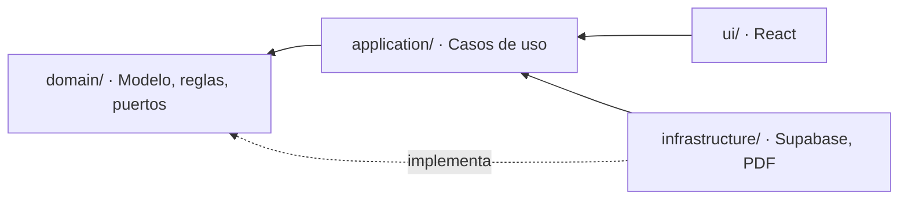

# 07 · Arquitectura técnica

Arquitectura hexagonal (puertos y adaptadores) sobre Clean Architecture, con principios SOLID.

---

## 1. Stack

| Capa | Elección | Razón |
|---|---|---|
| Lenguaje | **TypeScript** | Detecta errores de cálculo antes de ejecutar. Crítico tratándose de plata |
| Base | **React + Vite** | Arranque rápido, ecosistema enorme, app liviana |
| Estilos | **Tailwind CSS + shadcn/ui** | Componentes accesibles sin librería pesada |
| Datos | **TanStack Query** | Caché y reintentos automáticos, clave con señal inestable |
| Formularios | **react-hook-form + Zod** | Una sola definición de validación para formulario y datos |
| Gráficos | **Recharts** | Liviano, suficiente para los gráficos previstos |
| Backend | **Supabase** (PostgreSQL + Auth + Storage + RLS + triggers) | Sin backend propio; permisos y auditoría en la base |
| PDF | **pdfmake** | Cotizaciones, remisiones y desprendibles con logo |
| Móvil | **vite-plugin-pwa** | Instalable, tolerante a fallos de red |
| Pruebas | **Vitest** | El dominio se prueba sin base de datos ni navegador |
| Despliegue | **Vercel** | Publicación automática, HTTPS incluido |

**Costo mensual de operación: $0** en los planes gratuitos de Supabase y Vercel.

### 1.1 Por qué este stack cumple los tres criterios pedidos

**Ligero.** Vite produce una aplicación que carga en menos de 2 segundos con datos móviles. Sin
servidor propio, sin Docker, sin base de datos que administrar.

**Rápido de construir.** Lo más lento y riesgoso de cualquier sistema es el backend: usuarios,
contraseñas, permisos, subida de archivos, respaldos. Supabase entrega todo eso hecho, así que
el trabajo se concentra en las pantallas y en los cálculos. Reduce el proyecto de unas 20
semanas a **14**.

**Seguro.** Los permisos por rol viven **dentro de PostgreSQL** (Row Level Security), no en
código de aplicación. Un error en una pantalla no puede exponer la nómina ni los retiros. El
`DELETE` revocado a nivel de motor hace imposible el borrado accidental. Las contraseñas las
gestiona el proveedor de autenticación y nunca tocan el código propio.

---

## 2. Estructura de carpetas

```
src/
├── domain/                    # EL NÚCLEO — no conoce React, ni Supabase, ni internet
│   ├── model/
│   │   ├── Dinero.ts          # Objeto de valor: entero de pesos, nunca decimales
│   │   ├── Periodo.ts         # Mes/año en America/Bogota
│   │   ├── Movimiento.ts
│   │   ├── Pedido.ts
│   │   ├── Producto.ts
│   │   └── Empleado.ts
│   ├── services/              # Reglas puras — el corazón del sistema
│   │   ├── calcularUtilidadCausada.ts
│   │   ├── calcularCajaLibre.ts
│   │   ├── calcularAnticipoMinimo.ts
│   │   ├── calcularMargenes.ts
│   │   ├── calcularPatrimonio.ts
│   │   ├── calcularCapacidadDePago.ts
│   │   ├── calcularPuntoDeEquilibrio.ts
│   │   ├── repartirEnSobres.ts
│   │   └── liquidarNomina.ts
│   └── ports/                 # Interfaces — contratos con el exterior
│       ├── RepositorioMovimientos.ts
│       ├── RepositorioPedidos.ts
│       ├── RepositorioNomina.ts
│       ├── GeneradorPdf.ts
│       └── Exportador.ts
│
├── application/               # CASOS DE USO — uno por archivo, uno por CU-xx
│   ├── RegistrarMovimiento.ts          # CU-01, CU-02
│   ├── AnularMovimiento.ts             # CU-03
│   ├── CorregirPorContraAsiento.ts     # CU-04
│   ├── RegistrarPedido.ts              # CU-05
│   ├── CobrarAnticipo.ts               # CU-06
│   ├── EntregarPedido.ts               # CU-07
│   ├── CostearProducto.ts              # CU-09, CU-10
│   ├── GenerarCotizacion.ts            # CU-11
│   ├── ConsultarTresCifras.ts          # CU-13
│   ├── RegistrarRetiro.ts              # CU-16, CU-25
│   ├── CalcularCapacidadDePago.ts      # CU-18
│   ├── LiquidarNomina.ts               # CU-19
│   ├── RegistrarAdelanto.ts            # CU-26
│   └── ImportarHistorico.ts            # CU-21
│
├── infrastructure/            # ADAPTADORES — lo único que sabe de tecnología concreta
│   ├── supabase/
│   │   ├── cliente.ts
│   │   ├── RepositorioMovimientosSupabase.ts
│   │   ├── RepositorioPedidosSupabase.ts
│   │   └── mapeadores/
│   ├── pdf/
│   │   ├── GeneradorPdfCotizacion.ts
│   │   └── GeneradorPdfDesprendible.ts
│   └── export/
│       └── ExportadorZip.ts
│
├── ui/                        # REACT — solo presenta. Nunca calcula.
│   ├── pages/
│   ├── components/
│   ├── hooks/
│   └── formato/               # Formateo de moneda y fechas para Colombia
│
└── test/
    ├── domain/                # Pruebas puras, sin base de datos ni navegador
    └── dobles/                # Repositorios en memoria para pruebas
```

---

## 3. Regla de dependencias



**Las flechas apuntan siempre hacia adentro.** `domain/` no importa nada de `infrastructure/`
ni de `ui/`.

**Consecuencia práctica:** si mañana Supabase deja de servir o cambia de precio, se escribe un
adaptador nuevo en `infrastructure/` y **no se toca una sola línea de las reglas de negocio**.
Los cálculos financieros —lo más valioso y lo más costoso de reconstruir— quedan aislados de
cualquier decisión tecnológica.

Esta regla se verifica automáticamente en cada compilación:

```json
// .eslintrc — regla de frontera
{
  "rules": {
    "import/no-restricted-paths": ["error", {
      "zones": [
        { "target": "./src/domain", "from": "./src/infrastructure" },
        { "target": "./src/domain", "from": "./src/ui" },
        { "target": "./src/application", "from": "./src/ui" }
      ]
    }]
  }
}
```

Si alguien importa Supabase dentro del dominio, la compilación falla. No es una recomendación
de estilo: es una barrera.

---

## 4. El dominio en detalle

### 4.1 Dinero como objeto de valor

```typescript
// domain/model/Dinero.ts
// Pesos colombianos enteros. Nunca decimales, nunca punto flotante.

export class Dinero {
  private constructor(private readonly pesos: number) {}

  static de(pesos: number): Dinero {
    if (!Number.isInteger(pesos)) {
      throw new Error('El dinero debe expresarse en pesos enteros');
    }
    return new Dinero(pesos);
  }

  static cero(): Dinero { return new Dinero(0); }

  mas(otro: Dinero): Dinero  { return new Dinero(this.pesos + otro.pesos); }
  menos(otro: Dinero): Dinero { return new Dinero(this.pesos - otro.pesos); }

  porcentaje(pct: number): Dinero {
    return new Dinero(Math.round(this.pesos * pct / 100));
  }

  esNegativo(): boolean { return this.pesos < 0; }
  valor(): number       { return this.pesos; }
}
```

**Por qué importa.** Con números decimales, `0.1 + 0.2` no es `0.3`. En un sistema financiero
ese error se acumula de forma invisible hasta que un reporte no cuadra por unos pesos y nadie
sabe por qué. Con enteros, el problema no existe.

### 4.2 Un servicio de dominio típico

```typescript
// domain/services/calcularCajaLibre.ts
// Función pura: mismas entradas, mismo resultado, sin efectos secundarios.

export function calcularCajaLibre(entrada: {
  saldosPorCuenta: Dinero[];
  anticiposPorDevengar: Dinero;
  gastosFijosComprometidos: Dinero;
}): ResultadoCajaLibre {
  const saldoTotal = entrada.saldosPorCuenta.reduce(
    (acc, s) => acc.mas(s), Dinero.cero()
  );

  const cajaLibre = saldoTotal
    .menos(entrada.anticiposPorDevengar)
    .menos(entrada.gastosFijosComprometidos);

  return {
    saldoTotal,
    anticipos: entrada.anticiposPorDevengar,
    gastosFijos: entrada.gastosFijosComprometidos,
    cajaLibre,
    alerta: cajaLibre.esNegativo() ? 'CAJA_LIBRE_NEGATIVA' : null,
  };
}
```

Sin base de datos, sin React, sin `async`. Se prueba en milisegundos y su comportamiento es
completamente predecible.

### 4.3 Un puerto

```typescript
// domain/ports/RepositorioMovimientos.ts
// El dominio declara QUÉ necesita, no CÓMO se obtiene.

export interface LeerMovimientos {
  porPeriodo(periodo: Periodo): Promise<Movimiento[]>;
  saldosPorCuenta(): Promise<SaldoCuenta[]>;
}

export interface EscribirMovimientos {
  registrar(movimiento: NuevoMovimiento): Promise<Movimiento>;
  anular(id: string, motivo: string, contexto: ContextoAuditoria): Promise<void>;
}
```

Dos interfaces pequeñas en lugar de una grande: quien solo necesita leer no queda obligado a
implementar la escritura.

---

## 5. SOLID aplicado a este proyecto

| Principio | Cómo se aplica aquí | Qué se evita |
|---|---|---|
| **S** · Responsabilidad única | Un archivo por caso de uso. `RegistrarMovimiento` no genera PDF ni consulta reportes | Archivos de 900 líneas que nadie se atreve a tocar |
| **O** · Abierto/cerrado | Un reporte nuevo implementa una interfaz existente, sin modificar los ya probados | Romper lo que funciona al agregar algo |
| **L** · Sustitución de Liskov | Toda implementación de `LeerMovimientos` es intercambiable: Supabase en producción, en memoria en pruebas | Pruebas que necesitan una base de datos real |
| **I** · Segregación de interfaces | Puertos pequeños (`LeerMovimientos`, `EscribirMovimientos`) | Implementar métodos vacíos solo para cumplir el contrato |
| **D** · Inversión de dependencias | El caso de uso depende de la interfaz, nunca de `SupabaseClient` | Quedar atrapado en un proveedor |

### 5.1 El beneficio, en lenguaje de negocio

Todos los cálculos de plata se prueban **sin base de datos, sin internet y en milisegundos**.
Eso significa que:

- Cada fórmula financiera tiene pruebas automáticas que corren en cada cambio.
- Un error de cálculo se detecta antes de llegar a un reporte del que dependan decisiones reales.
- El ejemplo de septiembre del documento 05 se convierte en una prueba ejecutable: si alguien
  rompe la fórmula de caja libre, la prueba falla y el cambio no llega a producción.

---

## 6. Seguridad

| Capa | Medida |
|---|---|
| Transporte | HTTPS obligatorio, gestionado por el despliegue |
| Autenticación | **Nombre de usuario y contraseña**, no correo. La aplicación traduce el usuario a un correo sintético interno y delega la verificación al proveedor. Las contraseñas nunca tocan código propio |
| Contraseñas | Mínimo 8 caracteres, sin composición obligatoria y sin caducidad periódica. Hash bcrypt del proveedor |
| Primer ingreso | Cambio de contraseña obligatorio. `usuarios.debe_cambiar_clave` arranca en `TRUE` al crear y al restablecer, y solo baja cuando la persona la cambia |
| Restablecimiento | **Presencial.** Solo Gerencia genera una clave temporal desde la pantalla de Gestión de usuarios. No hay recuperación por correo |
| Intentos fallidos | Se registran en `auditoria` como `inicio_sesion_fallido` con usuario intentado, fecha, dispositivo e IP. **Nunca se guarda la contraseña tecleada**, ni completa ni parcial |
| Autorización | **Row Level Security por rol dentro de PostgreSQL** |
| Integridad | `DELETE` y `TRUNCATE` revocados en el motor |
| Trazabilidad | Triggers de auditoría que la aplicación no puede evitar |
| Validación | Zod en el cliente y restricciones `CHECK` en la base — doble barrera |
| Archivos | Storage con políticas de acceso por rol |
| Secretos | Variables de entorno; ninguna llave en el repositorio |

**La decisión central.** Los permisos no se implementan escondiendo botones. Si los datos de
nómina llegaran al navegador de la empleada, bastaría con abrir las herramientas de desarrollo
para verlos. Con RLS, PostgreSQL **no devuelve esas filas**, sin importar cómo se construya la
petición.

Lo que evalúa RLS es `usuarios.tipo` —`gerencia` u `operacion`—, nunca el cargo.
**El tipo dice qué puede ver. El cargo dice qué hace.**

### 6.1 Acceso con nombre de usuario · el correo sintético

Supabase Auth autentica contra un **correo electrónico**. Las empleadas de un taller de
estampados no siempre tienen correo, y pedirles uno es una barrera real de adopción.

Entonces el sistema traduce. La persona escribe `marcela`, la aplicación arma
`marcela@usuarios.prismamy.co` y llama a `signInWithPassword`.

```
usuario escrito:  marcela
dominio interno:  @usuarios.prismamy.co     (constante de configuración, fija de por vida)
correo sintético: marcela@usuarios.prismamy.co
```

El correo sintético es un detalle interno: **nunca se muestra, nunca se pide, nunca se imprime
en un desprendible.** La decisión completa está en
[ADR-009](adr/ADR-009-login-por-usuario.md).

Las cinco reglas del mecanismo:

| Regla | Por qué |
|---|---|
| El dominio interno es un **subdominio del dominio del negocio**, no `.local` | `.local` está reservado por RFC 6762 para mDNS y algunas plataformas lo resuelven raro |
| La **confirmación de correo queda desactivada** en el proveedor | Si alguien la activa por error, ningún usuario nuevo podrá entrar y el mensaje de error no lo explica |
| **No hay «olvidé mi contraseña» por correo** | No hay correo real. La recuperación es presencial: Gerencia restablece la clave desde la pantalla de Gestión de usuarios |
| El dominio interno **no se cambia** después del primer usuario | Cambiarlo obliga a migrar todas las identidades. Se fija una vez |
| El nombre de usuario es `CITEXT` y se normaliza a minúsculas antes de armar el correo | Para que `Marcela` y `marcela` sean la misma persona |

> **La recuperación presencial es una consecuencia aceptada, no un olvido.** Sin correo real no
> hay a dónde mandar un enlace. La clave temporal se entrega en persona y el sistema obliga a
> cambiarla en el primer ingreso.

Política de contraseñas:

| Regla | Valor | Razón |
|---|---|---|
| Longitud mínima | 8 caracteres | Longitud sobre composición: obligar símbolos produce claves peores y más apuntadas en papel |
| Composición obligatoria | Ninguna | Ídem |
| Almacenamiento | Hash bcrypt del proveedor | El código propio nunca ve la contraseña |
| Primer ingreso | Cambio obligatorio | `debe_cambiar_clave = TRUE` al crear y al restablecer |
| Restablecimiento | Solo Gerencia, con clave temporal | No hay canal de correo |
| Caducidad periódica | **No** | Rotar por calendario empeora las claves |
| Intentos fallidos | Limitados por el proveedor | Se registran en auditoría |

---

## 7. Comportamiento sin conexión

El taller no siempre tiene buena señal. La estrategia, en orden de esfuerzo:

| Nivel | Comportamiento | Sprint |
|---|---|---|
| 1 | La aplicación se instala y abre sin red, mostrando los últimos datos en caché | 7 |
| 2 | Un registro hecho sin conexión se encola localmente | 7 |
| 3 | Al reconectar, la cola se sincroniza conservando la **fecha del movimiento** original | 7 |
| 4 | Si un registro encolado falla, se avisa y no se pierde | 7 |

La doble fecha del modelo (RN-01) es lo que hace posible el nivel 3: el movimiento se digita
cuando vuelve la señal, pero se contabiliza el día en que realmente ocurrió.

---

## 8. Respaldos

| Nivel | Qué | Frecuencia | Responsable |
|---|---|---|---|
| Automático del proveedor | Toda la base de datos | Diario | Supabase |
| Exportación manual | Base completa o un mes | Cuando se decida | Gerencia (CU-22) |
| Repositorio de código | Todo el proyecto | Cada cambio | Control de versiones |

El diseño de la exportación está en [`13-respaldo-y-exportacion.md`](13-respaldo-y-exportacion.md).
Su construcción queda programada para después del go-live.

---

## 9. Decisiones registradas

| ADR | Decisión |
|---|---|
| [ADR-001](adr/ADR-001-stack.md) | React + Vite + TypeScript + Supabase |
| [ADR-002](adr/ADR-002-arquitectura-hexagonal.md) | Arquitectura hexagonal con regla de dependencias verificada |
| [ADR-003](adr/ADR-003-dinero-entero.md) | Dinero como entero de pesos |
| [ADR-004](adr/ADR-004-base-solo-escritura.md) | Base de datos de solo escritura |
| [ADR-005](adr/ADR-005-auditoria-por-triggers.md) | Auditoría por triggers, no por aplicación |
| [ADR-006](adr/ADR-006-rls-por-rol.md) | Permisos con Row Level Security |
| [ADR-007](adr/ADR-007-pwa.md) | PWA en lugar de aplicación nativa |
| [ADR-008](adr/ADR-008-exportacion.md) | Exportación con descarga manual |
| [ADR-009](adr/ADR-009-login-por-usuario.md) | Acceso con nombre de usuario, no con correo |
