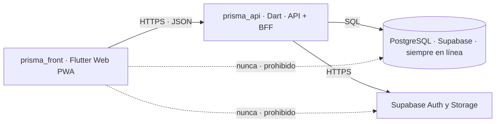
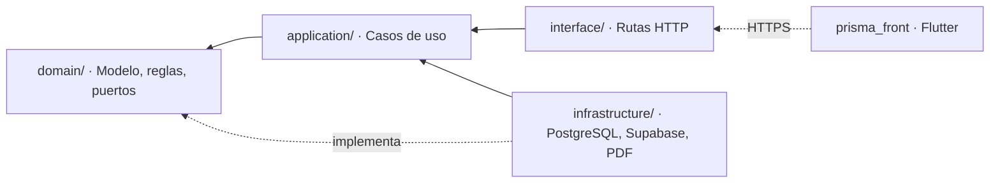

# 07 · Arquitectura técnica

Dos proyectos —un front en Flutter y una API en Dart— sobre una base PostgreSQL siempre en línea.
Arquitectura hexagonal (puertos y adaptadores) sobre Clean Architecture, con principios SOLID.

---

## 1. Stack

| Capa | Elección | Razón |
|---|---|---|
| Lenguaje | **Dart**, en los dos proyectos | Un solo lenguaje de punta a punta. El modelo del negocio se piensa una vez y se lee igual en el front y en la API |
| Front | **Flutter Web**, instalable como PWA (`prisma_front`) | Una sola base de código para el navegador y para la instalación en el celular del taller |
| API | **Dart**, a la vez API y BFF (`prisma_api`) | Único punto que habla con la base. Ahí viven el dominio y los casos de uso |
| Framework HTTP | **Dart Frog** ([ADR-011](adr/ADR-011-stack-flutter-dart.md)) | Va sobre Shelf, da enrutado por sistema de archivos y recarga en caliente. Si algún día conviene depender de menos capas, Shelf desnudo sostiene la misma estructura |
| Base | **PostgreSQL gestionado por Supabase**, siempre en línea | Es la misma base de siempre: RLS, triggers y restricciones siguen siendo el corazón de la seguridad |
| Autenticación | **Supabase Auth, llamado desde la API** | El front manda usuario y contraseña; nunca ve al proveedor ni el correo sintético (§6.1) |
| Archivos | **Supabase Storage, llamado desde la API** | El front sube a `prisma_api` y la API al Storage. Las políticas por rol no se mueven |
| PDF | **Se genera en `prisma_api`** | Cotizaciones, remisiones y desprendibles salen idénticos para todo el mundo y el front no carga una librería de PDF |
| Pruebas | **`package:test` de Dart** | El dominio se prueba sin base de datos ni navegador, igual que antes |
| Ambientes | **dev, qa, uat y prod**, un proyecto de Supabase por ambiente | El detalle está en [`19-ambientes-y-entrega.md`](19-ambientes-y-entrega.md) |

> **El costo de operación deja de ser cero.** «Siempre en línea» significa que prod y uat no
> pueden vivir en el plan gratuito de Supabase, porque ese plan pausa el proyecto tras una semana
> de inactividad, y un taller que factura los lunes encontraría el sistema dormido. dev y qa sí
> pueden quedarse en el gratuito. Son, como mínimo, dos proyectos de pago. La cuenta completa va
> en [`19-ambientes-y-entrega.md`](19-ambientes-y-entrega.md).

### 1.1 La forma del sistema



> **Regla dura: el front NUNCA habla con Supabase directamente.** Ni con la base, ni con Auth,
> ni con Storage. Todo pasa por `prisma_api`.

Si alguien mete el cliente de Supabase en el código Flutter, está saltándose la arquitectura y
**hay que rechazarlo en revisión de código**. No es una preferencia de estilo: es lo que sostiene
la propagación de identidad (§7) y lo que hace que el front no lleve ninguna clave dentro.

### 1.2 Por qué una sola API y no un BFF más una API de dominio

Hoy hay **un solo cliente**. Separar las dos capas daría dos cosas que desplegar, versionar y
vigilar sin ninguna ganancia a cambio.

El día que aparezca un segundo cliente —una integración contable, un panel público— ahí sí se
parte. Y `prisma_api` ya está organizada por dentro para permitirlo.

### 1.3 Por dentro de `prisma_api`

[ADR-002](adr/ADR-002-arquitectura-hexagonal.md) decidió **arquitectura hexagonal**, y esa
decisión **no se deroga: se refuerza**. Ahora por fin hay un backend donde aplicarla de verdad,
en lugar de sostenerla dentro de un navegador.

| Capa | Qué vive ahí | Qué NO puede hacer |
|---|---|---|
| `domain/` | Entidades, reglas de negocio, valores (Dinero, Usuario, Pedido) | Importar Dart del servidor, SQL o HTTP |
| `application/` | Casos de uso, uno por CU del documento 02 | Conocer el framework HTTP |
| `infrastructure/` | Repositorios contra PostgreSQL, cliente de Supabase Auth, Storage | Contener reglas de negocio |
| `interface/` | Rutas HTTP, serialización, mapeo de errores | Contener reglas de negocio |

El día que haya que partir en BFF y API, `interface/` se convierte en el BFF y el resto queda en
la API. Por eso la separación importa desde el primer día aunque hoy sea un solo despliegue.

### 1.4 Qué se gana y qué cuesta

Lo que cuesta, dicho sin adornos: **el backend vuelve al proyecto.** Hay que construirlo,
probarlo, desplegarlo, versionarlo y asegurarlo, multiplicado por cuatro ambientes. Eso es
trabajo que antes no existía, y el plan de desarrollo tiene que reflejarlo en lugar de apretar
las mismas tareas en el mismo tiempo.

Lo que se gana, y por eso la decisión es defendible:

- Un punto único donde poner las reglas que la base no puede expresar.
- La posibilidad de tener más de un cliente sin reescribir nada.
- Un solo lenguaje —Dart— en todo el proyecto.
- Que el front **deje de llevar claves de base de datos dentro**.

---

## 2. Estructura de carpetas

Dos proyectos, cada uno con su repositorio, su `pubspec.yaml` y su versión.

```
prisma_api/
├── lib/
│   ├── domain/                    # EL NÚCLEO — no conoce HTTP, ni SQL, ni Supabase
│   │   ├── model/
│   │   │   ├── dinero.dart        # Objeto de valor: entero de pesos, nunca decimales
│   │   │   ├── periodo.dart       # Mes/año en America/Bogota
│   │   │   ├── movimiento.dart
│   │   │   ├── pedido.dart
│   │   │   ├── producto.dart
│   │   │   └── empleado.dart
│   │   ├── services/              # Reglas puras — el corazón del sistema
│   │   │   ├── calcular_utilidad_causada.dart
│   │   │   ├── calcular_caja_libre.dart
│   │   │   ├── calcular_anticipo_minimo.dart
│   │   │   ├── calcular_margenes.dart
│   │   │   ├── calcular_patrimonio.dart
│   │   │   ├── calcular_capacidad_de_pago.dart
│   │   │   ├── calcular_punto_de_equilibrio.dart
│   │   │   ├── repartir_en_sobres.dart
│   │   │   └── liquidar_nomina.dart
│   │   └── ports/                 # Interfaces — contratos con el exterior
│   │       ├── repositorio_movimientos.dart
│   │       ├── repositorio_pedidos.dart
│   │       ├── repositorio_nomina.dart
│   │       ├── generador_pdf.dart
│   │       └── exportador.dart
│   │
│   ├── application/               # CASOS DE USO — uno por archivo, uno por CU-xx
│   │   ├── registrar_movimiento.dart          # CU-01, CU-02
│   │   ├── anular_movimiento.dart             # CU-03
│   │   ├── corregir_por_contra_asiento.dart   # CU-04
│   │   ├── registrar_pedido.dart              # CU-05
│   │   ├── cobrar_anticipo.dart               # CU-06
│   │   ├── entregar_pedido.dart               # CU-07
│   │   ├── costear_producto.dart              # CU-09, CU-10
│   │   ├── generar_cotizacion.dart            # CU-11
│   │   ├── consultar_tres_cifras.dart         # CU-13
│   │   ├── registrar_retiro.dart              # CU-16, CU-25
│   │   ├── calcular_capacidad_de_pago.dart    # CU-18
│   │   ├── liquidar_nomina.dart               # CU-19
│   │   ├── registrar_adelanto.dart            # CU-26
│   │   └── importar_historico.dart            # CU-21
│   │
│   ├── infrastructure/            # ADAPTADORES — lo único que sabe de tecnología concreta
│   │   ├── postgres/
│   │   │   ├── pool.dart
│   │   │   ├── con_identidad.dart             # §7.2 — la transacción con identidad
│   │   │   ├── repositorio_movimientos_postgres.dart
│   │   │   ├── repositorio_pedidos_postgres.dart
│   │   │   └── mapeadores/
│   │   ├── supabase/
│   │   │   ├── auth.dart                      # Correo sintético y sesión (§6.1)
│   │   │   └── storage.dart
│   │   ├── pdf/
│   │   │   ├── generador_pdf_cotizacion.dart
│   │   │   └── generador_pdf_desprendible.dart
│   │   └── export/
│   │       └── exportador_zip.dart
│   │
│   └── interface/                 # HTTP — solo traduce. Nunca calcula.
│       ├── rutas/
│       ├── middleware/            # Token, claims, contexto de auditoría
│       └── errores/
│           └── traduccion_restricciones.dart  # §8.4 — restricción → HTTP + mensaje
│
└── test/
    ├── domain/                    # Pruebas puras, sin base de datos ni red
    ├── dobles/                    # Repositorios en memoria para pruebas
    └── integracion/               # Contra la base real, incluye la prueba de §7.4
```

```
prisma_front/
├── lib/
│   ├── ui/                        # FLUTTER — solo presenta. Nunca calcula plata.
│   │   ├── pantallas/
│   │   ├── componentes/
│   │   └── formato/               # Moneda y fechas para Colombia
│   ├── datos/
│   │   ├── cliente_api.dart       # ÚNICO punto de salida a la red. Solo habla con prisma_api
│   │   └── modelos/               # Espejo de lo que devuelve la API
│   └── estado/                    # Estado de pantalla y sesión
├── web/                           # Manifiesto y service worker de la PWA
└── test/
```

**No hay carpeta `supabase/` en el front, y no puede haberla.** Si aparece, es la señal de que
alguien se saltó §1.1.

---

## 3. Regla de dependencias



**Las flechas apuntan siempre hacia adentro.** `domain/` no importa nada de `infrastructure/` ni
de `interface/`. Y `prisma_front` entra por la puerta de HTTP como cualquier otro cliente: no
tiene acceso privilegiado a nada.

**Consecuencia práctica:** si mañana Supabase deja de servir o cambia de precio, se escribe un
adaptador nuevo en `infrastructure/` y **no se toca una sola línea de las reglas de negocio**.
Los cálculos financieros —lo más valioso y lo más costoso de reconstruir— quedan aislados de
cualquier decisión tecnológica.

Esta regla se verifica en el análisis estático, en cada compilación:

```yaml
# analysis_options.yaml — reglas de frontera
dart_code_metrics:
  rules:
    - avoid-banned-imports:
        entries:
          # prisma_api: el dominio no sabe de servidor
          - paths: ['lib/domain/.*']
            deny: ['package:postgres', 'package:supabase', 'package:dart_frog', 'dart:io']
            message: 'El dominio no conoce base de datos, HTTP ni servidor'
          # prisma_api: los casos de uso no saben de framework
          - paths: ['lib/application/.*']
            deny: ['package:dart_frog', 'package:shelf']
            message: 'Los casos de uso no conocen el framework HTTP'
          # prisma_front: el front no conoce Supabase, en ningún archivo
          - paths: ['lib/.*']
            deny: ['package:supabase_flutter', 'package:postgres']
            message: 'El front habla con prisma_api, nunca con Supabase (§1.1)'
```

Si alguien importa PostgreSQL dentro del dominio, o Supabase dentro del front, el análisis falla.
No es una recomendación de estilo: es una barrera.

---

## 4. El dominio en detalle

Vive en `prisma_api`. El front no reimplementa ninguna de estas reglas: las consume.

### 4.1 Dinero como objeto de valor

```dart
// lib/domain/model/dinero.dart
// Pesos colombianos enteros. Nunca decimales, nunca punto flotante.

class Dinero {
  final int pesos;
  const Dinero._(this.pesos);

  factory Dinero.de(int pesos) => Dinero._(pesos);
  static const Dinero cero = Dinero._(0);

  Dinero mas(Dinero otro)   => Dinero._(pesos + otro.pesos);
  Dinero menos(Dinero otro) => Dinero._(pesos - otro.pesos);

  Dinero porcentaje(num pct) => Dinero._((pesos * pct / 100).round());

  bool get esNegativo => pesos < 0;
}
```

**Por qué importa.** Con números decimales, `0.1 + 0.2` no es `0.3`. En un sistema financiero ese
error se acumula de forma invisible hasta que un reporte no cuadra por unos pesos y nadie sabe por
qué. Con enteros, el problema no existe. En Dart el tipo `int` ya garantiza lo que en el stack
anterior había que comprobar a mano en cada constructor.

> **Y hay una razón más para que el dinero se calcule en la API.** En la máquina virtual de Dart
> —donde corre `prisma_api`— un `int` es un entero de 64 bits de verdad. Compilado a JavaScript
> para el navegador, ese mismo `int` pasa a ser un número de coma flotante. El sitio correcto
> para sumar plata es el servidor.

### 4.2 Un servicio de dominio típico

```dart
// lib/domain/services/calcular_caja_libre.dart
// Función pura: mismas entradas, mismo resultado, sin efectos secundarios.

ResultadoCajaLibre calcularCajaLibre({
  required List<Dinero> saldosPorCuenta,
  required Dinero anticiposPorDevengar,
  required Dinero gastosFijosComprometidos,
}) {
  final saldoTotal = saldosPorCuenta.fold<Dinero>(
    Dinero.cero,
    (acc, s) => acc.mas(s),
  );

  final cajaLibre = saldoTotal
      .menos(anticiposPorDevengar)
      .menos(gastosFijosComprometidos);

  return ResultadoCajaLibre(
    saldoTotal: saldoTotal,
    anticipos: anticiposPorDevengar,
    gastosFijos: gastosFijosComprometidos,
    cajaLibre: cajaLibre,
    alerta: cajaLibre.esNegativo ? 'CAJA_LIBRE_NEGATIVA' : null,
  );
}
```

Sin base de datos, sin HTTP, sin `async`. Se prueba en milisegundos y su comportamiento es
completamente predecible.

### 4.3 Un puerto

```dart
// lib/domain/ports/repositorio_movimientos.dart
// El dominio declara QUÉ necesita, no CÓMO se obtiene.

abstract interface class LeerMovimientos {
  Future<List<Movimiento>> porPeriodo(Periodo periodo);
  Future<List<SaldoCuenta>> saldosPorCuenta();
}

abstract interface class EscribirMovimientos {
  Future<Movimiento> registrar(NuevoMovimiento movimiento);
  Future<void> anular(String id, String motivo, ContextoAuditoria contexto);
}
```

Dos interfaces pequeñas en lugar de una grande: quien solo necesita leer no queda obligado a
implementar la escritura.

---

## 5. SOLID aplicado a este proyecto

| Principio | Cómo se aplica aquí | Qué se evita |
|---|---|---|
| **S** · Responsabilidad única | Un archivo por caso de uso. `RegistrarMovimiento` no genera PDF ni consulta reportes | Archivos de 900 líneas que nadie se atreve a tocar |
| **O** · Abierto/cerrado | Un reporte nuevo implementa una interfaz existente, sin modificar los ya probados | Romper lo que funciona al agregar algo |
| **L** · Sustitución de Liskov | Toda implementación de `LeerMovimientos` es intercambiable: PostgreSQL en producción, en memoria en pruebas | Pruebas que necesitan una base de datos real |
| **I** · Segregación de interfaces | Puertos pequeños (`LeerMovimientos`, `EscribirMovimientos`) | Implementar métodos vacíos solo para cumplir el contrato |
| **D** · Inversión de dependencias | El caso de uso depende de la interfaz, nunca de la conexión a PostgreSQL | Quedar atrapado en un proveedor |

### 5.1 El beneficio, en lenguaje de negocio

Todos los cálculos de plata se prueban **sin base de datos, sin internet y en milisegundos**.
Eso significa que:

- Cada fórmula financiera tiene pruebas automáticas que corren en cada cambio.
- Un error de cálculo se detecta antes de llegar a un reporte del que dependan decisiones reales.
- El ejemplo de septiembre del documento 05 se convierte en una prueba ejecutable: si alguien
  rompe la fórmula de caja libre, la prueba falla y el cambio no llega a producción.

---

## 6. Seguridad

| Capa | Medida |
|---|---|
| Transporte | HTTPS obligatorio en el front y en la API, gestionado por el despliegue |
| Autenticación | **Nombre de usuario y contraseña, no correo.** La traducción a correo sintético ocurre **dentro de `prisma_api`**: el front manda usuario y contraseña y nunca ve un correo. Las contraseñas nunca tocan código propio |
| Contraseñas | Mínimo 8 caracteres, sin composición obligatoria y sin caducidad periódica. Hash bcrypt del proveedor |
| Primer ingreso | Cambio de contraseña obligatorio. `usuarios.debe_cambiar_clave` arranca en `TRUE` al crear y al restablecer, y solo baja cuando la persona la cambia |
| Restablecimiento | **Presencial.** Solo Gerencia genera una clave temporal desde la pantalla de Gestión de usuarios. No hay recuperación por correo |
| Intentos fallidos | La API los registra en `auditoria` como `inicio_sesion_fallido` con usuario intentado, fecha, dispositivo e IP. **Nunca se guarda la contraseña tecleada**, ni completa ni parcial |
| Autorización | **Row Level Security por rol dentro de PostgreSQL**, con la identidad de la persona propagada por la API (§7) |
| Integridad | `DELETE` y `TRUNCATE` revocados en el motor |
| Trazabilidad | Triggers de auditoría que ni el front ni la API pueden evitar |
| Validación | **Tres capas, y la base es el juez** (§8) |
| Archivos | Storage con políticas de acceso por rol. El front sube a la API y la API al Storage |
| Secretos | **Solo la API los tiene.** Viven en variables de entorno del servidor, distintas por ambiente. El front se compila con `--dart-define` y solo lleva la dirección de la API y el nombre del ambiente. Ninguna llave en el repositorio |

**La decisión central.** Los permisos no se implementan escondiendo botones. Si los datos de
nómina llegaran al dispositivo de la empleada, bastaría con abrir las herramientas de desarrollo
para verlos. Con RLS, PostgreSQL **no devuelve esas filas**, sin importar cómo se construya la
petición.

Lo que evalúa RLS es `usuarios.tipo` —`gerencia` u `operacion`—, nunca el cargo.
**El tipo dice qué puede ver. El cargo dice qué hace.**

> **Lo que el front dejó de saber.** No conoce la dirección de la base, ni la clave anónima, ni
> la de servicio, ni el dominio de correo sintético, ni las reglas de Storage. Un paquete de
> Flutter Web es un archivo que cualquiera puede descargar y leer; ahora no hay nada que leer.

### 6.1 Acceso con nombre de usuario · el correo sintético

Supabase Auth autentica contra un **correo electrónico**. Las empleadas de un taller de
estampados no siempre tienen correo, y pedirles uno es una barrera real de adopción.

Entonces el sistema traduce, **y traduce en el servidor**. La persona escribe `marcela`, el front
envía usuario y contraseña a `POST /sesiones`, y `prisma_api` arma
`marcela@usuarios.prismamy.co` y llama al proveedor.

```
usuario escrito:  marcela                     (lo único que sale del front)
dominio interno:  @usuarios.prismamy.co       (constante de la API, fija de por vida)
correo sintético: marcela@usuarios.prismamy.co (nunca sale de la API)
```

El correo sintético es un detalle interno: **nunca se muestra, nunca se pide, nunca se imprime
en un desprendible.** La decisión completa está en
[ADR-009](adr/ADR-009-login-por-usuario.md), que este cambio **no deroga sino que mejora**: lo
que era un truco del cliente pasa a ser un detalle del servidor, que es donde debía estar.

Las cinco reglas del mecanismo:

| Regla | Por qué |
|---|---|
| El dominio interno es un **subdominio del dominio del negocio**, no `.local` | `.local` está reservado por RFC 6762 para mDNS y algunas plataformas lo resuelven raro |
| La **confirmación de correo queda desactivada** en el proveedor | Si alguien la activa por error, ningún usuario nuevo podrá entrar y el mensaje de error no lo explica |
| **No hay «olvidé mi contraseña» por correo** | No hay correo real. La recuperación es presencial: Gerencia restablece la clave desde la pantalla de Gestión de usuarios |
| El dominio interno **no se cambia** después del primer usuario | Cambiarlo obliga a migrar todas las identidades. Se fija una vez |
| El nombre de usuario es `CITEXT` y la API lo normaliza a minúsculas antes de armar el correo | Para que `Marcela` y `marcela` sean la misma persona |

> **La recuperación presencial es una consecuencia aceptada, no un olvido.** Sin correo real no
> hay a dónde mandar un enlace. La clave temporal se entrega en persona y el sistema obliga a
> cambiarla en el primer ingreso.

Política de contraseñas:

| Regla | Valor | Razón |
|---|---|---|
| Longitud mínima | 8 caracteres | Longitud sobre composición: obligar símbolos produce claves peores y más apuntadas en papel |
| Composición obligatoria | Ninguna | Ídem |
| Almacenamiento | Hash bcrypt del proveedor | El código propio nunca ve la contraseña |
| Primer ingreso | Cambio obligatorio | `debe_cambiar_clave = TRUE` al crear y al restablecer |
| Restablecimiento | Solo Gerencia, con clave temporal | No hay canal de correo |
| Caducidad periódica | **No** | Rotar por calendario empeora las claves |
| Intentos fallidos | Limitados por el proveedor | Se registran en auditoría |

---

## 7. La identidad tiene que llegar hasta PostgreSQL

Esta es la sección que decide si el cambio de arquitectura conserva o destruye la seguridad del
sistema. **No es opcional y no se puede dejar para después.** La decisión está registrada en
[ADR-012](adr/ADR-012-identidad-a-postgres.md).

### 7.1 El problema

[ADR-006](adr/ADR-006-rls-por-rol.md) decidió que los permisos viven dentro de PostgreSQL con
Row Level Security. Todas las políticas escritas preguntan por `auth.uid()`:
`usuarios_lectura`, `fn_es_gerencia()`, `nom_lectura`, `mov_insercion`, el guardián de la última
Gerencia, y las que protegen nómina, adelantos y patrimonio.

Eso funcionaba porque el navegador hablaba directo con la base llevando su propio token.

Con `prisma_api` en medio, la base ya no ve a la empleada: ve a la API. Y entonces:

| Si la API se conecta… | Qué pasa |
|---|---|
| Con la **clave de servicio** (`service_role`) | RLS **deja de aplicar**. Todas las políticas se vuelven decorado y la seguridad pasa a depender de que ningún `if` de Dart falle nunca |
| Como **anónimo**, sin propagar nada | `auth.uid()` es nulo, las políticas no encuentran usuario y **no se puede leer nada** |

La primera opción es la tentadora, la que «funciona», y la que convierte `ADR-006`, `ADR-005` y
todo el trabajo de permisos en una ilusión.

### 7.2 La solución, obligatoria

`prisma_api` abre **una transacción por petición** y, antes de tocar ninguna tabla, propaga los
claims del token del usuario a la sesión de PostgreSQL:

```dart
Future<T> conIdentidad<T>(Claims claims, Future<T> Function(Session tx) cuerpo) {
  return _pool.runTx((tx) async {
    // 'true' = local a la transacción: se descarta al terminar y no contamina la conexión
    await tx.execute(
      Sql.named("SELECT set_config('request.jwt.claims', @claims, true)"),
      parameters: {'claims': jsonEncode(claims.toJson())},
    );
    await tx.execute('SET LOCAL ROLE authenticated');
    return cuerpo(tx);
  });
}
```

`auth.uid()` de Supabase lee `request.jwt.claims ->> 'sub'`. Al fijarlo así, **todas las
políticas ya escritas funcionan sin tocar una sola línea de SQL.** RLS sigue siendo el juez.

### 7.3 Las cuatro condiciones que lo hacen real

Sin estas cuatro, lo anterior es teatro:

1. **El usuario de base de datos de la API no puede tener `BYPASSRLS`.** Se crea un rol dedicado,
   `prisma_api`, sin ese atributo y sin `SUPERUSER`.
2. **El usuario de la API no puede ser dueño de las tablas.** El dueño se salta RLS por defecto.
3. **`ALTER TABLE … FORCE ROW LEVEL SECURITY` en todas las tablas**, para que ni el dueño se
   libre. Es cinturón y tirantes, y aquí se justifica.
4. **La clave `service_role` de Supabase no se usa nunca en el camino de una petición de usuario.**
   Queda reservada para migraciones y tareas administrativas, y vive en un secreto distinto.

> **Dos tablas no admiten la tercera condición, y está decidido así.** `usuarios` y `auditoria`
> se quedan sin `FORCE`: la primera porque `fn_es_gerencia()` la consulta y el ciclo solo se
> corta si el dueño no pasa por RLS; la segunda porque la bitácora la escribe una función
> `SECURITY DEFINER` que con `FORCE` dejaría de poder escribir. En esas dos manda la condición 2:
> el rol de la API no es dueño de nada. El detalle y el SQL están en
> [`04-modelo-de-datos.md`](04-modelo-de-datos.md) §7.1.

### 7.4 Cómo se prueba

Prueba de integración obligatoria, en cada ambiente, contra la base real: autenticarse como una
usuaria de tipo Operación a través de la API y comprobar que `GET /nomina`, `GET /usuarios` y
`GET /patrimonio` devuelven vacío o 403 **por decisión de la base**, no por un `if` de Dart.

Para demostrarlo: se desactiva temporalmente la comprobación de la capa de aplicación en el
ambiente de pruebas y el resultado debe seguir siendo el mismo. Si al quitar el `if` los datos
aparecen, RLS no está actuando y la prueba falla.

---

## 8. Validación en tres capas, y la base manda

La base valida todo lo que puede, y la lógica de arriba es a propósito un poco redundante. La
decisión está en [ADR-015](adr/ADR-015-validacion-tres-capas.md).

### 8.1 El principio

> **La base de datos es la única capa que nadie puede saltarse, así que es la única que decide.
> Las otras dos existen para que el fallo sea rápido y comprensible, nunca para autorizar.**

Si las tres capas discrepan, gana la base. Siempre. Y si la base rechaza algo que las otras dos
dejaron pasar, eso es un defecto de las otras dos, no de la base.

### 8.2 Qué hace cada capa

| Capa | Qué valida | Qué pasa si falla | Se puede saltar |
|---|---|---|---|
| **PostgreSQL** | `NOT NULL`, `CHECK`, `FOREIGN KEY`, `UNIQUE`, `EXCLUDE`, dominios, triggers, RLS, `REVOKE DELETE` | Error del motor con nombre de restricción | **No** |
| **`prisma_api`** | Las mismas reglas, otra vez, antes de ir a la base | 400 o 422 con mensaje en español | Sí, si alguien llama a la base por fuera |
| **`prisma_front`** | Las mismas reglas, otra vez, en el formulario | Aviso inmediato, sin viaje a la red | Sí, con las herramientas del navegador |

### 8.3 Por qué la redundancia es necesaria y no es desperdicio

Hay que dejarlo escrito, porque a alguien le parecerá trabajo repetido y querrá quitarlo:

- **La base no sabe hablar.** Devuelve `23514 check_violation` en la restricción
  `movimientos_valor_positivo`. Eso no se le puede mostrar a la dueña del taller. La API traduce.
- **La red cuesta.** Validar en el formulario evita un viaje de ida y vuelta por datos móviles en
  un taller con señal intermitente.
- **La API valida cosas que la base no ve barato**: forma de la petición, tamaño de un archivo,
  límite de intentos, coherencia entre campos que vienen de pantallas distintas.
- **Y la base valida cosas que la API no puede garantizar**: concurrencia. Dos peticiones
  simultáneas pueden pasar las dos el `if` de Dart y solo una puede pasar el `UNIQUE`.

### 8.4 El contrato de errores: lo que mantiene honesta la redundancia

El riesgo real de validar tres veces es que las tres versiones se separen con el tiempo y digan
cosas distintas. Se ataca así:

1. **Toda restricción de la base lleva nombre explícito.** Nada de nombres generados por
   PostgreSQL. `CONSTRAINT movimientos_valor_positivo CHECK (valor > 0)`.
2. **Existe una tabla única de traducción** en `prisma_api`: nombre de restricción → código HTTP
   + mensaje en español + campo del formulario al que señala. Un solo archivo, revisable de un
   vistazo.
3. **Si la API recibe un error de la base que no está en esa tabla, devuelve 500 y lo registra
   como defecto.** Significa que hay una regla en la base que la API no conocía: eso es
   exactamente lo que hay que descubrir, no esconder.
4. **Prueba automática**: recorrer todas las restricciones nombradas de la base (`pg_constraint`)
   y comprobar que cada una tiene entrada en la tabla de traducción. Si alguien agrega una
   restricción y olvida el mensaje, la prueba falla.

Ese punto 4 es lo que convierte la redundancia en un sistema mantenible en vez de en deuda.

### 8.5 Qué se refuerza en la base

Sobre lo que ya tiene el modelo de [`04-modelo-de-datos.md`](04-modelo-de-datos.md), se agrega:

- **Dominios** para los tipos que se repiten, de modo que la regla viva en un solo sitio:
  `CREATE DOMAIN dinero AS BIGINT CHECK (VALUE >= 0);` y el resto de tipos propios del negocio.
- **Nombres explícitos en todas las restricciones**, incluidas las que hoy no lo tienen.
- **Funciones de negocio en la base** para las operaciones que deben ser atómicas y no pueden
  quedar a medias: entregar un pedido y causar la venta, liquidar la nómina descontando
  adelantos, revertir un cambio de usuario. La API las llama; no rehace sus pasos por su cuenta.
- `FORCE ROW LEVEL SECURITY` en todas las tablas (§7.3).

Las tablas no cambian. Lo que cambia es cuánto de la regla vive escrita en el motor.

---

## 9. Comportamiento sin conexión

El taller no siempre tiene buena señal. La estrategia, en orden de esfuerzo:

| Nivel | Comportamiento | Sprint |
|---|---|---|
| 1 | La aplicación se instala y abre sin red, mostrando los últimos datos en caché | 9 |
| 2 | Un registro hecho sin conexión se encola localmente | 9 |
| 3 | Al reconectar, la cola se envía a `prisma_api` conservando la **fecha del movimiento** original | 9 |
| 4 | Si un registro encolado falla, se avisa y no se pierde | 9 |

La doble fecha del modelo (RN-01) es lo que hace posible el nivel 3: el movimiento se digita
cuando vuelve la señal, pero se contabiliza el día en que realmente ocurrió.

El diseño completo está en
[`17-resiliencia-offline-y-cache.md`](17-resiliencia-offline-y-cache.md).

---

## 10. Respaldos

| Nivel | Qué | Frecuencia | Responsable |
|---|---|---|---|
| Automático del proveedor | Toda la base de datos | Diario | Supabase |
| Exportación manual | Base completa o un mes | Cuando se decida | Gerencia (CU-22) |
| Repositorio de código | Todo el proyecto | Cada cambio | Control de versiones |

El diseño de la exportación está en [`13-respaldo-y-exportacion.md`](13-respaldo-y-exportacion.md).
Su construcción queda programada para después del go-live.

---

## 11. Ambientes y entrega

Aquí va la arquitectura; la entrega va aparte. Los cuatro ambientes (dev, qa, uat y prod), la
promoción de migraciones y de artefactos, el versionado SemVer de las tres cosas que se versionan
por separado —front, API y esquema de base—, el contrato de compatibilidad entre front y API, la
integración continua, el manejo de secretos y el procedimiento de publicación y reversión están
en [`19-ambientes-y-entrega.md`](19-ambientes-y-entrega.md).

Lo único que este documento fija al respecto: **la configuración no vive en el código.** En
Flutter entra por `--dart-define` en el momento de compilar; en la API, por variables de entorno.

---

## 12. Decisiones registradas

| ADR | Decisión | Estado |
|---|---|---|
| [ADR-001](adr/ADR-001-stack.md) | React + Vite + TypeScript + Supabase | Reemplazado por [ADR-011](adr/ADR-011-stack-flutter-dart.md) |
| [ADR-002](adr/ADR-002-arquitectura-hexagonal.md) | Arquitectura hexagonal con regla de dependencias verificada | Aceptado · **se refuerza** (§1.3) |
| [ADR-003](adr/ADR-003-dinero-entero.md) | Dinero como entero de pesos | Aceptado |
| [ADR-004](adr/ADR-004-base-solo-escritura.md) | Base de datos de solo escritura | Aceptado |
| [ADR-005](adr/ADR-005-auditoria-por-triggers.md) | Auditoría por triggers, no por aplicación | Aceptado |
| [ADR-006](adr/ADR-006-rls-por-rol.md) | Permisos con Row Level Security | Aceptado · **solo sobrevive si se cumple §7** |
| [ADR-007](adr/ADR-007-pwa.md) | PWA en lugar de aplicación nativa | Reemplazado por [ADR-016](adr/ADR-016-flutter-web-pwa.md) |
| [ADR-008](adr/ADR-008-exportacion.md) | Exportación con descarga manual | Aceptado |
| [ADR-009](adr/ADR-009-login-por-usuario.md) | Acceso con nombre de usuario, no con correo | Aceptado · mejorado (§6.1) |
| [ADR-010](adr/ADR-010-almacenamiento-contrasenas.md) | Contraseñas: hashing delegado con salt por usuario | Aceptado |
| [ADR-011](adr/ADR-011-stack-flutter-dart.md) | Stack: Flutter y Dart con API propia | Aceptado |
| [ADR-012](adr/ADR-012-identidad-a-postgres.md) | La API propaga la identidad a PostgreSQL para que RLS siga juzgando | Aceptado |
| [ADR-013](adr/ADR-013-cuatro-ambientes.md) | Cuatro ambientes y promoción de migraciones | Aceptado |
| [ADR-014](adr/ADR-014-semver.md) | SemVer independiente por proyecto y contrato de compatibilidad | Aceptado |
| [ADR-015](adr/ADR-015-validacion-tres-capas.md) | Validación en tres capas, con la base como juez | Aceptado |
| [ADR-016](adr/ADR-016-flutter-web-pwa.md) | Flutter Web instalable como PWA | Aceptado |

El índice completo, con el estado de cada uno, vive en [`adr/README.md`](adr/README.md).

Un ADR no se modifica: si una decisión cambia, se escribe uno nuevo que reemplaza al anterior y
el viejo se marca **Reemplazado**, con su cuerpo intacto. El valor de un ADR reemplazado es dejar
constancia de lo que se pensó entonces y por qué.

---

### 🧭 Navegación

**⬅️ Anterior:** [06 · Nómina y capacidad de pago](06-nomina-y-capacidad-de-pago.md)  ·  **🗂️ [Índice general](INDICE.md)**  ·  **Siguiente ➡️:** [08 · Plan de desarrollo](08-plan-de-desarrollo.md)
