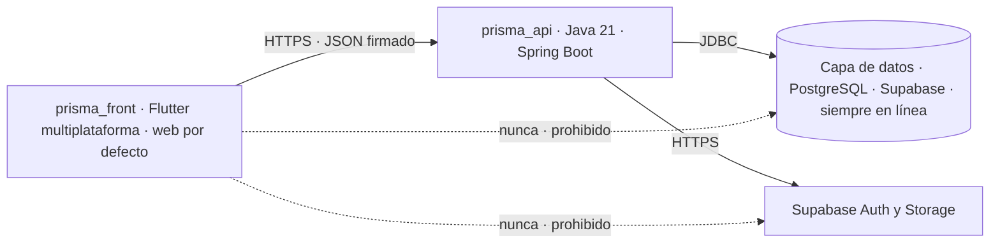
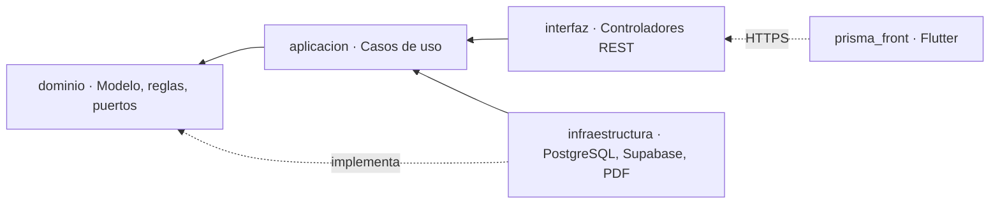

# 07 · Arquitectura técnica

Tres partes —un front en Flutter multiplataforma, una API en Java 21 con Spring Boot y una capa
de datos PostgreSQL siempre en línea—. Arquitectura hexagonal (puertos y adaptadores) sobre Clean
Architecture, con principios SOLID.

---

## 1. Stack

| Capa | Elección | Razón |
|---|---|---|
| Lenguajes | **Dart en el front, Java 21 en la API** | Son dos, y es un costo que se asume a conciencia. El porqué está en §1.5 |
| Front | **Flutter multiplataforma**, objetivo por defecto **web**, instalable como PWA (`prisma_front`) | Una sola base de código para el navegador del taller y, sin reescribir nada, para Android, iOS y escritorio |
| API | **Java 21 con Spring Boot**, a la vez API y BFF (`prisma_api`) | Único punto que habla con la base. Ahí viven el dominio y los casos de uso |
| Framework HTTP | **Spring Web** sobre el arranque de Spring Boot ([ADR-017](adr/ADR-017-api-en-java.md)) | Enrutado por anotaciones, inyección de dependencias y transacciones declarativas en la misma caja. Nada de esto hay que construirlo |
| Acceso a datos | **JDBC con `JdbcTemplate`**, sin ORM | El SQL queda a la vista y la transacción con identidad (§7.2) se controla a mano. Un ORM que abre conexiones por su cuenta es justo lo que rompe esa transacción |
| Base | **PostgreSQL gestionado por Supabase**, siempre en línea | Es la misma base de siempre: RLS, triggers y restricciones siguen siendo el corazón de la seguridad |
| Autenticación | **Supabase Auth, llamado desde la API** | El front manda usuario y contraseña; nunca ve al proveedor ni el correo sintético (§6.1) |
| Archivos | **Supabase Storage, llamado desde la API** | El front sube a `prisma_api` y la API al Storage. Las políticas por rol no se mueven |
| PDF | **Se genera en `prisma_api`** | Cotizaciones, remisiones y desprendibles salen idénticos para todo el mundo y el front no carga una librería de PDF |
| Resiliencia | **Resilience4j** | Reintentos, cortacircuitos, tiempos de espera y límite de tasa como piezas probadas, no escritas a mano (§10) |
| Documentación | **springdoc-openapi** | Swagger sale del ecosistema y se genera de los controladores (§9.4) |
| Pruebas | **JUnit 5 y AssertJ** en la API, `package:test` en el front | El dominio se prueba sin base de datos ni navegador, igual que antes |
| Frontera verificada | **ArchUnit** en la API, lints de Dart en el front | La regla de dependencias falla la compilación, no la revisión (§3) |
| Ambientes | **dev, qa, uat y prod**, un proyecto de Supabase por ambiente | El detalle está en [`19-ambientes-y-entrega.md`](19-ambientes-y-entrega.md) |

> **El costo de operación deja de ser cero.** «Siempre en línea» significa que prod y uat no
> pueden vivir en el plan gratuito de Supabase, porque ese plan pausa el proyecto tras una semana
> de inactividad, y un taller que factura los lunes encontraría el sistema dormido. dev y qa sí
> pueden quedarse en el gratuito. Son, como mínimo, dos proyectos de pago, más el alojamiento de
> la API, que ahora es una JVM y pide más memoria que un binario. La cuenta completa va en
> [`19-ambientes-y-entrega.md`](19-ambientes-y-entrega.md).

### 1.1 Las tres partes



| Parte | Qué es | Qué hace | Qué NO hace |
|---|---|---|---|
| **prisma_front** | Flutter, un solo código; objetivo por defecto **web**, y el mismo código compila a Android, iOS y escritorio | Pide, recibe y muestra. Pinta lo que la API le dicta | **No decide nada.** Ni reglas, ni permisos, ni mensajes, ni cálculos de negocio |
| **prisma_api** | Java 21 con Spring Boot | Toda la lógica. Toma todas las decisiones. Dicta qué mensaje se muestra y cuándo | No confía en el front. No decide los permisos que le tocan a la base |
| **Capa de datos** | PostgreSQL en Supabase, más migraciones, funciones de negocio, índices, particiones y el pool de conexiones | Garantiza lo que no se puede romper: restricciones, RLS, atomicidad, durabilidad | No es un servicio desplegable. La API le habla directo |

> **Regla dura: el front NUNCA habla con Supabase directamente.** Ni con la base, ni con Auth,
> ni con Storage. Todo pasa por `prisma_api`.

Si alguien mete el cliente de Supabase en el código Flutter, está saltándose la arquitectura y
**hay que rechazarlo en revisión de código**. No es una preferencia de estilo: es lo que sostiene
la propagación de identidad (§7) y lo que hace que el front no lleve ninguna clave dentro.

### 1.2 Por qué la capa de datos no es un servicio desplegable aparte

Se consideró un tercer servicio, desplegado entre la API y la base, que fuera «el back-end de
base de datos». Se descartó por una razón concreta y no por gusto: **la identidad del usuario
tiene que llegar viva hasta PostgreSQL** ([ADR-012](adr/ADR-012-identidad-a-postgres.md)). Cada
salto que atraviesa es un sitio más donde puede perderse, y si se pierde, RLS deja de proteger
sin fallar y sin avisar.

La capa de datos es una de las tres partes **por responsabilidad, no por despliegue**. Tiene
dueño, tiene versión y tiene su propio trabajo —migraciones, funciones de negocio, índices,
particiones, pool—, pero corre dentro del mismo salto que la API.

Y como [ADR-002](adr/ADR-002-arquitectura-hexagonal.md) exige puertos y adaptadores, el día que
haya de verdad varias bases se extrae como servicio sin rehacer la API.

### 1.3 Por qué una sola API y no un BFF más una API de dominio

Hoy hay **un solo cliente**. Separar las dos capas daría dos cosas que desplegar, versionar y
vigilar sin ninguna ganancia a cambio.

El día que aparezca un segundo cliente —una integración contable, un panel público— ahí sí se
parte. Y `prisma_api` ya está organizada por dentro para permitirlo.

### 1.4 Por dentro de `prisma_api`

[ADR-002](adr/ADR-002-arquitectura-hexagonal.md) decidió **arquitectura hexagonal**, y esa
decisión **no se deroga: se refuerza**. Ahora por fin hay un backend donde aplicarla de verdad,
en lugar de sostenerla dentro de un navegador.

| Paquete | Qué vive ahí | Qué NO puede hacer |
|---|---|---|
| `dominio` | Entidades, reglas de negocio, valores (Dinero, Usuario, Pedido) | Importar Spring, JDBC, SQL o HTTP. Ni una anotación |
| `aplicacion` | Casos de uso, uno por CU del documento 02 | Conocer el framework HTTP |
| `infraestructura` | Repositorios JDBC contra PostgreSQL, cliente de Supabase Auth, Storage | Contener reglas de negocio |
| `interfaz` | Controladores REST, el sobre de respuesta, el filtro de firma, el de idempotencia | Contener reglas de negocio |

El día que haya que partir en BFF y API, `interfaz` se convierte en el BFF y el resto queda en la
API. Por eso la separación importa desde el primer día aunque hoy sea un solo despliegue.

### 1.5 Qué se pierde y qué se gana al pasar la API a Java

Lo que se pierde, dicho sin adornos: **el argumento de un solo lenguaje en todo el proyecto.**
[ADR-011](adr/ADR-011-stack-flutter-dart.md) eligió Dart en la API precisamente por eso, y esa
razón ahora es falsa. Serán dos lenguajes, dos cadenas de herramientas y el modelo del negocio
escrito en dos dialectos. Hay que decirlo, porque era una de sus razones principales.

Lo que se gana, y por lo que la decisión se sostiene:

- **Gente que lo pueda retomar.** Es exactamente el criterio que usó
  [ADR-001](adr/ADR-001-stack.md) para preferir React a Svelte: para un sistema del que dependerá
  un negocio durante años, la disponibilidad de quien pueda retomarlo pesa más que ahorrar unas
  semanas. En Colombia hay muchísimo más Java de servidor que Dart de servidor.
- **Swagger sale del ecosistema.** `springdoc-openapi` genera el OpenAPI desde los controladores.
  No hay que construirlo ni mantenerlo a mano (§9.4).
- **Resiliencia con piezas probadas.** `Resilience4j` trae reintentos, cortacircuitos y límite de
  tasa ya escritos y ya depurados por mucha gente (§10).
- **Transacciones declarativas.** Es justo lo que exigen la propagación de identidad de
  [ADR-012](adr/ADR-012-identidad-a-postgres.md) (§7.2) y la atomicidad de la idempotencia (§9.2).

Lo que cuesta, además del lenguaje extra: **el backend sigue siendo trabajo nuevo** —construirlo,
probarlo, desplegarlo, versionarlo y asegurarlo, multiplicado por cuatro ambientes— y **la JVM
pide más memoria y arranca más lento** que un binario compilado. Eso encarece alojar cuatro
ambientes. Con `RNF-14` reescrito a «costo al mínimo sostenible» es asumible, pero es real y el
plan de desarrollo tiene que reflejarlo.

---

## 2. Estructura de carpetas

Dos proyectos, cada uno con su repositorio y su versión: la API con `pom.xml`, el front con
`pubspec.yaml`. **Son dos árboles distintos y dos lenguajes distintos:** Java en `prisma_api`,
Dart en `prisma_front`.

```
prisma_api/
├── pom.xml
└── src/
    ├── main/
    │   ├── java/co/prismamy/api/
    │   │   ├── PrismaApiApplication.java
    │   │   │
    │   │   ├── dominio/                   # EL NÚCLEO — no conoce HTTP, ni SQL, ni Spring
    │   │   │   ├── modelo/
    │   │   │   │   ├── Dinero.java        # Objeto de valor: entero de pesos, nunca decimales
    │   │   │   │   ├── Periodo.java       # Mes/año en America/Bogota
    │   │   │   │   ├── Movimiento.java
    │   │   │   │   ├── Pedido.java
    │   │   │   │   ├── Producto.java
    │   │   │   │   └── Empleado.java
    │   │   │   ├── servicio/              # Reglas puras — el corazón del sistema
    │   │   │   │   ├── CalcularUtilidadCausada.java
    │   │   │   │   ├── CalcularCajaLibre.java
    │   │   │   │   ├── CalcularAnticipoMinimo.java
    │   │   │   │   ├── CalcularMargenes.java
    │   │   │   │   ├── CalcularPatrimonio.java
    │   │   │   │   ├── CalcularCapacidadDePago.java
    │   │   │   │   ├── CalcularPuntoDeEquilibrio.java
    │   │   │   │   ├── RepartirEnSobres.java
    │   │   │   │   └── LiquidarNomina.java
    │   │   │   └── puerto/                # Interfaces — contratos con el exterior
    │   │   │       ├── LeerMovimientos.java
    │   │   │       ├── EscribirMovimientos.java
    │   │   │       ├── RepositorioPedidos.java
    │   │   │       ├── RepositorioNomina.java
    │   │   │       ├── GeneradorPdf.java
    │   │   │       └── Exportador.java
    │   │   │
    │   │   ├── aplicacion/                # CASOS DE USO — uno por clase, uno por CU-xx
    │   │   │   ├── RegistrarMovimiento.java           # CU-01, CU-02
    │   │   │   ├── AnularMovimiento.java              # CU-03
    │   │   │   ├── CorregirPorContraAsiento.java      # CU-04
    │   │   │   ├── RegistrarPedido.java               # CU-05
    │   │   │   ├── CobrarAnticipo.java                # CU-06
    │   │   │   ├── EntregarPedido.java                # CU-07
    │   │   │   ├── CostearProducto.java               # CU-09, CU-10
    │   │   │   ├── GenerarCotizacion.java             # CU-11
    │   │   │   ├── ConsultarTresCifras.java           # CU-13
    │   │   │   ├── RegistrarRetiro.java               # CU-16, CU-25
    │   │   │   ├── CalcularCapacidadDePago.java       # CU-18
    │   │   │   ├── LiquidarNomina.java                # CU-19
    │   │   │   ├── RegistrarAdelanto.java             # CU-26
    │   │   │   └── ImportarHistorico.java             # CU-21
    │   │   │
    │   │   ├── infraestructura/           # ADAPTADORES — lo único que sabe de tecnología concreta
    │   │   │   ├── postgres/
    │   │   │   │   ├── ConfiguracionDePool.java
    │   │   │   │   ├── ConIdentidad.java              # §7.2 — la transacción con identidad
    │   │   │   │   ├── RepositorioMovimientosPostgres.java
    │   │   │   │   ├── RepositorioPedidosPostgres.java
    │   │   │   │   └── mapeador/
    │   │   │   ├── supabase/
    │   │   │   │   ├── ClienteAuth.java               # Correo sintético y sesión (§6.1)
    │   │   │   │   └── ClienteStorage.java
    │   │   │   ├── pdf/
    │   │   │   │   ├── GeneradorPdfCotizacion.java
    │   │   │   │   └── GeneradorPdfDesprendible.java
    │   │   │   └── exportacion/
    │   │   │       └── ExportadorZip.java
    │   │   │
    │   │   └── interfaz/                  # HTTP — solo traduce. Nunca calcula.
    │   │       ├── rest/                  # Controladores, uno por recurso
    │   │       ├── sobre/
    │   │       │   ├── Sobre.java                     # {status, mensaje, data} (§9.1)
    │   │       │   └── CatalogoDeCodigos.java         # Fuente única de los códigos de 5 dígitos
    │   │       ├── filtro/
    │   │       │   ├── FiltroDeFirma.java             # §9.3 — nonce, marca de tiempo y HMAC
    │   │       │   ├── FiltroDeIdempotencia.java      # §9.2
    │   │       │   └── FiltroDeIdentidad.java         # Token y claims hacia §7.2
    │   │       └── error/
    │   │           └── TraduccionDeRestricciones.java # §8.5 — restricción → código + mensaje
    │   └── resources/
    │       ├── application.yml
    │       └── openapi.json                           # Versionado y verificado en CI (§9.4)
    └── test/
        └── java/co/prismamy/api/
            ├── dominio/                   # Pruebas puras, sin base de datos ni red
            ├── doble/                     # Repositorios en memoria para pruebas
            ├── arquitectura/              # ArchUnit: la regla de dependencias (§3)
            └── integracion/               # Contra la base real, incluye la prueba de §7.4
```

```
prisma_front/
├── pubspec.yaml
├── lib/
│   ├── ui/                        # FLUTTER — solo presenta. Nunca calcula plata.
│   │   ├── pantallas/
│   │   ├── componentes/
│   │   ├── formulario/            # Pinta el descriptor que manda la API (§8.4)
│   │   └── formato/               # Moneda y fechas para Colombia
│   ├── datos/
│   │   ├── cliente_api.dart       # ÚNICO punto de salida a la red. Solo habla con prisma_api
│   │   ├── firma.dart             # Nonce, marca de tiempo y HMAC de cada petición (§9.3)
│   │   ├── cola_pendientes.dart   # Cola local persistente con clave de idempotencia (§10)
│   │   └── modelos/               # Espejo de lo que devuelve la API
│   └── estado/                    # Estado de pantalla y sesión
├── web/                           # Manifiesto y service worker de la PWA — objetivo por defecto
├── android/ · ios/ · windows/     # Mismos fuentes, otros objetivos. Nada se reescribe
└── test/
```

**No hay carpeta `supabase/` en el front, y no puede haberla.** Si aparece, es la señal de que
alguien se saltó §1.1.

---

## 3. Regla de dependencias



**Las flechas apuntan siempre hacia adentro.** `dominio` no importa nada de `infraestructura` ni
de `interfaz`. Y `prisma_front` entra por la puerta de HTTP como cualquier otro cliente: no tiene
acceso privilegiado a nada.

**Consecuencia práctica:** si mañana Supabase deja de servir o cambia de precio, se escribe un
adaptador nuevo en `infraestructura` y **no se toca una sola línea de las reglas de negocio**.
Los cálculos financieros —lo más valioso y lo más costoso de reconstruir— quedan aislados de
cualquier decisión tecnológica.

En la API, la regla se verifica con **ArchUnit**, como una prueba más que corre en cada
compilación:

```java
// src/test/java/co/prismamy/api/arquitectura/ReglaDeDependenciasTest.java
@AnalyzeClasses(packages = "co.prismamy.api")
class ReglaDeDependenciasTest {

    @ArchTest
    static final ArchRule el_dominio_no_conoce_tecnologia =
        noClasses().that().resideInAPackage("..dominio..")
            .should().dependOnClassesThat().resideInAnyPackage(
                "org.springframework..", "java.sql..", "javax.sql..",
                "..infraestructura..", "..interfaz..")
            .because("el dominio no conoce base de datos, HTTP ni framework");

    @ArchTest
    static final ArchRule los_casos_de_uso_no_conocen_http =
        noClasses().that().resideInAPackage("..aplicacion..")
            .should().dependOnClassesThat().resideInAnyPackage(
                "org.springframework.web..", "jakarta.servlet..", "..interfaz..")
            .because("los casos de uso no conocen el framework HTTP");
}
```

En el front, la misma idea con el análisis estático de Dart:

```yaml
# prisma_front/analysis_options.yaml — la frontera del front
dart_code_metrics:
  rules:
    - avoid-banned-imports:
        entries:
          - paths: ['lib/.*']
            deny: ['package:supabase_flutter', 'package:postgres']
            message: 'El front habla con prisma_api, nunca con Supabase (§1.1)'
```

Si alguien importa PostgreSQL dentro del dominio, o Supabase dentro del front, la compilación
falla. No es una recomendación de estilo: es una barrera.

---

## 4. El dominio en detalle

Vive en `prisma_api`. El front no reimplementa ninguna de estas reglas: las consume.

### 4.1 Dinero como objeto de valor

```java
// dominio/modelo/Dinero.java
// Pesos colombianos enteros. Nunca decimales, nunca coma flotante.

public record Dinero(long pesos) {

    public static final Dinero CERO = new Dinero(0L);

    public static Dinero de(long pesos) { return new Dinero(pesos); }

    public Dinero mas(Dinero otro)   { return new Dinero(pesos + otro.pesos()); }
    public Dinero menos(Dinero otro) { return new Dinero(pesos - otro.pesos()); }

    public Dinero porcentaje(BigDecimal pct) {
        return new Dinero(BigDecimal.valueOf(pesos)
            .multiply(pct)
            .divide(BigDecimal.valueOf(100), 0, RoundingMode.HALF_UP)
            .longValueExact());
    }

    public boolean esNegativo() { return pesos < 0; }
}
```

**Por qué importa.** Con números decimales, `0.1 + 0.2` no es `0.3`. En un sistema financiero ese
error se acumula de forma invisible hasta que un reporte no cuadra por unos pesos y nadie sabe por
qué. Con enteros, el problema no existe. En Java, `long` es siempre un entero de 64 bits, y el
único sitio donde aparece una fracción —el porcentaje— usa `BigDecimal` con redondeo explícito, no
`double`.

> **Y hay una razón más para que el dinero se calcule en la API.** En la JVM —donde corre
> `prisma_api`— un `long` es un entero de 64 bits de verdad. En el front compilado a JavaScript
> para el navegador, un `int` de Dart pasa a ser un número de coma flotante. El sitio correcto
> para sumar plata es el servidor, y con el front sin reglas de negocio (§8) ni siquiera hay
> tentación de hacerlo en otro lado.

### 4.2 Un servicio de dominio típico

```java
// dominio/servicio/CalcularCajaLibre.java
// Función pura: mismas entradas, mismo resultado, sin efectos secundarios.

public final class CalcularCajaLibre {

    private CalcularCajaLibre() { }

    public static ResultadoCajaLibre calcular(List<Dinero> saldosPorCuenta,
                                              Dinero anticiposPorDevengar,
                                              Dinero gastosFijosComprometidos) {

        Dinero saldoTotal = saldosPorCuenta.stream()
            .reduce(Dinero.CERO, Dinero::mas);

        Dinero cajaLibre = saldoTotal
            .menos(anticiposPorDevengar)
            .menos(gastosFijosComprometidos);

        return new ResultadoCajaLibre(
            saldoTotal,
            anticiposPorDevengar,
            gastosFijosComprometidos,
            cajaLibre,
            cajaLibre.esNegativo() ? "CAJA_LIBRE_NEGATIVA" : null);
    }
}
```

Sin base de datos, sin HTTP, sin una sola anotación de Spring. Se prueba en milisegundos y su
comportamiento es completamente predecible.

### 4.3 Un puerto

```java
// dominio/puerto/LeerMovimientos.java
// El dominio declara QUÉ necesita, no CÓMO se obtiene.

public interface LeerMovimientos {
    List<Movimiento> porPeriodo(Periodo periodo);
    List<SaldoCuenta> saldosPorCuenta();
}

// dominio/puerto/EscribirMovimientos.java
public interface EscribirMovimientos {
    Movimiento registrar(NuevoMovimiento movimiento);
    void anular(UUID id, String motivo, ContextoAuditoria contexto);
}
```

Dos interfaces pequeñas en lugar de una grande: quien solo necesita leer no queda obligado a
implementar la escritura.

Y son métodos **sincrónicos, sin `Future` ni `async`**, a propósito. JDBC bloquea, y con los hilos
virtuales de Java 21 bloquear deja de ser caro. A cambio, la transacción es un bloque de código
con principio y fin visibles, que es exactamente lo que necesita §7.2.

---

## 5. SOLID aplicado a este proyecto

| Principio | Cómo se aplica aquí | Qué se evita |
|---|---|---|
| **S** · Responsabilidad única | Una clase por caso de uso. `RegistrarMovimiento` no genera PDF ni consulta reportes | Clases de 900 líneas que nadie se atreve a tocar |
| **O** · Abierto/cerrado | Un reporte nuevo implementa una interfaz existente, sin modificar los ya probados | Romper lo que funciona al agregar algo |
| **L** · Sustitución de Liskov | Toda implementación de `LeerMovimientos` es intercambiable: PostgreSQL en producción, en memoria en pruebas | Pruebas que necesitan una base de datos real |
| **I** · Segregación de interfaces | Puertos pequeños (`LeerMovimientos`, `EscribirMovimientos`) | Implementar métodos vacíos solo para cumplir el contrato |
| **D** · Inversión de dependencias | El caso de uso depende de la interfaz, nunca de la conexión a PostgreSQL | Quedar atrapado en un proveedor |

### 5.1 El beneficio, en lenguaje de negocio

Todos los cálculos de plata se prueban **sin base de datos, sin internet y en milisegundos**.
Eso significa que:

- Cada fórmula financiera tiene pruebas automáticas que corren en cada cambio.
- Un error de cálculo se detecta antes de llegar a un reporte del que dependan decisiones reales.
- El ejemplo de septiembre del documento 05 se convierte en una prueba ejecutable: si alguien
  rompe la fórmula de caja libre, la prueba falla y el cambio no llega a producción.

---

## 6. Seguridad

| Capa | Medida |
|---|---|
| Transporte | HTTPS obligatorio en el front y en la API, gestionado por el despliegue |
| Canal firmado | Sobre HTTPS, **no en vez de HTTPS**: cada petición lleva nonce, marca de tiempo y firma HMAC contra repetición y manipulación (§9.3) |
| Autenticación | **Nombre de usuario y contraseña, no correo.** La traducción a correo sintético ocurre **dentro de `prisma_api`**: el front manda usuario y contraseña y nunca ve un correo. Las contraseñas nunca tocan código propio |
| Contraseñas | Mínimo 8 caracteres, sin composición obligatoria y sin caducidad periódica. Hash bcrypt del proveedor |
| Primer ingreso | Cambio de contraseña obligatorio. `usuarios.debe_cambiar_clave` arranca en `TRUE` al crear y al restablecer, y solo baja cuando la persona la cambia |
| Restablecimiento | **Presencial.** Solo Gerencia genera una clave temporal desde la pantalla de Gestión de usuarios. No hay recuperación por correo |
| Intentos fallidos | La API los registra en `auditoria` como `inicio_sesion_fallido` con usuario intentado, fecha, dispositivo e IP. **Nunca se guarda la contraseña tecleada**, ni completa ni parcial |
| Autorización | **Row Level Security por rol dentro de PostgreSQL**, con la identidad de la persona propagada por la API (§7) |
| Integridad | `DELETE` y `TRUNCATE` revocados en el motor |
| Trazabilidad | Triggers de auditoría que ni el front ni la API pueden evitar |
| Validación | **Dos capas deciden —base y API— y el front pinta** (§8) |
| Archivos | Storage con políticas de acceso por rol. El front sube a la API y la API al Storage |
| Secretos | **Solo la API los tiene.** Viven en variables de entorno del servidor, distintas por ambiente. El front se compila con `--dart-define` y solo lleva la dirección de la API y el nombre del ambiente. Ninguna llave en el repositorio |

**La decisión central.** Los permisos no se implementan escondiendo botones. Si los datos de
nómina llegaran al dispositivo de la empleada, bastaría con abrir las herramientas de desarrollo
para verlos. Con RLS, PostgreSQL **no devuelve esas filas**, sin importar cómo se construya la
petición.

Lo que evalúa RLS es `usuarios.tipo` —`gerencia` u `operacion`—, nunca el cargo.
**El tipo dice qué puede ver. El cargo dice qué hace.**

> **Lo que el front dejó de saber.** No conoce la dirección de la base, ni la clave anónima, ni
> la de servicio, ni el dominio de correo sintético, ni las reglas de Storage. Una compilación de
> Flutter para web es un archivo que cualquiera puede descargar y leer; ahora no hay nada que
> leer.

### 6.1 Acceso con nombre de usuario · el correo sintético

Supabase Auth autentica contra un **correo electrónico**. Las empleadas de un taller de
estampados no siempre tienen correo, y pedirles uno es una barrera real de adopción.

Entonces el sistema traduce, **y traduce en el servidor**. La persona escribe `marcela`, el front
envía usuario y contraseña a `POST /sesiones`, y `prisma_api` arma
`marcela@usuarios.prismamy.co` y llama al proveedor.

```
usuario escrito:  marcela                     (lo único que sale del front)
dominio interno:  @usuarios.prismamy.co       (constante de la API, fija de por vida)
correo sintético: marcela@usuarios.prismamy.co (nunca sale de la API)
```

El correo sintético es un detalle interno: **nunca se muestra, nunca se pide, nunca se imprime
en un desprendible.** La decisión completa está en
[ADR-009](adr/ADR-009-login-por-usuario.md), que este cambio **no deroga sino que mejora**: lo
que era un truco del cliente pasa a ser un detalle del servidor, que es donde debía estar.

Las cinco reglas del mecanismo:

| Regla | Por qué |
|---|---|
| El dominio interno es un **subdominio del dominio del negocio**, no `.local` | `.local` está reservado por RFC 6762 para mDNS y algunas plataformas lo resuelven raro |
| La **confirmación de correo queda desactivada** en el proveedor | Si alguien la activa por error, ningún usuario nuevo podrá entrar y el mensaje de error no lo explica |
| **No hay «olvidé mi contraseña» por correo** | No hay correo real. La recuperación es presencial: Gerencia restablece la clave desde la pantalla de Gestión de usuarios |
| El dominio interno **no se cambia** después del primer usuario | Cambiarlo obliga a migrar todas las identidades. Se fija una vez |
| El nombre de usuario es `CITEXT` y la API lo normaliza a minúsculas antes de armar el correo | Para que `Marcela` y `marcela` sean la misma persona |

> **La recuperación presencial es una consecuencia aceptada, no un olvido.** Sin correo real no
> hay a dónde mandar un enlace. La clave temporal se entrega en persona y el sistema obliga a
> cambiarla en el primer ingreso.

Política de contraseñas:

| Regla | Valor | Razón |
|---|---|---|
| Longitud mínima | 8 caracteres | Longitud sobre composición: obligar símbolos produce claves peores y más apuntadas en papel |
| Composición obligatoria | Ninguna | Ídem |
| Almacenamiento | Hash bcrypt del proveedor | El código propio nunca ve la contraseña |
| Primer ingreso | Cambio obligatorio | `debe_cambiar_clave = TRUE` al crear y al restablecer |
| Restablecimiento | Solo Gerencia, con clave temporal | No hay canal de correo |
| Caducidad periódica | **No** | Rotar por calendario empeora las claves |
| Intentos fallidos | Limitados por el proveedor | Se registran en auditoría |

---

## 7. La identidad tiene que llegar hasta PostgreSQL

Esta es la sección que decide si el cambio de arquitectura conserva o destruye la seguridad del
sistema. **No es opcional y no se puede dejar para después.** La decisión está registrada en
[ADR-012](adr/ADR-012-identidad-a-postgres.md), que **no cambia con el paso a Java**: cambia el
lenguaje del ejemplo, no la decisión.

### 7.1 El problema

[ADR-006](adr/ADR-006-rls-por-rol.md) decidió que los permisos viven dentro de PostgreSQL con
Row Level Security. Todas las políticas escritas preguntan por `auth.uid()`:
`usuarios_lectura`, `fn_es_gerencia()`, `nom_lectura`, `mov_insercion`, el guardián de la última
Gerencia, y las que protegen nómina, adelantos y patrimonio.

Eso funcionaba porque el navegador hablaba directo con la base llevando su propio token.

Con `prisma_api` en medio, la base ya no ve a la empleada: ve a la API. Y entonces:

| Si la API se conecta… | Qué pasa |
|---|---|
| Con la **clave de servicio** (`service_role`) | RLS **deja de aplicar**. Todas las políticas se vuelven decorado y la seguridad pasa a depender de que ningún `if` de Java falle nunca |
| Como **anónimo**, sin propagar nada | `auth.uid()` es nulo, las políticas no encuentran usuario y **no se puede leer nada** |

La primera opción es la tentadora, la que «funciona», y la que convierte `ADR-006`, `ADR-005` y
todo el trabajo de permisos en una ilusión.

### 7.2 La solución, obligatoria

`prisma_api` abre **una transacción por petición** y, antes de tocar ninguna tabla, propaga los
claims del token del usuario a la sesión de PostgreSQL:

```java
// infraestructura/postgres/ConIdentidad.java
@Transactional
public <T> T conIdentidad(Claims claims, Supplier<T> cuerpo) {
    // 'true' = local a la transacción: se descarta al terminar y no contamina la conexión
    jdbc.update("SELECT set_config('request.jwt.claims', ?, true)",
                objectMapper.writeValueAsString(claims));
    jdbc.execute("SET LOCAL ROLE authenticated");
    return cuerpo.get();
}
```

`auth.uid()` de Supabase lee `request.jwt.claims ->> 'sub'`. Al fijarlo así, **todas las
políticas ya escritas funcionan sin tocar una sola línea de SQL.** RLS sigue siendo el juez.

> **Aviso concreto de Spring.** Con un pool de conexiones, `SET LOCAL` solo dura la transacción,
> que es justo lo que se quiere: la siguiente petición que reciba esa misma conexión no hereda la
> identidad de la anterior. Pero la otra cara es dura: **cualquier consulta que se ejecute fuera
> de la transacción irá sin identidad**, y no fallará de forma ruidosa. La regla es
> **ningún repositorio se llama fuera de una transacción**, y una prueba lo verifica.

### 7.3 Las cuatro condiciones que lo hacen real

Sin estas cuatro, lo anterior es teatro:

1. **El usuario de base de datos de la API no puede tener `BYPASSRLS`.** Se crea un rol dedicado,
   `prisma_api`, sin ese atributo y sin `SUPERUSER`.
2. **El usuario de la API no puede ser dueño de las tablas.** El dueño se salta RLS por defecto.
3. **`ALTER TABLE … FORCE ROW LEVEL SECURITY` en todas las tablas**, para que ni el dueño se
   libre. Es cinturón y tirantes, y aquí se justifica.
4. **La clave `service_role` de Supabase no se usa nunca en el camino de una petición de usuario.**
   Queda reservada para migraciones y tareas administrativas, y vive en un secreto distinto.

> **Dos tablas no admiten la tercera condición, y está decidido así.** `usuarios` y `auditoria`
> se quedan sin `FORCE`: la primera porque `fn_es_gerencia()` la consulta y el ciclo solo se
> corta si el dueño no pasa por RLS; la segunda porque la bitácora la escribe una función
> `SECURITY DEFINER` que con `FORCE` dejaría de poder escribir. En esas dos manda la condición 2:
> el rol de la API no es dueño de nada. El detalle y el SQL están en
> [`04-modelo-de-datos.md`](04-modelo-de-datos.md) §7.1.

### 7.4 Cómo se prueba

Prueba de integración obligatoria, en cada ambiente, contra la base real: autenticarse como una
usuaria de tipo Operación a través de la API y comprobar que `GET /nomina`, `GET /usuarios` y
`GET /patrimonio` devuelven vacío o 403 **por decisión de la base**, no por un `if` de Java.

Para demostrarlo: se desactiva temporalmente la comprobación de la capa de aplicación en el
ambiente de pruebas y el resultado debe seguir siendo el mismo. Si al quitar el `if` los datos
aparecen, RLS no está actuando y la prueba falla.

Y una segunda prueba, hermana del aviso de §7.2: recorrer los repositorios y comprobar que
ninguno se invoca fuera de una transacción. Una consulta suelta es una consulta sin identidad.

---

## 8. Validación: dos capas deciden, una pinta

La decisión está en [ADR-018](adr/ADR-018-front-sin-decisiones.md), que reemplaza a
[ADR-015](adr/ADR-015-validacion-tres-capas.md). `ADR-015` había escrito tres capas de
validación, con el front validando como tercera. **Eso ya no es cierto y hay que decirlo claro:
el front no valida, pinta.**

### 8.1 El principio

> **La base de datos es la única capa que nadie puede saltarse, así que es la que decide en
> última instancia. La API decide todo lo demás. El front no decide nada: muestra lo que la API
> le dicta.**

Si la base y la API discrepan, gana la base. Siempre. Y si la base rechaza algo que la API dejó
pasar, eso es un defecto de la API, no de la base.

> **El front no contiene ni una sola regla de negocio.** Ni un umbral, ni un porcentaje, ni una
> comprobación de permisos, ni un catálogo de mensajes, ni una cifra calculada. Si algo hay que
> decidir, lo decide la API y el front pinta el resultado.

Lo que sí hace el front: rutas, estado de pantalla, animaciones, formato de presentación
—separador de miles, formato de fecha— y accesibilidad. Eso es presentación, no decisión.

### 8.2 Qué hace cada capa

| Capa | Qué hace | Qué pasa si falla | Se puede saltar |
|---|---|---|---|
| **PostgreSQL** | **Decide.** `NOT NULL`, `CHECK`, `FOREIGN KEY`, `UNIQUE`, `EXCLUDE`, dominios, triggers, RLS, `REVOKE DELETE` | Error del motor con nombre de restricción, que la API traduce (§8.5) | **No** |
| **`prisma_api`** | **Decide.** Las reglas que la base no puede expresar, los permisos que sí puede adelantar, los cálculos y **el mensaje exacto que se va a mostrar** | Sobre de respuesta con su código de cinco dígitos y su mensaje en español (§9.1) | Sí, si alguien llamara a la base por fuera. Por eso la base sigue siendo el juez |
| **`prisma_front`** | **Pinta.** Aplica el descriptor que la API le envió (§8.4) y muestra los mensajes que la API redactó | Aviso inmediato en pantalla, con el texto que vino de la API, sin viaje a la red | Sí, con las herramientas del navegador. **Y no importa**: no autoriza nada |

La diferencia con el modelo anterior es de fondo. Antes el front tenía su copia de las reglas
para poder responder rápido, y esa copia se separaba de la original con el tiempo. Ahora el front
sigue respondiendo rápido, pero con **datos que vienen de la única regla que existe**.

### 8.3 Qué desaparece del front

| Hoy en el mockup | A partir de ahora |
|---|---|
| `data-ger` decide qué se muestra según el tipo de usuario | **La API devuelve el menú** que esa sesión puede ver. El front lo pinta |
| Mensajes de error escritos en el cliente | **La API dicta el mensaje**, ya redactado en español y listo para mostrar |
| Reglas de validación escritas en el formulario | **La API envía el descriptor** del formulario (§8.4) |
| Cálculo de totales en pantalla | **La API los calcula** y los manda listos |

> **Esto no reemplaza a RLS: es defensa en profundidad.** Que la API no mande una opción de menú
> es comodidad; que la base no devuelva la fila es seguridad. Quitar lo primero molesta a la
> usuaria; quitar lo segundo abre el sistema.

### 8.4 El descriptor de formulario

Para que «el front no decide» no signifique «cada error cuesta un viaje por datos móviles», las
reglas viajan **como datos**, no como código:

```json
{
  "campo": "valor",
  "etiqueta": "Valor del gasto",
  "tipo": "dinero",
  "obligatorio": true,
  "minimo": 1,
  "maximo": 99999999,
  "teclado": "numerico",
  "ayuda": "En pesos, sin centavos",
  "mensajes": {
    "obligatorio": "Escribe cuánto fue el gasto.",
    "minimo": "El gasto tiene que ser mayor que cero."
  }
}
```

El front **no sabe** que el valor debe ser mayor que cero: sabe que hay una regla llamada `minimo`
con valor 1 y un mensaje que mostrar si no se cumple. La regla sigue siendo de la API, y la API
**la vuelve a comprobar cuando llega la petición, siempre**.

El descriptor se genera del mismo sitio que las validaciones del servidor. No se escribe a mano
dos veces: si se escribiera dos veces, se separarían, que es justo lo que este diseño evita.

La forma completa del descriptor, campo por campo, es parte del contrato y vive en
[`20-contrato-de-api.md`](20-contrato-de-api.md).

### 8.5 El contrato de errores: lo que mantiene honesta la redundancia

La base y la API validan lo mismo dos veces a propósito. El riesgo real es que las dos versiones
se separen con el tiempo y digan cosas distintas. Se ataca así:

1. **Toda restricción de la base lleva nombre explícito.** Nada de nombres generados por
   PostgreSQL. `CONSTRAINT movimientos_valor_positivo CHECK (valor > 0)`.
2. **Existe una tabla única de traducción** en `prisma_api`: nombre de restricción → código de
   cinco dígitos + mensaje en español + campo del formulario al que señala. Un solo archivo,
   revisable de un vistazo, alimentado por el mismo catálogo de códigos de §9.1.
3. **Si la API recibe un error de la base que no está en esa tabla, responde `50001` y lo registra
   como defecto.** Significa que hay una regla en la base que la API no conocía: eso es
   exactamente lo que hay que descubrir, no esconder.
4. **Prueba automática**: recorrer todas las restricciones nombradas de la base (`pg_constraint`)
   y comprobar que cada una tiene entrada en la tabla de traducción. Si alguien agrega una
   restricción y olvida el mensaje, la prueba falla.

Ese punto 4 es lo que convierte la redundancia en un sistema mantenible en vez de en deuda.

Y hay una razón que no se puede resolver quitando capas: **la base valida cosas que la API no
puede garantizar.** Concurrencia, sobre todo. Dos peticiones simultáneas pueden pasar las dos el
`if` de Java y solo una puede pasar el `UNIQUE`.

### 8.6 Qué se refuerza en la base

Sobre lo que ya tiene el modelo de [`04-modelo-de-datos.md`](04-modelo-de-datos.md), se agrega:

- **Dominios** para los tipos que se repiten, de modo que la regla viva en un solo sitio:
  `CREATE DOMAIN dinero AS BIGINT CHECK (VALUE >= 0);` y el resto de tipos propios del negocio.
- **Nombres explícitos en todas las restricciones**, incluidas las que hoy no lo tienen.
- **Funciones de negocio en la base** para las operaciones que deben ser atómicas y no pueden
  quedar a medias: entregar un pedido y causar la venta, liquidar la nómina descontando
  adelantos, revertir un cambio de usuario. La API las llama; no rehace sus pasos por su cuenta.
- **La tabla de peticiones idempotentes** (§9.2), que vive en la capa de datos porque su escritura
  tiene que ocurrir dentro de la misma transacción que el efecto de la operación.
- `FORCE ROW LEVEL SECURITY` en todas las tablas (§7.3).

Las tablas del negocio no cambian. Lo que cambia es cuánto de la regla vive escrita en el motor.

---

## 9. El contrato entre el front y la API

Aquí va **la arquitectura**: por qué cada pieza existe y qué obliga en el diseño del sistema.
**La forma exacta** —cabeceras, tablas de códigos, esquemas, ejemplos— vive en
[`20-contrato-de-api.md`](20-contrato-de-api.md). No se escribe dos veces:

| Aquí, en 07 | Allá, en 20 |
|---|---|
| Por qué toda respuesta va en un sobre y qué obliga eso en la API | La forma del sobre, el catálogo completo de códigos y los rangos por módulo |
| Por qué la idempotencia es una propiedad de la transacción, no un adorno | La cabecera, la huella, los estados y el DDL de la tabla |
| Qué protege el canal firmado y, sobre todo, qué **no** protege | Las cabeceras exactas, el algoritmo y los códigos de rechazo |
| Que OpenAPI se genera del código y lo verifica la integración continua | Qué documenta cada operación y dónde se publica |

### 9.1 El sobre de respuesta

**Toda** respuesta de la API, con éxito o con error, tiene exactamente tres claves:
`status` —un entero de cinco dígitos—, `mensaje` y `data`.

```json
{ "status": 20101, "mensaje": "Gasto registrado.", "data": { } }
```

Lo que esto obliga en la arquitectura:

- **`mensaje` es para una persona del taller**, siempre en español, nunca jerga técnica, nunca un
  nombre de restricción, nunca una traza. Es la API la que redacta, no el front (§8.3).
- **Existe un catálogo único de códigos** en `prisma_api`, y de él salen las respuestas, la
  documentación de Swagger y la tabla de traducción de restricciones de §8.5. Generados, nunca
  copiados a mano.
- Una prueba automática comprueba que **ningún código emitido por el código fuente falta en el
  catálogo, y que ningún código del catálogo quedó sin usar.**
- Los errores de campo van **dentro de `data`**, para que el sobre no cambie de forma nunca.

La decisión está en [ADR-019](adr/ADR-019-contrato-de-respuesta.md).

### 9.2 Idempotencia

Toda petición que **escribe** lleva una clave de idempotencia obligatoria, generada por el front
**en el momento en que la persona decide la acción**, no en cada reintento. Es la diferencia
entre «reintentar esta acción» y «hacer otra acción igual»: si la empleada toca Guardar dos veces
porque no vio la confirmación, es la misma intención y debe cobrarse una vez.

> **El registro de la clave y el efecto de la operación tienen que ocurrir en la MISMA
> transacción de base de datos.** Si se guardan por separado, un corte entre las dos escrituras
> deja el sistema exactamente en el estado que la idempotencia prometía evitar.

Eso es lo que la vuelve una decisión de arquitectura y no de contrato: la tabla vive en la capa de
datos (§8.6), la transacción es la misma que la de identidad de §7.2, y por eso la API usa
transacciones declarativas y no un ORM que abra conexiones por su cuenta.

Con una excepción que hay que decir en voz alta: **la tabla de peticiones idempotentes es la
única del sistema de la que sí se borran filas.** Contradice en apariencia a
[ADR-004](adr/ADR-004-base-solo-escritura.md), y no la contradice de verdad porque no es
información del negocio: es un mecanismo de transporte con fecha de caducidad.

La decisión está en [ADR-020](adr/ADR-020-idempotencia.md).

### 9.3 El canal firmado

Además del token, cada petición viaja firmada: un nonce, una marca de tiempo y un HMAC sobre el
método, la ruta y el cuerpo. La clave de firma se entrega al iniciar sesión y **vive solo en
memoria del cliente**: nunca en `localStorage`, nunca en una cookie, nunca en disco.

Va **sobre HTTPS, no en vez de HTTPS**. Lo que agrega es anti-repetición e integridad.

> **Esto protege el trayecto, no el extremo.** Impide que alguien reenvíe una petición capturada
> o la manipule en el camino. **No protege de un cliente comprometido**: en un navegador, la clave
> de firma vive en memoria de JavaScript, y quien controla la página controla la clave.

Creer que esto sustituye a la autenticación, a los permisos o a RLS sería peligroso. Es una capa
más, y la única que de verdad decide sigue siendo la base de datos (§8.1).

La higiene de base no es alternativa a esto, es el suelo mínimo y va igual: HSTS, CSP estricta,
tokens de vida corta con rotación del token de refresco, cookies `HttpOnly` y `SameSite`, y
fijado de certificado en las compilaciones nativas de Flutter, donde sí es posible.

La decisión está en [ADR-021](adr/ADR-021-canal-firmado.md).

### 9.4 Swagger, generado del código

`springdoc-openapi` produce el documento OpenAPI desde los controladores y los DTO de Spring Boot.
Un documento escrito a mano se desactualiza el primer día en que alguien tiene prisa.

> El archivo `openapi.json` está **versionado en el repositorio**. La integración continua
> regenera el documento y **falla la compilación si difiere del versionado**. Actualizar la
> documentación deja de ser disciplina y pasa a ser un requisito para poder mezclar el cambio.

En `dev`, `qa` y `uat` la interfaz queda abierta en `/docs`. En **producción va detrás de
autenticación**: el catálogo de endpoints es un mapa del sistema y no tiene por qué ser público.

Qué documenta cada operación —caso de uso, regla de negocio en español, códigos posibles, ejemplo
real y quién puede llamarla— está en [`20-contrato-de-api.md`](20-contrato-de-api.md).

La decisión está en [ADR-022](adr/ADR-022-openapi-generado.md).

---

## 10. Resiliencia y comportamiento sin conexión

El taller no siempre tiene buena señal, y la exigencia es dura:

> **Toda escritura que el sistema aceptó es duradera. Toda escritura que aún no aceptó sigue viva
> en el dispositivo hasta que se confirme o hasta que la persona la descarte a propósito.**
> No hay un tercer estado. Nada desaparece en silencio.

Quién sostiene cada parte:

| Parte | Mecanismo |
|---|---|
| **Front** | Cola local persistente. Cada intención se guarda **con su clave de idempotencia antes** de intentar enviarse, así el reintento es seguro por construcción |
| **Front** | Reintentos con espera exponencial y variación aleatoria. La cola sobrevive a cerrar la aplicación |
| **Front** | La persona ve qué hay pendiente y desde cuándo. Nunca se descarta algo sin decirlo |
| **API** | Idempotencia (§9.2) y transacciones: o todo el efecto o nada |
| **API** | `Resilience4j`: tiempos de espera y cortacircuitos hacia la base, para degradar en vez de colapsar |
| **Datos** | [ADR-004](adr/ADR-004-base-solo-escritura.md): nada se borra. Auditoría por triggers ([ADR-005](adr/ADR-005-auditoria-por-triggers.md)) |
| **Datos** | WAL y recuperación a un punto en el tiempo en producción. Respaldos verificados, no solo programados |

La estrategia de trabajo sin conexión, por nivel de esfuerzo:

| Nivel | Comportamiento | Sprint |
|---|---|---|
| 1 | La aplicación se instala y abre sin red, mostrando los últimos datos en caché | 9 |
| 2 | Un registro hecho sin conexión se encola localmente | 9 |
| 3 | Al reconectar, la cola se envía a `prisma_api` conservando la **fecha del movimiento** original | 9 |
| 4 | Si un registro encolado falla, se avisa y no se pierde | 9 |

La doble fecha del modelo (RN-01) es lo que hace posible el nivel 3: el movimiento se digita
cuando vuelve la señal, pero se contabiliza el día en que realmente ocurrió.

El diseño completo está en
[`17-resiliencia-offline-y-cache.md`](17-resiliencia-offline-y-cache.md).

---

## 11. Respaldos

| Nivel | Qué | Frecuencia | Responsable |
|---|---|---|---|
| Automático del proveedor | Toda la base de datos | Diario | Supabase |
| Exportación manual | Base completa o un mes | Cuando se decida | Gerencia (CU-22) |
| Repositorio de código | Todo el proyecto | Cada cambio | Control de versiones |

Un respaldo que nunca se restauró no es un respaldo: en UAT, una vez por trimestre, se restaura el
respaldo de producción anonimizado y se comprueba que el sistema arranca contra él.

El diseño de la exportación está en [`13-respaldo-y-exportacion.md`](13-respaldo-y-exportacion.md).
Su construcción queda programada para después del go-live.

---

## 12. Ambientes y entrega

Aquí va la arquitectura; la entrega va aparte. Los cuatro ambientes (dev, qa, uat y prod), la
promoción de migraciones y de artefactos, el versionado SemVer de las tres cosas que se versionan
por separado —front, API y esquema de base—, el contrato de compatibilidad entre front y API, la
integración continua, el manejo de secretos y el procedimiento de publicación y reversión están
en [`19-ambientes-y-entrega.md`](19-ambientes-y-entrega.md).

Lo único que este documento fija al respecto: **la configuración no vive en el código.** En
Flutter entra por `--dart-define` en el momento de compilar; en la API, por variables de entorno.

---

## 13. Decisiones registradas

| ADR | Decisión | Estado |
|---|---|---|
| [ADR-001](adr/ADR-001-stack.md) | React + Vite + TypeScript + Supabase | Reemplazado por [ADR-011](adr/ADR-011-stack-flutter-dart.md) |
| [ADR-002](adr/ADR-002-arquitectura-hexagonal.md) | Arquitectura hexagonal con regla de dependencias verificada | Aceptado · **se refuerza** (§1.4) |
| [ADR-003](adr/ADR-003-dinero-entero.md) | Dinero como entero de pesos | Aceptado |
| [ADR-004](adr/ADR-004-base-solo-escritura.md) | Base de datos de solo escritura | Aceptado · con la excepción declarada de §9.2 |
| [ADR-005](adr/ADR-005-auditoria-por-triggers.md) | Auditoría por triggers, no por aplicación | Aceptado |
| [ADR-006](adr/ADR-006-rls-por-rol.md) | Permisos con Row Level Security | Aceptado · **solo sobrevive si se cumple §7** |
| [ADR-007](adr/ADR-007-pwa.md) | PWA en lugar de aplicación nativa | Reemplazado por [ADR-016](adr/ADR-016-flutter-web-pwa.md) |
| [ADR-008](adr/ADR-008-exportacion.md) | Exportación con descarga manual | Aceptado |
| [ADR-009](adr/ADR-009-login-por-usuario.md) | Acceso con nombre de usuario, no con correo | Aceptado · mejorado (§6.1) |
| [ADR-010](adr/ADR-010-almacenamiento-contrasenas.md) | Contraseñas: hashing delegado con salt por usuario | Aceptado |
| [ADR-011](adr/ADR-011-stack-flutter-dart.md) | Stack: Flutter y Dart con API propia | Reemplazado por [ADR-017](adr/ADR-017-api-en-java.md) |
| [ADR-012](adr/ADR-012-identidad-a-postgres.md) | La API propaga la identidad a PostgreSQL para que RLS siga juzgando | Aceptado · el ejemplo en Java está en §7.2 |
| [ADR-013](adr/ADR-013-cuatro-ambientes.md) | Cuatro ambientes y promoción de migraciones | Aceptado |
| [ADR-014](adr/ADR-014-semver.md) | SemVer independiente por proyecto y contrato de compatibilidad | Aceptado |
| [ADR-015](adr/ADR-015-validacion-tres-capas.md) | Validación en tres capas, con la base como juez | Reemplazado por [ADR-018](adr/ADR-018-front-sin-decisiones.md) |
| [ADR-016](adr/ADR-016-flutter-web-pwa.md) | Flutter Web instalable como PWA | Aceptado · web sigue siendo el objetivo por defecto |
| [ADR-017](adr/ADR-017-api-en-java.md) | Stack: Flutter en el front, Java 21 con Spring Boot en la API | Aceptado (§1.5) |
| [ADR-018](adr/ADR-018-front-sin-decisiones.md) | Tres partes, y el front no toma decisiones | Aceptado (§1.1, §8) |
| [ADR-019](adr/ADR-019-contrato-de-respuesta.md) | Contrato de respuesta y catálogo de códigos de cinco dígitos | Aceptado (§9.1) |
| [ADR-020](adr/ADR-020-idempotencia.md) | Idempotencia obligatoria en toda escritura | Aceptado (§9.2) |
| [ADR-021](adr/ADR-021-canal-firmado.md) | Canal firmado contra repetición y manipulación | Aceptado (§9.3) |
| [ADR-022](adr/ADR-022-openapi-generado.md) | OpenAPI generado del código y verificado en integración continua | Aceptado (§9.4) |

Son **22 decisiones registradas**. El índice completo, con el estado de cada una, vive en
[`adr/README.md`](adr/README.md).

Un ADR no se modifica: si una decisión cambia, se escribe uno nuevo que reemplaza al anterior y
el viejo se marca **Reemplazado**, con su cuerpo intacto. El valor de un ADR reemplazado es dejar
constancia de lo que se pensó entonces y por qué.

---

### 🧭 Navegación

**⬅️ Anterior:** [06 · Nómina y capacidad de pago](06-nomina-y-capacidad-de-pago.md)  ·  **🗂️ [Índice general](INDICE.md)**  ·  **Siguiente ➡️:** [08 · Plan de desarrollo](08-plan-de-desarrollo.md)
