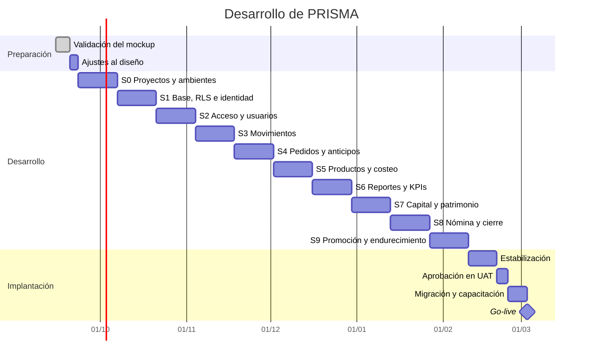
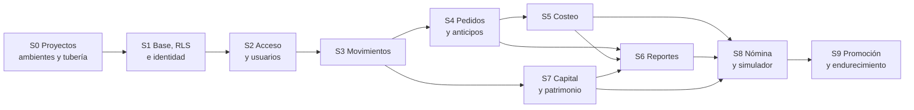

# 08 · Plan de desarrollo

10 sprints de 2 semanas + 3 semanas de estabilización y promoción = **23 semanas**.

> **El plan de 7 sprints daba por hecho que no había backend.**
> [ADR-011](adr/ADR-011-stack-flutter-dart.md) lo devolvió al proyecto: ahora hay dos bases de
> código que construir, versionar y desplegar —`prisma_front` en Flutter y `prisma_api` en Dart—
> y cuatro ambientes por donde promoverlas. Apretar lo nuevo en el mismo calendario sería mentir.

---

## 0. De dónde salen las semanas nuevas

[ADR-001](adr/ADR-001-stack.md) justificó Supabase diciendo que lo más lento y riesgoso de
cualquier sistema es el backend, y que quitarlo bajaba el proyecto de unas 20 semanas a 14. Este
cambio lo devuelve. Las semanas vuelven con él, y cada una tiene nombre:

| Qué cambia | Semanas | Por qué |
|---|:---:|---|
| Plan anterior | 16 | 7 sprints de 2 semanas + 2 de estabilización |
| **Sprint 0** · dos proyectos, cuatro ambientes y tubería | +2 | Antes no había nada que desplegar; ahora hay dos artefactos y cuatro destinos |
| **La fundación se parte en dos** | +2 | La base con identidad propagada por un lado; el acceso, los usuarios y los cargos por otro |
| **Sprint 9** · promoción, PWA y endurecimiento | +2 | Aprobar en UAT y publicar en prod es trabajo, no un botón |
| Estabilización de 2 a 3 semanas | +1 | La versión aprobada atraviesa cuatro ambientes antes de llegar al taller |
| **Total** | **23** | 10 sprints de 2 semanas + 3 de estabilización |

Nada de esto agrega funcionalidad: los 101 requisitos y los 37 casos de uso son los mismos. Lo que
crece es **con qué** se construyen y **por dónde** pasan antes de llegar al taller.

> **No se reparten las mismas horas en más casillas.** El backend es trabajo nuevo: dominio,
> endpoints, contrato de errores, despliegue y cuatro configuraciones. Fingir que cabe en 16
> semanas sería descubrir el atraso en la semana 12, cuando ya no hay margen.

---

## 1. Cronograma

---

## 2. Hitos

| Hito | Al terminar | Criterio de aceptación |
|---|---|---|
| **H0** | Validación | Checklist del mockup firmado |
| **H1** | Sprint 0 | Un cambio fusionado se despliega solo hasta dev y el front muestra `v0.1.0 · Desarrollo` |
| **H2** | Sprint 1 | Con la comprobación de la API desactivada, la base sigue negando los datos restringidos |
| **H3** | Sprint 2 | Dos usuarios con tipos distintos; Operación no ve lo restringido |
| **H4** | Sprint 3 | Se registra un gasto desde el celular en menos de 30 segundos |
| **H5** | Sprint 4 | El anticipo no aparece como ingreso; la venta se causa al entregar |
| **H6** | Sprint 5 | El margen por hora de los 5 productos está calculado |
| **H7** | Sprint 6 | Las tres cifras cuadran con el ejemplo de septiembre del documento 05 |
| **H8** | Sprint 7 | El retiro no reduce la utilidad; el patrimonio es correcto |
| **H9** | Sprint 8 | El simulador responde la pregunta de la contratación |
| **H10** | Sprint 9 | Gerencia aprueba en UAT exactamente el artefacto que irá a prod |
| **H11** | Go-live | El Excel y el cuaderno dejan de usarse |

---

## 3. Sprints

> **Cada sprint entrega las dos mitades.** Una función no está hecha cuando el endpoint responde
> en una herramienta de pruebas: está hecha cuando la pantalla de Flutter la usa, el contrato de
> errores está traducido y el cambio llegó por lo menos hasta qa.

### Sprint 0 · Dos proyectos, cuatro ambientes y tubería

| | |
|---|---|
| **Objetivo** | Que exista dónde escribir código y a dónde publicarlo, antes de escribir la primera regla de negocio |
| **Requisitos** | Ninguno directo: es el sprint habilitador de todos los demás |
| **Riesgo** | Alto: sin esto, cada despliegue posterior se hace a mano y se hace distinto cada vez |

| # | Tarea | Días |
|---|---|---:|
| 0.1 | Proyecto `prisma_api` en Dart con el esqueleto hexagonal: `domain/`, `application/`, `infrastructure/`, `interface/` | 1,5 |
| 0.2 | Regla de frontera verificada en la integración continua: la construcción falla si `domain/` importa SQL o HTTP | 1 |
| 0.3 | Proyecto `prisma_front` en Flutter Web con la misma separación por capas | 1,5 |
| 0.4 | Los cuatro proyectos de Supabase —dev, qa, uat y prod— cada uno con su base, sus claves y su almacenamiento | 1 |
| 0.5 | Rol `prisma_api` en los cuatro: sin `BYPASSRLS`, sin `SUPERUSER` y sin ser dueño de las tablas | 1 |
| 0.6 | Secretos por ambiente fuera del repositorio: variables de entorno en la API, `--dart-define` en el front | 1 |
| 0.7 | Integración continua: formato, `dart analyze`, pruebas y compilación, **para cada proyecto por separado** | 2 |
| 0.8 | Entrega a dev al fusionar en la rama principal: despliegue de la API y publicación del front | 1,5 |
| 0.9 | SemVer en los dos `pubspec.yaml` y migraciones numeradas con tabla `schema_version` | 1 |
| 0.10 | `GET /version`: versión de la API, versión del esquema y ambiente | 0,5 |
| 0.11 | Insignia `v0.1.0 · Desarrollo` y franja fija de ambiente en dev, qa y uat; en prod ninguna de las dos | 1 |
| 0.12 | El front declara qué MAJOR de la API necesita y bloquea con pantalla clara si no coincide | 1 |

**Terminado cuando** — un cambio fusionado llega solo hasta dev sin que nadie toque una consola,
y la insignia del front dice la versión y el ambiente.

---

### Sprint 1 · Base de datos, RLS e identidad propagada

| | |
|---|---|
| **Objetivo** | Que la base siga siendo el juez de los permisos aunque ahora haya una API en medio |
| **Requisitos** | RF-03, RF-06, RF-07, RF-17 |
| **Riesgo** | Alto: si esto sale mal, todas las políticas de [ADR-006](adr/ADR-006-rls-por-rol.md) quedan de adorno |

| # | Tarea | Días |
|---|---|---:|
| 1.1 | Esquema SQL completo: tablas, dominios, índices y restricciones **con nombre explícito** | 2 |
| 1.2 | Revocación de `DELETE` y `TRUNCATE` | 0,5 |
| 1.3 | Triggers de auditoría sobre todas las tablas de negocio | 1,5 |
| 1.4 | Función `fn_es_gerencia` y políticas RLS | 1,5 |
| 1.5 | `FORCE ROW LEVEL SECURITY` en todas las tablas, para que ni el dueño se libre | 0,5 |
| 1.6 | Transacción por petición en `prisma_api`: propaga `request.jwt.claims` y fija `SET LOCAL ROLE authenticated` ([ADR-012](adr/ADR-012-identidad-a-postgres.md)) | 1,5 |
| 1.7 | **Prueba de permisos con sesión real:** una usuaria de Operación pide sus datos restringidos a través de la API y la base la rechaza; se repite con la comprobación de la capa de aplicación desactivada y el resultado no cambia | 1,5 |
| 1.8 | Tabla única de traducción restricción → HTTP + mensaje en español + campo, y prueba que recorre `pg_constraint` y falla si falta una entrada | 1,5 |
| 1.9 | Objeto de valor `Dinero` y formateo de moneda colombiana, en el dominio de la API y del front | 1 |
| 1.10 | Gestión de cuentas y categorías: endpoints y pantalla | 1,5 |
| 1.11 | Datos semilla reproducibles para dev y qa | 0,5 |
| 1.12 | Primera promoción de migraciones dev → qa, con el procedimiento escrito | 0,5 |

**Terminado cuando** — con el `if` de Dart desactivado a propósito, una sesión de tipo Operación
sigue sin poder leer `aportes_retiros`: el rechazo viene de la base, no de la aplicación.

---

### Sprint 2 · Acceso, usuarios y cargos

| | |
|---|---|
| **Objetivo** | Que cada persona entre con su propio usuario y que el front nunca vea un correo |
| **Requisitos** | RF-01, RF-02, RF-04, RF-05, RF-71 … RF-83 |
| **Riesgo** | Medio: la parte delicada quedó resuelta en el Sprint 1 |

| # | Tarea | Días |
|---|---|---:|
| 2.1 | Autenticación contra Supabase Auth **desde `prisma_api`**: el mapeo de usuario a correo sintético ocurre en el servidor ([ADR-009](adr/ADR-009-login-por-usuario.md)) | 1,5 |
| 2.2 | Sesión, expiración a 30 días y guardas de navegación por tipo en el front | 1,5 |
| 2.3 | Tabla `cargos` con sus datos semilla y sus políticas RLS | 1 |
| 2.4 | Tabla `usuarios` ampliada: `usuario`, `nombre_completo`, `cargo_id` y `tipo` | 1 |
| 2.5 | Trigger `tg_proteger_ultima_gerencia`: no se puede desactivar ni degradar al último usuario de Gerencia | 0,5 |
| 2.6 | Pantalla de acceso y cambio obligatorio de contraseña en el primer ingreso | 1,5 |
| 2.7 | Gestión de usuarios: crear, editar, desactivar con motivo y restablecer clave | 1,5 |
| 2.8 | Catálogo de cargos: crear, renombrar, reordenar y desactivar con motivo | 1 |
| 2.9 | Registro de cada inicio de sesión con fecha, dispositivo e IP | 1 |
| 2.10 | Panel «Acerca de»: versión del front, de la API y del esquema, ambiente, fecha de compilación y referencia del commit | 0,5 |
| 2.11 | La prueba de permisos del Sprint 1 se ejecuta también en qa, contra la base de qa | 0,5 |

**Terminado cuando** — dos usuarios con tipos distintos entran con su propio nombre de usuario y
la sesión de Operación no alcanza lo restringido, en dev y en qa.

---

### Sprint 3 · Movimientos

| | |
|---|---|
| **Objetivo** | Registrar plata que entra y sale en menos de 30 segundos |
| **Requisitos** | RF-08 … RF-16 |

| # | Tarea | Días |
|---|---|---:|
| 3.1 | Dominio: `Movimiento`, tipos y su efecto sobre utilidad, caja y patrimonio | 1,5 |
| 3.2 | Caso de uso `RegistrarMovimiento` con doble fecha | 1 |
| 3.3 | Repositorio de movimientos contra PostgreSQL en `infrastructure/` | 1 |
| 3.4 | Endpoints de movimientos y su traducción de errores de la base a mensajes en español | 1 |
| 3.5 | Formulario de registro rápido optimizado para celular | 2 |
| 3.6 | Adjuntar foto del recibo con compresión previa; el archivo sube **a través de la API**, nunca directo al almacenamiento | 1,5 |
| 3.7 | Transferencias entre cuentas | 1 |
| 3.8 | Listado con filtros por fecha, tipo, categoría y cuenta | 1,5 |
| 3.9 | Anulación con motivo obligatorio | 1 |
| 3.10 | Corrección por contra-asiento | 1 |
| 3.11 | Marca de registro tardío | 0,5 |
| 3.12 | Cálculo de saldos por cuenta | 1 |

**Terminado cuando** — se cronometra el registro de un gasto real con foto y toma menos de 30
segundos.

---

### Sprint 4 · Pedidos y anticipos

| | |
|---|---|
| **Objetivo** | Que el anticipo se comporte como pasivo y la venta se cause al entregar |
| **Requisitos** | RF-18 … RF-27 |
| **Riesgo** | Alto: es la regla financiera menos intuitiva |

| # | Tarea | Días |
|---|---|---:|
| 4.1 | Dominio: `Pedido`, estados y transiciones | 1,5 |
| 4.2 | Gestión de clientes | 1 |
| 4.3 | Registro de pedido con líneas de producto | 2 |
| 4.4 | Caso de uso `CobrarAnticipo` — crea pasivo, no ingreso | 1,5 |
| 4.5 | Función de negocio en la base que entrega el pedido y causa la venta en una sola transacción; la API la llama y no rehace sus pasos | 2 |
| 4.6 | Listado ordenado por fecha con filtros | 1,5 |
| 4.7 | Resaltado de pedidos estancados (15+ días con anticipo) | 1 |
| 4.8 | Adjuntar factura al pedido | 0,5 |
| 4.9 | Cancelación de pedido con destino del anticipo | 1 |

**Terminado cuando** — el escenario BDD-07-1 pasa: anticipo cobrado en marzo, entrega en abril,
la venta se causa completa en abril.

---

### Sprint 5 · Productos y costeo

| | |
|---|---|
| **Objetivo** | Conocer el margen real y el margen por hora de cada producto |
| **Requisitos** | RF-28 … RF-35 |

| # | Tarea | Días |
|---|---|---:|
| 5.1 | Dominio: `Producto` y servicio `calcularMargenes` | 1,5 |
| 5.2 | Catálogo de productos y servicios | 1,5 |
| 5.3 | Costeo unitario: insumo, consumibles, minutos de trabajo | 2 |
| 5.4 | Costeo de bordado por tiempo de máquina | 1 |
| 5.5 | Historial de costos con fecha de vigencia | 1 |
| 5.6 | Cálculo y presentación del margen por hora | 1 |
| 5.7 | Sugerencia de precio por margen objetivo | 1 |
| 5.8 | Ocultar costos y márgenes al tipo Operación: **la API no los envía**; esconderlos solo en la pantalla no cuenta | 1 |
| 5.9 | Cuadro comparativo ordenable por margen por hora | 1 |

**Terminado cuando** — el cuadro de los 5 productos coincide con el documento 05 §7.2.

---

### Sprint 6 · Reportes y KPIs

| | |
|---|---|
| **Objetivo** | Las tres cifras, el promedio de ganancias y el punto de equilibrio |
| **Requisitos** | RF-41 … RF-44, RF-52, RF-53 |
| **Riesgo** | Alto: es el corazón del valor del sistema |

| # | Tarea | Días |
|---|---|---:|
| 6.1 | Servicios de dominio: utilidad causada, flujo de caja, caja libre | 2 |
| 6.2 | Pruebas unitarias con el ejemplo de septiembre completo | 1,5 |
| 6.3 | Dashboard con las tres cifras lado a lado | 2 |
| 6.4 | Gráfico de 12 meses | 1,5 |
| 6.5 | Reporte mensual y anual con promedio de ganancias | 2 |
| 6.6 | Punto de equilibrio | 1 |
| 6.7 | Alertas: caja libre negativa, anticipos, pedidos estancados | 1,5 |
| 6.8 | Cierre mensual con snapshot inmutable | 1,5 |

**Terminado cuando** — el sistema reproduce exactamente las cifras del documento 05 §12.

---

### Sprint 7 · Capital, retiros y patrimonio

| | |
|---|---|
| **Objetivo** | Que el retiro deje de distorsionar la utilidad |
| **Requisitos** | RF-45 … RF-51 |

| # | Tarea | Días |
|---|---|---:|
| 7.1 | Registro de inversiones en activos | 1,5 |
| 7.2 | Aportes de capital | 1 |
| 7.3 | Configuración del pro-labore con justificación | 1,5 |
| 7.4 | Retiro con división automática pro-labore y distribución | 2 |
| 7.5 | Cálculo de patrimonio | 1,5 |
| 7.6 | Alerta de descapitalización a 12 meses | 1 |
| 7.7 | Configuración de los 4 sobres con historial | 1,5 |
| 7.8 | Panel de sobres: asignado contra usado | 2 |

**Terminado cuando** — BDD-16-1 y BDD-25-1 pasan: el retiro no reduce la utilidad y el
pro-labore sí.

---

### Sprint 8 · Nómina, cotizador y cierre

| | |
|---|---|
| **Objetivo** | Responder la pregunta de la contratación y cerrar el alcance funcional |
| **Requisitos** | RF-36 … RF-40, RF-54 … RF-69 |

| # | Tarea | Días |
|---|---|---:|
| 8.1 | Registro de empleadas | 1 |
| 8.2 | Función de negocio en la base que liquida la nómina descontando adelantos, en una sola transacción | 2 |
| 8.3 | Adelantos como cuenta por cobrar | 1,5 |
| 8.4 | Desprendible PDF con acceso restringido al propio, decidido por la base | 1,5 |
| 8.5 | Simulador de capacidad de pago con controles en vivo | 2,5 |
| 8.6 | Traducción a unidades de producto por vender | 1 |
| 8.7 | Indicador de horas pagadas contra facturadas | 1 |
| 8.8 | Cotizaciones y remisiones en PDF con logo | 2 |
| 8.9 | Validador de anticipo mínimo | 1 |
| 8.10 | Importador de CSV con mapeo y reporte de errores | 2 |

**Terminado cuando** — el simulador entrega un veredicto con datos reales del negocio.

---

### Sprint 9 · Promoción, PWA y endurecimiento

| | |
|---|---|
| **Objetivo** | Que lo construido se pueda aprobar en UAT y publicar en prod sin sorpresas |
| **Requisitos** | RF-70 |
| **Riesgo** | Medio, pero es el único sprint que no se puede recortar: es el que hace publicable lo demás |

| # | Tarea | Días |
|---|---|---:|
| 9.1 | PWA instalable sobre Flutter Web y cola sin conexión ([ADR-016](adr/ADR-016-flutter-web-pwa.md)) | 2 |
| 9.2 | Ambiente uat en pie: datos realistas **anonimizados** y su propia semilla | 1 |
| 9.3 | Promoción del artefacto aprobado de uat a prod **sin recompilar**, con la misma versión | 1 |
| 9.4 | Procedimiento de reversión ensayado en qa: volver la API y el front a la versión anterior y medir cuánto tarda | 1,5 |
| 9.5 | La prueba de permisos con sesión real corre en los cuatro ambientes, no solo en dev | 1 |
| 9.6 | Pruebas de extremo a extremo de los flujos críticos, ejecutadas en qa | 2 |
| 9.7 | Rendimiento en celular real con 4G (RNF-01) | 1 |
| 9.8 | Repaso de secretos: nada en el repositorio y `service_role` solo en migraciones | 0,5 |
| 9.9 | Prueba de verdad del contrato de compatibilidad: el front rechaza un MAJOR de API distinto | 0,5 |
| 9.10 | Etiquetar `1.0.0` del front y de la API para el go-live | 0,5 |

**Terminado cuando** — Gerencia aprueba en UAT y ese mismo artefacto, sin reconstruir, queda
listo para prod.

---

## 4. Definición de terminado

Una tarea no está terminada hasta que cumple **todo** lo siguiente:

- [ ] `dart analyze` pasa sin errores ni advertencias en los dos proyectos.
- [ ] La regla de frontera de arquitectura no se viola, y la integración continua lo comprueba.
- [ ] Los servicios de dominio involucrados tienen pruebas unitarias.
- [ ] Los escenarios BDD asociados pasan.
- [ ] Si toca datos sensibles, hay una prueba con sesión real de tipo Operación que verifica que
      **el rechazo viene de la base**, no de un `if` de Dart.
- [ ] Toda restricción nueva de la base tiene nombre explícito y su entrada en la tabla de
      traducción de errores.
- [ ] Funciona en un celular real, no solo en el navegador de escritorio.
- [ ] Los textos están en español y el dinero con formato colombiano.
- [ ] Ninguna cifra monetaria usa decimales.
- [ ] La versión del proyecto tocado subió según SemVer y el cambio llegó al menos hasta qa.

---

## 5. Riesgos del desarrollo

| Riesgo | Prob. | Impacto | Mitigación |
|---|:---:|:---:|---|
| La regla del anticipo se implementa mal | Media | **Alto** | Sprint 4 dedicado, escenarios BDD explícitos |
| Los permisos quedan solo en la interfaz | Media | **Alto** | Pruebas obligatorias con sesión de tipo Operación |
| **La API se conecta con `service_role` «para que funcione»** | Media | **Alto** | Rol `prisma_api` sin `BYPASSRLS` y sin ser dueño; la prueba del Sprint 1 corre con el `if` desactivado |
| **El front termina hablando directo con Supabase** | Media | **Alto** | Se rechaza en revisión de código: el cliente de Supabase no entra en `prisma_front` |
| **Las tres capas de validación se separan con el tiempo** | Alta | Medio | Tabla única de traducción y prueba automática sobre `pg_constraint` |
| **Mantener cuatro ambientes consume tiempo de cada sprint** | Alta | Medio | Sprint 0 dedicado y todo automatizado desde el primer día |
| El registro diario resulta lento y se abandona | Media | **Alto** | Cronómetro como criterio de aceptación del Sprint 3 |
| Errores de redondeo en los cálculos | Baja | Alto | Objeto `Dinero` con enteros desde el Sprint 1 |
| El alcance crece durante el desarrollo | Alta | Medio | Lo nuevo va al roadmap, no al sprint en curso |
| El histórico de Excel llega incompleto | Alta | Medio | Reporte de errores por fila y digitación asistida |
| Las fórmulas financieras se malinterpretan | Media | **Alto** | El ejemplo de septiembre es prueba ejecutable |

---

## 6. Backlog priorizado

| Prioridad | Alcance |
|---|---|
| **M** · Imprescindible | 77 requisitos. Sin ellos el sistema no responde las tres preguntas |
| **S** · Importante | 22 requisitos. Mejoran el uso diario; si un sprint se atrasa, se negocian |
| **C** · Deseable | 2 requisitos. Entran solo si hay holgura |

Lo que surja durante el desarrollo y no esté en esta lista **va al roadmap**, no al sprint en
curso. Esa es la única defensa efectiva contra el crecimiento descontrolado del alcance.

---

## 7. Orden de construcción y por qué

El orden no es arbitrario. Cada sprint habilita al siguiente:

El Sprint 0 va primero porque **no se puede promover lo que no se puede construir dos veces
igual**: sin la tubería, cada despliegue a cada ambiente se haría a mano y distinto.

El Sprint 1 va antes que el acceso porque la propagación de identidad decide si los permisos son
reales o decorado. Construir pantallas encima de una seguridad que todavía no juzga nada sería
descubrir el problema cuando ya hay diez pantallas que rehacer.

El simulador de capacidad de pago va al final porque **necesita todo lo anterior**: sin costeo
no hay margen de contribución, sin reportes no hay utilidad promedio, y sin pro-labore el
cálculo estaría inflado. Construirlo antes daría una respuesta con apariencia de precisión y
sin fundamento — que es peor que no tener respuesta.

El Sprint 9 va de último porque endurece lo que ya existe. No es relleno: es lo que separa
«funciona en mi computador» de «Gerencia lo aprobó y el taller lo tiene».

---

### 🧭 Navegación

**⬅️ Anterior:** [07 · Arquitectura](07-arquitectura.md)  ·  **🗂️ [Índice general](INDICE.md)**  ·  **Siguiente ➡️:** [09 · Plan de implantación](09-plan-de-implantacion.md)
