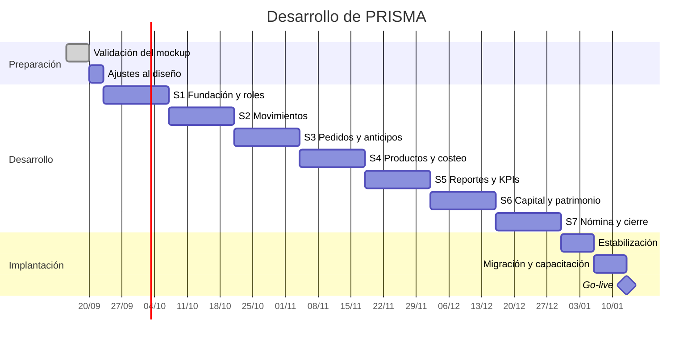
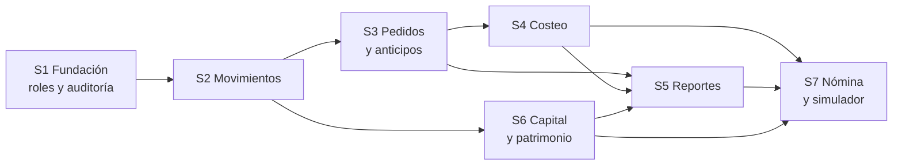

# 08 · Plan de desarrollo

7 sprints de 2 semanas + 2 semanas de estabilización = **16 semanas**.

---

## 1. Cronograma

---

## 2. Hitos

| Hito | Al terminar | Criterio de aceptación |
|---|---|---|
| **H0** | Validación | Checklist del mockup firmado |
| **H1** | Sprint 1 | Dos usuarios con tipos distintos; Operación no ve lo restringido |
| **H2** | Sprint 2 | Se registra un gasto desde el celular en menos de 30 segundos |
| **H3** | Sprint 3 | El anticipo no aparece como ingreso; la venta se causa al entregar |
| **H4** | Sprint 4 | El margen por hora de los 5 productos está calculado |
| **H5** | Sprint 5 | Las tres cifras cuadran con el ejemplo de septiembre del documento 05 |
| **H6** | Sprint 6 | El retiro no reduce la utilidad; el patrimonio es correcto |
| **H7** | Sprint 7 | El simulador responde la pregunta de la contratación |
| **H8** | Go-live | El Excel y el cuaderno dejan de usarse |

---

## 3. Sprints

### Sprint 1 · Fundación y roles

| | |
|---|---|
| **Objetivo** | Que exista una base de datos correcta, segura y auditada |
| **Requisitos** | RF-01 … RF-07, RF-17, RF-71 … RF-75, RF-79, RF-80, RF-82, RF-83 |
| **Riesgo** | Alto: todo lo demás se apoya aquí |

| # | Tarea | Días |
|---|---|---:|
| 1.1 | Proyecto Vite + TypeScript + Tailwind + estructura hexagonal | 1 |
| 1.2 | Regla de frontera en ESLint que impide importaciones prohibidas | 0,5 |
| 1.3 | Esquema SQL completo: tablas, tipos, índices, restricciones | 2 |
| 1.4 | Revocación de `DELETE` y `TRUNCATE` | 0,5 |
| 1.5 | Triggers de auditoría sobre todas las tablas de negocio | 1,5 |
| 1.6 | Función `fn_es_gerencia` y políticas RLS | 1,5 |
| 1.7 | Autenticación, sesión y guardas de navegación por tipo | 1,5 |
| 1.8 | Objeto de valor `Dinero` y formateo de moneda colombiana | 1 |
| 1.9 | Gestión de cuentas y categorías | 1,5 |
| 1.10 | Datos semilla | 0,5 |
| 1.11 | Pruebas de permisos con sesión de tipo Operación | 1 |
| 1.12 | Tabla `cargos` con sus datos semilla y sus políticas RLS | 1 |
| 1.13 | Tabla `usuarios` ampliada: `usuario`, `nombre_completo`, `cargo_id` y `tipo` | 1 |
| 1.14 | Trigger `tg_proteger_ultima_gerencia`: no se puede desactivar ni degradar al último usuario de Gerencia | 0,5 |
| 1.15 | Mapeo de nombre de usuario a correo sintético en la capa de autenticación | 1 |
| 1.16 | Pantalla de acceso y cambio obligatorio de contraseña en el primer ingreso | 1,5 |

**Terminado cuando** — una sesión con tipo Operación recibe error de la base de datos, no de la
pantalla, al intentar leer `aportes_retiros`.

---

### Sprint 2 · Movimientos

| | |
|---|---|
| **Objetivo** | Registrar plata que entra y sale en menos de 30 segundos |
| **Requisitos** | RF-08 … RF-16, RF-76 … RF-78, RF-81 |

| # | Tarea | Días |
|---|---|---:|
| 2.1 | Dominio: `Movimiento`, tipos y su efecto sobre utilidad, caja y patrimonio | 1,5 |
| 2.2 | Caso de uso `RegistrarMovimiento` con doble fecha | 1 |
| 2.3 | Adaptador Supabase del repositorio de movimientos | 1 |
| 2.4 | Formulario de registro rápido optimizado para celular | 2 |
| 2.5 | Adjuntar foto del recibo con compresión previa | 1,5 |
| 2.6 | Transferencias entre cuentas | 1 |
| 2.7 | Listado con filtros por fecha, tipo, categoría y cuenta | 1,5 |
| 2.8 | Anulación con motivo obligatorio | 1 |
| 2.9 | Corrección por contra-asiento | 1 |
| 2.10 | Marca de registro tardío | 0,5 |
| 2.11 | Cálculo de saldos por cuenta | 1 |
| 2.12 | Pantalla Gestión de usuarios: crear, editar, desactivar con motivo y restablecer clave | 1,5 |
| 2.13 | Catálogo de cargos: crear, renombrar, reordenar y desactivar con motivo | 1 |

**Terminado cuando** — se cronometra el registro de un gasto real con foto y toma menos de 30
segundos.

---

### Sprint 3 · Pedidos y anticipos

| | |
|---|---|
| **Objetivo** | Que el anticipo se comporte como pasivo y la venta se cause al entregar |
| **Requisitos** | RF-18 … RF-27 |
| **Riesgo** | Alto: es la regla financiera menos intuitiva |

| # | Tarea | Días |
|---|---|---:|
| 3.1 | Dominio: `Pedido`, estados y transiciones | 1,5 |
| 3.2 | Gestión de clientes | 1 |
| 3.3 | Registro de pedido con líneas de producto | 2 |
| 3.4 | Caso de uso `CobrarAnticipo` — crea pasivo, no ingreso | 1,5 |
| 3.5 | Caso de uso `EntregarPedido` — causa la venta en una transacción | 2 |
| 3.6 | Listado ordenado por fecha con filtros | 1,5 |
| 3.7 | Resaltado de pedidos estancados (15+ días con anticipo) | 1 |
| 3.8 | Adjuntar factura al pedido | 0,5 |
| 3.9 | Cancelación de pedido con destino del anticipo | 1 |

**Terminado cuando** — el escenario BDD-07-1 pasa: anticipo cobrado en marzo, entrega en abril,
la venta se causa completa en abril.

---

### Sprint 4 · Productos y costeo

| | |
|---|---|
| **Objetivo** | Conocer el margen real y el margen por hora de cada producto |
| **Requisitos** | RF-28 … RF-35 |

| # | Tarea | Días |
|---|---|---:|
| 4.1 | Dominio: `Producto` y servicio `calcularMargenes` | 1,5 |
| 4.2 | Catálogo de productos y servicios | 1,5 |
| 4.3 | Costeo unitario: insumo, consumibles, minutos de trabajo | 2 |
| 4.4 | Costeo de bordado por tiempo de máquina | 1 |
| 4.5 | Historial de costos con fecha de vigencia | 1 |
| 4.6 | Cálculo y presentación del margen por hora | 1 |
| 4.7 | Sugerencia de precio por margen objetivo | 1 |
| 4.8 | Ocultar costos y márgenes al tipo Operación | 1 |
| 4.9 | Cuadro comparativo ordenable por margen por hora | 1 |

**Terminado cuando** — el cuadro de los 5 productos coincide con el documento 05 §7.2.

---

### Sprint 5 · Reportes y KPIs

| | |
|---|---|
| **Objetivo** | Las tres cifras, el promedio de ganancias y el punto de equilibrio |
| **Requisitos** | RF-41 … RF-44, RF-52, RF-53 |
| **Riesgo** | Alto: es el corazón del valor del sistema |

| # | Tarea | Días |
|---|---|---:|
| 5.1 | Servicios de dominio: utilidad causada, flujo de caja, caja libre | 2 |
| 5.2 | Pruebas unitarias con el ejemplo de septiembre completo | 1,5 |
| 5.3 | Dashboard con las tres cifras lado a lado | 2 |
| 5.4 | Gráfico de 12 meses | 1,5 |
| 5.5 | Reporte mensual y anual con promedio de ganancias | 2 |
| 5.6 | Punto de equilibrio | 1 |
| 5.7 | Alertas: caja libre negativa, anticipos, pedidos estancados | 1,5 |
| 5.8 | Cierre mensual con snapshot inmutable | 1,5 |

**Terminado cuando** — el sistema reproduce exactamente las cifras del documento 05 §12.

---

### Sprint 6 · Capital, retiros y patrimonio

| | |
|---|---|
| **Objetivo** | Que el retiro deje de distorsionar la utilidad |
| **Requisitos** | RF-45 … RF-51 |

| # | Tarea | Días |
|---|---|---:|
| 6.1 | Registro de inversiones en activos | 1,5 |
| 6.2 | Aportes de capital | 1 |
| 6.3 | Configuración del pro-labore con justificación | 1,5 |
| 6.4 | Retiro con división automática pro-labore y distribución | 2 |
| 6.5 | Cálculo de patrimonio | 1,5 |
| 6.6 | Alerta de descapitalización a 12 meses | 1 |
| 6.7 | Configuración de los 4 sobres con historial | 1,5 |
| 6.8 | Panel de sobres: asignado contra usado | 2 |

**Terminado cuando** — BDD-16-1 y BDD-25-1 pasan: el retiro no reduce la utilidad y el
pro-labore sí.

---

### Sprint 7 · Nómina, cotizador y cierre

| | |
|---|---|
| **Objetivo** | Responder la pregunta de la contratación y cerrar el MVP |
| **Requisitos** | RF-36 … RF-40, RF-54 … RF-70 |

| # | Tarea | Días |
|---|---|---:|
| 7.1 | Registro de empleadas | 1 |
| 7.2 | Liquidación de nómina con horas extra y descuentos | 2 |
| 7.3 | Adelantos como cuenta por cobrar | 1,5 |
| 7.4 | Desprendible PDF con acceso restringido al propio | 1,5 |
| 7.5 | Simulador de capacidad de pago con controles en vivo | 2,5 |
| 7.6 | Traducción a unidades de producto por vender | 1 |
| 7.7 | Indicador de horas pagadas contra facturadas | 1 |
| 7.8 | Cotizaciones y remisiones en PDF con logo | 2 |
| 7.9 | Validador de anticipo mínimo | 1 |
| 7.10 | Importador de CSV con mapeo y reporte de errores | 2 |
| 7.11 | PWA instalable y cola sin conexión | 1,5 |

**Terminado cuando** — el simulador entrega un veredicto con datos reales del negocio.

---

## 4. Definición de terminado

Una tarea no está terminada hasta que cumple **todo** lo siguiente:

- [ ] El código compila sin errores ni advertencias de TypeScript.
- [ ] La regla de frontera de arquitectura no se viola.
- [ ] Los servicios de dominio involucrados tienen pruebas unitarias.
- [ ] Los escenarios BDD asociados pasan.
- [ ] Si toca datos sensibles, hay una prueba con sesión de tipo Operación que verifica el rechazo.
- [ ] Funciona en un celular real, no solo en el navegador de escritorio.
- [ ] Los textos están en español y el dinero con formato colombiano.
- [ ] Ninguna cifra monetaria usa decimales.

---

## 5. Riesgos del desarrollo

| Riesgo | Prob. | Impacto | Mitigación |
|---|:---:|:---:|---|
| La regla del anticipo se implementa mal | Media | **Alto** | Sprint 3 dedicado, escenarios BDD explícitos |
| Los permisos quedan solo en la interfaz | Media | **Alto** | Pruebas obligatorias con sesión de tipo Operación |
| El registro diario resulta lento y se abandona | Media | **Alto** | Cronómetro como criterio de aceptación del Sprint 2 |
| Errores de redondeo en los cálculos | Baja | Alto | Objeto `Dinero` con enteros desde el Sprint 1 |
| El alcance crece durante el desarrollo | Alta | Medio | Lo nuevo va al roadmap, no al sprint en curso |
| El histórico de Excel llega incompleto | Alta | Medio | Reporte de errores por fila y digitación asistida |
| Las fórmulas financieras se malinterpretan | Media | **Alto** | El ejemplo de septiembre es prueba ejecutable |

---

## 6. Backlog priorizado

| Prioridad | Alcance |
|---|---|
| **M** · Imprescindible | 73 requisitos. Sin ellos el sistema no responde las tres preguntas |
| **S** · Importante | 22 requisitos. Mejoran el uso diario; si un sprint se atrasa, se negocian |
| **C** · Deseable | 2 requisitos. Entran solo si hay holgura |

Lo que surja durante el desarrollo y no esté en esta lista **va al roadmap**, no al sprint en
curso. Esa es la única defensa efectiva contra el crecimiento descontrolado del alcance.

---

## 7. Orden de construcción y por qué

El orden no es arbitrario. Cada sprint habilita al siguiente:

El simulador de capacidad de pago va al final porque **necesita todo lo anterior**: sin costeo
no hay margen de contribución, sin reportes no hay utilidad promedio, y sin pro-labore el
cálculo estaría inflado. Construirlo antes daría una respuesta con apariencia de precisión y
sin fundamento — que es peor que no tener respuesta.
