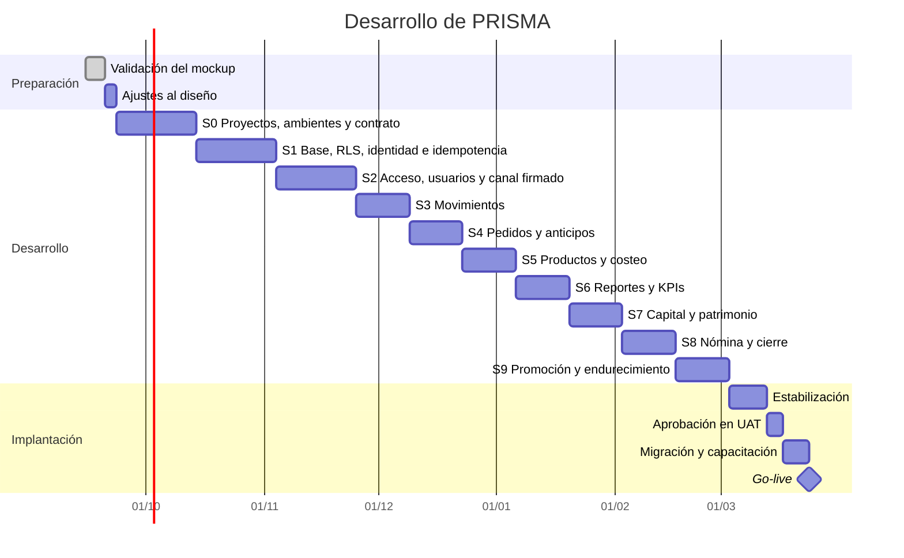
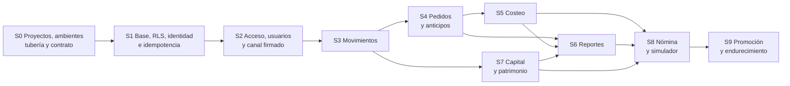

# 08 · Plan de desarrollo

10 sprints —siete de 2 semanas y tres de 3— + 3 semanas de estabilización y promoción =
**26 semanas con un equipo**, o **≈ 17 semanas con dos**.

> **El plan de 7 sprints daba por hecho que no había backend.**
> ADR-011 lo devolvió al proyecto y **ADR-017 lo reescribió en Java**: ahora hay dos bases de
> código que construir, versionar y desplegar —`prisma_front` en Flutter, con web por defecto, y
> `prisma_api` en Java 25 con Spring Boot— y cuatro ambientes por donde promoverlas. Apretar lo
> nuevo en el mismo calendario sería mentir.

> **Este documento describe el trabajo, no cuántas personas lo hacen.** Los diez sprints y su
> orden son los mismos con uno o con dos equipos; lo que cambia es cuáles se solapan. El reparto
> entre equipos, los cuatro repositorios y las reglas para no pisarse están en
> [`21-trabajo-en-paralelo.md`](21-trabajo-en-paralelo.md) y en
> [ADR-025](adr/ADR-025-cuatro-repositorios.md).
>
> **Con dos equipos no se tarda la mitad, y quien lo prometa se va a equivocar.** Los Sprints 0
> a 2 son cimientos transversales y casi no se parten: hay que construirlos igual, solo se
> solapan algunas tareas (9 semanas pasan a 7). Los Sprints 3 a 8 sí se parten en dos cadenas
> independientes (12 semanas pasan a 7). Y las 3 semanas de estabilización **no se parten en
> absoluto**, porque consisten en integrar y probar lo de todos. Nueve semanas de ahorro sobre
> veintiséis es un buen resultado; trece sería una promesa falsa.

---

## 0. De dónde salen las semanas nuevas

[ADR-001](adr/ADR-001-stack.md) justificó Supabase diciendo que lo más lento y riesgoso de
cualquier sistema es el backend, y que quitarlo bajaba el proyecto de unas 20 semanas a 14. Este
cambio lo devuelve. Las semanas vuelven con él, y cada una tiene nombre:

| Qué cambia | Semanas | Por qué |
|---|:---:|---|
| Plan sin backend | 16 | 7 sprints de 2 semanas + 2 de estabilización |
| **Sprint 0** · dos proyectos, cuatro ambientes y tubería | +2 | Antes no había nada que desplegar; ahora hay dos artefactos y cuatro destinos |
| **La fundación se parte en dos** | +2 | La base con identidad propagada por un lado; el acceso, los usuarios y los cargos por otro |
| **Sprint 9** · promoción, PWA y endurecimiento | +2 | Aprobar en UAT y publicar en prod es trabajo, no un botón |
| Estabilización de 2 a 3 semanas | +1 | La versión aprobada atraviesa cuatro ambientes antes de llegar al taller |
| Subtotal, con la API en Dart | 23 | 10 sprints de 2 semanas + 3 de estabilización |
| **Sprint 0** de 2 a 3 semanas | +1 | El sobre de respuesta, el catálogo de códigos, el descriptor de formulario y la puerta de OpenAPI son cimientos: o están antes del primer endpoint, o después hay que rehacerlos todos |
| **Sprint 1** de 2 a 3 semanas | +1 | La idempotencia de verdad —clave y efecto en la misma transacción— es trabajo de base y de API a la vez, y ese sprint ya era el más cargado |
| **Sprint 2** de 2 a 3 semanas | +1 | El canal firmado nace con la sesión, y RF-84 … RF-94 no estaban en ningún sprint |
| **Total** | **26** | 7 sprints de 2 semanas, 3 sprints de 3 semanas y 3 de estabilización |

### 0.1 Qué mueve el calendario y qué no

> **El cambio de lenguaje por sí solo casi no mueve el calendario. Lo que lo mueve son las piezas
> nuevas del contrato.** Decir «se atrasó por pasarse a Java» sería cómodo y falso.

| Días nuevos | Qué | Sprint |
|:---:|---|:---:|
| **+0,5** | Proyecto Java con Gradle y ArchUnit, en lugar del proyecto Dart | S0 |
| **+1** | Imagen de contenedor y memoria de la JVM acotada, en cuatro ambientes | S0 |
| **+2,5** | Sobre de respuesta y catálogo de códigos, con la prueba que los amarra (RNF-26) | S0 |
| **+2** | Descriptor de formulario generado de la validación del servidor (RF-102) | S0 |
| **+1,5** | Puerta de OpenAPI en integración continua (RNF-30) | S0 |
| **+4** | Idempotencia: tabla, filtro con huella, purga y prueba de corte (RNF-27, RNF-31) | S1 |
| **+0,5** | `Dinero` escrito dos veces, una por lenguaje | S1 |
| **+2,5** | Canal firmado: clave de sesión, nonce, marca de tiempo y HMAC (RNF-29) | S2 |
| **+1** | Navegación dictada por la API (RF-103) | S2 |
| **+6** | RF-84 … RF-94, que no estaban en ningún sprint | S2 |
| **+1,5** | RF-95 y RF-96, que tampoco estaban: Inicio de solo consulta y su descarga | S6 |
| **+0,5** | Swagger detrás de autenticación en prod | S9 |
| **+23,5** | **Total** | |

Y una resta que no se ve: `springdoc-openapi` y `Resilience4j` vienen hechos. Publicar OpenAPI,
reintentos y cortacircuitos a mano en Dart habría costado unos cuatro días que aquí ya no están.

**La comprobación de que las tres semanas alcanzan.** De esos 23,5 días, **21,5 caen en los
sprints 0, 1 y 2**, que pasan de 39,5 a 61 días de trabajo y de 6 a 9 semanas de calendario: la
carga por semana sube de 6,6 a 6,8 días, casi la misma densidad de antes y no un apretón
disfrazado. Los dos días restantes se reparten entre el **Sprint 6**, que queda en 14,5 días, y el
**Sprint 9**, que queda en 11,5: ninguno de los dos pasa de la carga que ya llevan los sprints 3 y
8, de 14 y 15,5 días en dos semanas, así que los absorben sin semana extra.

De las tres semanas nuevas, la del **Sprint 1** es la que queda con más holgura: 18,5 días donde
los otros dos llevan 21. Es a propósito. Es el sprint donde un error se paga más caro —RLS,
identidad propagada e idempotencia— y el único cuyo resultado no se puede comprobar mirando la
pantalla.

Los 37 casos de uso siguen siendo los mismos y ninguna regla financiera cambia. Lo que crece es el
contrato entre las tres partes: dos requisitos funcionales nuevos (RF-102 y RF-103) y seis no
funcionales (RNF-26 a RNF-31).

> **No se reparten las mismas horas en más casillas.** El backend es trabajo nuevo: dominio,
> endpoints, contrato de respuesta, idempotencia, despliegue y cuatro configuraciones. Fingir que
> cabe en el calendario anterior sería descubrir el atraso en la semana 12, cuando ya no hay
> margen.

---

## 1. Cronograma

---

## 2. Hitos

| Hito | Al terminar | Criterio de aceptación |
|---|---|---|
| **H0** | Validación | Checklist del mockup firmado |
| **H1** | Sprint 0 | Un cambio fusionado se despliega solo hasta dev, el front muestra `v0.1.0 · Desarrollo` en el pie de la barra lateral y toda respuesta sale con el sobre `{status, mensaje, data}` |
| **H2** | Sprint 1 | Con la comprobación de la API desactivada, la base sigue negando los datos restringidos, y un reintento con la misma clave de idempotencia no duplica nada |
| **H3** | Sprint 2 | Dos usuarios con tipos distintos; Operación no ve lo restringido, y una petición reenviada tal cual se rechaza por nonce repetido |
| **H4** | Sprint 3 | Se registra un gasto desde el celular en menos de 30 segundos |
| **H5** | Sprint 4 | El anticipo no aparece como ingreso; la venta se causa al entregar |
| **H6** | Sprint 5 | El margen por hora de los 5 productos está calculado |
| **H7** | Sprint 6 | Las tres cifras cuadran con el ejemplo de septiembre del documento 05 |
| **H8** | Sprint 7 | El retiro no reduce la utilidad; el patrimonio es correcto |
| **H9** | Sprint 8 | El simulador responde la pregunta de la contratación |
| **H10** | Sprint 9 | Gerencia aprueba en UAT exactamente el artefacto que irá a prod |
| **H11** | Go-live | El Excel y el cuaderno dejan de usarse |

---

## 3. Sprints

> **Cada sprint entrega las dos mitades.** Una función no está hecha cuando el endpoint responde
> en una herramienta de pruebas: está hecha cuando la pantalla de Flutter la usa, sus códigos
> están en el catálogo con su mensaje en español y el cambio llegó por lo menos hasta qa.

**Con dos equipos**, los sprints se reparten así ([`21-trabajo-en-paralelo.md`](21-trabajo-en-paralelo.md) §4):

| Sprints | Cómo se reparte | Por qué |
|---|---|---|
| **0 a 2** · cimientos | **Por capa**: el equipo API construye base, RLS, identidad e idempotencia; el equipo Front construye el sistema de diseño en widgets, el renderizador del descriptor y la cola de pendientes | Lo que se construye es la capa misma. No hay rebanada que repartir todavía, y duplicar los cimientos es donde se rompen los sistemas |
| **3 a 8** · funcionalidades | **Por rebanada vertical**: el equipo A toma la cadena del dinero —Movimientos, Reportes, Capital—; el equipo B la cadena del pedido —Productos, Pedidos, Cotizador—. Nómina es el amortiguador | Cada equipo entrega funciones completas, con su SQL, su endpoint y su pantalla. Nadie espera a la mitad del otro |
| **9** · estabilización | **Los dos juntos** | Consiste en integrar y probar lo de todos: no se puede partir |

> **El equipo Front no se queda esperando durante los cimientos, pero hay que planificarlo o
> pasará.** En los Sprints 0 y 1 la API todavía no tiene endpoints de negocio. Ese tiempo va en
> traducir el mockup a componentes de Flutter: la paleta, las tablas, los paneles de confirmación
> en línea, el formato colombiano de dinero y fecha. Es trabajo imprescindible que no depende de
> ningún endpoint, y si no se hace ahí, se hace después bloqueando funcionalidades.

### Sprint 0 · Dos proyectos, cuatro ambientes, tubería y contrato de respuesta · **3 semanas**

| | |
|---|---|
| **Objetivo** | Que exista dónde escribir código, a dónde publicarlo y **con qué forma responde la API**, antes de escribir la primera regla de negocio |
| **Requisitos** | RF-98, RF-99, RF-101, RF-102, RNF-26, RNF-30 |
| **Riesgo** | Alto: sin esto, cada despliegue posterior se hace a mano y se hace distinto cada vez; y un sobre de respuesta que llega tarde obliga a reescribir todos los endpoints anteriores |

| # | Tarea | Días |
|---|---|---:|
| 0.1 | Proyecto `prisma_api` en **Java 25 con Spring Boot**, construido con **Gradle**, con el esqueleto hexagonal en paquetes: `dominio`, `aplicacion`, `infraestructura`, `interfaz` | 2 |
| 0.2 | Regla de frontera verificada en la integración continua con **ArchUnit**: la construcción falla si `dominio` importa Spring, JDBC o HTTP | 1 |
| 0.3 | Proyecto `prisma_front` en Flutter, con **web por defecto** y la misma separación por capas | 1,5 |
| 0.4 | Los cuatro proyectos de Supabase —dev, qa, uat y prod— cada uno con su base, sus claves y su almacenamiento | 1 |
| 0.5 | Rol `prisma_api` en los cuatro: sin `BYPASSRLS`, sin `SUPERUSER` y sin ser dueño de las tablas | 1 |
| 0.6 | Secretos por ambiente fuera del repositorio: variables de entorno en la API, `--dart-define` en el front | 1 |
| 0.7 | Integración continua: formato con `spotless`, análisis estático, pruebas y compilación en la API; `dart format`, `dart analyze`, pruebas y compilación en el front, **para cada proyecto por separado** | 2 |
| 0.8 | **Imagen de contenedor de la API**: JRE 25 mínimo, memoria de la JVM acotada por variable, y arranque verificado en los cuatro ambientes | 1 |
| 0.9 | Entrega a dev al fusionar en la rama principal: despliegue de la imagen de la API y publicación del front | 1,5 |
| 0.10 | SemVer en el `pubspec.yaml` del front y en el `build.gradle.kts` de la API, y migraciones numeradas con tabla `schema_version` | 1 |
| 0.11 | `GET /version`: versión de la API, versión del esquema y ambiente | 0,5 |
| 0.12 | Insignia `v0.1.0 · Desarrollo` **en el pie de la barra lateral, abajo a la izquierda**, y franja fija de ambiente arriba en dev, qa y uat; en prod, franja ninguna y la versión en color neutro | 1 |
| 0.13 | El front declara qué MAJOR de la API necesita y bloquea con pantalla clara si no coincide | 1 |
| 0.14 | **El sobre de respuesta** `{status, mensaje, data}` en un solo sitio de `interfaz`: lo aplican todos los controladores y el manejador global de excepciones, sin excepción posible | 1 |
| 0.15 | **Catálogo único de códigos** de cinco dígitos: código, HTTP, módulo, mensaje en español y cuándo se emite, con los rangos de caso por módulo | 1 |
| 0.16 | Prueba que falla si el código fuente emite un código que no está en el catálogo, o si un código del catálogo quedó sin usar | 0,5 |
| 0.17 | **Descriptor de formulario** generado de la misma definición con la que el servidor valida: una sola fuente, nunca escrita dos veces (RF-102) | 2 |
| 0.18 | `springdoc-openapi` sirviendo `/docs`, `openapi.json` versionado en el repositorio y **la integración continua falla si el generado difiere del versionado** (RNF-30) | 1,5 |

**Terminado cuando** — un cambio fusionado llega solo hasta dev sin que nadie toque una consola,
la versión y el ambiente se leen en el pie de la barra lateral, y un endpoint de prueba responde
con el sobre de tres claves y un código que está en el catálogo.

---

### Sprint 1 · Base de datos, RLS, identidad propagada e idempotencia · **3 semanas**

| | |
|---|---|
| **Objetivo** | Que la base siga siendo el juez de los permisos aunque ahora haya una API en medio, y que una escritura aceptada no se pueda duplicar ni perder |
| **Requisitos** | RF-03, RF-06, RF-07, RF-17, RF-97, RNF-27, RNF-31 |
| **Riesgo** | Alto: si esto sale mal, todas las políticas de [ADR-006](adr/ADR-006-rls-por-rol.md) quedan de adorno |

| # | Tarea | Días |
|---|---|---:|
| 1.1 | Esquema SQL completo: tablas, dominios, índices y restricciones **con nombre explícito** | 2 |
| 1.2 | Revocación de `DELETE` y `TRUNCATE` | 0,5 |
| 1.3 | Triggers de auditoría sobre todas las tablas de negocio | 1,5 |
| 1.4 | Función `fn_es_gerencia` y políticas RLS | 1,5 |
| 1.5 | `FORCE ROW LEVEL SECURITY` en todas las tablas, para que ni el dueño se libre | 0,5 |
| 1.6 | Transacción por petición en `prisma_api`: propaga `request.jwt.claims` y fija `SET LOCAL ROLE authenticated` ([ADR-012](adr/ADR-012-identidad-a-postgres.md)) | 1,5 |
| 1.7 | **Prueba de permisos con sesión real:** una usuaria de Operación pide sus datos restringidos a través de la API y la base la rechaza; se repite con la comprobación de la capa de aplicación desactivada y el resultado no cambia | 1,5 |
| 1.8 | Traducción restricción → código del catálogo + mensaje en español + campo, alimentada del catálogo del Sprint 0, y prueba que recorre `pg_constraint` y falla si falta una entrada | 1,5 |
| 1.9 | Objeto de valor `Dinero` y formateo de moneda colombiana: en el dominio de la API en Java y, para presentar, en el front en Dart | 1,5 |
| 1.10 | Gestión de cuentas y categorías: endpoints y pantalla; las cuentas de dinero se crean desde Movimientos y solo con tipo Gerencia (RF-97) | 1,5 |
| 1.11 | Datos semilla reproducibles para dev y qa | 0,5 |
| 1.12 | Primera promoción de migraciones dev → qa, con el procedimiento escrito | 0,5 |
| 1.13 | Tabla `peticiones_idempotentes`: clave, huella, usuario, estado, respuesta guardada y vencimiento, con su índice por `expira_en` | 0,5 |
| 1.14 | **Filtro de idempotencia** en `interfaz`: toda escritura exige `Idempotency-Key`; misma clave y misma huella devuelven la respuesta guardada, misma clave y otra huella responden `40901`, y en curso responde `40902` | 2 |
| 1.15 | **Prueba de corte:** se interrumpe el proceso entre el efecto y el registro de la clave, y el sistema no queda con media operación. Es la prueba que hace real la idempotencia; sin ella es decorado | 1 |
| 1.16 | Purga de claves vencidas a las 72 horas con tarea programada, y la nota de por qué esta es la única tabla de la que sí se borran filas | 0,5 |

**Terminado cuando** — con el `if` de la API desactivado a propósito, una sesión de tipo Operación
sigue sin poder leer `aportes_retiros` —el rechazo viene de la base, no de la aplicación— y el
mismo `POST` enviado dos veces con la misma clave deja un solo movimiento.

> **La clave y el efecto viajan en la misma transacción.** Guardarlos por separado deja abierta
> justo la ventana que la idempotencia prometía cerrar: un corte entre las dos escrituras y la
> operación queda hecha sin constancia de que se hizo.

---

### Sprint 2 · Acceso, usuarios, cargos y canal firmado · **3 semanas**

| | |
|---|---|
| **Objetivo** | Que cada persona entre con su propio usuario, que el front nunca vea un correo y que una petición capturada no se pueda reenviar |
| **Requisitos** | RF-01, RF-02, RF-04, RF-05, RF-71 … RF-94, RF-100, RF-103, RNF-29 |
| **Riesgo** | Medio: la parte delicada quedó resuelta en el Sprint 1 |

| # | Tarea | Días |
|---|---|---:|
| 2.1 | Autenticación contra Supabase Auth **desde `prisma_api`**: el mapeo de usuario a correo sintético ocurre en el servidor ([ADR-009](adr/ADR-009-login-por-usuario.md)) | 1,5 |
| 2.2 | Sesión, expiración a 30 días y enrutamiento del front **según la navegación que dicta la API**, no según reglas escritas en el cliente | 1,5 |
| 2.3 | Tabla `cargos` con sus datos semilla y sus políticas RLS | 1 |
| 2.4 | Tabla `usuarios` ampliada: `usuario`, `nombre_completo`, `cargo_id` y `tipo` | 1 |
| 2.5 | Trigger `tg_proteger_ultima_gerencia`: no se puede desactivar ni degradar al último usuario de Gerencia | 0,5 |
| 2.6 | Pantalla de acceso y cambio obligatorio de contraseña en el primer ingreso | 1,5 |
| 2.7 | Gestión de usuarios: crear, editar, desactivar con motivo y restablecer clave | 1,5 |
| 2.8 | Catálogo de cargos: crear, renombrar, reordenar y desactivar con motivo | 1 |
| 2.9 | Registro de cada inicio de sesión con fecha, dispositivo e IP | 1 |
| 2.10 | Panel «Acerca de»: versión del front, de la API y del esquema, ambiente, fecha de compilación y referencia del commit (RF-100) | 0,5 |
| 2.11 | La prueba de permisos del Sprint 1 se ejecuta también en qa, contra la base de qa | 0,5 |
| 2.12 | **Clave de firma de sesión**: la API la entrega al iniciar sesión y el front la guarda **solo en memoria**, nunca en disco ni en `localStorage` | 1 |
| 2.13 | **Filtro de firma** en la API: HMAC del método, la ruta, la marca de tiempo, el nonce y el resumen del cuerpo; rechaza con `40101`, `40102` y `40103` según el caso | 1,5 |
| 2.14 | La API devuelve la navegación que esa sesión puede ver y el front la pinta sin decidir nada (RF-103) | 1 |
| 2.15 | Tabla única de usuarios activos y desactivados, con el estado y la fecha y hora de desactivación en cada fila, y cambio de estado desde la propia tabla con confirmación y motivo escrito (RF-84 … RF-87) | 1,5 |
| 2.16 | Bitácora de todo cambio sobre usuarios y cargos —quién, cuándo y por qué— y reversión que escribe una entrada nueva sin borrar la original; se rechaza la reversión que dejaría el sistema sin Gerencia activa (RF-88, RF-89, RF-91) | 2,5 |
| 2.17 | Cambio obligatorio de contraseña también al reactivar un usuario (RF-90) | 0,5 |
| 2.18 | Vista previa de la interfaz de Operación para Gerencia, señalada de forma permanente y con salida a un clic, y la constancia de que **no sustituye la prueba de permisos con sesión real** (RF-92 … RF-94) | 1,5 |

**Terminado cuando** — dos usuarios con tipos distintos entran con su propio nombre de usuario,
la sesión de Operación no alcanza lo restringido en dev y en qa, y una petición capturada y
reenviada tal cual se rechaza por nonce repetido.

---

### Sprint 3 · Movimientos

| | |
|---|---|
| **Objetivo** | Registrar plata que entra y sale en menos de 30 segundos |
| **Requisitos** | RF-08 … RF-16 |

| # | Tarea | Días |
|---|---|---:|
| 3.1 | Dominio: `Movimiento`, tipos y su efecto sobre utilidad, caja y patrimonio | 1,5 |
| 3.2 | Caso de uso `RegistrarMovimiento` con doble fecha | 1 |
| 3.3 | Repositorio de movimientos contra PostgreSQL en `infrastructure/` | 1 |
| 3.4 | Endpoints de movimientos, con sus códigos del catálogo y sus mensajes en español tomados de él | 1 |
| 3.5 | Formulario de registro rápido optimizado para celular, pintado del descriptor que envía la API | 2 |
| 3.6 | Adjuntar foto del recibo con compresión previa; el archivo sube **a través de la API**, nunca directo al almacenamiento | 1,5 |
| 3.7 | Transferencias entre cuentas | 1 |
| 3.8 | Listado con filtros por fecha, tipo, categoría y cuenta | 1,5 |
| 3.9 | Anulación con motivo obligatorio | 1 |
| 3.10 | Corrección por contra-asiento | 1 |
| 3.11 | Marca de registro tardío | 0,5 |
| 3.12 | Cálculo de saldos por cuenta | 1 |

**Terminado cuando** — se cronometra el registro de un gasto real con foto y toma menos de 30
segundos.

---

### Sprint 4 · Pedidos y anticipos

| | |
|---|---|
| **Objetivo** | Que el anticipo se comporte como pasivo y la venta se cause al entregar |
| **Requisitos** | RF-18 … RF-27 |
| **Riesgo** | Alto: es la regla financiera menos intuitiva |

| # | Tarea | Días |
|---|---|---:|
| 4.1 | Dominio: `Pedido`, estados y transiciones | 1,5 |
| 4.2 | Gestión de clientes | 1 |
| 4.3 | Registro de pedido con líneas de producto | 2 |
| 4.4 | Caso de uso `CobrarAnticipo` — crea pasivo, no ingreso | 1,5 |
| 4.5 | Función de negocio en la base que entrega el pedido y causa la venta en una sola transacción; la API la llama y no rehace sus pasos | 2 |
| 4.6 | Listado ordenado por fecha con filtros | 1,5 |
| 4.7 | Resaltado de pedidos estancados (15+ días con anticipo) | 1 |
| 4.8 | Adjuntar factura al pedido | 0,5 |
| 4.9 | Cancelación de pedido con destino del anticipo | 1 |

**Terminado cuando** — el escenario BDD-07-1 pasa: anticipo cobrado en marzo, entrega en abril,
la venta se causa completa en abril.

---

### Sprint 5 · Productos y costeo

| | |
|---|---|
| **Objetivo** | Conocer el margen real y el margen por hora de cada producto |
| **Requisitos** | RF-28 … RF-35 |

| # | Tarea | Días |
|---|---|---:|
| 5.1 | Dominio: `Producto` y servicio `calcularMargenes` | 1,5 |
| 5.2 | Catálogo de productos y servicios | 1,5 |
| 5.3 | Costeo unitario: insumo, consumibles, minutos de trabajo | 2 |
| 5.4 | Costeo de bordado por tiempo de máquina | 1 |
| 5.5 | Historial de costos con fecha de vigencia | 1 |
| 5.6 | Cálculo y presentación del margen por hora | 1 |
| 5.7 | Sugerencia de precio por margen objetivo | 1 |
| 5.8 | Ocultar costos y márgenes al tipo Operación: **la API no los envía**; esconderlos solo en la pantalla no cuenta | 1 |
| 5.9 | Cuadro comparativo ordenable por margen por hora | 1 |

**Terminado cuando** — el cuadro de los 5 productos coincide con el documento 05 §7.2.

---

### Sprint 6 · Reportes y KPIs

| | |
|---|---|
| **Objetivo** | Las tres cifras, el promedio de ganancias y el punto de equilibrio |
| **Requisitos** | RF-41 … RF-44, RF-52, RF-53, RF-95, RF-96 |
| **Riesgo** | Alto: es el corazón del valor del sistema |

| # | Tarea | Días |
|---|---|---:|
| 6.1 | Servicios de dominio: utilidad causada, flujo de caja, caja libre | 2 |
| 6.2 | Pruebas unitarias con el ejemplo de septiembre completo | 1,5 |
| 6.3 | Dashboard con las tres cifras lado a lado | 2 |
| 6.4 | Gráfico de 12 meses | 1,5 |
| 6.5 | Reporte mensual y anual con promedio de ganancias | 2 |
| 6.6 | Punto de equilibrio | 1 |
| 6.7 | Alertas: caja libre negativa, anticipos, pedidos estancados | 1,5 |
| 6.8 | Cierre mensual con snapshot inmutable | 1,5 |
| 6.9 | El Inicio queda de solo consulta —ni crear, ni editar, ni anular— y se puede descargar en CSV o PDF lo que muestra (RF-95, RF-96) | 1,5 |

**Terminado cuando** — el sistema reproduce exactamente las cifras del documento 05 §12.

---

### Sprint 7 · Capital, retiros y patrimonio

| | |
|---|---|
| **Objetivo** | Que el retiro deje de distorsionar la utilidad |
| **Requisitos** | RF-45 … RF-51 |

| # | Tarea | Días |
|---|---|---:|
| 7.1 | Registro de inversiones en activos | 1,5 |
| 7.2 | Aportes de capital | 1 |
| 7.3 | Configuración del pro-labore con justificación | 1,5 |
| 7.4 | Retiro con división automática pro-labore y distribución | 2 |
| 7.5 | Cálculo de patrimonio | 1,5 |
| 7.6 | Alerta de descapitalización a 12 meses | 1 |
| 7.7 | Configuración de los 4 sobres con historial | 1,5 |
| 7.8 | Panel de sobres: asignado contra usado | 2 |

**Terminado cuando** — BDD-16-1 y BDD-25-1 pasan: el retiro no reduce la utilidad y el
pro-labore sí.

---

### Sprint 8 · Nómina, cotizador y cierre

| | |
|---|---|
| **Objetivo** | Responder la pregunta de la contratación y cerrar el alcance funcional |
| **Requisitos** | RF-36 … RF-40, RF-54 … RF-69 |

| # | Tarea | Días |
|---|---|---:|
| 8.1 | Registro de empleadas | 1 |
| 8.2 | Función de negocio en la base que liquida la nómina descontando adelantos, en una sola transacción | 2 |
| 8.3 | Adelantos como cuenta por cobrar | 1,5 |
| 8.4 | Desprendible PDF con acceso restringido al propio, decidido por la base | 1,5 |
| 8.5 | Simulador de capacidad de pago con controles en vivo | 2,5 |
| 8.6 | Traducción a unidades de producto por vender | 1 |
| 8.7 | Indicador de horas pagadas contra facturadas | 1 |
| 8.8 | Cotizaciones y remisiones en PDF con logo | 2 |
| 8.9 | Validador de anticipo mínimo | 1 |
| 8.10 | Importador de CSV con mapeo y reporte de errores | 2 |

**Terminado cuando** — el simulador entrega un veredicto con datos reales del negocio.

---

### Sprint 9 · Promoción, PWA y endurecimiento

| | |
|---|---|
| **Objetivo** | Que lo construido se pueda aprobar en UAT y publicar en prod sin sorpresas |
| **Requisitos** | RF-70 |
| **Riesgo** | Medio, pero es el único sprint que no se puede recortar: es el que hace publicable lo demás |

| # | Tarea | Días |
|---|---|---:|
| 9.1 | PWA instalable sobre la compilación web de Flutter y cola local persistente sin conexión, con su clave de idempotencia guardada **antes** de intentar enviar ([ADR-016](adr/ADR-016-flutter-web-pwa.md)) | 2 |
| 9.2 | Ambiente uat en pie: datos realistas **anonimizados** y su propia semilla | 1 |
| 9.3 | Promoción del artefacto aprobado de uat a prod **sin recompilar**, con la misma versión | 1 |
| 9.4 | Procedimiento de reversión ensayado en qa: volver la API y el front a la versión anterior y medir cuánto tarda | 1,5 |
| 9.5 | La prueba de permisos con sesión real corre en los cuatro ambientes, no solo en dev | 1 |
| 9.6 | Pruebas de extremo a extremo de los flujos críticos, ejecutadas en qa | 2 |
| 9.7 | Rendimiento en celular real con 4G (RNF-01) | 1 |
| 9.8 | Repaso de secretos: nada en el repositorio y `service_role` solo en migraciones | 0,5 |
| 9.9 | Prueba de verdad del contrato de compatibilidad: el front rechaza un MAJOR de API distinto | 0,5 |
| 9.10 | Etiquetar `1.0.0` del front y de la API para el go-live | 0,5 |
| 9.11 | Swagger abierto en `/docs` en dev, qa y uat, y **detrás de autenticación en prod**: el catálogo de endpoints es un mapa del sistema | 0,5 |

**Terminado cuando** — Gerencia aprueba en UAT y ese mismo artefacto, sin reconstruir, queda
listo para prod.

---

## 4. Definición de terminado

Una tarea no está terminada hasta que cumple **todo** lo siguiente:

- [ ] La API compila con las advertencias tratadas como errores y pasa formato y análisis estático;
      `dart analyze` pasa sin errores ni advertencias en el front.
- [ ] La regla de frontera de arquitectura no se viola, y la integración continua lo comprueba.
- [ ] Los servicios de dominio involucrados tienen pruebas unitarias.
- [ ] Los escenarios BDD asociados pasan.
- [ ] Si toca datos sensibles, hay una prueba con sesión real de tipo Operación que verifica que
      **el rechazo viene de la base**, no de un `if` de la API.
- [ ] Toda restricción nueva de la base tiene nombre explícito y su entrada en la tabla de
      traducción de errores.
- [ ] La respuesta sale con el sobre `{status, mensaje, data}` y **todo código nuevo está en el
      catálogo**, con su mensaje en español ya redactado para el taller.
- [ ] Si la operación escribe, exige `Idempotency-Key` y hay prueba de que repetirla no duplica.
- [ ] Si hay formulario, sus reglas llegan en el descriptor de la API: **el front no trae ninguna
      regla propia**, ni umbral, ni mensaje escrito en el cliente.
- [ ] El `openapi.json` versionado coincide con el generado, y la operación documenta qué caso de
      uso implementa y qué códigos puede devolver.
- [ ] Funciona en un celular real, no solo en el navegador de escritorio.
- [ ] Los textos están en español y el dinero con formato colombiano.
- [ ] Ninguna cifra monetaria usa decimales.
- [ ] La versión del proyecto tocado subió según SemVer y el cambio llegó al menos hasta qa.

---

## 5. Riesgos del desarrollo

| Riesgo | Prob. | Impacto | Mitigación |
|---|:---:|:---:|---|
| La regla del anticipo se implementa mal | Media | **Alto** | Sprint 4 dedicado, escenarios BDD explícitos |
| Los permisos quedan solo en la interfaz | Media | **Alto** | Pruebas obligatorias con sesión de tipo Operación |
| **La API se conecta con `service_role` «para que funcione»** | Media | **Alto** | Rol `prisma_api` sin `BYPASSRLS` y sin ser dueño; la prueba del Sprint 1 corre con el `if` desactivado |
| **El front termina hablando directo con Supabase** | Media | **Alto** | Se rechaza en revisión de código: el cliente de Supabase no entra en `prisma_front` |
| **El descriptor del formulario se separa de la validación del servidor** | Alta | Medio | El descriptor se genera de la misma definición con la que valida el servidor, y la prueba de `pg_constraint` sigue cuidando el lado de la base |
| **La clave de idempotencia se guarda fuera de la transacción del efecto** | Media | **Alto** | Prueba de corte del Sprint 1: se interrumpe entre las dos escrituras y no puede quedar media operación |
| **La JVM encarece alojar cuatro ambientes** | Alta | Medio | Imagen mínima, memoria acotada por variable, dev y qa apagables; RNF-14 ya no exige costo cero sino costo mínimo sostenible |
| **Dos lenguajes se desalinean: el front reimplementa una regla «por comodidad»** | Media | **Alto** | RNF-28 y revisión de código: si aparece un umbral o un mensaje escrito en el front, se rechaza el cambio |
| **Mantener cuatro ambientes consume tiempo de cada sprint** | Alta | Medio | Sprint 0 dedicado y todo automatizado desde el primer día |
| El registro diario resulta lento y se abandona | Media | **Alto** | Cronómetro como criterio de aceptación del Sprint 3 |
| Errores de redondeo en los cálculos | Baja | Alto | Objeto `Dinero` con enteros desde el Sprint 1 |
| El alcance crece durante el desarrollo | Alta | Medio | Lo nuevo va al roadmap, no al sprint en curso |
| El histórico de Excel llega incompleto | Alta | Medio | Reporte de errores por fila y digitación asistida |
| Las fórmulas financieras se malinterpretan | Media | **Alto** | El ejemplo de septiembre es prueba ejecutable |

---

## 6. Backlog priorizado

Recuento hecho sobre [`03-requisitos-y-bdd.md`](03-requisitos-y-bdd.md), fila por fila, el día de
esta edición: **103 requisitos funcionales**, RF-01 a RF-103.

| Prioridad | Alcance |
|---|---|
| **M** · Imprescindible | 79 requisitos. Sin ellos el sistema no responde las tres preguntas |
| **S** · Importante | 22 requisitos. Mejoran el uso diario; si un sprint se atrasa, se negocian |
| **C** · Deseable | 2 requisitos. Entran solo si hay holgura |
| **Total** | **103** |

Los dos últimos son los que agrega este cambio —**RF-102** (descriptor de formulario) y **RF-103**
(navegación dictada por la API)—, ambos **M** por decisión del documento 03, y quedan en los
sprints 0 y 2. La prioridad la fija ese documento, no este plan: aquí solo se dice dónde se
construyen.

Lo que surja durante el desarrollo y no esté en esta lista **va al roadmap**, no al sprint en
curso. Esa es la única defensa efectiva contra el crecimiento descontrolado del alcance.

### 6.1 Los requisitos que estaban sin sprint

RF-84 a RF-97 aparecían en el documento 03 y en ningún sprint. Quedan asignados así, sin mover
ninguno de sitio ni renumerar nada:

| Requisitos | Sprint | Tareas |
|---|:---:|---|
| RF-84 … RF-87 · tabla única de usuarios con estado y fecha de desactivación | S2 | 2.15 |
| RF-88, RF-89, RF-91 · bitácora de cambios y reversión sin borrar | S2 | 2.16 |
| RF-90 · cambio de clave obligatorio al reactivar | S2 | 2.17 |
| RF-92 … RF-94 · vista previa de Operación, señalada y con su advertencia | S2 | 2.18 |
| RF-95, RF-96 · Inicio de solo consulta y su descarga en CSV o PDF | S6 | 6.9 |
| RF-97 · las cuentas de dinero se crean desde Movimientos y solo con tipo Gerencia | S1 | 1.10 |

De paso quedan asignados RF-98, RF-99 y RF-101 al Sprint 0 (tareas 0.12 y 0.13) y RF-100 al
Sprint 2 (tarea 2.10): las tareas ya existían, pero ningún sprint los declaraba.

---

## 7. Orden de construcción y por qué

El orden no es arbitrario. Cada sprint habilita al siguiente:

El Sprint 0 va primero porque **no se puede promover lo que no se puede construir dos veces
igual**: sin la tubería, cada despliegue a cada ambiente se haría a mano y distinto.

Y el sobre de respuesta, el catálogo de códigos y el descriptor de formulario van en ese mismo
Sprint 0 por una razón de costo: **son la forma de todo lo que viene después**. Un contrato que
llega en el Sprint 4 obliga a reescribir los endpoints y las pantallas de los sprints 1, 2 y 3,
y a rehacer las pruebas que ya pasaban. Cuesta tres veces más tarde que temprano.

La idempotencia va en el Sprint 1, junto con el esquema, porque la clave y el efecto tienen que
escribirse en la misma transacción: es una decisión de base de datos disfrazada de cabecera HTTP.
El canal firmado va en el Sprint 2 porque la clave de firma nace al iniciar sesión, y antes del
Sprint 2 no hay sesión que la entregue.

El Sprint 1 va antes que el acceso porque la propagación de identidad decide si los permisos son
reales o decorado. Construir pantallas encima de una seguridad que todavía no juzga nada sería
descubrir el problema cuando ya hay diez pantallas que rehacer.

El simulador de capacidad de pago va al final porque **necesita todo lo anterior**: sin costeo
no hay margen de contribución, sin reportes no hay utilidad promedio, y sin pro-labore el
cálculo estaría inflado. Construirlo antes daría una respuesta con apariencia de precisión y
sin fundamento — que es peor que no tener respuesta.

El Sprint 9 va de último porque endurece lo que ya existe. No es relleno: es lo que separa
«funciona en mi computador» de «Gerencia lo aprobó y el taller lo tiene».

---

### 🧭 Navegación

**⬅️ Anterior:** [07 · Arquitectura](07-arquitectura.md)  ·  **🗂️ [Índice general](INDICE.md)**  ·  **Siguiente ➡️:** [09 · Plan de implantación](09-plan-de-implantacion.md)
