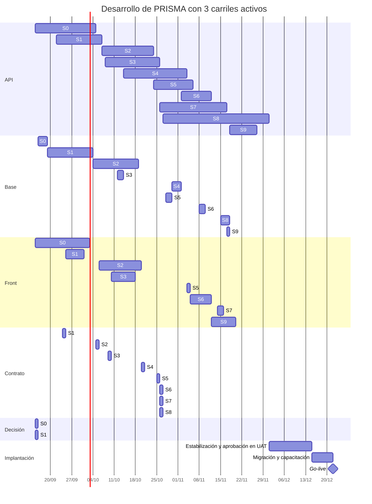
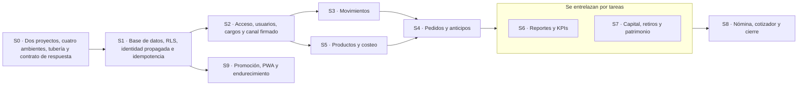

# 08 · Plan de desarrollo

| Versión | Estado | Creado | Actualizado | Etiquetas |
|---|---|---|---|---|
| [4.2.0](https://github.com/Juanchope039/Finanzas-PRISMA/commits/main/docs/08-plan-de-desarrollo.md "Historial de cambios") | [✅ Vigente](22-documentacion.md#estados) | 2026-09-13 | 2026-09-19 | [Plan](INDICE.md#etiqueta-plan) · [Paralelo](INDICE.md#etiqueta-paralelo) |

**El plan se organiza por carriles y dependencias, no por personas.** Cada tarea dice en qué carril
vive —API, Base, Front, Contrato o Decisión— y de qué depende. De esas dos columnas sale lo demás,
calculado y no estimado a ojo: qué va a la vez en cada sprint, cuál es la cadena que no se parte y
cuánto dura el desarrollo según cuántos carriles avancen a la vez. Un carril activo puede ser una
persona, un equipo o una sesión de trabajo; al plan le da igual.

<!-- generado:plan-resumen · no editar a mano: lo escribe scripts/docs/documentar.mjs -->
**27,6 semanas con 1 carril**, **16,7 semanas con 2 carriles** y **14,0 semanas con 3 carriles**, contando las 3 de estabilización. El detalle está en el [cronograma por carriles](#1-cronograma-por-carriles).
<!-- /generado:plan-resumen -->

> **El plan de 7 sprints daba por hecho que no había backend.**
> [ADR-011](adr/ADR-011-stack-flutter-dart.md) lo devolvió al proyecto y **[ADR-017](adr/ADR-017-api-en-java.md) lo reescribió en Java**: ahora hay dos bases de
> código que construir, versionar y desplegar —`prisma_front` en Flutter, con web por defecto, y
> `prisma_api` en Java 25 con Spring Boot— y cuatro ambientes por donde promoverlas. Apretar lo
> nuevo en el mismo calendario sería mentir.

> **Con más carriles no se tarda la mitad, y el cálculo dice por qué.** Los Sprints 0 a 2 son
> cimientos encadenados —el esquema antes que la identidad, la identidad antes que el acceso— y
> casi no se parten. Las 3 semanas de estabilización no se parten en absoluto, porque consisten en
> integrar y probar lo de todos. Y cada carril extra cobra su coordinación. Por eso el segundo
> carril es el que más ahorra, el tercero ahorra bastante menos y un cuarto ya casi no suma. El
> reparto, los cuatro repositorios y las reglas para no pisarse están en
> [`21-trabajo-en-paralelo.md`](21-trabajo-en-paralelo.md) y en
> [ADR-025](adr/ADR-025-cuatro-repositorios.md).

---

## 0. De dónde salen las semanas nuevas

[ADR-001](adr/ADR-001-stack.md) justificó Supabase diciendo que lo más lento y riesgoso de
cualquier sistema es el backend, y que quitarlo bajaba el proyecto de unas 20 semanas a 14. Este
cambio lo devuelve. Las semanas vuelven con él, y cada una tiene nombre:

| Qué cambia | Semanas | Por qué |
|---|:---:|---|
| Plan sin backend | 16 | 7 sprints de 2 semanas + 2 de estabilización |
| **[Sprint 0](#sprint-0)** · dos proyectos, cuatro ambientes y tubería | +2 | Antes no había nada que desplegar; ahora hay dos artefactos y cuatro destinos |
| **La fundación se parte en dos** | +2 | La base con identidad propagada por un lado; el acceso, los usuarios y los cargos por otro |
| **[Sprint 9](#sprint-9)** · promoción, PWA y endurecimiento | +2 | Aprobar en UAT y publicar en prod es trabajo, no un botón |
| Estabilización de 2 a 3 semanas | +1 | La versión aprobada atraviesa cuatro ambientes antes de llegar al taller |
| Subtotal, con la API en Dart | 23 | 10 sprints de 2 semanas + 3 de estabilización |
| **[Sprint 0](#sprint-0)** de 2 a 3 semanas | +1 | El sobre de respuesta, el catálogo de códigos, el descriptor de formulario y la puerta de OpenAPI son cimientos: o están antes del primer endpoint, o después hay que rehacerlos todos |
| **[Sprint 1](#sprint-1)** de 2 a 3 semanas | +1 | La idempotencia de verdad —clave y efecto en la misma transacción— es trabajo de base y de API a la vez, y ese sprint ya era el más cargado |
| **[Sprint 2](#sprint-2)** de 2 a 3 semanas | +1 | El canal firmado nace con la sesión, y [RF-84](03-requisitos-y-bdd.md#rf-84) … [RF-94](03-requisitos-y-bdd.md#rf-94) no estaban en ningún sprint |
| **Total** | **26** | 7 sprints de 2 semanas, 3 sprints de 3 semanas y 3 de estabilización |

### 0.1 Qué mueve el calendario y qué no

> **El cambio de lenguaje por sí solo casi no mueve el calendario. Lo que lo mueve son las piezas
> nuevas del contrato.** Decir «se atrasó por pasarse a Java» sería cómodo y falso.

| Días nuevos | Qué | Sprint |
|:---:|---|:---:|
| **+0,5** | Proyecto Java con Gradle y ArchUnit, en lugar del proyecto Dart | S0 |
| **+1** | Imagen de contenedor y memoria de la JVM acotada, en cuatro ambientes | S0 |
| **+2,5** | Sobre de respuesta y catálogo de códigos, con la prueba que los amarra ([RNF-26](03-requisitos-y-bdd.md#rnf-26)) | S0 |
| **+2** | Descriptor de formulario generado de la validación del servidor ([RF-102](03-requisitos-y-bdd.md#rf-102)) | S0 |
| **+1,5** | Puerta de OpenAPI en integración continua ([RNF-30](03-requisitos-y-bdd.md#rnf-30)) | S0 |
| **+4** | Idempotencia: tabla, filtro con huella, purga y prueba de corte ([RNF-27](03-requisitos-y-bdd.md#rnf-27), [RNF-31](03-requisitos-y-bdd.md#rnf-31)) | S1 |
| **+0,5** | `Dinero` escrito dos veces, una por lenguaje | S1 |
| **+2,5** | Canal firmado: clave de sesión, nonce, marca de tiempo y HMAC ([RNF-29](03-requisitos-y-bdd.md#rnf-29)) | S2 |
| **+1** | Navegación dictada por la API ([RF-103](03-requisitos-y-bdd.md#rf-103)) | S2 |
| **+6** | [RF-84](03-requisitos-y-bdd.md#rf-84) … [RF-94](03-requisitos-y-bdd.md#rf-94), que no estaban en ningún sprint | S2 |
| **+1,5** | [RF-95](03-requisitos-y-bdd.md#rf-95) y [RF-96](03-requisitos-y-bdd.md#rf-96), que tampoco estaban: Inicio de solo consulta y su descarga | S6 |
| **+0,5** | Swagger detrás de autenticación en prod | S9 |
| **+23,5** | **Total** | |

Y una resta que no se ve: `springdoc-openapi` y `Resilience4j` vienen hechos. Publicar OpenAPI,
reintentos y cortacircuitos a mano en Dart habría costado unos cuatro días que aquí ya no están.

**La comprobación de que las tres semanas alcanzan.** De esos 23,5 días, **21,5 caen en los
sprints 0, 1 y 2**, que pasan de 39,5 a 61 días de trabajo y de 6 a 9 semanas de calendario: la
carga por semana sube de 6,6 a 6,8 días, casi la misma densidad de antes y no un apretón
disfrazado. Los dos días restantes se reparten entre el **[Sprint 6](#sprint-6)**, que queda en 14,5 días, y el
**[Sprint 9](#sprint-9)**, que queda en 11,5: ninguno de los dos pasa de la carga que ya llevan los sprints 3 y
8, de 14 y 15,5 días en dos semanas, así que los absorben sin semana extra.

De las tres semanas nuevas, la del **[Sprint 1](#sprint-1)** es la que queda con más holgura: 18,5 días donde
los otros dos llevan 21. Es a propósito. Es el sprint donde un error se paga más caro —RLS,
identidad propagada e idempotencia— y el único cuyo resultado no se puede comprobar mirando la
pantalla.

Los 37 casos de uso siguen siendo los mismos y ninguna regla financiera cambia. Lo que crece es el
contrato entre las tres partes: dos requisitos funcionales nuevos ([RF-102](03-requisitos-y-bdd.md#rf-102) y [RF-103](03-requisitos-y-bdd.md#rf-103)) y seis no
funcionales ([RNF-26](03-requisitos-y-bdd.md#rnf-26) a [RNF-31](03-requisitos-y-bdd.md#rnf-31)).

> **No se reparten las mismas horas en más casillas.** El backend es trabajo nuevo: dominio,
> endpoints, contrato de respuesta, idempotencia, despliegue y cuatro configuraciones. Fingir que
> cabe en el calendario anterior sería descubrir el atraso en la semana 12, cuando ya no hay
> margen.

### 0.2 Lo que el plan hacía sin numerarlo

Al pasar el plan a carriles, cada tarea tuvo que decir de qué depende, y aparecieron **doce tareas
que el trabajo en paralelo necesita y que el plan daba por hechas sin contarlas**. Suman 10,5 días:

| Tareas | Días | Por qué hacían falta |
|---|---:|---|
| [**0.19**](#tarea-0-19) · sistema de diseño en widgets | 2,5 | [21 §4.2](21-trabajo-en-paralelo.md#42-fase-1--cimientos-sprints-0-a-2) lo pedía al carril Front en el [Sprint 0](#sprint-0), pero no estaba en ninguna tabla. Sin él, cada pantalla inventa sus propias tablas y paneles |
| [**1.18**](#tarea-1-18) · renderizador del descriptor, y [**1.19**](#tarea-1-19) · cliente HTTP con clave de idempotencia | 3 | Son la mitad de front de [RF-102](03-requisitos-y-bdd.md#rf-102) y de [ADR-020](adr/ADR-020-idempotencia.md). Estaban en [21 §4.2](21-trabajo-en-paralelo.md#42-fase-1--cimientos-sprints-0-a-2) y en ninguna tabla |
| [**1.17**](#tarea-1-17), [**2.19**](#tarea-2-19), [**3.13**](#tarea-3-13), [**4.10**](#tarea-4-10), [**5.10**](#tarea-5-10), [**6.10**](#tarea-6-10), [**7.9**](#tarea-7-9) y [**8.11**](#tarea-8-11) · un contrato por funcionalidad | 4,5 | **Sin contrato acordado antes, el carril Front espera al carril API**, que es justo lo que el paralelismo quiere evitar ([21 §3.2](21-trabajo-en-paralelo.md#32-contrato-acordado-y-contrato-generado-no-se-contradicen)). Era trabajo real: alguien escribe el contrato y los dos lados lo revisan |
| [**1.20**](#tarea-1-20) · decidir cómo consiguen la API y su CI el esquema de `prisma_db` | 0,5 | [ADR-025](adr/ADR-025-cuatro-repositorios.md) la dejó abierta, y bloquea las pruebas de integración de las tareas [1.7](#tarea-1-7), [1.8](#tarea-1-8) y [1.15](#tarea-1-15) |

**Con estas tareas, en un solo carril el desarrollo pasa de 26 a unas 27,4 semanas** (cálculo del
16/09/2026). No es que el
plan se haya alargado: es que ahora cuenta lo que antes se hacía igual, sin que nadie lo hubiera
presupuestado. En dos o tres carriles, estas tareas son justamente lo que permite solaparse.

---

## 1. Cronograma por carriles

### 1.1 Cuánto dura con 1, 2 o 3 carriles activos

<!-- generado:plan-calendario · no editar a mano: lo escribe scripts/docs/documentar.mjs -->
**163,5 días de trabajo en 134 tareas.** Un carril avanza 6,59 días por semana, el ritmo del plan original; cada carril extra le quita un 10 % a todos por coordinación; y dos tareas del mismo carril y del mismo sprint no van a la vez.

| Carriles activos | Desarrollo | Estabilización | Total | Frente a 1 carril |
|:---:|---:|---:|---:|---:|
| 1 | 24,6 semanas | 3 semanas | **27,6 semanas** | — |
| 2 | 13,7 semanas | 3 semanas | **16,7 semanas** | −10,8 semanas |
| 3 | 11,0 semanas | 3 semanas | **14,0 semanas** | −13,6 semanas |

| Hito | 1 carril | 2 carriles | 3 carriles |
|---|:---:|:---:|:---:|
| [H1](#h1) · Sprint 0 | semana 4 | semana 3 | semana 3 |
| [H2](#h2) · Sprint 1 | semana 7 | semana 5 | semana 4 |
| [H3](#h3) · Sprint 2 | semana 11 | semana 7 | semana 6 |
| [H4](#h4) · Sprint 3 | semana 13 | semana 8 | semana 6 |
| [H5](#h5) · Sprint 4 | semana 16 | semana 9 | semana 8 |
| [H6](#h6) · Sprint 5 | semana 17 | semana 10 | semana 8 |
| [H7](#h7) · Sprint 6 | semana 20 | semana 12 | semana 9 |
| [H8](#h8) · Sprint 7 | semana 21 | semana 12 | semana 10 |
| [H9](#h9) · Sprint 8 | semana 23 | semana 14 | semana 12 |
| [H10](#h10) · Sprint 9 | semana 25 | semana 14 | semana 11 |
| [H11](#h11) · go-live | semana 28 | semana 17 | semana 15 |
<!-- /generado:plan-calendario -->

**Cómo se calcula.** Se reparten las tareas en el tiempo respetando sus dependencias, siempre
primero las del sprint más temprano y, entre ellas, las que más retrasan a otras. Un carril avanza
al ritmo del plan original —151,5 días de trabajo en 23 semanas de desarrollo—. Dos tareas del mismo
carril y del mismo sprint no van a la vez, porque tocan la misma capa de la misma funcionalidad; de
sprints distintos sí, que es el reparto por rebanadas de [21 §4.3](21-trabajo-en-paralelo.md#43-fase-2--rebanadas-verticales-sprints-3-a-8). Y cada carril extra le quita un
10 % de ritmo a todos, que es lo que cuestan las revisiones cruzadas, los acuerdos de contrato y la
integración. Con esos supuestos, **dos carriles dan lo mismo que [21 §5](21-trabajo-en-paralelo.md#5-cuánto-se-gana-de-verdad) había estimado a ojo**,
alrededor de 17 semanas, y eso es lo que permite confiar en la cifra de tres.

> **La cifra no incluye lo que no está en las tablas:** vacaciones, enfermedad, un requisito que
> cambia a mitad de camino o una semana perdida con un proveedor. Es el calendario del trabajo
> descrito, no una promesa de fecha. Cuando una estimación de días cambie, cambia aquí sola.

### 1.2 La cadena que no se parte

<!-- generado:plan-camino-critico · no editar a mano: lo escribe scripts/docs/documentar.mjs -->
**La cadena más larga de dependencias suma 24,5 días en 16 tareas.** Un día de retraso en cualquiera de ellas es un día de retraso del plan entero, tenga los carriles que tenga:

[0.4](#tarea-0-4) → [0.10](#tarea-0-10) → [1.1](#tarea-1-1) → [1.4](#tarea-1-4) → [2.3](#tarea-2-3) → [2.4](#tarea-2-4) → [2.1](#tarea-2-1) → [2.12](#tarea-2-12) → [2.13](#tarea-2-13) → [5.2](#tarea-5-2) → [4.3](#tarea-4-3) → [4.5](#tarea-4-5) → [6.1](#tarea-6-1) → [6.5](#tarea-6-5) → [8.5](#tarea-8-5) → [8.6](#tarea-8-6)
<!-- /generado:plan-camino-critico -->

### 1.3 El diagrama con 3 carriles

Cada barra es un sprint dentro de un carril. Las barras de un mismo carril se solapan cuando dos
funcionalidades avanzan a la vez.

<!-- generado:plan-gantt · no editar a mano: lo escribe scripts/docs/documentar.mjs -->

<!-- /generado:plan-gantt -->

---

## 2. Hitos

| Hito | Al terminar | Criterio de aceptación |
|---|---|---|
| **H0** | Validación | Checklist del mockup firmado |
| **H1** | [Sprint 0](#sprint-0) | Un cambio fusionado se despliega solo hasta dev, el front muestra `v0.1.0 · Desarrollo` en el pie de la barra lateral y toda respuesta sale con el sobre `{status, mensaje, data}` |
| **H2** | [Sprint 1](#sprint-1) | Con la comprobación de la API desactivada, la base sigue negando los datos restringidos, y un reintento con la misma clave de idempotencia no duplica nada |
| **H3** | [Sprint 2](#sprint-2) | Dos usuarios con tipos distintos; Operación no ve lo restringido, y una petición reenviada tal cual se rechaza por nonce repetido |
| **H4** | [Sprint 3](#sprint-3) | Se registra un gasto desde el celular en menos de 30 segundos |
| **H5** | [Sprint 4](#sprint-4) | El anticipo no aparece como ingreso; la venta se causa al entregar |
| **H6** | [Sprint 5](#sprint-5) | El margen por hora de los 5 productos está calculado |
| **H7** | [Sprint 6](#sprint-6) | Las tres cifras cuadran con el ejemplo de septiembre del documento [05](05-reglas-financieras.md) |
| **H8** | [Sprint 7](#sprint-7) | El retiro no reduce la utilidad; el patrimonio es correcto |
| **H9** | [Sprint 8](#sprint-8) | El simulador responde la pregunta de la contratación |
| **H10** | [Sprint 9](#sprint-9) | Gerencia aprueba en UAT exactamente el artefacto que irá a prod |
| **H11** | Go-live | El Excel y el cuaderno dejan de usarse |

> **[H1](#h1) vuelve a cumplirse de una sola vez** ([ADR-032](adr/ADR-032-railway-en-dev-ahora.md)). El [ADR-026](adr/ADR-026-railway-al-final.md) lo había partido
> en dos porque no había a dónde desplegar; desde que **dev se aloja en Railway**, la insignia de
> versión, el sobre en toda respuesta y el cambio fusionado que llega solo hasta dev se cumplen
> juntos, al cerrar el [Sprint 0](#sprint-0).

---

## 3. Sprints

> **Cada sprint entrega las dos mitades.** Una función no está hecha cuando el endpoint responde
> en una herramienta de pruebas: está hecha cuando la pantalla de Flutter la usa, sus códigos
> están en el catálogo con su mensaje en español y el cambio llegó por lo menos hasta qa —o a
> `develop` con la integración continua en verde, mientras qa no exista—.

### Cómo se leen las tablas

| Columna | Qué dice |
|---|---|
| **Carril** | Dónde vive la tarea: **API** (`prisma_api`), **Base** (`prisma_db`), **Front** (`prisma_front`), **Contrato** (`contrato/` de la especificación, lo revisan los dos lados) o **Decisión** (no es código: la toma quien dirige el proyecto). Si hay varios, el primero es el que la lleva |
| **Depende de** | Lo que tiene que estar hecho antes de empezarla, sea del mismo sprint o de otro. Un hito, como [H9](#h9), significa todas las tareas de ese sprint |
| **Días** | Días de trabajo, no de calendario |

Debajo de cada tabla, **las oleadas** dicen qué puede ir a la vez dentro del sprint. Las tareas de
una misma oleada arrancan juntas; cada oleada espera solo a las anteriores. Lo que se puede empezar
hoy, con lo que ya está hecho, está en [`TODO.md`](../TODO.md).

### Cómo se reparten los carriles

| Sprints | Reparto | Por qué |
|---|---|---|
| **0 a 2** · cimientos | **Por capa:** API construye identidad, idempotencia y firma; Base, el esquema y RLS; Front, el sistema de diseño, el renderizador del descriptor y el cliente HTTP. Contrato los junta | Lo que se construye es la capa misma. Todavía no hay rebanada que repartir, y duplicar los cimientos es donde se rompen los sistemas |
| **3 a 8** · funcionalidades | **Por rebanada:** cada funcionalidad es un frente con su SQL, su endpoint y su pantalla, y dos funcionalidades avanzan a la vez sin tocarse. Con dos carriles, la cadena del dinero —Movimientos, Reportes, Capital— y la del pedido —Productos, Pedidos, Cotizador—; Nómina es el amortiguador ([21 §4.3](21-trabajo-en-paralelo.md#43-fase-2--rebanadas-verticales-sprints-3-a-8)) | Cada carril entrega funciones completas. Nadie espera la mitad del otro, porque el contrato de la funcionalidad se acuerda primero |
| **9** · estabilización | **Todos juntos** | Consiste en integrar y probar lo de todos: no se puede partir |

> **El carril Front no se queda esperando durante los cimientos, y ya no depende de acordarse:**
> sus tareas están numeradas —[**0.19**](#tarea-0-19), [**1.18**](#tarea-1-18) y [**1.19**](#tarea-1-19)— y dependen del contrato y del
> descriptor, no de los endpoints de negocio.

### Sprint 0 · Dos proyectos, cuatro ambientes, tubería y contrato de respuesta · **3 semanas**

| | |
|---|---|
| **Objetivo** | Que exista dónde escribir código, a dónde publicarlo y **con qué forma responde la API**, antes de escribir la primera regla de negocio |
| **Requisitos** | [RF-98](03-requisitos-y-bdd.md#rf-98), [RF-99](03-requisitos-y-bdd.md#rf-99), [RF-101](03-requisitos-y-bdd.md#rf-101), [RF-102](03-requisitos-y-bdd.md#rf-102), [RNF-26](03-requisitos-y-bdd.md#rnf-26), [RNF-30](03-requisitos-y-bdd.md#rnf-30) |
| **Riesgo** | Alto: sin esto, cada despliegue posterior se hace a mano y se hace distinto cada vez; y un sobre de respuesta que llega tarde obliga a reescribir todos los endpoints anteriores |

| # | Tarea | Carril | Depende de | Días |
|---|---|---|---|---:|
| 0.1 | Proyecto `prisma_api` en **Java 25 con Spring Boot**, construido con **Gradle**, con el esqueleto hexagonal en paquetes: `dominio`, `aplicacion`, `infraestructura`, `interfaz` | API | — | 2 |
| 0.2 | Regla de frontera verificada en la integración continua con **ArchUnit**: la construcción falla si `dominio` importa Spring, JDBC o HTTP | API | [0.1](#tarea-0-1) | 1 |
| 0.3 | Proyecto `prisma_front` en Flutter, con **web por defecto** y la misma separación por capas | Front | — | 1,5 |
| 0.4 | Los cuatro proyectos de Supabase —dev, qa, uat y prod— cada uno con su base, sus claves y su almacenamiento | Decisión | — | 1 |
| 0.5 | Rol `prisma_api` en los cuatro: sin `BYPASSRLS`, sin `SUPERUSER` y sin ser dueño de las tablas | Base | [0.4](#tarea-0-4) | 1 |
| 0.6 | Secretos por ambiente fuera del repositorio: variables de entorno en la API, `--dart-define` en el front | API, Front | [0.1](#tarea-0-1), [0.3](#tarea-0-3) | 1 |
| 0.7 | Integración continua: formato con `spotless`, análisis estático, pruebas y compilación en la API; `dart format`, `dart analyze`, pruebas y compilación en el front, **para cada proyecto por separado** | API, Front | [0.1](#tarea-0-1), [0.3](#tarea-0-3) | 2 |
| 0.8 | **Imagen de contenedor de la API**: JRE 25 mínimo, memoria de la JVM acotada por variable, el puerto que inyecte el alojamiento y la sonda de disponibilidad mirando la base. **Arranque verificado en dev**; los otros tres ambientes, cuando existan ([9.2](#tarea-9-2), [9.3](#tarea-9-3)) | API | [0.1](#tarea-0-1) | 1 |
| 0.9 | Entrega a dev al fusionar en la rama principal: despliegue de la imagen de la API y publicación del front, con su receta de construcción | API, Front | [0.7](#tarea-0-7), [0.8](#tarea-0-8) | 1,5 |
| 0.10 | SemVer en el `pubspec.yaml` del front y en el `build.gradle.kts` de la API, y migraciones numeradas con tabla `schema_version` | Base | [0.4](#tarea-0-4) | 1 |
| 0.11 | `POST /api/v0/consultas/version`: versión de la API, versión del esquema y ambiente | API | [0.14](#tarea-0-14) | 0,5 |
| 0.12 | Insignia `v0.1.0 · Desarrollo` **en el pie de la barra lateral, abajo a la izquierda**, y franja fija de ambiente arriba en dev, qa y uat; en prod, franja ninguna y la versión en color neutro | Front | [0.3](#tarea-0-3) | 1 |
| 0.13 | El front declara qué MAJOR de la API necesita y bloquea con pantalla clara si no coincide | Front | [0.3](#tarea-0-3), [0.11](#tarea-0-11) | 1 |
| 0.14 | **El sobre de respuesta** `{status, mensaje, data}` en un solo sitio de `interfaz`: lo aplican todos los controladores y el manejador global de excepciones, sin excepción posible | API | [0.1](#tarea-0-1) | 1 |
| 0.15 | **Catálogo único de códigos** de cinco dígitos: código, HTTP, módulo, mensaje en español y cuándo se emite, con los rangos de caso por módulo | API, Contrato | [0.1](#tarea-0-1) | 1 |
| 0.16 | Prueba que falla si el código fuente emite un código que no está en el catálogo, o si un código del catálogo quedó sin usar | API | [0.15](#tarea-0-15) | 0,5 |
| 0.17 | **Descriptor de formulario** generado de la misma definición con la que el servidor valida: una sola fuente, nunca escrita dos veces ([RF-102](03-requisitos-y-bdd.md#rf-102)) | API | [0.14](#tarea-0-14), [0.15](#tarea-0-15) | 2 |
| 0.18 | `springdoc-openapi` sirviendo `/docs`, `openapi.json` versionado en el repositorio y **la integración continua falla si el generado difiere del versionado** ([RNF-30](03-requisitos-y-bdd.md#rnf-30)) | API, Contrato | [0.7](#tarea-0-7), [0.14](#tarea-0-14) | 1,5 |
| 0.19 | **Sistema de diseño del mockup en widgets**: tablas, paneles de confirmación en línea, y fechas y porcentajes con el formato colombiano. Es lo que usan todas las pantallas y lo que evita que el carril Front espere a la API | Front | [0.3](#tarea-0-3) | 2,5 |

<!-- generado:plan-oleadas-0 · no editar a mano: lo escribe scripts/docs/documentar.mjs -->
**Qué puede ir a la vez en este sprint.** Cada oleada espera solo a las anteriores; dentro de una oleada, todo arranca junto.

| Oleada | Tareas | Carriles | Días |
|:---:|---|---|---:|
| 1 | [0.1](#tarea-0-1) · [0.3](#tarea-0-3) · [0.4](#tarea-0-4) | API, Front, Decisión | 4,5 |
| 2 | [0.2](#tarea-0-2) · [0.5](#tarea-0-5) · [0.6](#tarea-0-6) · [0.7](#tarea-0-7) · [0.8](#tarea-0-8) · [0.10](#tarea-0-10) · [0.12](#tarea-0-12) · [0.14](#tarea-0-14) · [0.15](#tarea-0-15) · [0.19](#tarea-0-19) | API, Base, Front | 12,5 |
| 3 | [0.9](#tarea-0-9) · [0.11](#tarea-0-11) · [0.16](#tarea-0-16) · [0.17](#tarea-0-17) · [0.18](#tarea-0-18) | API | 6 |
| 4 | [0.13](#tarea-0-13) | Front | 1 |
<!-- /generado:plan-oleadas-0 -->

> **0.8 y 0.9 se hacen aquí, y solo para dev** ([ADR-032](adr/ADR-032-railway-en-dev-ahora.md)). El [ADR-026](adr/ADR-026-railway-al-final.md) las había movido al
> [Sprint 9](#sprint-9) porque no había a dónde entregar; volvieron cuando hubo algo que enseñar fuera de la
> máquina de desarrollo, que era la condición que ese mismo ADR dejó escrita. **qa, uat y prod siguen
> en el [Sprint 9](#sprint-9)**, y con ellos el «arranque verificado en los cuatro ambientes» de la 0.8 y la
> promoción del artefacto entre ambientes.

**Terminado cuando** — un cambio fusionado llega solo hasta dev sin que nadie toque una consola,
la versión y el ambiente se leen en el pie de la barra lateral, y un endpoint de prueba responde
con el sobre de tres claves y un código que está en el catálogo.

---

### Sprint 1 · Base de datos, RLS, identidad propagada e idempotencia · **3 semanas**

| | |
|---|---|
| **Objetivo** | Que la base siga siendo el juez de los permisos aunque ahora haya una API en medio, y que una escritura aceptada no se pueda duplicar ni perder |
| **Requisitos** | [RF-03](03-requisitos-y-bdd.md#rf-03), [RF-06](03-requisitos-y-bdd.md#rf-06), [RF-07](03-requisitos-y-bdd.md#rf-07), [RF-17](03-requisitos-y-bdd.md#rf-17), [RF-97](03-requisitos-y-bdd.md#rf-97), [RNF-27](03-requisitos-y-bdd.md#rnf-27), [RNF-31](03-requisitos-y-bdd.md#rnf-31) |
| **Riesgo** | Alto: si esto sale mal, todas las políticas de [ADR-006](adr/ADR-006-rls-por-rol.md) quedan de adorno |

| # | Tarea | Carril | Depende de | Días |
|---|---|---|---|---:|
| 1.1 | Esquema SQL completo: tablas, dominios, índices y restricciones **con nombre explícito** | Base | [0.4](#tarea-0-4), [0.10](#tarea-0-10) | 2 |
| 1.2 | Revocación de `DELETE` y `TRUNCATE` | Base | [1.1](#tarea-1-1) | 0,5 |
| 1.3 | Triggers de auditoría sobre todas las tablas de negocio | Base | [1.1](#tarea-1-1) | 1,5 |
| 1.4 | Función `fn_es_gerencia` y políticas RLS | Base | [1.1](#tarea-1-1) | 1,5 |
| 1.5 | `FORCE ROW LEVEL SECURITY` en todas las tablas, para que ni el dueño se libre | Base | [1.4](#tarea-1-4) | 0,5 |
| 1.6 | Transacción por petición en `prisma_api`: propaga `request.jwt.claims` y fija `SET LOCAL ROLE authenticated` ([ADR-012](adr/ADR-012-identidad-a-postgres.md)) | API | [0.5](#tarea-0-5), [1.4](#tarea-1-4) | 1,5 |
| 1.7 | **Prueba de permisos con sesión real:** una usuaria de Operación pide sus datos restringidos a través de la API y la base la rechaza; se repite con la comprobación de la capa de aplicación desactivada y el resultado no cambia | API | [1.5](#tarea-1-5), [1.6](#tarea-1-6), [1.20](#tarea-1-20) | 1,5 |
| 1.8 | Traducción restricción → código del catálogo + mensaje en español + campo, alimentada del catálogo del [Sprint 0](#sprint-0), y prueba que recorre `pg_constraint` y falla si falta una entrada | API | [0.15](#tarea-0-15), [1.1](#tarea-1-1), [1.20](#tarea-1-20) | 1,5 |
| 1.9 | Objeto de valor `Dinero` y formateo de moneda colombiana: en el dominio de la API en Java y, para presentar, en el front en Dart | API, Front | [0.1](#tarea-0-1), [0.3](#tarea-0-3) | 1,5 |
| 1.10 | Gestión de cuentas y categorías: endpoints y pantalla; las cuentas de dinero se crean desde Movimientos y solo con tipo Gerencia ([RF-97](03-requisitos-y-bdd.md#rf-97)) | API, Front | [1.6](#tarea-1-6), [1.8](#tarea-1-8), [1.14](#tarea-1-14), [1.17](#tarea-1-17), [1.18](#tarea-1-18), [1.19](#tarea-1-19) | 1,5 |
| 1.11 | Datos semilla reproducibles para dev y qa | Base | [1.1](#tarea-1-1) | 0,5 |
| 1.12 | Primera promoción de migraciones dev → qa, con el procedimiento escrito | Base | [0.10](#tarea-0-10), [1.11](#tarea-1-11) | 0,5 |
| 1.13 | Tabla `peticiones_idempotentes`: clave, huella, usuario, estado, respuesta guardada y vencimiento, con su índice por `expira_en` | Base | [1.1](#tarea-1-1) | 0,5 |
| 1.14 | **Filtro de idempotencia** en `interfaz`: toda escritura exige `Idempotency-Key`; misma clave y misma huella devuelven la respuesta guardada, misma clave y otra huella responden `40901`, y en curso responde `40902` | API | [1.6](#tarea-1-6), [1.13](#tarea-1-13) | 2 |
| 1.15 | **Prueba de corte:** se interrumpe el proceso entre el efecto y el registro de la clave, y el sistema no queda con media operación. Es la prueba que hace real la idempotencia; sin ella es decorado | API | [1.14](#tarea-1-14), [1.20](#tarea-1-20) | 1 |
| 1.16 | Purga de claves vencidas a las 72 horas con tarea programada, y la nota de por qué esta es la única tabla de la que sí se borran filas | API, Base | [1.13](#tarea-1-13) | 0,5 |
| 1.17 | **Contrato de cuentas y categorías**: endpoints, formularios y códigos, acordados y etiquetados en `openapi.json` antes de implementar ([21 §6.3](21-trabajo-en-paralelo.md#63-el-contrato)) | Contrato | [0.18](#tarea-0-18) | 0,5 |
| 1.18 | **Renderizador del descriptor de formulario** en el front: campos, teclado, límites y mensajes tal como llegan de la API ([RF-102](03-requisitos-y-bdd.md#rf-102)) | Front | [0.17](#tarea-0-17), [0.19](#tarea-0-19) | 2 |
| 1.19 | **Cliente HTTP con `Idempotency-Key`**: la clave se genera cuando la persona decide la acción y se reutiliza en cada reintento ([ADR-020](adr/ADR-020-idempotencia.md)) | Front | [0.3](#tarea-0-3) | 1 |
| 1.20 | **Decidir cómo consiguen la API y su integración continua el esquema de `prisma_db`** para las pruebas de integración: etiqueta, submódulo o imagen de PostgreSQL ([ADR-025](adr/ADR-025-cuatro-repositorios.md)) | Decisión | — | 0,5 |

<!-- generado:plan-oleadas-1 · no editar a mano: lo escribe scripts/docs/documentar.mjs -->
**Qué puede ir a la vez en este sprint.** Cada oleada espera solo a las anteriores; dentro de una oleada, todo arranca junto.

| Oleada | Tareas | Carriles | Días |
|:---:|---|---|---:|
| 1 | [1.1](#tarea-1-1) · [1.9](#tarea-1-9) · [1.17](#tarea-1-17) · [1.18](#tarea-1-18) · [1.19](#tarea-1-19) · [1.20](#tarea-1-20) | Base, API, Contrato, Front, Decisión | 7,5 |
| 2 | [1.2](#tarea-1-2) · [1.3](#tarea-1-3) · [1.4](#tarea-1-4) · [1.8](#tarea-1-8) · [1.11](#tarea-1-11) · [1.13](#tarea-1-13) | Base, API | 6 |
| 3 | [1.5](#tarea-1-5) · [1.6](#tarea-1-6) · [1.12](#tarea-1-12) · [1.16](#tarea-1-16) | Base, API | 3 |
| 4 | [1.7](#tarea-1-7) · [1.14](#tarea-1-14) | API | 3,5 |
| 5 | [1.10](#tarea-1-10) · [1.15](#tarea-1-15) | API | 2,5 |
<!-- /generado:plan-oleadas-1 -->

**Terminado cuando** — con el `if` de la API desactivado a propósito, una sesión de tipo Operación
sigue sin poder leer `aportes_retiros` —el rechazo viene de la base, no de la aplicación— y el
mismo `POST` enviado dos veces con la misma clave deja un solo movimiento.

> **La clave y el efecto viajan en la misma transacción.** Guardarlos por separado deja abierta
> justo la ventana que la idempotencia prometía cerrar: un corte entre las dos escrituras y la
> operación queda hecha sin constancia de que se hizo.

---

### Sprint 2 · Acceso, usuarios, cargos y canal firmado · **3 semanas**

| | |
|---|---|
| **Objetivo** | Que cada persona entre con su propio usuario, que el front nunca vea un correo y que una petición capturada no se pueda reenviar |
| **Requisitos** | [RF-01](03-requisitos-y-bdd.md#rf-01), [RF-02](03-requisitos-y-bdd.md#rf-02), [RF-04](03-requisitos-y-bdd.md#rf-04), [RF-05](03-requisitos-y-bdd.md#rf-05), [RF-71](03-requisitos-y-bdd.md#rf-71) … [RF-94](03-requisitos-y-bdd.md#rf-94), [RF-100](03-requisitos-y-bdd.md#rf-100), [RF-103](03-requisitos-y-bdd.md#rf-103), [RNF-29](03-requisitos-y-bdd.md#rnf-29) |
| **Riesgo** | Medio: la parte delicada quedó resuelta en el [Sprint 1](#sprint-1) |

| # | Tarea | Carril | Depende de | Días |
|---|---|---|---|---:|
| 2.1 | Autenticación contra Supabase Auth **desde `prisma_api`**: el mapeo de usuario a correo sintético ocurre en el servidor ([ADR-009](adr/ADR-009-login-por-usuario.md)) | API | [1.6](#tarea-1-6), [2.4](#tarea-2-4), [2.19](#tarea-2-19) | 1,5 |
| 2.2 | Sesión, expiración a 30 días y enrutamiento del front **según la navegación que dicta la API**, no según reglas escritas en el cliente | API, Front | [2.1](#tarea-2-1), [2.14](#tarea-2-14) | 1,5 |
| 2.3 | Tabla `cargos` con sus datos semilla y sus políticas RLS | Base | [1.4](#tarea-1-4) | 1 |
| 2.4 | Tabla `usuarios` ampliada: `usuario`, `nombre_completo`, `cargo_id` y `tipo` | Base | [2.3](#tarea-2-3) | 1 |
| 2.5 | Trigger `tg_proteger_ultima_gerencia`: no se puede desactivar ni degradar al último usuario de Gerencia | Base | [2.4](#tarea-2-4) | 0,5 |
| 2.6 | Pantalla de acceso y cambio obligatorio de contraseña en el primer ingreso | Front | [1.18](#tarea-1-18), [2.19](#tarea-2-19) | 1,5 |
| 2.7 | Gestión de usuarios: crear, editar, desactivar con motivo y restablecer clave | API, Front | [1.14](#tarea-1-14), [2.1](#tarea-2-1) | 1,5 |
| 2.8 | Catálogo de cargos: crear, renombrar, reordenar y desactivar con motivo | API, Front | [2.1](#tarea-2-1), [2.3](#tarea-2-3) | 1 |
| 2.9 | Registro de cada inicio de sesión con fecha, dispositivo e IP | API, Base | [2.1](#tarea-2-1) | 1 |
| 2.10 | Panel «Acerca de»: versión del front, de la API y del esquema, ambiente, fecha de compilación y referencia del commit ([RF-100](03-requisitos-y-bdd.md#rf-100)) | Front, API | [0.11](#tarea-0-11), [0.12](#tarea-0-12) | 0,5 |
| 2.11 | La prueba de permisos del [Sprint 1](#sprint-1) se ejecuta también en qa, contra la base de qa | API | [1.7](#tarea-1-7), [1.12](#tarea-1-12) | 0,5 |
| 2.12 | **Clave de firma de sesión**: la API la entrega al iniciar sesión y el front la guarda **solo en memoria**, nunca en disco ni en `localStorage` | API, Front | [2.1](#tarea-2-1) | 1 |
| 2.13 | **Filtro de firma** en la API: HMAC del método, la ruta, la marca de tiempo, el nonce y el resumen del cuerpo; rechaza con `40101`, `40102` y `40103` según el caso | API | [2.12](#tarea-2-12), [2.20](#tarea-2-20) | 1,5 |
| 2.14 | La API devuelve la navegación que esa sesión puede ver y el front la pinta sin decidir nada ([RF-103](03-requisitos-y-bdd.md#rf-103)) | API, Front | [2.1](#tarea-2-1) | 1 |
| 2.15 | Tabla única de usuarios activos y desactivados, con el estado y la fecha y hora de desactivación en cada fila, y cambio de estado desde la propia tabla con confirmación y motivo escrito ([RF-84](03-requisitos-y-bdd.md#rf-84) … [RF-87](03-requisitos-y-bdd.md#rf-87)) | API, Front | [2.7](#tarea-2-7) | 1,5 |
| 2.16 | Bitácora de todo cambio sobre usuarios y cargos —quién, cuándo y por qué— y reversión que escribe una entrada nueva sin borrar la original; se rechaza la reversión que dejaría el sistema sin Gerencia activa ([RF-88](03-requisitos-y-bdd.md#rf-88), [RF-89](03-requisitos-y-bdd.md#rf-89), [RF-91](03-requisitos-y-bdd.md#rf-91)) | Base, API, Front | [1.3](#tarea-1-3), [2.7](#tarea-2-7), [2.8](#tarea-2-8) | 2,5 |
| 2.17 | Cambio obligatorio de contraseña también al reactivar un usuario ([RF-90](03-requisitos-y-bdd.md#rf-90)) | API, Front | [2.7](#tarea-2-7) | 0,5 |
| 2.18 | Vista previa de la interfaz de Operación para Gerencia, señalada de forma permanente y con salida a un clic, y la constancia de que **no sustituye la prueba de permisos con sesión real** ([RF-92](03-requisitos-y-bdd.md#rf-92) … [RF-94](03-requisitos-y-bdd.md#rf-94)) | Front, API | [2.14](#tarea-2-14) | 1,5 |
| 2.19 | **Contrato de acceso, usuarios, cargos y canal firmado**: endpoints, cabeceras de firma y los códigos `40101` a `40103`, acordados antes de implementar | Contrato | [1.17](#tarea-1-17) | 1 |
| 2.20 | **Tablas del canal firmado**: `sesiones`, donde vive del lado del servidor la clave que la [2.12](#tarea-2-12) entrega y hoy nadie guarda, y `nonces_vistos` ([04 §4.10](04-modelo-de-datos.md#410-los-nonce-vistos)), con sus políticas y la purga de la ventana | Base | [2.4](#tarea-2-4) | 0,5 |

<!-- generado:plan-oleadas-2 · no editar a mano: lo escribe scripts/docs/documentar.mjs -->
**Qué puede ir a la vez en este sprint.** Cada oleada espera solo a las anteriores; dentro de una oleada, todo arranca junto.

| Oleada | Tareas | Carriles | Días |
|:---:|---|---|---:|
| 1 | [2.3](#tarea-2-3) · [2.10](#tarea-2-10) · [2.11](#tarea-2-11) · [2.19](#tarea-2-19) | Base, Front, API, Contrato | 3 |
| 2 | [2.4](#tarea-2-4) · [2.6](#tarea-2-6) | Base, Front | 2,5 |
| 3 | [2.1](#tarea-2-1) · [2.5](#tarea-2-5) · [2.20](#tarea-2-20) | API, Base | 2,5 |
| 4 | [2.7](#tarea-2-7) · [2.8](#tarea-2-8) · [2.9](#tarea-2-9) · [2.12](#tarea-2-12) · [2.14](#tarea-2-14) | API | 5,5 |
| 5 | [2.2](#tarea-2-2) · [2.13](#tarea-2-13) · [2.15](#tarea-2-15) · [2.16](#tarea-2-16) · [2.17](#tarea-2-17) · [2.18](#tarea-2-18) | API, Base, Front | 9 |
<!-- /generado:plan-oleadas-2 -->

> **La [2.20](#tarea-2-20) apareció al ir a hacer la [2.13](#tarea-2-13), y no estaba.** El filtro de firma necesita dos tablas
> que no existen: `nonces_vistos`, que el [04 §4.10](04-modelo-de-datos.md#410-los-nonce-vistos) especifica entera desde hace días pero ninguna
> migración crea, y **una donde guardar la clave de firma**, que la [2.12](#tarea-2-12) genera, entrega y olvida.
> Sin la segunda no hay HMAC que comprobar. Va como tarea de Base y no dentro de la [2.13](#tarea-2-13) por el
> mismo reparto que ya tuvo la idempotencia —la tabla fue la [1.13](#tarea-1-13) y el filtro la [1.14](#tarea-1-14)—: dos
> carriles, dos commits, y el trabajo de Base donde alguien lo busca.

**Terminado cuando** — dos usuarios con tipos distintos entran con su propio nombre de usuario,
la sesión de Operación no alcanza lo restringido en dev y en qa, y una petición capturada y
reenviada tal cual se rechaza por nonce repetido.

---

### Sprint 3 · Movimientos

| | |
|---|---|
| **Objetivo** | Registrar plata que entra y sale en menos de 30 segundos |
| **Requisitos** | [RF-08](03-requisitos-y-bdd.md#rf-08) … [RF-16](03-requisitos-y-bdd.md#rf-16) |

| # | Tarea | Carril | Depende de | Días |
|---|---|---|---|---:|
| 3.1 | Dominio: `Movimiento`, tipos y su efecto sobre utilidad, caja y patrimonio | API | [1.9](#tarea-1-9) | 1,5 |
| 3.2 | Caso de uso `RegistrarMovimiento` con doble fecha | API | [3.1](#tarea-3-1) | 1 |
| 3.3 | Repositorio de movimientos contra PostgreSQL en `infrastructure/` | API | [1.6](#tarea-1-6), [3.1](#tarea-3-1) | 1 |
| 3.4 | Endpoints de movimientos, con sus códigos del catálogo y sus mensajes en español tomados de él | API | [1.14](#tarea-1-14), [2.13](#tarea-2-13), [3.2](#tarea-3-2), [3.3](#tarea-3-3), [3.13](#tarea-3-13) | 1 |
| 3.5 | Formulario de registro rápido optimizado para celular, pintado del descriptor que envía la API | Front | [1.18](#tarea-1-18), [1.19](#tarea-1-19), [3.13](#tarea-3-13) | 2 |
| 3.6 | Adjuntar foto del recibo con compresión previa; el archivo sube **a través de la API**, nunca directo al almacenamiento | Front, API | [3.4](#tarea-3-4), [3.5](#tarea-3-5), [3.14](#tarea-3-14) | 1,5 |
| 3.7 | Transferencias entre cuentas | API | [3.4](#tarea-3-4) | 1 |
| 3.8 | Listado con filtros por fecha, tipo, categoría y cuenta | API, Front | [3.4](#tarea-3-4) | 1,5 |
| 3.9 | Anulación con motivo obligatorio | API, Front | [3.4](#tarea-3-4) | 1 |
| 3.10 | Corrección por contra-asiento | API | [3.9](#tarea-3-9) | 1 |
| 3.11 | Marca de registro tardío | API | [3.2](#tarea-3-2) | 0,5 |
| 3.12 | Cálculo de saldos por cuenta | API | [3.3](#tarea-3-3) | 1 |
| 3.13 | **Contrato de movimientos**: registro, transferencias, anulación, adjuntos y filtros | Contrato | [2.19](#tarea-2-19) | 0,5 |
| 3.14 | Tabla `adjuntos` y bucket de soportes: especificarla en el [04](04-modelo-de-datos.md) y escribir su migración | Base | [1.1](#tarea-1-1), [3.13](#tarea-3-13) | 1 |

<!-- generado:plan-oleadas-3 · no editar a mano: lo escribe scripts/docs/documentar.mjs -->
**Qué puede ir a la vez en este sprint.** Cada oleada espera solo a las anteriores; dentro de una oleada, todo arranca junto.

| Oleada | Tareas | Carriles | Días |
|:---:|---|---|---:|
| 1 | [3.1](#tarea-3-1) · [3.13](#tarea-3-13) | API, Contrato | 2 |
| 2 | [3.2](#tarea-3-2) · [3.3](#tarea-3-3) · [3.5](#tarea-3-5) · [3.14](#tarea-3-14) | API, Front, Base | 5 |
| 3 | [3.4](#tarea-3-4) · [3.11](#tarea-3-11) · [3.12](#tarea-3-12) | API | 2,5 |
| 4 | [3.6](#tarea-3-6) · [3.7](#tarea-3-7) · [3.8](#tarea-3-8) · [3.9](#tarea-3-9) | Front, API | 5 |
| 5 | [3.10](#tarea-3-10) | API | 1 |
<!-- /generado:plan-oleadas-3 -->

**Terminado cuando** — se cronometra el registro de un gasto real con foto y toma menos de 30
segundos.

---

### Sprint 4 · Pedidos y anticipos

| | |
|---|---|
| **Objetivo** | Que el anticipo se comporte como pasivo y la venta se cause al entregar |
| **Requisitos** | [RF-18](03-requisitos-y-bdd.md#rf-18) … [RF-27](03-requisitos-y-bdd.md#rf-27) |
| **Riesgo** | Alto: es la regla financiera menos intuitiva |

| # | Tarea | Carril | Depende de | Días |
|---|---|---|---|---:|
| 4.1 | Dominio: `Pedido`, estados y transiciones | API | [1.9](#tarea-1-9) | 1,5 |
| 4.2 | Gestión de clientes | API, Front | [1.14](#tarea-1-14), [2.13](#tarea-2-13), [4.10](#tarea-4-10) | 1 |
| 4.3 | Registro de pedido con líneas de producto | API, Front | [4.1](#tarea-4-1), [4.2](#tarea-4-2), [5.2](#tarea-5-2) | 2 |
| 4.4 | Caso de uso `CobrarAnticipo` — crea pasivo, no ingreso | API | [3.3](#tarea-3-3), [4.1](#tarea-4-1) | 1,5 |
| 4.5 | Función de negocio en la base que entrega el pedido y causa la venta en una sola transacción; la API la llama y no rehace sus pasos | Base | [4.3](#tarea-4-3), [4.4](#tarea-4-4) | 2 |
| 4.6 | Listado ordenado por fecha con filtros | API, Front | [4.3](#tarea-4-3) | 1,5 |
| 4.7 | Resaltado de pedidos estancados (15+ días con anticipo) | API, Front | [4.6](#tarea-4-6) | 1 |
| 4.8 | Adjuntar factura al pedido | API, Front | [3.6](#tarea-3-6), [4.3](#tarea-4-3) | 0,5 |
| 4.9 | Cancelación de pedido con destino del anticipo | API | [4.4](#tarea-4-4) | 1 |
| 4.10 | **Contrato de clientes, pedidos y anticipos** | Contrato | [2.19](#tarea-2-19) | 0,5 |

<!-- generado:plan-oleadas-4 · no editar a mano: lo escribe scripts/docs/documentar.mjs -->
**Qué puede ir a la vez en este sprint.** Cada oleada espera solo a las anteriores; dentro de una oleada, todo arranca junto.

| Oleada | Tareas | Carriles | Días |
|:---:|---|---|---:|
| 1 | [4.1](#tarea-4-1) · [4.10](#tarea-4-10) | API, Contrato | 2 |
| 2 | [4.2](#tarea-4-2) · [4.4](#tarea-4-4) | API | 2,5 |
| 3 | [4.3](#tarea-4-3) · [4.9](#tarea-4-9) | API | 3 |
| 4 | [4.5](#tarea-4-5) · [4.6](#tarea-4-6) · [4.8](#tarea-4-8) | Base, API | 4 |
| 5 | [4.7](#tarea-4-7) | API | 1 |
<!-- /generado:plan-oleadas-4 -->

**Terminado cuando** — el escenario [BDD-07-1](03-requisitos-y-bdd.md#bdd-07-1) pasa: anticipo cobrado en marzo, entrega en abril,
la venta se causa completa en abril.

---

### Sprint 5 · Productos y costeo

| | |
|---|---|
| **Objetivo** | Conocer el margen real y el margen por hora de cada producto |
| **Requisitos** | [RF-28](03-requisitos-y-bdd.md#rf-28) … [RF-35](03-requisitos-y-bdd.md#rf-35) |

| # | Tarea | Carril | Depende de | Días |
|---|---|---|---|---:|
| 5.1 | Dominio: `Producto` y servicio `calcularMargenes` | API | [1.9](#tarea-1-9) | 1,5 |
| 5.2 | Catálogo de productos y servicios | API, Front | [1.14](#tarea-1-14), [2.13](#tarea-2-13), [5.1](#tarea-5-1), [5.10](#tarea-5-10) | 1,5 |
| 5.3 | Costeo unitario: insumo, consumibles, minutos de trabajo | API | [5.1](#tarea-5-1) | 2 |
| 5.4 | Costeo de bordado por tiempo de máquina | API | [5.3](#tarea-5-3) | 1 |
| 5.5 | Historial de costos con fecha de vigencia | Base, API | [5.2](#tarea-5-2) | 1 |
| 5.6 | Cálculo y presentación del margen por hora | API | [5.3](#tarea-5-3) | 1 |
| 5.7 | Sugerencia de precio por margen objetivo | API | [5.6](#tarea-5-6) | 1 |
| 5.8 | Ocultar costos y márgenes al tipo Operación: **la API no los envía**; esconderlos solo en la pantalla no cuenta | API | [1.7](#tarea-1-7), [5.6](#tarea-5-6) | 1 |
| 5.9 | Cuadro comparativo ordenable por margen por hora | Front | [5.6](#tarea-5-6), [5.10](#tarea-5-10) | 1 |
| 5.10 | **Contrato de productos, servicios y costeo** | Contrato | [2.19](#tarea-2-19) | 0,5 |

<!-- generado:plan-oleadas-5 · no editar a mano: lo escribe scripts/docs/documentar.mjs -->
**Qué puede ir a la vez en este sprint.** Cada oleada espera solo a las anteriores; dentro de una oleada, todo arranca junto.

| Oleada | Tareas | Carriles | Días |
|:---:|---|---|---:|
| 1 | [5.1](#tarea-5-1) · [5.10](#tarea-5-10) | API, Contrato | 2 |
| 2 | [5.2](#tarea-5-2) · [5.3](#tarea-5-3) | API | 3,5 |
| 3 | [5.4](#tarea-5-4) · [5.5](#tarea-5-5) · [5.6](#tarea-5-6) | API, Base | 3 |
| 4 | [5.7](#tarea-5-7) · [5.8](#tarea-5-8) · [5.9](#tarea-5-9) | API, Front | 3 |
<!-- /generado:plan-oleadas-5 -->

**Terminado cuando** — el cuadro de los 5 productos coincide con el documento [05](05-reglas-financieras.md) [§7.2](05-reglas-financieras.md#72-los-tres-márgenes).

---

### Sprint 6 · Reportes y KPIs

| | |
|---|---|
| **Objetivo** | Las tres cifras, el promedio de ganancias y el punto de equilibrio |
| **Requisitos** | [RF-41](03-requisitos-y-bdd.md#rf-41) … [RF-44](03-requisitos-y-bdd.md#rf-44), [RF-52](03-requisitos-y-bdd.md#rf-52), [RF-53](03-requisitos-y-bdd.md#rf-53), [RF-95](03-requisitos-y-bdd.md#rf-95), [RF-96](03-requisitos-y-bdd.md#rf-96) |
| **Riesgo** | Alto: es el corazón del valor del sistema |

| # | Tarea | Carril | Depende de | Días |
|---|---|---|---|---:|
| 6.1 | Servicios de dominio: utilidad causada, flujo de caja, caja libre | API | [3.12](#tarea-3-12), [4.5](#tarea-4-5), [5.3](#tarea-5-3), [7.3](#tarea-7-3), [7.4](#tarea-7-4) | 2 |
| 6.2 | Pruebas unitarias con el ejemplo de septiembre completo | API | [6.1](#tarea-6-1) | 1,5 |
| 6.3 | Dashboard con las tres cifras lado a lado | Front | [6.1](#tarea-6-1), [6.10](#tarea-6-10) | 2 |
| 6.4 | Gráfico de 12 meses | Front | [6.3](#tarea-6-3) | 1,5 |
| 6.5 | Reporte mensual y anual con promedio de ganancias | API, Front | [2.13](#tarea-2-13), [6.1](#tarea-6-1), [6.10](#tarea-6-10) | 2 |
| 6.6 | Punto de equilibrio | API | [5.6](#tarea-5-6), [6.1](#tarea-6-1) | 1 |
| 6.7 | Alertas: caja libre negativa, anticipos, pedidos estancados | API, Front | [4.7](#tarea-4-7), [6.1](#tarea-6-1) | 1,5 |
| 6.8 | Cierre mensual con snapshot inmutable | Base, API | [6.5](#tarea-6-5) | 1,5 |
| 6.9 | El Inicio queda de solo consulta —ni crear, ni editar, ni anular— y se puede descargar en CSV o PDF lo que muestra ([RF-95](03-requisitos-y-bdd.md#rf-95), [RF-96](03-requisitos-y-bdd.md#rf-96)) | Front, API | [6.3](#tarea-6-3) | 1,5 |
| 6.10 | **Contrato de reportes, indicadores, alertas y cierre mensual** | Contrato | [2.19](#tarea-2-19) | 0,5 |

<!-- generado:plan-oleadas-6 · no editar a mano: lo escribe scripts/docs/documentar.mjs -->
**Qué puede ir a la vez en este sprint.** Cada oleada espera solo a las anteriores; dentro de una oleada, todo arranca junto.

| Oleada | Tareas | Carriles | Días |
|:---:|---|---|---:|
| 1 | [6.1](#tarea-6-1) · [6.10](#tarea-6-10) | API, Contrato | 2,5 |
| 2 | [6.2](#tarea-6-2) · [6.3](#tarea-6-3) · [6.5](#tarea-6-5) · [6.6](#tarea-6-6) · [6.7](#tarea-6-7) | API, Front | 8 |
| 3 | [6.4](#tarea-6-4) · [6.8](#tarea-6-8) · [6.9](#tarea-6-9) | Front, Base | 4,5 |
<!-- /generado:plan-oleadas-6 -->

**Terminado cuando** — el sistema reproduce exactamente las cifras del documento [05](05-reglas-financieras.md) [§12](05-reglas-financieras.md#12-ejemplo-integral--septiembre-completo).

---

### Sprint 7 · Capital, retiros y patrimonio

| | |
|---|---|
| **Objetivo** | Que el retiro deje de distorsionar la utilidad |
| **Requisitos** | [RF-45](03-requisitos-y-bdd.md#rf-45) … [RF-51](03-requisitos-y-bdd.md#rf-51) |

| # | Tarea | Carril | Depende de | Días |
|---|---|---|---|---:|
| 7.1 | Registro de inversiones en activos | API, Front | [3.4](#tarea-3-4), [7.9](#tarea-7-9) | 1,5 |
| 7.2 | Aportes de capital | API, Front | [3.4](#tarea-3-4), [7.9](#tarea-7-9) | 1 |
| 7.3 | Configuración del pro-labore con justificación | API, Front | [3.4](#tarea-3-4), [7.9](#tarea-7-9) | 1,5 |
| 7.4 | Retiro con división automática pro-labore y distribución | API | [7.3](#tarea-7-3) | 2 |
| 7.5 | Cálculo de patrimonio | API | [6.1](#tarea-6-1), [7.1](#tarea-7-1), [7.2](#tarea-7-2), [7.4](#tarea-7-4) | 1,5 |
| 7.6 | Alerta de descapitalización a 12 meses | API | [7.5](#tarea-7-5) | 1 |
| 7.7 | Configuración de los 4 sobres con historial | API, Front | [3.4](#tarea-3-4), [7.9](#tarea-7-9) | 1,5 |
| 7.8 | Panel de sobres: asignado contra usado | Front | [6.1](#tarea-6-1), [7.7](#tarea-7-7) | 2 |
| 7.9 | **Contrato de inversiones, aportes, retiros, pro-labore y sobres** | Contrato | [2.19](#tarea-2-19) | 0,5 |

<!-- generado:plan-oleadas-7 · no editar a mano: lo escribe scripts/docs/documentar.mjs -->
**Qué puede ir a la vez en este sprint.** Cada oleada espera solo a las anteriores; dentro de una oleada, todo arranca junto.

| Oleada | Tareas | Carriles | Días |
|:---:|---|---|---:|
| 1 | [7.9](#tarea-7-9) | Contrato | 0,5 |
| 2 | [7.1](#tarea-7-1) · [7.2](#tarea-7-2) · [7.3](#tarea-7-3) · [7.7](#tarea-7-7) | API | 5,5 |
| 3 | [7.4](#tarea-7-4) · [7.8](#tarea-7-8) | API, Front | 4 |
| 4 | [7.5](#tarea-7-5) | API | 1,5 |
| 5 | [7.6](#tarea-7-6) | API | 1 |
<!-- /generado:plan-oleadas-7 -->

**Terminado cuando** — [BDD-16-1](03-requisitos-y-bdd.md#bdd-16-1) y [BDD-25-1](03-requisitos-y-bdd.md#bdd-25-1) pasan: el retiro no reduce la utilidad y el
pro-labore sí.

---

### Sprint 8 · Nómina, cotizador y cierre

| | |
|---|---|
| **Objetivo** | Responder la pregunta de la contratación y cerrar el alcance funcional |
| **Requisitos** | [RF-36](03-requisitos-y-bdd.md#rf-36) … [RF-40](03-requisitos-y-bdd.md#rf-40), [RF-54](03-requisitos-y-bdd.md#rf-54) … [RF-69](03-requisitos-y-bdd.md#rf-69) |

| # | Tarea | Carril | Depende de | Días |
|---|---|---|---|---:|
| 8.1 | Registro de empleadas | API, Front | [1.14](#tarea-1-14), [2.13](#tarea-2-13), [8.11](#tarea-8-11) | 1 |
| 8.2 | Función de negocio en la base que liquida la nómina descontando adelantos, en una sola transacción | Base | [8.1](#tarea-8-1), [8.3](#tarea-8-3) | 2 |
| 8.3 | Adelantos como cuenta por cobrar | API | [3.4](#tarea-3-4), [8.1](#tarea-8-1) | 1,5 |
| 8.4 | Desprendible PDF con acceso restringido al propio, decidido por la base | API | [8.2](#tarea-8-2) | 1,5 |
| 8.5 | Simulador de capacidad de pago con controles en vivo | API, Front | [5.6](#tarea-5-6), [6.5](#tarea-6-5), [7.3](#tarea-7-3), [8.11](#tarea-8-11) | 2,5 |
| 8.6 | Traducción a unidades de producto por vender | API | [5.6](#tarea-5-6), [8.5](#tarea-8-5) | 1 |
| 8.7 | Indicador de horas pagadas contra facturadas | API, Front | [5.6](#tarea-5-6), [8.2](#tarea-8-2) | 1 |
| 8.8 | Cotizaciones y remisiones en PDF con logo | API, Front | [4.3](#tarea-4-3), [5.2](#tarea-5-2), [8.11](#tarea-8-11) | 2 |
| 8.9 | Validador de anticipo mínimo | API | [4.4](#tarea-4-4), [5.3](#tarea-5-3) | 1 |
| 8.10 | Importador de CSV con mapeo y reporte de errores | API, Front | [3.4](#tarea-3-4), [4.3](#tarea-4-3) | 2 |
| 8.11 | **Contrato de nómina, simulador, cotizaciones e importación** | Contrato | [2.19](#tarea-2-19) | 0,5 |

<!-- generado:plan-oleadas-8 · no editar a mano: lo escribe scripts/docs/documentar.mjs -->
**Qué puede ir a la vez en este sprint.** Cada oleada espera solo a las anteriores; dentro de una oleada, todo arranca junto.

| Oleada | Tareas | Carriles | Días |
|:---:|---|---|---:|
| 1 | [8.9](#tarea-8-9) · [8.10](#tarea-8-10) · [8.11](#tarea-8-11) | API, Contrato | 3,5 |
| 2 | [8.1](#tarea-8-1) · [8.5](#tarea-8-5) · [8.8](#tarea-8-8) | API | 5,5 |
| 3 | [8.3](#tarea-8-3) · [8.6](#tarea-8-6) | API | 2,5 |
| 4 | [8.2](#tarea-8-2) | Base | 2 |
| 5 | [8.4](#tarea-8-4) · [8.7](#tarea-8-7) | API | 2,5 |
<!-- /generado:plan-oleadas-8 -->

**Terminado cuando** — el simulador entrega un veredicto con datos reales del negocio.

---

### Sprint 9 · Promoción, PWA y endurecimiento

| | |
|---|---|
| **Objetivo** | Que lo construido se pueda aprobar en UAT y publicar en prod sin sorpresas |
| **Requisitos** | [RF-70](03-requisitos-y-bdd.md#rf-70) |
| **Riesgo** | Medio, pero es el único sprint que no se puede recortar: es el que hace publicable lo demás |

| # | Tarea | Carril | Depende de | Días |
|---|---|---|---|---:|
| 9.1 | PWA instalable sobre la compilación web de Flutter y cola local persistente sin conexión, con su clave de idempotencia guardada **antes** de intentar enviar ([ADR-016](adr/ADR-016-flutter-web-pwa.md)) | Front | [1.19](#tarea-1-19) | 2 |
| 9.2 | Ambiente uat en pie: datos realistas **anonimizados** y su propia semilla | Base, API | [0.9](#tarea-0-9), [1.11](#tarea-1-11) | 1 |
| 9.3 | Promoción del artefacto aprobado de uat a prod **sin recompilar**, con la misma versión | API, Front | [9.2](#tarea-9-2) | 1 |
| 9.4 | Procedimiento de reversión ensayado en qa: volver la API y el front a la versión anterior y medir cuánto tarda | API, Front | [0.9](#tarea-0-9) | 1,5 |
| 9.5 | La prueba de permisos con sesión real corre en los cuatro ambientes, no solo en dev | API | [1.7](#tarea-1-7), [9.2](#tarea-9-2) | 1 |
| 9.6 | Pruebas de extremo a extremo de los flujos críticos, ejecutadas en qa | API, Front | [0.9](#tarea-0-9) | 2 |
| 9.7 | Rendimiento en celular real con 4G ([RNF-01](03-requisitos-y-bdd.md#rnf-01)) | Front | [0.9](#tarea-0-9) | 1 |
| 9.8 | Repaso de secretos: nada en el repositorio y `service_role` solo en migraciones | API | [0.9](#tarea-0-9) | 0,5 |
| 9.9 | Prueba de verdad del contrato de compatibilidad: el front rechaza un MAJOR de API distinto | Front | [0.9](#tarea-0-9), [0.13](#tarea-0-13) | 0,5 |
| 9.10 | Etiquetar `1.0.0` del front y de la API para el go-live | API, Front | [9.1](#tarea-9-1), [9.3](#tarea-9-3), [9.4](#tarea-9-4), [9.5](#tarea-9-5), [9.6](#tarea-9-6), [9.7](#tarea-9-7), [9.8](#tarea-9-8), [9.9](#tarea-9-9), [9.11](#tarea-9-11) | 0,5 |
| 9.11 | Swagger abierto en `/docs` en dev, qa y uat, y **detrás de autenticación en prod**: el catálogo de endpoints es un mapa del sistema | API | [0.9](#tarea-0-9) | 0,5 |

<!-- generado:plan-oleadas-9 · no editar a mano: lo escribe scripts/docs/documentar.mjs -->
**Qué puede ir a la vez en este sprint.** Cada oleada espera solo a las anteriores; dentro de una oleada, todo arranca junto.

| Oleada | Tareas | Carriles | Días |
|:---:|---|---|---:|
| 1 | [9.1](#tarea-9-1) · [9.2](#tarea-9-2) · [9.4](#tarea-9-4) · [9.6](#tarea-9-6) · [9.7](#tarea-9-7) · [9.8](#tarea-9-8) · [9.9](#tarea-9-9) · [9.11](#tarea-9-11) | Front, Base, API | 9 |
| 2 | [9.3](#tarea-9-3) · [9.5](#tarea-9-5) | API | 2 |
| 3 | [9.10](#tarea-9-10) | API | 0,5 |
<!-- /generado:plan-oleadas-9 -->

> **Las tareas [0.8](#tarea-0-8) y [0.9](#tarea-0-9) ya no llegan aquí:** volvieron al [Sprint 0](#sprint-0) por [ADR-032](adr/ADR-032-railway-en-dev-ahora.md), y el sprint
> se queda en sus 11,5 días. Lo que sí sigue siendo de este sprint es todo lo que dependía de tener
> **los otros tres ambientes**: levantarlos ([9.2](#tarea-9-2)), promover el artefacto sin recompilarlo ([9.3](#tarea-9-3)),
> ensayar la reversión ([9.4](#tarea-9-4)) y verificar el arranque de la imagen donde todavía no corre.

**Terminado cuando** — Gerencia aprueba en UAT y ese mismo artefacto, sin reconstruir, queda
listo para prod.

---

## 4. Definición de terminado

Una tarea no está terminada hasta que cumple **todo** lo siguiente:

- [ ] La API compila con las advertencias tratadas como errores y pasa formato y análisis estático;
      `dart analyze` pasa sin errores ni advertencias en el front.
- [ ] La regla de frontera de arquitectura no se viola, y la integración continua lo comprueba.
- [ ] Los servicios de dominio involucrados tienen pruebas unitarias.
- [ ] Los escenarios BDD asociados pasan.
- [ ] Si toca datos sensibles, hay una prueba con sesión real de tipo Operación que verifica que
      **el rechazo viene de la base**, no de un `if` de la API.
- [ ] Toda restricción nueva de la base tiene nombre explícito y su entrada en la tabla de
      traducción de errores.
- [ ] La respuesta sale con el sobre `{status, mensaje, data}` y **todo código nuevo está en el
      catálogo**, con su mensaje en español ya redactado para el taller.
- [ ] Si la operación escribe, exige `Idempotency-Key` y hay prueba de que repetirla no duplica.
- [ ] Si hay formulario, sus reglas llegan en el descriptor de la API: **el front no trae ninguna
      regla propia**, ni umbral, ni mensaje escrito en el cliente.
- [ ] El `openapi.json` versionado coincide con el generado, y la operación documenta qué caso de
      uso implementa y qué códigos puede devolver.
- [ ] Funciona en un celular real, no solo en el navegador de escritorio.
- [ ] Los textos están en español y el dinero con formato colombiano.
- [ ] Ninguna cifra monetaria usa decimales.
- [ ] La versión del proyecto tocado subió según SemVer y el cambio llegó al menos hasta qa.
      Mientras qa no exista —hasta el [Sprint 9](#sprint-9), por [ADR-026](adr/ADR-026-railway-al-final.md)—, basta con fusionarlo a `develop` con la
      integración continua en verde, por el PR de su rama `feature/` ([21 §6.5](21-trabajo-en-paralelo.md#65-ramas-e-integración)).
- [ ] **La tarea es un commit, y el commit explica por qué** ([ADR-028](adr/ADR-028-un-commit-por-tarea.md)). El asunto lleva el sprint y
      el número de la tarea; el cuerpo son tres líneas —`Hace:`, `Decide:` y `Verifica:`—, la
      última con el conteo de pruebas y qué se rompió a propósito para verlas fallar. Dos tareas no
      van en un mismo commit aunque toquen la misma clase.
- [ ] **El mensaje entero cabe en 256 caracteres** ([ADR-031](adr/ADR-031-commit-de-256-caracteres.md)), asunto, cuerpo y trailers
      incluidos. El porqué largo no va ahí: va en el plan de `plan/` ([22 §10](22-documentacion.md#planes)), que se escribió antes
      y no tiene tope.
- [ ] **El tablero quedó al día en el mismo empuje:** la tarea marcada `[x]` en [`TODO.md`](../TODO.md) y
      `node scripts/docs/documentar.mjs enlazar` corrido, que rehace las marcas ⚡ y 🔒, lo que puede
      empezar hoy y cuánto falta.
- [ ] Si el cambio toca documentación, el documento subió su versión y
      `node scripts/docs/documentar.mjs verificar` pasa ([`22-documentacion.md`](22-documentacion.md)).

---

## 5. Riesgos del desarrollo

| Riesgo | Prob. | Impacto | Mitigación |
|---|:---:|:---:|---|
| La regla del anticipo se implementa mal | Media | **Alto** | [Sprint 4](#sprint-4) dedicado, escenarios BDD explícitos |
| Los permisos quedan solo en la interfaz | Media | **Alto** | Pruebas obligatorias con sesión de tipo Operación |
| **La API se conecta con `service_role` «para que funcione»** | Media | **Alto** | Rol `prisma_api` sin `BYPASSRLS` y sin ser dueño; la prueba del [Sprint 1](#sprint-1) corre con el `if` desactivado |
| **El front termina hablando directo con Supabase** | Media | **Alto** | Se rechaza en revisión de código: el cliente de Supabase no entra en `prisma_front` |
| **El descriptor del formulario se separa de la validación del servidor** | Alta | Medio | El descriptor se genera de la misma definición con la que valida el servidor, y la prueba de `pg_constraint` sigue cuidando el lado de la base |
| **La clave de idempotencia se guarda fuera de la transacción del efecto** | Media | **Alto** | Prueba de corte del [Sprint 1](#sprint-1): se interrumpe entre las dos escrituras y no puede quedar media operación |
| **La JVM encarece alojar cuatro ambientes** | Alta | Medio | Imagen mínima, memoria acotada por variable, dev y qa apagables; [RNF-14](03-requisitos-y-bdd.md#rnf-14) ya no exige costo cero sino costo mínimo sostenible |
| **Dos lenguajes se desalinean: el front reimplementa una regla «por comodidad»** | Media | **Alto** | [RNF-28](03-requisitos-y-bdd.md#rnf-28) y revisión de código: si aparece un umbral o un mensaje escrito en el front, se rechaza el cambio |
| **Mantener cuatro ambientes consume tiempo de cada sprint** | Alta | Medio | [Sprint 0](#sprint-0) dedicado y todo automatizado desde el primer día |
| El registro diario resulta lento y se abandona | Media | **Alto** | Cronómetro como criterio de aceptación del [Sprint 3](#sprint-3) |
| Errores de redondeo en los cálculos | Baja | Alto | Objeto `Dinero` con enteros desde el [Sprint 1](#sprint-1) |
| El alcance crece durante el desarrollo | Alta | Medio | Lo nuevo va al roadmap, no al sprint en curso |
| El histórico de Excel llega incompleto | Alta | Medio | Reporte de errores por fila y digitación asistida |
| Las fórmulas financieras se malinterpretan | Media | **Alto** | El ejemplo de septiembre es prueba ejecutable |

---

## 6. Backlog priorizado

Recuento hecho sobre [`03-requisitos-y-bdd.md`](03-requisitos-y-bdd.md), fila por fila, el día de
esta edición: **103 requisitos funcionales**, [RF-01](03-requisitos-y-bdd.md#rf-01) a [RF-103](03-requisitos-y-bdd.md#rf-103).

| Prioridad | Alcance |
|---|---|
| **M** · Imprescindible | 79 requisitos. Sin ellos el sistema no responde las tres preguntas |
| **S** · Importante | 22 requisitos. Mejoran el uso diario; si un sprint se atrasa, se negocian |
| **C** · Deseable | 2 requisitos. Entran solo si hay holgura |
| **Total** | **103** |

Los dos últimos son los que agrega este cambio —**[RF-102](03-requisitos-y-bdd.md#rf-102)** (descriptor de formulario) y **[RF-103](03-requisitos-y-bdd.md#rf-103)**
(navegación dictada por la API)—, ambos **M** por decisión del documento [03](03-requisitos-y-bdd.md), y quedan en los
sprints 0 y 2. La prioridad la fija ese documento, no este plan: aquí solo se dice dónde se
construyen.

Lo que surja durante el desarrollo y no esté en esta lista **va al roadmap**, no al sprint en
curso. Esa es la única defensa efectiva contra el crecimiento descontrolado del alcance.

### 6.1 Los requisitos que estaban sin sprint

[RF-84](03-requisitos-y-bdd.md#rf-84) a [RF-97](03-requisitos-y-bdd.md#rf-97) aparecían en el documento [03](03-requisitos-y-bdd.md) y en ningún sprint. Quedan asignados así, sin mover
ninguno de sitio ni renumerar nada:

| Requisitos | Sprint | Tareas |
|---|:---:|---|
| [RF-84](03-requisitos-y-bdd.md#rf-84) … [RF-87](03-requisitos-y-bdd.md#rf-87) · tabla única de usuarios con estado y fecha de desactivación | S2 | 2.15 |
| [RF-88](03-requisitos-y-bdd.md#rf-88), [RF-89](03-requisitos-y-bdd.md#rf-89), [RF-91](03-requisitos-y-bdd.md#rf-91) · bitácora de cambios y reversión sin borrar | S2 | 2.16 |
| [RF-90](03-requisitos-y-bdd.md#rf-90) · cambio de clave obligatorio al reactivar | S2 | 2.17 |
| [RF-92](03-requisitos-y-bdd.md#rf-92) … [RF-94](03-requisitos-y-bdd.md#rf-94) · vista previa de Operación, señalada y con su advertencia | S2 | 2.18 |
| [RF-95](03-requisitos-y-bdd.md#rf-95), [RF-96](03-requisitos-y-bdd.md#rf-96) · Inicio de solo consulta y su descarga en CSV o PDF | S6 | 6.9 |
| [RF-97](03-requisitos-y-bdd.md#rf-97) · las cuentas de dinero se crean desde Movimientos y solo con tipo Gerencia | S1 | 1.10 |

De paso quedan asignados [RF-98](03-requisitos-y-bdd.md#rf-98), [RF-99](03-requisitos-y-bdd.md#rf-99) y [RF-101](03-requisitos-y-bdd.md#rf-101) al [Sprint 0](#sprint-0) (tareas [0.12](#tarea-0-12) y [0.13](#tarea-0-13)) y [RF-100](03-requisitos-y-bdd.md#rf-100) al
[Sprint 2](#sprint-2) (tarea [2.10](#tarea-2-10)): las tareas ya existían, pero ningún sprint los declaraba.

---

## 7. Orden de construcción y por qué

El orden no es arbitrario: sale de las dependencias de las tareas. Una flecha de un sprint a otro
significa que alguna tarea del segundo necesita una del primero; las flechas que ya se deducen de
otras no se dibujan.

<!-- generado:plan-grafo · no editar a mano: lo escribe scripts/docs/documentar.mjs -->

<!-- /generado:plan-grafo -->

> **Este diagrama antes se dibujaba a mano, y estaba mal en un punto.** Ponía Pedidos antes que
> Costeo, pero registrar un pedido con sus líneas (tarea [4.3](#tarea-4-3)) necesita el catálogo de productos
> (tarea [5.2](#tarea-5-2)): la cadena del pedido de [21 §4.3](21-trabajo-en-paralelo.md#43-fase-2--rebanadas-verticales-sprints-3-a-8) ya lo decía al empezar por Productos. Y Reportes
> necesita los retiros de Capital para cuadrar el flujo de caja de septiembre ([05 §12.2](05-reglas-financieras.md#122-flujo-de-caja-del-mismo-mes)), así que
> las dos funcionalidades se entrelazan por tareas, no por sprints enteros.

El [Sprint 0](#sprint-0) va primero porque **no se puede promover lo que no se puede construir dos veces
igual**: sin la tubería, cada despliegue a cada ambiente se haría a mano y distinto.

Y el sobre de respuesta, el catálogo de códigos y el descriptor de formulario van en ese mismo
[Sprint 0](#sprint-0) por una razón de costo: **son la forma de todo lo que viene después**. Un contrato que
llega en el [Sprint 4](#sprint-4) obliga a reescribir los endpoints y las pantallas de los sprints 1, 2 y 3,
y a rehacer las pruebas que ya pasaban. Cuesta tres veces más tarde que temprano.

La idempotencia va en el [Sprint 1](#sprint-1), junto con el esquema, porque la clave y el efecto tienen que
escribirse en la misma transacción: es una decisión de base de datos disfrazada de cabecera HTTP.
El canal firmado va en el [Sprint 2](#sprint-2) porque la clave de firma nace al iniciar sesión, y antes del
[Sprint 2](#sprint-2) no hay sesión que la entregue.

El [Sprint 1](#sprint-1) va antes que el acceso porque la propagación de identidad decide si los permisos son
reales o decorado. Construir pantallas encima de una seguridad que todavía no juzga nada sería
descubrir el problema cuando ya hay diez pantallas que rehacer.

El simulador de capacidad de pago va al final porque **necesita todo lo anterior**: sin costeo
no hay margen de contribución, sin reportes no hay utilidad promedio, y sin pro-labore el
cálculo estaría inflado. Construirlo antes daría una respuesta con apariencia de precisión y
sin fundamento — que es peor que no tener respuesta.

El [Sprint 9](#sprint-9) va de último porque endurece lo que ya existe. No es relleno: es lo que separa
«funciona en mi computador» de «Gerencia lo aprobó y el taller lo tiene».

<!-- generado:referenciado-desde · no editar a mano: lo escribe scripts/docs/documentar.mjs -->
**🔗 Referenciado desde:** [00](00-resumen-ejecutivo.md "00 · Resumen ejecutivo") · [04](04-modelo-de-datos.md "04 · Modelo de datos") · [07](07-arquitectura.md "07 · Arquitectura técnica") · [09](09-plan-de-implantacion.md "09 · Plan de implantación") · [11](11-riesgos-y-proteccion-de-datos.md "11 · Riesgos y protección de datos") · [16](16-base-de-datos-y-snapshots.md "16 · Base de datos: snapshots y datos de prueba") · [19](19-ambientes-y-entrega.md "19 · Ambientes, versionado y entrega") · [20](20-contrato-de-api.md "20 · Contrato de la API") · [21](21-trabajo-en-paralelo.md "21 · Trabajo en paralelo por carriles") · [22](22-documentacion.md "22 · Documentación: versiones, estados y referencias") · [Contrato](../contrato/README.md "Contrato de la API · v0.9.0") · [ADR-011](adr/ADR-011-stack-flutter-dart.md "ADR-011 · Stack: Flutter y Dart con API propia") · [ADR-012](adr/ADR-012-identidad-a-postgres.md "ADR-012 · La API propaga la identidad a PostgreSQL para que RLS siga juzgando") · [ADR-017](adr/ADR-017-api-en-java.md "ADR-017 · Stack: Flutter en el front, Java con Spring Boot en la API") · [ADR-024](adr/ADR-024-java-25-y-gradle.md "ADR-024 · Java 25, Gradle y Spring Boot 4 en la API") · [ADR-025](adr/ADR-025-cuatro-repositorios.md "ADR-025 · Cuatro repositorios: la base de datos sale de la API") · [ADR-026](adr/ADR-026-railway-al-final.md "ADR-026 · Railway aloja la API y el front, y el despliegue va al final del desarrollo") · [ADR-027](adr/ADR-027-documentacion-versionada.md "ADR-027 · La documentación se versiona, se fecha y se enlaza, y la integración continua lo verifica") · [ADR-028](adr/ADR-028-un-commit-por-tarea.md "ADR-028 · Cada tarea hecha es un commit, y el commit explica por qué") · [ADR-029](adr/ADR-029-esquema-por-etiqueta.md "ADR-029 · El esquema llega a la API por etiqueta, y la integración continua lo levanta con Supabase") · [ADR-031](adr/ADR-031-commit-de-256-caracteres.md "ADR-031 · El mensaje de commit cabe en 256 caracteres") · [ADR-032](adr/ADR-032-railway-en-dev-ahora.md "ADR-032 · Railway aloja dev desde ahora, y los otros tres ambientes siguen al final") · [ADR-033](adr/ADR-033-service-role-solo-en-auth.md "ADR-033 · La clave de servicio entra, pero solo para crear identidades") · [CLAUDE](../CLAUDE.md "CLAUDE.md") · [README](../scripts/docs/README.md "Herramienta de documentación")
<!-- /generado:referenciado-desde -->

---

### 🧭 Navegación

**⬅️ Anterior:** [07 · Arquitectura](07-arquitectura.md)  ·  **🗂️ [Índice general](INDICE.md)**  ·  **Siguiente ➡️:** [09 · Plan de implantación](09-plan-de-implantacion.md)
