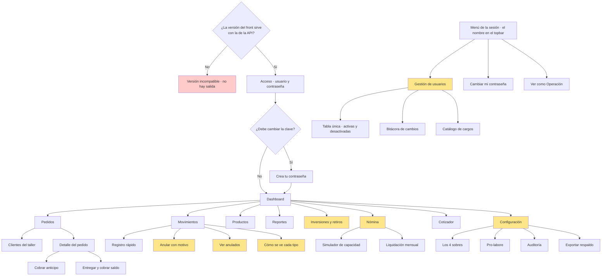

# 10 · Diseño de experiencia y mockups

| Versión | Estado | Creado | Actualizado | Etiquetas |
|---|---|---|---|---|
| [3.0.0](https://github.com/Juanchope039/Finanzas-PRISMA/commits/main/docs/10-ux-y-mockups.md "Historial de cambios") | [✅ Vigente](22-documentacion.md#estados) | 2026-09-13 | 2026-09-24 | [UX](INDICE.md#etiqueta-ux) · [Front](INDICE.md#etiqueta-front) |

Prototipo navegable: [`../mockup/prisma-mockup.html`](../mockup/prisma-mockup.html)

> **El mockup HTML es el contrato de diseño, y lo sigue siendo.** El front se construye en
> Flutter, pero lo que Flutter implementa es esto: cada pantalla, cada estado y cada texto salen
> del prototipo, no del criterio de quien programa. Cambió la tecnología con la que se construye,
> no quién manda en el diseño. La regla de oro del proyecto sigue igual: **nada se construye
> hasta que el mockup de esa pantalla esté aprobado.** Lo que no está dibujado aquí todavía no
> existe.

---

## 1. Principios de diseño

| # | Principio | Consecuencia concreta |
|---|---|---|
| <a id="principio-1"></a>1 | **El celular es el dispositivo principal** | Todo se diseña primero para una pantalla de 375 px y una sola mano |
| <a id="principio-2"></a>2 | **Registrar debe costar menos que no registrar** | El botón de registro rápido flota sobre todas las pantallas menos el Inicio; máximo 4 campos obligatorios |
| <a id="principio-3"></a>3 | **Las tres cifras nunca van solas** | Utilidad, caja y caja libre siempre juntas, nunca una sin las otras |
| <a id="principio-4"></a>4 | **Nada de jerga contable** | "Lo que ganaste" en vez de "utilidad neta del ejercicio" |
| <a id="principio-5"></a>5 | **Las alertas dicen qué hacer** | No "caja libre negativa" sino "estás usando plata de anticipos" |
| <a id="principio-6"></a>6 | **Lo restringido no se ve, no se atenúa** | El rol Operación no ve menús deshabilitados: simplemente no existen. El menú llega armado desde el ingreso —lo manda la API según el tipo de la sesión ([principio 9](#principio-9), [RF-103](03-requisitos-y-bdd.md#rf-103))—, no se recorta después |
| <a id="principio-7"></a>7 | **El dinero siempre con formato colombiano** | `$1.350.784` — punto de miles, sin decimales |
| <a id="principio-8"></a>8 | **El Inicio es un espejo, no un formulario** | Ninguna acción que escriba en la base vive en el Inicio: cada cosa se registra en la pantalla de su asunto —el dinero en Movimientos, los pedidos en Pedidos, el catálogo en Productos, la gente en Gestión de usuarios |
| <a id="principio-9"></a>9 | **El front no decide nada** | Los mensajes de error, las reglas de los formularios y qué opciones de menú existen los dicta la API; el front los pinta |

> **Por qué el Inicio no escribe.** Un tablero que además crea datos compite consigo mismo: la
> cifra que acabas de mirar cambia por algo que hiciste dos centímetros más abajo, y ya no sabes
> si el número que recuerdas era de antes o de después. Y un Inicio que no escribe se puede
> exportar entero sin ambigüedad: lo que ves es lo que descargas, porque nada de lo que hay ahí
> está a medio hacer. Por eso el botón flotante de registro rápido del [principio 2](#principio-2) flota sobre
> todas las pantallas menos esta: un botón que escribe plata volvería formulario justo a la
> pantalla que se definió como espejo.

> **Por qué el front no decide.** Una regla escrita en dos sitios se separa. Y cuando se separa,
> la que la persona ve en pantalla deja de ser la que el sistema aplica: el formulario acepta algo
> que la API después rechaza, o avisa de algo que la API ya permitía. Quien queda mal es la
> pantalla, y quien pierde el trabajo escrito es la empleada. Con una sola fuente —la API— el
> aviso y la decisión no pueden divergir. Esto no le quita agilidad al diseño: la pantalla sigue
> avisando al instante, pero lo que avisa se lo dictaron ([§3.4](#34-el-descriptor-de-formulario)).

---

## 2. Mapa de navegación



Lo que va en amarillo es **exclusivo de Gerencia**: pantallas enteras, y dentro de Movimientos,
anular, ver los anulados y decidir cómo se ve cada tipo.

**Gestión de usuarios cuelga aparte a propósito.** No está en el menú lateral: se abre desde el
menú de la sesión, el que aparece al pulsar el nombre en el topbar. Administrar quién entra no
es una tarea del día a día del taller, como sí lo son Pedidos o Movimientos: es una tarea de
cuenta, y vive donde ya están «Cambiar mi contraseña» y «Cerrar sesión». Las pantallas siguen
siendo 11; lo que cambia es por dónde se llega a una de ellas.

El acceso ya no es una caja de paso: es una pantalla con diseño propio, y es donde se decide
todo lo demás. Quien entra con la clave temporal que le dio Gerencia no llega al Dashboard
sino a **Crea tu contraseña**, y de ahí no sale sin cambiarla.

### 2.1 Navegación por rol

| Tipo de usuario | Menú visible |
|---|---|
| **Gerencia** | Dashboard · Pedidos · Movimientos · Productos · Reportes · Inversiones · Nómina · Cotizador · Configuración |
| **Operación** | Inicio · Pedidos · Movimientos · Productos (sin costos) · Cotizador · Mi desprendible |

**Gestión de usuarios no aparece en ninguna de las dos listas**, porque ya no es una entrada del
menú lateral: se alcanza desde el menú de la sesión y allí solo existe para Gerencia. En el
prototipo el menú lateral de Gerencia baja por eso de nueve entradas a ocho. Para Operación la
entrada no está en ninguna parte: no se atenúa, no se deshabilita, no existe ([principio 6](#principio-6)).

---

## 3. Sistema de diseño

### 3.1 Color

El color tiene significado funcional, no decorativo.

| Uso | Color | Dónde |
|---|---|---|
| Marca | Índigo profundo | Encabezados, acciones principales |
| Positivo | Verde | Ingresos, márgenes sanos, metas alcanzadas |
| Negativo | Rojo | Gastos, caja libre negativa, alertas críticas |
| Advertencia | Ámbar | Anticipos pendientes, pedidos estancados, registro tardío |
| Neutro | Gris | Transferencias, información secundaria |
| Anticipo | Morado | Todo lo relacionado con plata que aún no es del negocio |

> **El morado para anticipos es deliberado.** Es la categoría que más se confunde, y darle un
> color propio —ni verde de ingreso ni gris de neutro— ayuda a recordar que es una tercera cosa.

**En el libro de movimientos, Gerencia elige el color de cada tipo entre cuatro de estos: verde,
rojo, morado y gris** ([§4.3](#43-movimientos)). Cambia qué color lleva un tipo, no lo que significa cada color: por eso
no hay un selector libre. Quedan fuera los otros dos:
- el ámbar es de las advertencias, y «Registro tardío» y «Anulado» ya son ámbar en la misma fila;
- el índigo es de la marca y las acciones.

Un tipo de esos colores se leería como un aviso o como un botón.

### 3.2 Tipografía y jerarquía

| Elemento | Tratamiento |
|---|---|
| Cifra principal del dashboard | Muy grande, peso fuerte, tabular |
| Cifras secundarias | Grandes, peso medio |
| Etiquetas | Pequeñas, mayúsculas, gris medio |
| Cuerpo | 16 px mínimo — legible en el taller, con luz de día |

Todas las cifras usan **numeración tabular** para que las columnas se alineen.

### 3.3 Accesibilidad

- Contraste mínimo AA en todo texto.
- Objetivos táctiles de 44×44 px como mínimo.
- El color nunca es el único portador de información: siempre hay ícono o texto.
- Soporte de tema claro y oscuro.

### 3.4 El descriptor de formulario

Un formulario que solo avisa cuando el servidor contesta se siente lento y gasta datos móviles en
cada equivocación. Un formulario que decide por su cuenta vuelve a poner la regla en dos sitios,
que es justo lo que prohíbe el [principio 9](#principio-9). El diseño no escoge entre las dos cosas: **la pantalla
sigue avisando al instante, pero lo que avisa se lo dictaron.**

Junto con cada formulario, la API entrega el **descriptor** de sus campos: etiqueta, tipo, si es
obligatorio, mínimos y máximos, qué teclado conviene abrir, el texto de ayuda y **las palabras
exactas** del aviso cuando una regla no se cumple. El front lee ese descriptor y pinta.

| Lo dicta la API | Lo hace la pantalla |
|---|---|
| Qué campos hay y en qué orden | Los dibuja en ese orden, sin reordenarlos |
| Qué regla aplica a cada campo | La comprueba mientras se escribe, sin ir al servidor |
| Con qué palabras se avisa | Muestra el texto tal cual, sin redactar nada |
| Qué teclado conviene | Abre el numérico donde va plata, el de texto donde va texto |

> **La pantalla no sabe por qué existe la regla.** No sabe que un gasto tiene que ser mayor que
> cero: sabe que hay una regla llamada `minimo` con valor 1 y un mensaje que mostrar si no se
> cumple. Por eso corregir una palabra o mover un tope no obliga a publicar una versión nueva del
> front, y por eso el aviso que se lee en el celular es siempre el mismo que aplica el servidor.

El aviso inmediato es cortesía, no autoridad: la API vuelve a comprobar todo cuando llega la
petición, siempre. Cubre `RF-102`.

---

## 4. Las 11 pantallas

### 4.0 Acceso

**Pregunta:** *¿quién está entrando?*

Capa a pantalla completa, sin menú y sin topbar: mientras no haya sesión no hay nada más que
ver. Logo, campo **Usuario**, campo **Contraseña** con botón de mostrar u ocultar, y el botón
**Entrar**. El foco arranca en Usuario y Enter envía desde cualquiera de los dos campos.
El detalle de sus decisiones está en [§5](#5-la-sesión-acceso-y-gestión-de-usuarios).

### 4.1 Dashboard

**Pregunta que responde:** *¿cómo va el negocio ahora mismo?*

| Zona | Contenido |
|---|---|
| Encabezado | El botón **Descargar**, única acción de toda la pantalla |
| Superior | Las tres cifras del mes: utilidad causada, movimiento de caja, **caja libre** |
| Explicación | Una línea que concilia las tres: "La diferencia son $2.100.000 en anticipos" |
| Alertas | Solo las activas, con acción sugerida |
| Cuentas | Saldo de efectivo, Nequi, Daviplata, banco |
| Los 4 sobres | Barras con asignado contra usado |
| Gráfico | 12 meses de utilidad y caja superpuestas |
| Pendientes | Pedidos por entregar, cuentas por cobrar |

**Solo consulta.** Aquí no se crea, no se edita y no se anula nada ([principio 8](#principio-8)). Lo único que
hace el botón **Descargar** es sacar en CSV o PDF lo que la pantalla ya muestra: las tres cifras
del mes, los saldos de cuentas al corte, los 12 meses de utilidad y caja, las alertas activas y
los pedidos por entregar. Se elige con casillas qué incluir. Crear cuentas de dinero se hace en
Movimientos ([§4.3](#43-movimientos)).

> **En el prototipo el botón Descargar no descarga.** Al pulsarlo aparece un aviso que dice qué
> archivo se generaría y con qué contenido, y nada más. Prometer una descarga que no ocurre es
> peor que no ofrecerla.

### 4.2 Pedidos

**Pregunta:** *¿qué debo entregar y qué me deben?*

Lista **ordenada por fecha**, con estado visual: anticipo cobrado (morado), entregado (verde),
estancado 15+ días (ámbar). Filtros por estado, cliente y rango de fechas. Cada fila muestra
valor total, anticipo y saldo.

#### Los clientes viven aquí, y no en una pantalla propia

Un cliente existe para que haya un pedido, así que se administra donde se usa. **No es la pantalla
número doce**: el menú lo dicta la API y sus claves no incluyen ninguna que se llame así, y una
clave que el front no conoce no se pinta.

- **El cliente de un pedido se elige de una lista, no se escribe.** El campo «Cliente» de «Nuevo
  pedido» es un desplegable con los clientes vigentes, ordenados por nombre. Dos maneras de escribir
  el mismo nombre serían dos clientes y ningún historial común.
- **«+ Cliente nuevo…» abre el alta en la misma pantalla**, debajo del campo: nombre, teléfono,
  correo y notas. Solo el nombre es obligatorio, porque en el taller el cliente entra por teléfono
  mientras se toma el pedido y el correo llega después ([CU-05](02-casos-de-uso.md#cu-05)). Al guardar, el cliente recién
  creado queda elegido; nadie sale del pedido a medio tomar.
- **El panel «Clientes del taller»** lista los vigentes con su contacto, sus notas y cuántos pedidos
  tiene cada uno. Crear puede cualquiera de los dos tipos de usuario: sin cliente no hay pedido.
- **Anular es de Gerencia y pide motivo escrito.** Sale del desplegable y del panel, pero no se
  borra ([RN-13](03-requisitos-y-bdd.md#rn-13)): queda con cuándo, quién y por qué, y sus pedidos siguen enteros. Lo pide el mismo
  panel de confirmación en línea que el resto del prototipo, y a Operación el botón no se le
  atúna: no existe ([principio 6](#principio-6)).

  Que a Operación no se le pinte es comodidad, no permiso: quien lo impide de verdad es
  `clientes_actualizacion` en PostgreSQL ([04 §7](04-modelo-de-datos.md#7-seguridad-por-tipo-de-usuario-rls)).
- **Un cliente anulado no desaparece de los pedidos que ya lo nombran.** Si se modifica uno de esos
  pedidos, su cliente vuelve al desplegable mientras esa ficha esté abierta, marcado como anulado:
  guardar no puede cambiarle el cliente a un pedido por su cuenta.

### 4.3 Movimientos

**Pregunta:** *¿en qué se fue la plata?*

Registro rápido en un panel que se abre con el botón flotante, y ese botón flota sobre todas las
pantallas menos el Inicio: valor, tipo, categoría, cuenta, fecha (hoy por defecto), foto. El
Inicio queda fuera porque no escribe ([principio 8](#principio-8)). Debajo va **el libro**: la lista con filtros,
la marca de registro tardío y la acción de anular con motivo obligatorio.

**El libro.** Una tabla por mes, con lo más reciente primero, ordenada por la fecha en que ocurrió
cada movimiento y no por la de digitación ([RN-01](03-requisitos-y-bdd.md#rn-01)). De arriba abajo:

| Zona | Contenido |
|---|---|
| Encabezado | `‹ Septiembre 2026 ›`: las flechas cambian de mes, y la de adelante no pasa del mes en curso. Al lado, **Otro rango**, que abre «Desde» y «Hasta» con el mes ya puesto y un botón «Volver al mes» |
| Filtros | **Todos · Ingresos · Gastos**, la categoría, la cuenta —solo con los nombres, sin saldos— y, para Gerencia, el interruptor **Ver anulados** |
| Tabla | Fecha, concepto, categoría, cuenta, valor, tipo y la marca de registro tardío. El valor lleva el signo de lo que el movimiento le hace a la caja y el color de su tipo. Una transferencia dice «Nequi → Bancolombia», va sin signo y sale al filtrar por cualquiera de sus dos cuentas |
| Pie | **Por página: 10 · 25 · 50** y «‹ Anterior · 1–10 de 14 · Siguiente ›» |

Si no queda ninguna fila, la tabla lo dice con el período: «No hay movimientos en julio de 2026.»
Si hay algún filtro puesto, agrega «con estos filtros», y nunca lo dice sin filtros: mandaría a
buscar uno que no existe.

Un rango que no se puede pedir no deja la tabla en blanco. Si le falta una fecha o está al revés,
en lugar de la tabla va el aviso, en rojo, como se pinta una lectura que la API rechaza.

**La fila abierta.** Tocar una fila la abre debajo, como en Pedidos. Dice quién registró el
movimiento, cuándo se digitó y con qué registro va —el pedido de un anticipo, el activo de una
inversión—, y enseña el soporte: la foto del recibo, que se agranda al tocarla, o el PDF. Para
Gerencia trae además **Anular movimiento**. La cierran «Cerrar» y Escape.

**Anular.** Pide el motivo antes de confirmar, en un panel debajo de la fila. El panel dice que el
movimiento sale de todas las cifras sin borrarse y que, si lo que está mal es el valor, se corrige
con un contra-asiento. Si el movimiento va junto con otro registro —el anticipo de un pedido, un
activo, un aporte, un retiro o un adelanto—, dice también que ese registro se anula con él, en la
misma transacción. Una vez anulado, el movimiento sale del libro y se ve con **Ver anulados**.

**Ver anulados.** Con el interruptor puesto el panel cambia de aspecto —borde ámbar y, encima de
la tabla, «Estás viendo también los anulados · no suman en ninguna cifra»—, para que ese modo
nunca se confunda con el libro de siempre ([04 §5.5](04-modelo-de-datos.md#55-vistas-limpias-por-defecto)). Los anulados salen en su fecha, apagados,
con el valor tachado, la marca «Anulado» y debajo el motivo, quién y cuándo. El mes y los
filtros valen igual.

**Lo que dicta la API.** El libro no decide nada ([principio 9](#principio-9)):

| Lo dicta la API | Lo hace la pantalla |
|---|---|
| El nombre, el color y el signo de cada tipo, y si cuenta en «Ingresos», en «Gastos» o en ninguno | Pinta la píldora y el valor tal como llegan |
| El mes en curso, que es el de Bogotá | Apaga la flecha de adelante ahí |
| Cuántos movimientos caben por página como máximo: lo lee de una variable de entorno, y son 50 si no está | Ofrece 10, 25 y 50 sin pasar del máximo, y arranca en el máximo |
| Que un rango sin una de sus fechas, o al revés, no se puede pedir, y con qué palabras | Pinta el aviso donde iría la tabla |
| Si quien mira puede anular y ver los anulados | Pinta el botón y el interruptor solo si se lo dicen |
| Con qué registro va cada movimiento, y el aviso de que se anula con él | Los muestra en la fila abierta y en el panel de anular |
| La foto o el PDF, en base64 dentro del sobre | Los enseña |

| Decisión | Por qué |
|---|---|
| El libro va por meses, con flechas | El negocio razona por meses: el reporte y el cierre son mensuales. «Otro rango» cubre lo demás sin volver pesado lo de todos los días |
| «Ingresos» y «Gastos» son un filtro del libro, no una cifra | Que Gerencia ponga el anticipo en «Ingresos» cambia en qué filtro sale, no lo que es: sigue siendo un pasivo ([RN-05](03-requisitos-y-bdd.md#rn-05)), y las tres cifras siguen el [05 §2](05-reglas-financieras.md#2-naturaleza-de-cada-movimiento) |
| El signo es el de la caja | Dice si la plata entró a las cuentas o salió. Con el de la utilidad, el anticipo —que es lo que más se confunde— se quedaría sin signo |
| «Ver anulados» es un interruptor y no un filtro más | Cambia qué libro se lee, no cuánto de él. Por eso cambia también el aspecto del panel |
| Lo anulado se apaga con color y no con transparencia | Con transparencia el motivo quedaba por debajo del contraste AA ([§3.3](#33-accesibilidad)) |
| «Anular» vive en la fila abierta y no en un botón al final de cada fila | En el celular la última columna queda fuera de la vista hasta desplazar la tabla. La fila abierta se ve entera |
| Anular un movimiento anula también su registro hermano | Anular solo el movimiento dejaría el anticipo, el activo o el adelanto contando una plata que ya no suma |

Aloja además el panel **«Cuentas de dinero»**, exclusivo de Gerencia, que es donde se crean las
cuentas: efectivo, Nequi, Daviplata, banco. Vive aquí y no en el Inicio porque una cuenta es el
recipiente de un movimiento: quien crea una cuenta está pensando dónde va a registrar la plata, y
esta pantalla ya es esa. El `<select>` de cuenta del registro rápido debe mostrar solo nombres,
sin saldos, para que Operación pueda elegir una cuenta sin ver la caja.

**Cómo se ve cada tipo.** Es un bloque del panel «Cuentas de dinero», así que solo lo ve
Gerencia. Lista los nueve tipos, y de cada uno dice:
- el nombre que se lee en el libro, el color de su píldora y el grupo del filtro en que cuenta,
  que es lo que Gerencia cambia;
- lo que le hace a la utilidad, a la caja y al patrimonio, en tres columnas: «▲ sube», «▼ baja»,
  «↔ neutra» o «—».

Esas tres columnas **no se configuran**: las fija el [05 §2](05-reglas-financieras.md#2-naturaleza-de-cada-movimiento), y de la caja sale el signo del valor.
Están a la vista para que quien cambia cómo se lee un tipo vea, en el mismo renglón, lo que ese
cambio no toca. **Editar** abre debajo un panel con una píldora de muestra, para verla antes de
guardarla. Los colores son los cuatro que el [§3.1](#31-color) deja para un tipo. Cada «Editar» dice, para un
lector de pantalla, de qué tipo es: «Editar cómo se lee «Retiro · pro-labore»» ([§3.3](#33-accesibilidad)).

Arranca con lo que el libro ya pintaba:
- «Ingreso» en verde;
- «Gasto» en rojo, también el pro-labore, que es gasto;
- «Anticipo · pasivo» en morado;
- «No afecta utilidad» en gris para la distribución y el adelanto;
- la transferencia, la inversión y el aporte en gris, con su nombre.

> **En el prototipo, anular solo cambia el libro, y el PDF no se abre.** Las cifras de las otras
> pantallas son de ejemplo y no se recalculan. En el sistema real, la API saca el movimiento de
> las tres cifras y anula el registro hermano en la misma transacción.

### 4.4 Productos y servicios

**Pregunta:** *¿qué me deja más plata?*

Tabla ordenable con costo, precio, margen en pesos, margen porcentual y **margen por hora**.
Ordenar por margen por hora es la vista por defecto, porque es la que orienta la decisión.
El bordado se costea por tiempo de máquina. **El rol Operación ve la tabla sin las columnas de
costo ni margen.**

### 4.5 Inversiones y retiros

**Pregunta:** *¿cuánto he construido y cuánto he sacado?*

Tres bloques: activos del negocio, aportes de capital, y retiros **separados en pro-labore y
distribución**. Al pie, el patrimonio calculado y la alerta de descapitalización si aplica.

### 4.6 Reportes

**Pregunta:** *¿cómo va el año?*

Tabla mes a mes con ingresos, costos, gastos, utilidad y margen. Promedio de ganancias,
proyección anual y punto de equilibrio. Exportación de la vista.

### 4.7 Nómina *(solo Gerencia)*

**Pregunta:** *¿puedo pagarle a alguien y cuánto?*

Arriba, el **simulador**: controles de reserva y salario tentativo que recalculan en vivo, con
veredicto explícito y traducción a unidades de producto por vender. Abajo, la liquidación
mensual con adelantos descontados y el desprendible en PDF.

### 4.8 Cotizador

**Pregunta:** *¿qué le cobro y cuánto anticipo le pido?*

Selección de productos y cantidades, vista previa del PDF con logo, y el **validador de
anticipo mínimo** que advierte cuando el 50% no cubre el costo directo.

### 4.9 Gestión de usuarios *(solo Gerencia)*

**Pregunta:** *¿quién entra al sistema y qué hace cada quien?*

Tres bloques en una sola pantalla: la **tabla de personas con acceso** —activas y desactivadas
juntas— arriba, la **bitácora de cambios** en medio y el **catálogo de cargos** abajo. Se
administran juntos porque no se puede crear a alguien sin el cargo que le toca, y porque cada
cambio del primer bloque queda explicado en el segundo. Es la única pantalla que no se abre
desde el menú lateral sino desde el menú de la sesión. El detalle de sus decisiones está en [§5](#5-la-sesión-acceso-y-gestión-de-usuarios).

### 4.10 Versión incompatible

**Pregunta:** *¿por qué no puedo entrar?*

Capa a pantalla completa, como la de Acceso. Aparece cuando el front arranca y descubre que la
versión mayor que necesita no coincide con la que ofrece la API (`RF-101`). Muestra el logo, el
título **«Esta versión ya no sirve con el servidor»**, una explicación sin jerga, **las dos
versiones** —la que se tiene y la que el servidor necesita— y un único botón, **Reintentar**.

Dos decisiones que merecen su razón:

| Decisión | Por qué |
|---|---|
| **Se muestran las dos versiones** | Es lo primero que pregunta quien atiende el reporte. Sin ellas, la llamada empieza con «no me deja entrar» y hay que ir a buscarlas al dispositivo de la persona |
| **No hay forma de continuar** | Es el punto entero de la pantalla. Dejar seguir con un contrato roto no evita el fallo: lo aplaza hasta un campo nulo en la pantalla 7, donde ya nadie lo relaciona con la versión. Fallar ruidoso al arrancar es más barato que fallar tarde |

El texto no dice «versión mayor incompatible» ni menciona la API: dice que la aplicación y el
servidor no se entienden y que casi siempre se arregla actualizando. Quien la lee está en un
taller, no en una consola.

---

## 5. La sesión: acceso y gestión de usuarios

Las dos pantallas nuevas son las que más decisiones de diseño cargan, porque tocan algo que
antes no existía en el producto: la sesión. Antes el modo se cambiaba con un interruptor que
veía cualquiera; ahora lo determina quién inició sesión. Con ellas entran dos piezas más: la
pantalla de cambio obligatorio de contraseña y el bloque de identidad del topbar.

### 5.1 Acceso

Lo que se ve, en orden: logo, **Usuario**, **Contraseña**, **Entrar**. Nada más. No hay campo
de correo —se entra con nombre de usuario— y no hay enlace de recuperación.

| Decisión | Por qué |
|---|---|
| El error es siempre el mismo: **«Usuario o contraseña incorrectos»** | Un mensaje que distinga «ese usuario no existe» de «la clave está mal» le entrega a un desconocido la lista de quién trabaja aquí, un nombre a la vez. El mensaje genérico cuesta un segundo de duda y cierra esa puerta |
| El usuario desactivado **sí** recibe un mensaje propio: **«Este usuario está desactivado. Habla con Gerencia.»** | Para alguien que ya trabajó en el taller eso no es un secreto: sabe que existía y sabe que se fue. Y es lo único que evita que siga intentando, creyendo que olvidó la clave |
| No hay «olvidé mi contraseña» | No hay correo real a donde mandar nada. La clave la restablece Gerencia en persona; decirlo en la pantalla ahorra la búsqueda del enlace que no existe |
| El campo Usuario no autocapitaliza ni autocorrige | En el celular, `Marcela` con mayúscula inicial sería el primer intento fallido de todas |
| Enter envía desde los dos campos y el foco arranca en Usuario | Se entra sin soltar el teclado ni mover el pulgar. [RNF-19](03-requisitos-y-bdd.md#rnf-19) pide menos de 10 segundos con una sola mano |

**Cuando los campos no llegan.** Los campos los dicta la API ([RF-102](03-requisitos-y-bdd.md#rf-102)),
así que hay dos formas de quedarse sin ellos. La pantalla **las distingue**, porque no se arreglan
igual y porque un aviso equivocado manda a buscar el fallo al sitio equivocado:

| Lo que pasó | Lo que se lee |
|---|---|
| No se pudo hablar con el servidor: sin conexión, servidor caído o tiempo agotado | «No se pudo conectar con el servidor. Revisa tu conexión e intenta de nuevo.» |
| El servidor respondió, y aun así no hay formulario que pintar | «No se pudo cargar el formulario. Intenta de nuevo en un momento.» |

En los dos casos la tarjeta queda **sin campos** y con un botón **Reintentar** debajo del aviso, que
vuelve a pedir el formulario sin recargar la página. Sin ese botón el primer texto promete un
reintento que no se puede hacer.

Son de los poquísimos textos que **escribe el front**, igual que los de [§4.10](#410-versión-incompatible)
y por la misma razón: se muestran justo cuando no hay servidor que los dicte. Ninguno habla de una
regla de negocio, así que [RNF-28](03-requisitos-y-bdd.md#rnf-28) sigue en pie.

**Vista previa · entra con un clic.** Debajo del formulario hay un botón por cada usuario de
ejemplo que rellena y envía. Existe **solo en el mockup**, y por dos razones. La primera es que
reemplaza lo único útil que tenía el interruptor de rol: mostrarle el sistema a alguien sin
pedirle que memorice claves. La segunda es que en el sistema real no habría nada que rellenar,
porque la contraseña no vive en la pantalla. Va marcado como vista previa para que nadie lo
confunda con una función del producto.

> **El mockup no es seguridad.** Valida las contraseñas en el navegador, contra un arreglo en
> JavaScript que cualquiera puede leer. En el sistema real la verificación ocurre en el
> servidor y los permisos los aplica la base de datos.

### 5.2 Crea tu contraseña

Si la persona entra con una clave temporal, en lugar del Dashboard aparece esta pantalla:
contraseña nueva, repetirla, mínimo 8 caracteres, **Guardar y entrar**. No se puede saltar; la
única salida es cerrar sesión. Una clave temporal que Gerencia dictó en voz alta la conocen
dos personas, y eso deja de ser cierto en el primer ingreso.

### 5.3 La sesión en el topbar

Donde estaba el interruptor de rol va la identidad: el **nombre completo** en negrita, debajo
en letra pequeña el **cargo**, y una insignia `GER` u `OPE`.

| Decisión | Por qué |
|---|---|
| El topbar muestra el cargo, no solo el nombre | Para que la persona reconozca su sesión de un vistazo. En un computador compartido, ver «Domiciliaria» debajo del nombre evita media hora de trabajo registrada en la sesión de otra |
| La insignia dice el tipo; el renglón de abajo dice el cargo | «El tipo dice qué puede ver. El cargo dice qué hace.» Son dos cosas distintas y se muestran distinto a propósito |
| En pantallas angostas el nombre colapsa a iniciales y el cargo se oculta | A 375 px la identidad no puede competir con el contenido; la insignia del tipo es lo que nunca se va |

**El menú de la sesión.** Pulsar el nombre abre un menú con lo que es de la cuenta, no del
negocio. Queda así, en este orden:

| Entrada | Visible para |
|---|---|
| **Gestión de usuarios** | Solo Gerencia |
| Cambiar mi contraseña | Todos |
| Cambiar el tema | Todos |
| Acerca de | Todos |
| — separador — | |
| Cerrar sesión | Todos |

«Gestión de usuarios» va primero y separada del resto, porque es la única que lleva a una
pantalla; las demás se resuelven donde estás, sin moverte. Si el tipo no es Gerencia, la
entrada no está: no se atenúa, no se deshabilita, no existe. Al elegirla se cierra el menú y el
foco pasa al encabezado de la pantalla. En la sesión de Gerencia el menú lleva además el
interruptor **Ver como Operación**, que se explica en [§5.6](#56-vista-previa-de-operación).

### 5.4 Gestión de usuarios

**Bloque A — Personas con acceso.** Una sola tabla con nombre completo, usuario, cargo, tipo,
estado y último acceso. Las activas primero; las desactivadas al final, atenuadas y detrás de un
separador que dice `Desactivadas · nada se borra, queda el motivo`. La columna **Estado** es un
botón: pastilla verde si la persona está activa, pastilla atenuada si no, y debajo, en letra
pequeña, la fecha y la hora de la desactivación. Por fila quedan **Editar** y **Restablecer
clave**, ambas ocultas en las filas desactivadas. «+ Nuevo usuario» abre un formulario en línea,
igual que el de productos.

**Bloque B — Catálogo de cargos.** Cada cargo con su descripción, cuántas personas lo tienen y
su estado. Se agrega, se renombra y se desactiva con motivo.

| Decisión | Por qué |
|---|---|
| Activas y desactivadas van en **una sola tabla** | Separarlas en dos paneles esconde la mitad de la verdad y obliga a mirar en dos sitios para responder «¿quién puede entrar hoy?». Juntas, con el estado en cada fila, la respuesta se lee de un vistazo |
| El estado es un **botón**, no una opción dentro de un menú de acciones | Es lo que más se consulta y lo que se quiere cambiar justo cuando se está mirando. Enterrarlo en un menú lo esconde en el único lugar donde estorba |
| La fecha y la hora de la desactivación van en la propia fila | «Desactivada», sola, no dice si fue ayer o hace un año. `14 sep 2026, 3:42 p. m.` sí |
| Desactivar y reactivar confirman en un panel en línea, debajo de la fila | Los diálogos del navegador no se estilizan, no respetan el tema y en celular quedan fatal. El panel usa el mismo patrón de los formularios desplegables |
| Reactivar también pide motivo, y deja la clave marcada para cambio obligatorio | Quien vuelve después de meses no debería entrar con la clave vieja. El panel lo advierte antes de confirmar |
| Desactivar pide motivo escrito y obligatorio | Un usuario nunca se borra. Dentro de un año, «Retiro voluntario, 30 de junio de 2026» explica un registro histórico que un renglón vacío no explica |
| El sistema se niega a desactivar al último usuario activo de Gerencia | Nadie podría volver a entrar a administrar. El aviso lo dice con esas palabras: «No puedes desactivar al último usuario de Gerencia.» |
| Un cargo con personas activas asignadas no se puede desactivar | Dejaría usuarios apuntando a un cargo que ya no se ofrece. El aviso dice cuántas personas lo tienen |
| Los cargos y las personas viven en la misma pantalla | No se puede crear a alguien sin el cargo que le toca. Separarlos obligaría a ir y volver en mitad del formulario |
| El `<select>` de cargo solo ofrece cargos activos | Los desactivados se conservan en quienes ya los tenían, pero no se reparten más |

> **El tipo no se hereda del cargo.** Dos personas con el mismo cargo pueden tener tipos
> distintos, y el sistema se comporta igual con todas las de tipo Operación sin mirar su cargo.
> El cargo es descriptivo; el tipo es autoridad.

### 5.5 Bitácora de cambios

Va entre la tabla y el catálogo de cargos, con una bajada que dice a qué vino: *Quién cambió
qué, cuándo y por qué. Nada se borra.* Cada entrada trae la fecha y la hora, quién hizo el
cambio, sobre quién, qué pasó, el detalle —`de → a`, o el motivo escrito— y un botón
**Revertir**. Las más recientes primero.

> **Revertir es escribir un cambio nuevo que deshace el anterior, nunca borrar el registro del
> error.** Si alguien desactivó a la persona equivocada, la bitácora tiene que mostrar las dos
> cosas: que se desactivó y que se corrigió. Borrar la primera entrada convertiría la bitácora
> en un relato editable, y una bitácora editable no sirve como evidencia.

No es una idea nueva en el proyecto: es la misma que ya resuelve el «me equivoqué» del dinero.
Un movimiento errado no se edita, se reversa con un contra-asiento, y los dos quedan visibles
(`CU-04`, `RF-15`). La reversión de un cambio de usuario es una **escritura compensatoria**,
hermana de ese contra-asiento.

| Decisión | Por qué |
|---|---|
| Una entrada jamás se modifica ni desaparece | Es lo único que la hace servir como evidencia. Si se puede editar, no prueba nada |
| Revertir agrega una entrada nueva y marca la original como «Revertida» | La original conserva el error y la nueva conserva la corrección. El botón de revertir de la original se apaga, con un enlace a la entrada que la reversó |
| Revertir una reversión es legal | Vuelve a dejar el valor anterior, y también se anota. Nadie tiene que acertar de primeras |
| **Clave restablecida** es el único evento que no se puede revertir | Revertirlo sería restaurar la contraseña anterior, y el sistema no la conserva: solo guarda su hash. No se puede deshacer lo que no se guardó. Para volver atrás se restablece otra vez. Esta razón va escrita en la pantalla, no solo aquí |
| Se rechaza, con aviso claro, toda reversión que dejaría un estado inválido | Devolver un tipo que deje cero usuarios activos de Gerencia, o revertir la creación de quien tiene la sesión abierta, cierra la puerta por dentro |

> **La bitácora no es una tabla nueva de la base de datos.** Es una vista sobre `auditoria` —la
> que ya escriben los triggers de `ADR-005`— filtrada por las tablas `usuarios` y `cargos`. Y
> `usuarios.desactivado_en / _por / _motivo` guardan el **estado actual**, no la historia: al
> reactivar se limpian, y la historia sigue completa en `auditoria`. Parece que se pierde
> información y no se pierde ninguna.

### 5.6 Vista previa de Operación

En el mismo menú de la sesión, y solo si el tipo real es Gerencia, hay un interruptor **Ver como
Operación**. Al activarlo la interfaz se comporta como para una sesión de Operación: el menú
lateral pierde Inversiones, Reportes y Nómina; Productos deja de mostrar costos y márgenes;
Nómina queda bloqueada; y **Gestión de usuarios desaparece del propio menú de la sesión**,
porque también es exclusiva de Gerencia. Al desactivarlo, todo vuelve.

> **Para qué sirve:** para que Gerencia decida si la pantalla que va a ver la empleada tiene
> sentido, si le falta algo o si le sobra.
> **Para qué NO sirve:** para comprobar que la empleada no puede llegar a los datos ocultos.
> Eso se prueba con una sesión real, y así está en
> [`12-pruebas-y-calidad.md`](12-pruebas-y-calidad.md).

Ese par de frases va visible en la pantalla mientras la vista previa esté activa, no solo en
este documento. `ADR-006` ya lo dice sin rodeos: *ocultar un menú no es seguridad*. La vista
previa solo cambia lo que el navegador pinta; en el sistema real los permisos los aplica
PostgreSQL con Row Level Security.

El riesgo del modo no es técnico, es humano: Gerencia lo activa, se distrae, y media hora
después cree que el sistema se dañó porque no encuentra la Nómina. Por eso, mientras esté
activa:

| Señal | Comportamiento |
|---|---|
| Una franja fija arriba del contenido, en color de advertencia | Dice `Estás viendo el sistema como lo ve Operación` y trae el botón **`Volver a mi vista`** |
| La franja no se puede cerrar | Solo desaparece al salir del modo. Una franja que se cierra es una franja que se olvida |
| La insignia de tipo del chip de la sesión, en el topbar, muestra `OPE`, pero marcada como simulada | Su `title` dice `Vista previa de Operación · tu tipo real es Gerencia`, para que la insignia no mienta |
| Cerrar sesión apaga la vista previa | Nadie hereda el modo de otra sesión |

El interruptor existe o no según el **tipo real** de la sesión, nunca según el que se está
simulando. Si dependiera del simulado, al activarlo desaparecería y Gerencia quedaría atrapada
en la vista de Operación. El botón `Volver a mi vista` de la franja es la segunda red.

### 5.7 La versión y el ambiente, a la vista

Quien tiene la pantalla enfrente debe poder responder dos cosas sin preguntarle a nadie: **qué
versión estoy usando** y **contra qué servidor está hablando**. Se resuelve con tres piezas, de
la más discreta a la más detallada: una insignia siempre visible, una franja imposible de
ignorar y un panel con el detalle. Cubren `RF-98`, `RF-99` y `RF-100`.

**La insignia permanente.** En el **pie de la barra lateral, abajo a la izquierda**, debajo de la
navegación, pequeña y sin competir con nada:

```
┌──────────────┐
│  PRISMA M&Y  │
│              │
│  • Inicio    │
│  • Pedidos   │
│  ...         │
│              │
│              │
│  v0.4.2 · QA │  ← pie de la barra lateral
└──────────────┘
```

| Decisión | Por qué |
|---|---|
| La insignia va en el pie de la barra lateral, no en el topbar | La barra superior es donde viven la identidad y las acciones de la sesión. La versión no es ninguna de las dos cosas: es un dato de soporte. Abajo a la izquierda está siempre visible, no compite con nada y es donde la gente la busca por costumbre |
| En pantallas angostas el pie pasa al final del contenido | Cuando la barra lateral se vuelve pestañas horizontales ya no hay pie donde vivir. La insignia baja al final del contenido conservando la esquina inferior izquierda: cambia el sitio en el árbol, no el sitio donde la mira quien la busca |
| Sigue siendo pulsable y abre el panel «Acerca de» | Cambió de lugar, no de trabajo. Es el atajo al detalle que se dicta por teléfono cuando alguien reporta un fallo |
| En dev, qa y uat la insignia va en color de advertencia | Es el mismo ámbar que ya significa «ojo con esto» en todo el sistema ([§3.1](#31-color)). No hay que aprender un código nuevo |
| En **prod** la insignia muestra solo la versión, en color neutro, y **no rotula «PROD»** | Si no dice nada, es el de verdad. Rotular el sistema real es ruido: un aviso que se lee todos los días deja de leerse, y el día que aparezca uno que sí importa tampoco se va a notar. La advertencia solo funciona si es la excepción |
| El nombre del ambiente va completo y en español: `Desarrollo`, `QA`, `Aprobación` | Una sigla que hay que traducir no advierte: la lee quien ya sabe lo que significa, que es justo quien no la necesita |
| La versión va siempre, también en prod | Es la mitad de la respuesta cuando alguien reporta un fallo, y no molesta a nadie |

**La franja de ambiente.** En dev, qa y uat, además de la insignia, una franja fija arriba del
contenido:

> **Ambiente de QA · los datos no son reales**

En prod no hay franja. La ausencia es el mensaje.

| Decisión | Por qué |
|---|---|
| Reutiliza el patrón visual de la franja de «Ver como Operación» ([§5.6](#56-vista-previa-de-operación)) | Es exactamente el mismo propósito: avisar de que **lo que ves no es lo que crees**. El patrón ya está construido, aprobado y probado en celular; inventar un segundo aviso para el mismo trabajo solo agregaría una cosa más que mantener y una forma más que aprender |
| Tampoco se puede cerrar | Una franja que se cierra es una franja que se olvida, y esta existe justo para el momento en que ya se olvidó |
| No lleva botón de salida, a diferencia de la de vista previa | De la vista previa se sale con un clic porque es un modo; de un ambiente no se sale apagándolo. Ofrecer un botón que no puede cumplir sería peor que no ofrecer ninguno |
| **La franja no se movió con la insignia**: sigue arriba del contenido | Las dos dicen el ambiente, pero no hacen el mismo trabajo. La insignia está para que la encuentres cuando la buscas, y por eso vive tranquila en el pie. La franja está para interrumpir a quien no está buscando nada, y solo interrumpe desde arriba, en el camino de la mirada |

> **Esto no es adorno: es lo que evita que alguien registre la venta del día en UAT y la dé por
> guardada.** Ese error no avisa en el momento, se descubre en el cierre, y para entonces ya no
> se sabe qué se registró dónde.

**El panel «Acerca de».** Se abre desde el menú de la sesión ([§5.3](#53-la-sesión-en-el-topbar)) y muestra:

| Dato | Ejemplo |
|---|---|
| Versión del front | `0.4.2+118` |
| Versión de la API | `0.3.9` |
| Versión del esquema | `0.3.0` |
| Ambiente | `QA` |
| Fecha de compilación | `15 sep 2026, 9:40 a. m.` |
| Referencia del commit | `a3f19c4` |

Sirve para lo que sirve de verdad: **cuando alguien reporta un fallo, lo primero que hay que
saber es qué versión estaba usando y contra qué servidor.** Sin eso, la conversación arranca con
«¿y a ti te pasa?» y se va media hora en averiguar algo que la pantalla podía haber dicho de
una. Por eso el panel se lee y se dicta por teléfono: seis renglones, ninguno que haya que
interpretar.

**En el mockup.** La insignia, la franja y el panel se dibujan en el prototipo con datos de
ejemplo, igual que todo lo demás. Sin eso no estarían aprobadas, y sin aprobar no se construyen.

---

## 6. Micro-decisiones que importan

| Decisión | Por qué |
|---|---|
| La fecha del movimiento por defecto es hoy, pero siempre visible y editable | El 90% de los registros son del día; el 10% restante no debe quedar mal por descuido |
| El botón de registro rápido flota sobre todas las pantallas menos el Inicio | Si hay que navegar para registrar, no se registra. El Inicio queda fuera porque no escribe ([principio 8](#principio-8)) |
| Anular pide el motivo **antes** de confirmar, no después | Obliga a pensar, y el texto queda mejor escrito |
| La flecha de adelante del libro no pasa del mes en curso | No hay movimientos del futuro ([RF-16](03-requisitos-y-bdd.md#rf-16)): un mes que no ha llegado siempre saldría vacío |
| Lo anulado no se reactiva: no hay «Reactivar» en «Ver anulados» | Lo que hay que arreglar se corrige con un contra-asiento, y el original queda intacto ([RF-15](03-requisitos-y-bdd.md#rf-15)) |
| El libro no ofrece ningún tamaño de página por encima del máximo que dice la API | El máximo existe para que una consulta no traiga el libro entero: ofrecer más sería prometer lo que la API no va a dar |
| Los anticipos tienen su propio color en todas las pantallas | Es el concepto que más se confunde |
| El simulador se bloquea sin pro-labore definido, con explicación | Un resultado inflado es peor que ningún resultado |
| Las alertas muestran el monto exacto, no solo el aviso | "Caja libre en −$340.000" orienta; "revisa tu caja" no |

---

## 7. Verificación del diseño

El checklist de aprobación pantalla por pantalla está en
[`09-plan-de-implantacion.md`](09-plan-de-implantacion.md) [§1](09-plan-de-implantacion.md#1-checklist-de-aprobación-del-mockup).

<!-- generado:referenciado-desde · no editar a mano: lo escribe scripts/docs/documentar.mjs -->
**🔗 Referenciado desde:** [02](02-casos-de-uso.md "02 · Casos de uso") · [03](03-requisitos-y-bdd.md "03 · Requisitos, reglas de negocio y escenarios BDD") · [04](04-modelo-de-datos.md "04 · Modelo de datos") · [08](08-plan-de-desarrollo.md "08 · Plan de desarrollo") · [19](19-ambientes-y-entrega.md "19 · Ambientes, versionado y entrega") · [21](21-trabajo-en-paralelo.md "21 · Trabajo en paralelo por carriles") · [22](22-documentacion.md "22 · Documentación: versiones, estados y referencias") · [Contrato](../contrato/README.md "Contrato de la API · v0.20.0") · [CLAUDE](../CLAUDE.md "CLAUDE.md")
<!-- /generado:referenciado-desde -->

---

### 🧭 Navegación

**⬅️ Anterior:** [09 · Plan de implantación](09-plan-de-implantacion.md)  ·  **🗂️ [Índice general](INDICE.md)**  ·  **Siguiente ➡️:** [11 · Riesgos y protección de datos](11-riesgos-y-proteccion-de-datos.md)
