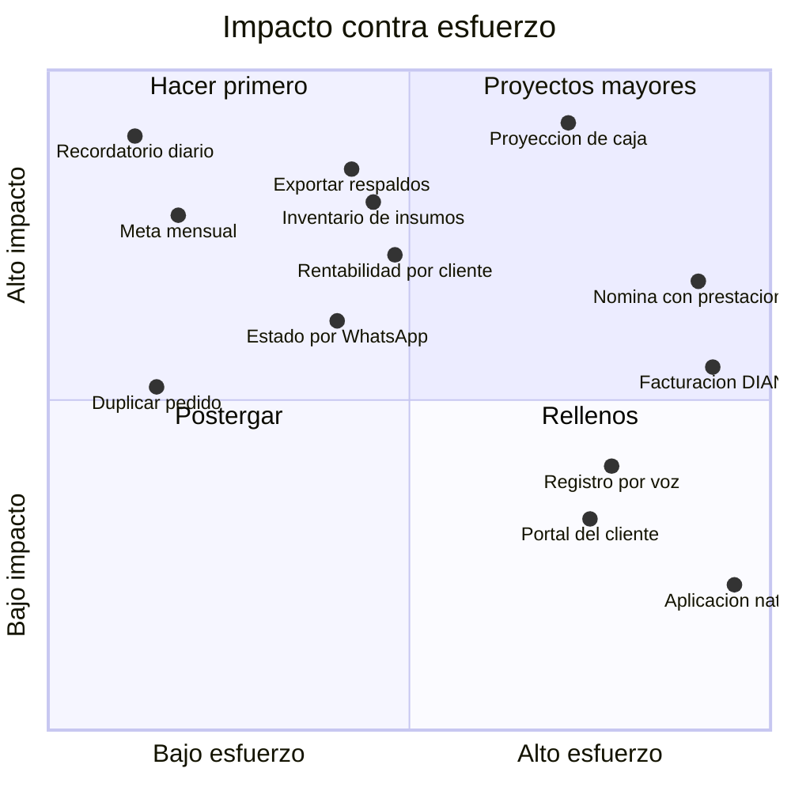

# 14 · Roadmap e ideas de valor

Todo lo que quedó fuera del MVP, más 30 ideas para después. Priorizado por **impacto sobre
esfuerzo**, no por qué tan llamativo suena.

---

## 1. Lo diferido explícitamente del MVP

| # | Tema | Por qué se difirió | Cuándo conviene |
|---|---|---|---|
| D-01 | Facturación electrónica DIAN | Decisión del negocio | Cuando se formalice y lo exija un cliente |
| D-02 | Parafiscales y seguridad social | Requiere formalización previa | Antes de contratar formalmente |
| D-03 | Escenarios jurídicos y factor prestacional | Diferido | Al decidir la figura jurídica |
| D-04 | Parámetros legales versionados por año | Diferido | Junto con D-02 |
| D-05 | Construcción del exportador de respaldos | Se diseñó, no se construyó | Mes 2 post go-live |
| D-06 | Procedimiento y simulacro de restauración | Fase posterior | Junto con D-05 |

> **Sobre D-03.** La figura jurídica tiene un efecto económico directo y considerable sobre el
> costo de emplear a alguien en Colombia. Cuando se retome el tema de la contratación formal,
> ese análisis debería hacerse **antes** de contratar, no después, y con un contador. No es un
> detalle administrativo: cambia la respuesta a la pregunta de si se puede contratar.

---

## 2. Las 30 ideas, priorizadas

### Fase A · Primeros 3 meses después del go-live

Alto impacto, esfuerzo bajo o medio. Son las que más rápido devuelven el trabajo invertido.

| # | Idea | Qué resuelve | Esfuerzo |
|---|---|---|:---:|
| 01 | **Exportación de respaldos** (D-05) | Independencia del proveedor | M |
| 02 | **Recordatorio diario de registro** | El riesgo número uno: que se deje de registrar | S |
| 03 | **Inventario de insumos con alerta de mínimos** | Quedarse sin DTF a mitad de un pedido | M |
| 04 | **Plantillas de gasto recurrente** | Arriendo y servicios en un toque | S |
| 05 | **Estado del pedido por WhatsApp al cliente** | Llamadas de "¿ya está listo?" | M |
| 06 | **Comparativo contra el mismo mes del año anterior** | Saber si se está creciendo de verdad | S |
| 07 | **Meta mensual de ventas con avance visible** | Convertir el punto de equilibrio en objetivo diario | S |
| 08 | **Duplicar un pedido anterior** | Clientes recurrentes con el mismo pedido | S |
| 09 | **Búsqueda global** | Encontrar un pedido o movimiento sin filtrar | S |
| 10 | **Calculadora de precio rápida** | Cotizar por teléfono sin abrir el cotizador | S |

### Fase B · Meses 4 a 9

Impacto alto, esfuerzo mayor. Requieren que el sistema ya tenga historia acumulada.

| # | Idea | Qué resuelve | Esfuerzo |
|---|---|---|:---:|
| 11 | **Proyección de caja a 30 y 60 días** | Ver un problema de liquidez antes de que llegue | L |
| 12 | **Análisis de rentabilidad por cliente** | Descubrir clientes que dan trabajo y poca plata | M |
| 13 | **Estacionalidad** | Anticipar regreso a clases y fin de año | M |
| 14 | **Presupuesto anual con seguimiento** | Planear en vez de solo registrar | L |
| 15 | **Alerta de producto vendido bajo costo** | Detectar de inmediato un precio desactualizado | S |
| 16 | **Lista de precios pública compartible** | Enviar precios sin cotizar uno por uno | M |
| 17 | **Historial de precios de insumos** | Ver cuánto subió el costo del mug en un año | M |
| 18 | **Registro por voz** | Registrar con las manos ocupadas en la prensa | L |
| 19 | **Lectura automática de recibos** | Eliminar la digitación de gastos | L |
| 20 | **Comisiones por venta** | Si alguien vende a comisión | M |

### Fase C · Año 2 en adelante

| # | Idea | Qué resuelve | Esfuerzo |
|---|---|---|:---:|
| 21 | **Facturación electrónica DIAN** (D-01) | Obligación legal al formalizarse | XL |
| 22 | **Nómina completa con prestaciones** (D-02, D-03, D-04) | Contratación formal | XL |
| 23 | **Módulo de producción con estados** | Seguimiento de pedidos en el taller | L |
| 24 | **Multi-sucursal** | Si se abre un segundo punto | L |
| 25 | **Portal del cliente** | Que el cliente consulte su pedido | L |
| 26 | **Integración con pasarela de pagos** | Cobrar anticipos por link | L |
| 27 | **Catálogo en línea con pedidos** | Vender sin intermediación | XL |
| 28 | **Programa de fidelización** | Retener clientes recurrentes | M |
| 29 | **Contabilidad formal exportable** | Entregar libros al contador | L |
| 30 | **Aplicación nativa** | Solo si la PWA resulta insuficiente | XL |

*Esfuerzo: S = días · M = 1-2 semanas · L = 3-5 semanas · XL = más de 6 semanas*

---

## 3. Matriz de priorización

---

## 4. Las cinco ideas que más valor darían

Si solo se pudieran construir cinco cosas después del MVP, estas serían.

### 4.1 Recordatorio diario de registro

**El riesgo número uno del proyecto no es técnico: es que se deje de registrar.** Un aviso a
una hora fija, con el resumen de lo registrado ese día, ataca directamente el modo en que estos
sistemas mueren. Es de los esfuerzos más pequeños y de los impactos más grandes.

### 4.2 Proyección de caja a 30 y 60 días

Hoy el sistema dice cuánta plata hay. Esto diría **cuánta va a haber**, cruzando pedidos por
entregar, anticipos comprometidos y gastos fijos conocidos. Permite ver un problema de liquidez
con un mes de anticipación en lugar de descubrirlo el día que no alcanza.

### 4.3 Inventario de insumos con alerta de mínimos

Quedarse sin transferencias DTF a mitad de un pedido cuesta tiempo, un viaje y a veces un
cliente. Con el costeo ya definido, el consumo por producto es conocido: el sistema puede
descontar automáticamente y avisar antes de que se acabe.

### 4.4 Análisis de rentabilidad por cliente

El sistema ya sabe el margen de cada pedido. Agruparlo por cliente revela algo que casi ningún
negocio ve: **qué clientes dan mucho trabajo y poca plata.** Suele ser información incómoda y
muy rentable; a veces la mejor decisión del año es dejar de atender a alguien.

### 4.5 Meta mensual con avance visible

El punto de equilibrio ya se calcula. Convertirlo en una meta con barra de avance transforma un
dato de reporte en un objetivo diario: *"vas en el 62% de lo que necesitas este mes."*

---

## 5. Ideas descartadas y por qué

Vale la pena dejar constancia de lo que se pensó y se decidió no hacer.

| Idea | Por qué se descarta |
|---|---|
| Contabilidad de partida doble completa | Complejidad enorme para un negocio de este tamaño; el modelo actual responde las mismas preguntas |
| Depreciación automática de activos | Sin efecto tributario en este alcance; agrega confusión sin agregar decisión |
| Multi-moneda | El negocio opera solo en pesos |
| Facturación recurrente | No hay suscripciones en el modelo de negocio |
| Aplicación de escritorio instalable | La PWA cubre el caso de uso con una fracción del esfuerzo |
| Chat interno entre roles | WhatsApp ya resuelve eso mejor |

---

## 6. Cómo entran ideas nuevas

Durante el desarrollo del MVP, **toda idea nueva se anota aquí, no se agrega al sprint en
curso.** Esa es la única defensa efectiva contra el crecimiento descontrolado del alcance, que
es la forma más común de que un proyecto de 26 semanas se convierta en uno de 45.

Al final de cada sprint se revisa esta lista y se decide si algo merece entrar al siguiente.
**La respuesta por defecto es no.**

---

### 🧭 Navegación

**⬅️ Anterior:** [13 · Respaldo y exportación](13-respaldo-y-exportacion.md)  ·  **🗂️ [Índice general](INDICE.md)**  ·  **Siguiente ➡️:** [15 · Glosario](15-glosario.md)
