# 23 · Diagramas de los casos de uso

| Versión | Estado | Creado | Actualizado | Etiquetas |
|---|---|---|---|---|
| [0.2.0](https://github.com/Juanchope039/Finanzas-PRISMA/commits/main/docs/23-diagramas-de-casos-de-uso.md "Historial de cambios") | [🔍 En revisión](22-documentacion.md#estados) | 2026-10-04 | 2026-10-04 | [Requisitos](INDICE.md#etiqueta-requisitos) · [Negocio](INDICE.md#etiqueta-negocio) · [Arquitectura](INDICE.md#etiqueta-arquitectura) |

Los 37 casos de uso dibujados, **dos veces cada uno**: una para quien dirige el negocio y una para
quien programa. Los pasos, los flujos alternativos y las reglas están en
[`02-casos-de-uso.md`](02-casos-de-uso.md); aquí está la misma cosa en forma de dibujo, y el anexo del [§5](#5-anexo-técnico-de-cada-caso-a-su-operación-sus-tablas-y-sus-pruebas) que amarra
cada caso con su operación del contrato.

> **Este documento no decide nada.** Si un dibujo y el 02 no coinciden, manda el 02; si el 02 y
> una regla financiera no coinciden, manda [`05-reglas-financieras.md`](05-reglas-financieras.md). Un diagrama es una vista,
> nunca una fuente.

---

## 1. Cómo se leen

**Cada caso de uso lleva dos diagramas, y responden preguntas distintas.**

| Diagrama | Para quién | Qué muestra |
|---|---|---|
| **Negocio** | Quien dirige y quien trabaja en el taller | Qué hace la persona, qué decide el sistema y en qué termina cada camino. Sin una sola palabra de tecnología |
| **Técnico** | Quien programa | El viaje de la petición: `prisma_front` → `prisma_api` → PostgreSQL, con la ruta del contrato, la función de negocio, el trigger y el código de respuesta |

**La notación del diagrama de negocio**, que es siempre la misma:

| Forma | Significa |
|---|---|
| Óvalo | Quién arranca: Gerencia, Operación o el propio sistema |
| Rectángulo | Un paso: alguien hace algo o el sistema hace algo |
| Rombo | Una decisión del sistema, con sus dos salidas |
| Paralelogramo | En qué termina: lo que queda escrito, o el rechazo con su motivo |

**Tres convenciones del diagrama técnico** que conviene saber antes de leer el primero:

- **Toda escritura pasa por `ConIdentidad`**, la única puerta a PostgreSQL: abre la transacción,
  le dice a la base quién pregunta y se vuelve `authenticated` ([ADR-012](adr/ADR-012-identidad-a-postgres.md)). En los diagramas es el
  primer mensaje a la base y no se repite en cada paso.
- **El rechazo por permiso lo dibuja la base, no la API.** Donde la flecha de vuelta sale de
  PostgreSQL, el permiso lo negó Row Level Security ([ADR-006](adr/ADR-006-rls-por-rol.md)); donde sale de la API, es una
  decisión que todavía está en la capa de aplicación, y el [§6](#6-las-negativas-que-no-vienen-de-la-base) dice cuáles son.
- **Toda respuesta viaja en el sobre `{status, mensaje, data}`** con su código de cinco dígitos
  ([ADR-019](adr/ADR-019-contrato-de-respuesta.md)). En los diagramas se escribe solo el código, que es lo que distingue un caso de otro.

---

## 2. El mapa: quién puede hacer qué

Siete mapas, uno por área del sistema. **La autorización que dibujan la impone PostgreSQL**, no la
pantalla: un caso que no sale del óvalo de Operación es un caso que la base le niega.

### 2.1 Acceso, usuarios y cargos

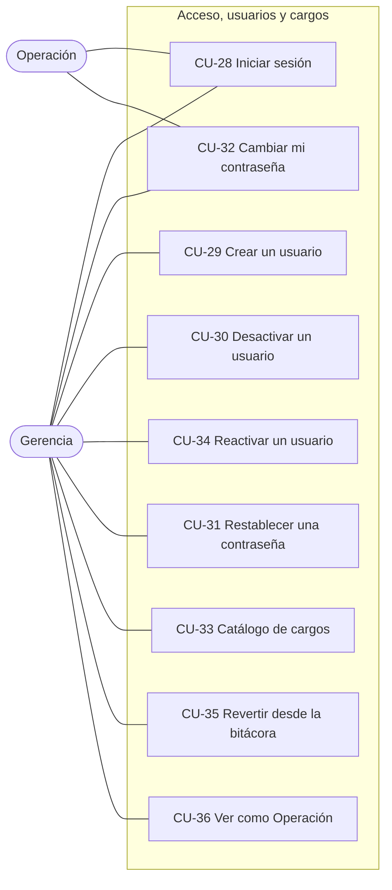
```mermaid
flowchart LR
    GER(["Gerencia"])
    OPE(["Operación"])

    subgraph acceso["Acceso, usuarios y cargos"]
        CU28["CU-28 Iniciar sesión"]
        CU32["CU-32 Cambiar mi contraseña"]
        CU29["CU-29 Crear un usuario"]
        CU30["CU-30 Desactivar un usuario"]
        CU34["CU-34 Reactivar un usuario"]
        CU31["CU-31 Restablecer una contraseña"]
        CU33["CU-33 Catálogo de cargos"]
        CU35["CU-35 Revertir desde la bitácora"]
        CU36["CU-36 Ver como Operación"]
    end

    GER --- CU28
    GER --- CU32
    GER --- CU29
    GER --- CU30
    GER --- CU34
    GER --- CU31
    GER --- CU33
    GER --- CU35
    GER --- CU36
    OPE --- CU28
    OPE --- CU32
```

### 2.2 Movimientos y cuentas

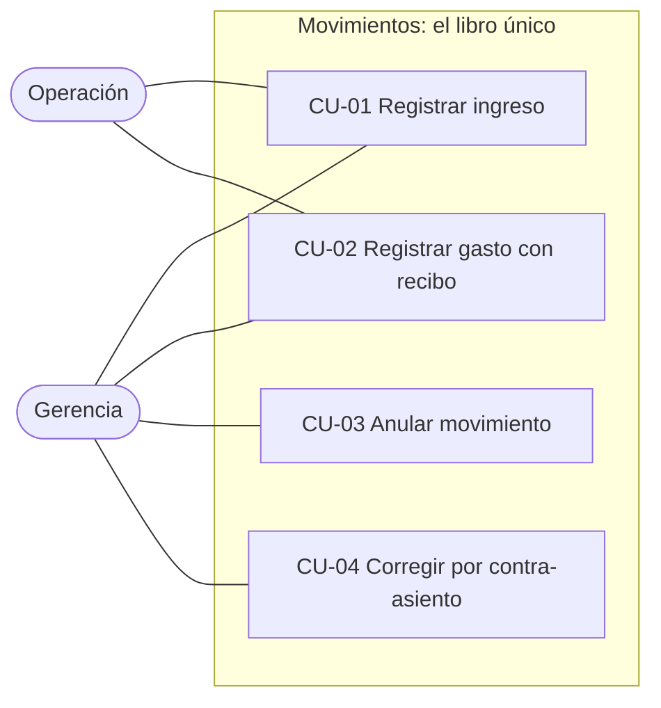
```mermaid
flowchart LR
    GER(["Gerencia"])
    OPE(["Operación"])

    subgraph libro["Movimientos: el libro único"]
        CU01["CU-01 Registrar ingreso"]
        CU02["CU-02 Registrar gasto con recibo"]
        CU03["CU-03 Anular movimiento"]
        CU04["CU-04 Corregir por contra-asiento"]
    end

    GER --- CU01
    GER --- CU02
    GER --- CU03
    GER --- CU04
    OPE --- CU01
    OPE --- CU02
```

### 2.3 Pedidos y clientes

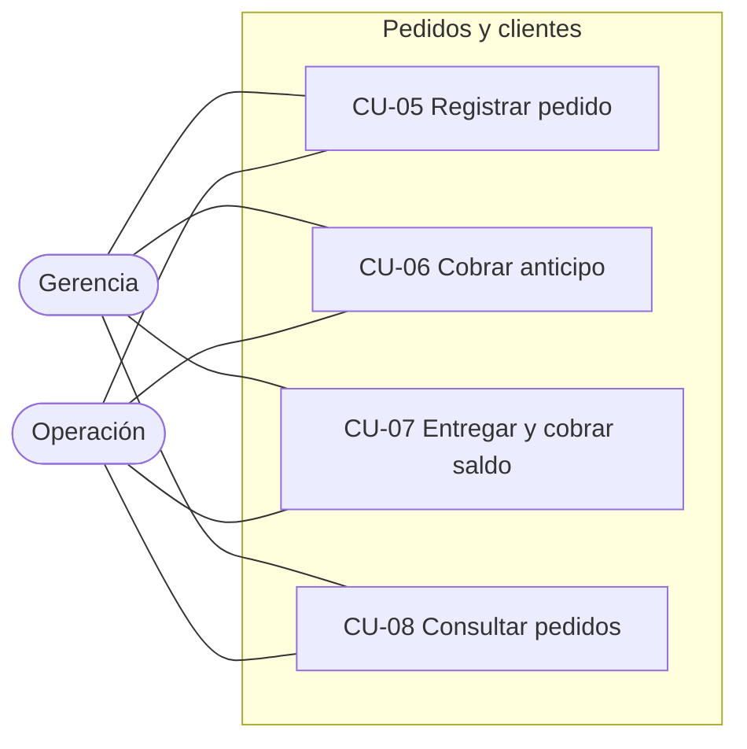
```mermaid
flowchart LR
    GER(["Gerencia"])
    OPE(["Operación"])

    subgraph pedidos["Pedidos y clientes"]
        CU05["CU-05 Registrar pedido"]
        CU06["CU-06 Cobrar anticipo"]
        CU07["CU-07 Entregar y cobrar saldo"]
        CU08["CU-08 Consultar pedidos"]
    end

    GER --- CU05
    GER --- CU06
    GER --- CU07
    GER --- CU08
    OPE --- CU05
    OPE --- CU06
    OPE --- CU07
    OPE --- CU08
```

### 2.4 Productos, costeo y cotizaciones

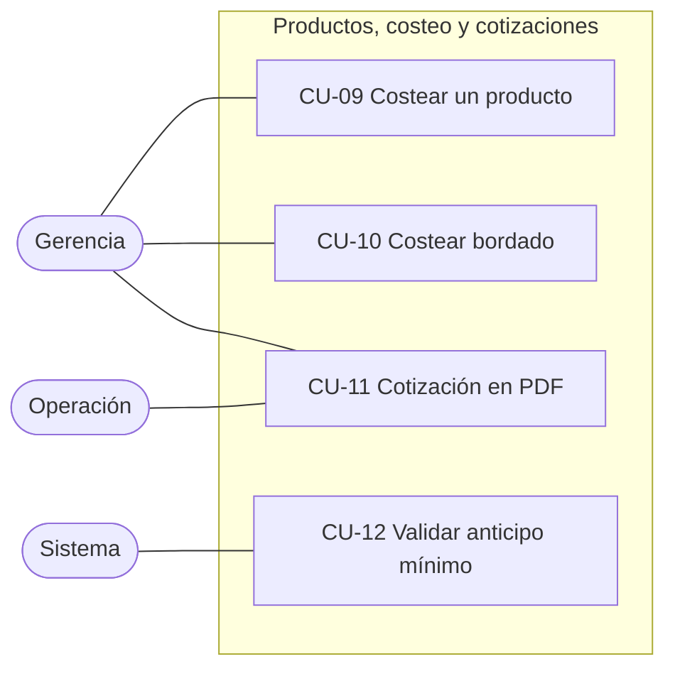
```mermaid
flowchart LR
    GER(["Gerencia"])
    OPE(["Operación"])
    SIS(["Sistema"])

    subgraph catalogo["Productos, costeo y cotizaciones"]
        CU09["CU-09 Costear un producto"]
        CU10["CU-10 Costear bordado"]
        CU11["CU-11 Cotización en PDF"]
        CU12["CU-12 Validar anticipo mínimo"]
    end

    GER --- CU09
    GER --- CU10
    GER --- CU11
    OPE --- CU11
    SIS --- CU12
```

### 2.5 Finanzas, capital y patrimonio

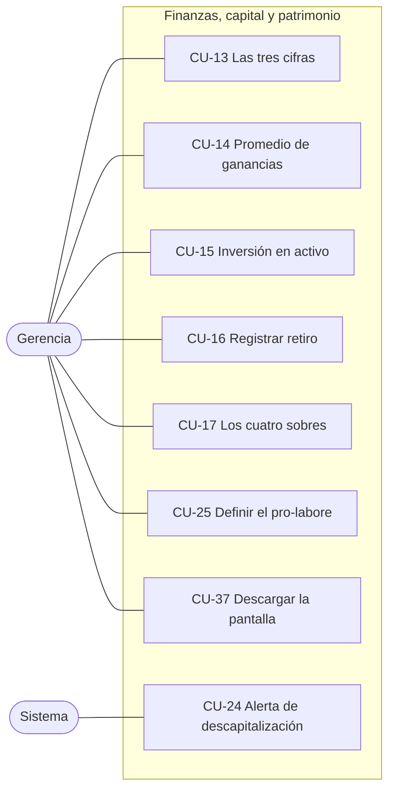
```mermaid
flowchart LR
    GER(["Gerencia"])
    SIS(["Sistema"])

    subgraph finanzas["Finanzas, capital y patrimonio"]
        CU13["CU-13 Las tres cifras"]
        CU14["CU-14 Promedio de ganancias"]
        CU15["CU-15 Inversión en activo"]
        CU16["CU-16 Registrar retiro"]
        CU17["CU-17 Los cuatro sobres"]
        CU25["CU-25 Definir el pro-labore"]
        CU37["CU-37 Descargar la pantalla"]
        CU24["CU-24 Alerta de descapitalización"]
    end

    GER --- CU13
    GER --- CU14
    GER --- CU15
    GER --- CU16
    GER --- CU17
    GER --- CU25
    GER --- CU37
    SIS --- CU24
```

### 2.6 Nómina y personal

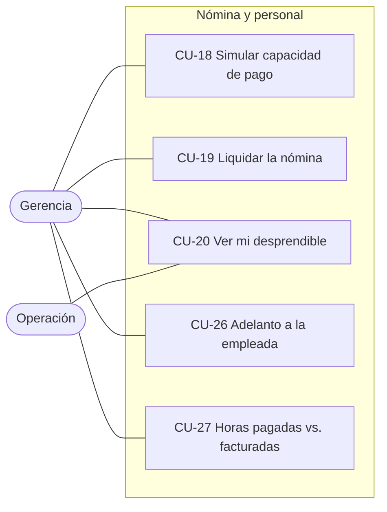
```mermaid
flowchart LR
    GER(["Gerencia"])
    OPE(["Operación"])

    subgraph nomina["Nómina y personal"]
        CU18["CU-18 Simular capacidad de pago"]
        CU19["CU-19 Liquidar la nómina"]
        CU20["CU-20 Ver mi desprendible"]
        CU26["CU-26 Adelanto a la empleada"]
        CU27["CU-27 Horas pagadas vs. facturadas"]
    end

    GER --- CU18
    GER --- CU19
    GER --- CU20
    GER --- CU26
    GER --- CU27
    OPE --- CU20
```

### 2.7 Datos del sistema

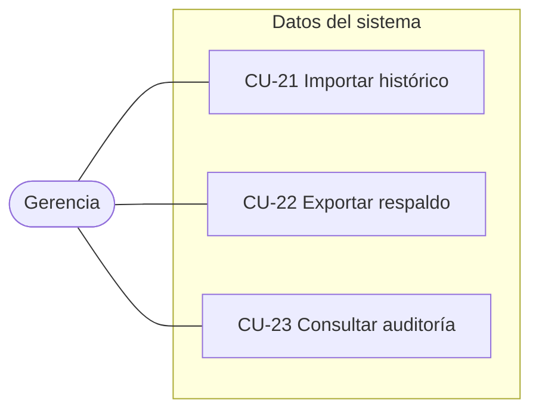
```mermaid
flowchart LR
    GER(["Gerencia"])

    subgraph datos["Datos del sistema"]
        CU21["CU-21 Importar histórico"]
        CU22["CU-22 Exportar respaldo"]
        CU23["CU-23 Consultar auditoría"]
    end

    GER --- CU21
    GER --- CU22
    GER --- CU23
```

---

## 3. Los estados que un caso de uso cambia

Cuatro cosas del sistema tienen estados, y saber de qué estado a cuál salta cada caso de uso
evita la mitad de las preguntas.

### 3.1 El pedido

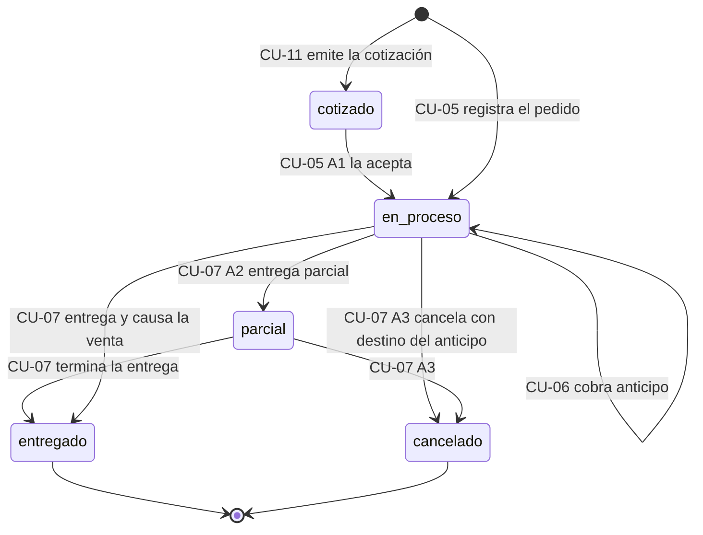
```mermaid
stateDiagram-v2
    [*] --> cotizado: CU-11 emite la cotización
    cotizado --> en_proceso: CU-05 A1 la acepta
    [*] --> en_proceso: CU-05 registra el pedido
    en_proceso --> en_proceso: CU-06 cobra anticipo
    en_proceso --> parcial: CU-07 A2 entrega parcial
    parcial --> entregado: CU-07 termina la entrega
    en_proceso --> entregado: CU-07 entrega y causa la venta
    en_proceso --> cancelado: CU-07 A3 cancela con destino del anticipo
    parcial --> cancelado: CU-07 A3
    entregado --> [*]
    cancelado --> [*]
```

**`entregado` y `cancelado` son finales.** Lo que haya que corregir después va por contra-asiento
([CU-04](02-casos-de-uso.md#cu-04)), nunca editando el pedido.

### 3.2 El período de nómina

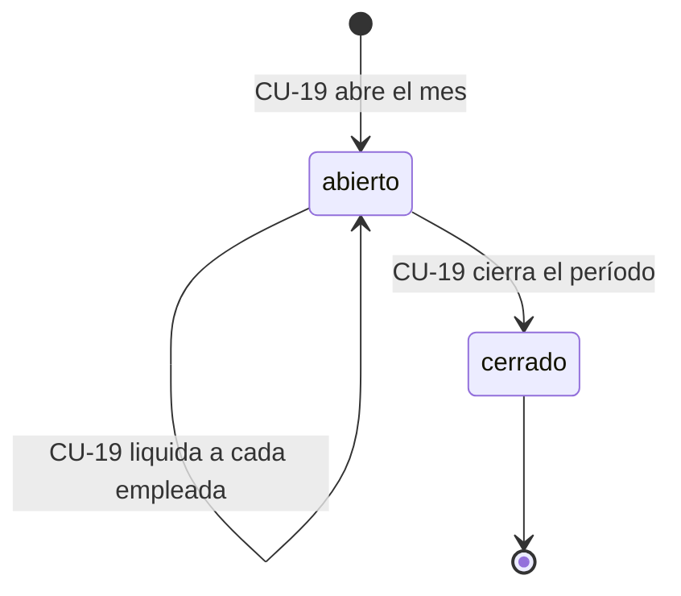
```mermaid
stateDiagram-v2
    [*] --> abierto: CU-19 abre el mes
    abierto --> abierto: CU-19 liquida a cada empleada
    abierto --> cerrado: CU-19 cierra el período
    cerrado --> [*]
```

**Desde el cierre no entra ninguna liquidación más.** Una empleada que faltó se corrige por
contra-asiento, no reabriendo el mes.

### 3.3 El usuario

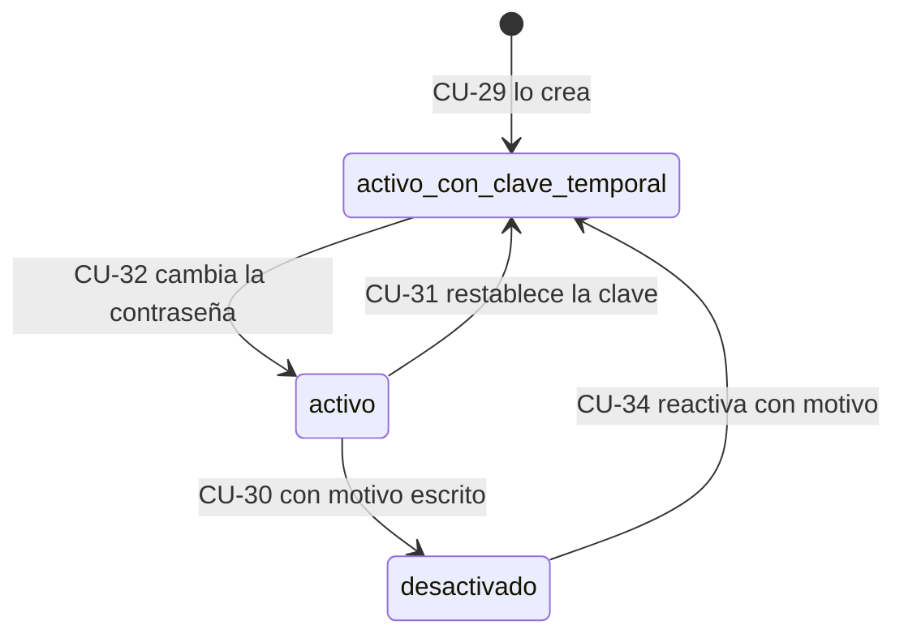
```mermaid
stateDiagram-v2
    [*] --> activo_con_clave_temporal: CU-29 lo crea
    activo_con_clave_temporal --> activo: CU-32 cambia la contraseña
    activo --> activo_con_clave_temporal: CU-31 restablece la clave
    activo --> desactivado: CU-30 con motivo escrito
    desactivado --> activo_con_clave_temporal: CU-34 reactiva con motivo
```

**No hay estado «borrado»**, y la última Gerencia activa no sale de `activo`: lo impide un trigger
de la base de datos ([RF-82](03-requisitos-y-bdd.md#rf-82), [RN-19](03-requisitos-y-bdd.md#rn-19)).

### 3.4 El movimiento

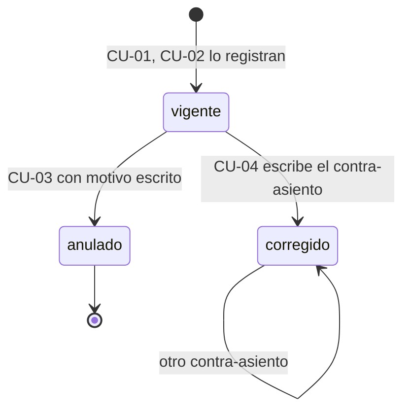
```mermaid
stateDiagram-v2
    [*] --> vigente: CU-01, CU-02 lo registran
    vigente --> anulado: CU-03 con motivo escrito
    vigente --> corregido: CU-04 escribe el contra-asiento
    corregido --> corregido: otro contra-asiento
    anulado --> [*]
```

**`corregido` no es un estado de la fila: es un vínculo.** El movimiento errado sigue vigente y el
contra-asiento apunta a él; los dos se leen en el libro ([04 §5.3](04-modelo-de-datos.md#53-corrección-por-contra-asiento)).

---
## 4. Los 37 casos, uno por uno

### CU-01 · Registrar ingreso

**Negocio**

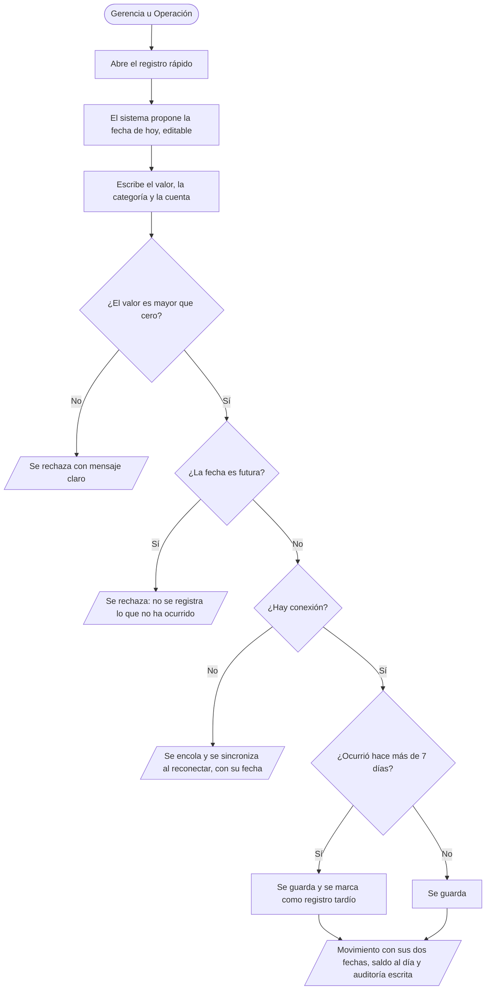
```mermaid
flowchart TD
    A(["Gerencia u Operación"]) --> B["Abre el registro rápido"]
    B --> C["El sistema propone la fecha de hoy, editable"]
    C --> D["Escribe el valor, la categoría y la cuenta"]
    D --> E{"¿El valor es mayor que cero?"}
    E -- No --> E1[/"Se rechaza con mensaje claro"/]
    E -- Sí --> F{"¿La fecha es futura?"}
    F -- Sí --> F1[/"Se rechaza: no se registra lo que no ha ocurrido"/]
    F -- No --> G{"¿Hay conexión?"}
    G -- No --> G1[/"Se encola y se sincroniza al reconectar, con su fecha"/]
    G -- Sí --> H{"¿Ocurrió hace más de 7 días?"}
    H -- Sí --> I["Se guarda y se marca como registro tardío"]
    H -- No --> J["Se guarda"]
    I --> K[/"Movimiento con sus dos fechas, saldo al día y auditoría escrita"/]
    J --> K
```

**Técnico**

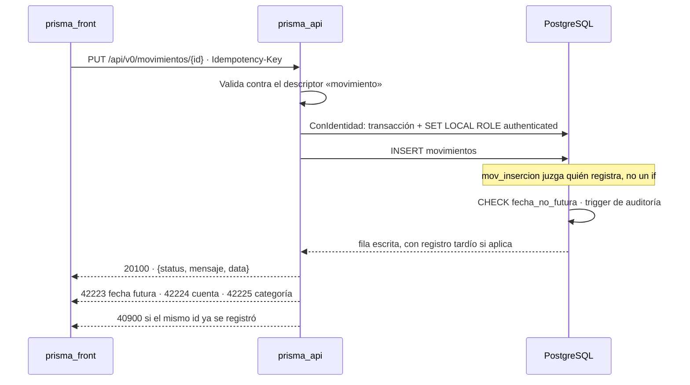
```mermaid
sequenceDiagram
    participant F as prisma_front
    participant A as prisma_api
    participant D as PostgreSQL
    F->>A: PUT /api/v0/movimientos/{id} · Idempotency-Key
    A->>A: Valida contra el descriptor «movimiento»
    A->>D: ConIdentidad: transacción + SET LOCAL ROLE authenticated
    A->>D: INSERT movimientos
    Note over D: mov_insercion juzga quién registra, no un if
    D->>D: CHECK fecha_no_futura · trigger de auditoría
    D-->>A: fila escrita, con registro tardío si aplica
    A-->>F: 20100 · {status, mensaje, data}
    A-->>F: 42223 fecha futura · 42224 cuenta · 42225 categoría
    A-->>F: 40900 si el mismo id ya se registró
```

### CU-02 · Registrar gasto con recibo

**Negocio**

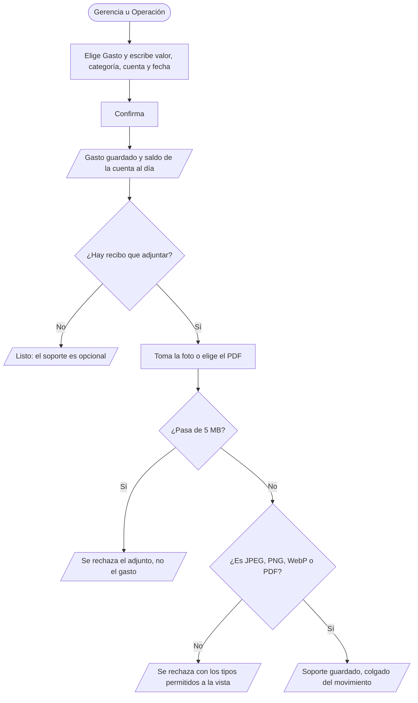
```mermaid
flowchart TD
    A(["Gerencia u Operación"]) --> B["Elige Gasto y escribe valor, categoría, cuenta y fecha"]
    B --> C["Confirma"]
    C --> D[/"Gasto guardado y saldo de la cuenta al día"/]
    D --> E{"¿Hay recibo que adjuntar?"}
    E -- No --> F[/"Listo: el soporte es opcional"/]
    E -- Sí --> G["Toma la foto o elige el PDF"]
    G --> H{"¿Pasa de 5 MB?"}
    H -- Sí --> H1[/"Se rechaza el adjunto, no el gasto"/]
    H -- No --> I{"¿Es JPEG, PNG, WebP o PDF?"}
    I -- No --> I1[/"Se rechaza con los tipos permitidos a la vista"/]
    I -- Sí --> J[/"Soporte guardado, colgado del movimiento"/]
```

**Técnico**

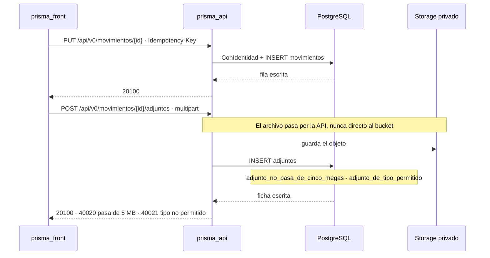
```mermaid
sequenceDiagram
    participant F as prisma_front
    participant A as prisma_api
    participant D as PostgreSQL
    participant S as Storage privado
    F->>A: PUT /api/v0/movimientos/{id} · Idempotency-Key
    A->>D: ConIdentidad + INSERT movimientos
    D-->>A: fila escrita
    A-->>F: 20100
    F->>A: POST /api/v0/movimientos/{id}/adjuntos · multipart
    Note over A,S: El archivo pasa por la API, nunca directo al bucket
    A->>S: guarda el objeto
    A->>D: INSERT adjuntos
    Note over D: adjunto_no_pasa_de_cinco_megas · adjunto_de_tipo_permitido
    D-->>A: ficha escrita
    A-->>F: 20100 · 40020 pasa de 5 MB · 40021 tipo no permitido
```

### CU-03 · Anular movimiento errado

**Negocio**

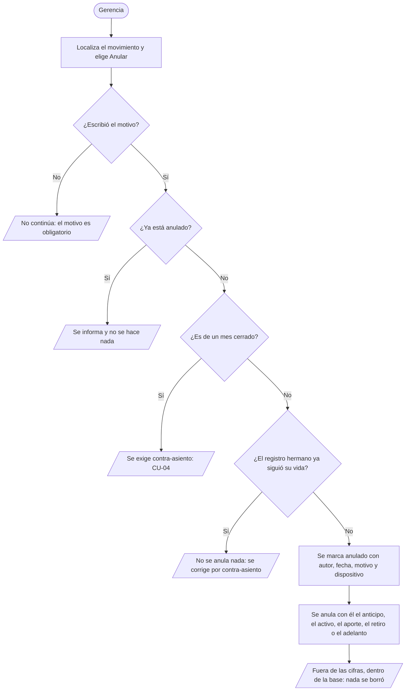
```mermaid
flowchart TD
    A(["Gerencia"]) --> B["Localiza el movimiento y elige Anular"]
    B --> C{"¿Escribió el motivo?"}
    C -- No --> C1[/"No continúa: el motivo es obligatorio"/]
    C -- Sí --> D{"¿Ya está anulado?"}
    D -- Sí --> D1[/"Se informa y no se hace nada"/]
    D -- No --> E{"¿Es de un mes cerrado?"}
    E -- Sí --> E1[/"Se exige contra-asiento: CU-04"/]
    E -- No --> F{"¿El registro hermano ya siguió su vida?"}
    F -- Sí --> F1[/"No se anula nada: se corrige por contra-asiento"/]
    F -- No --> G["Se marca anulado con autor, fecha, motivo y dispositivo"]
    G --> H["Se anula con él el anticipo, el activo, el aporte, el retiro o el adelanto"]
    H --> I[/"Fuera de las cifras, dentro de la base: nada se borró"/]
```

**Técnico**

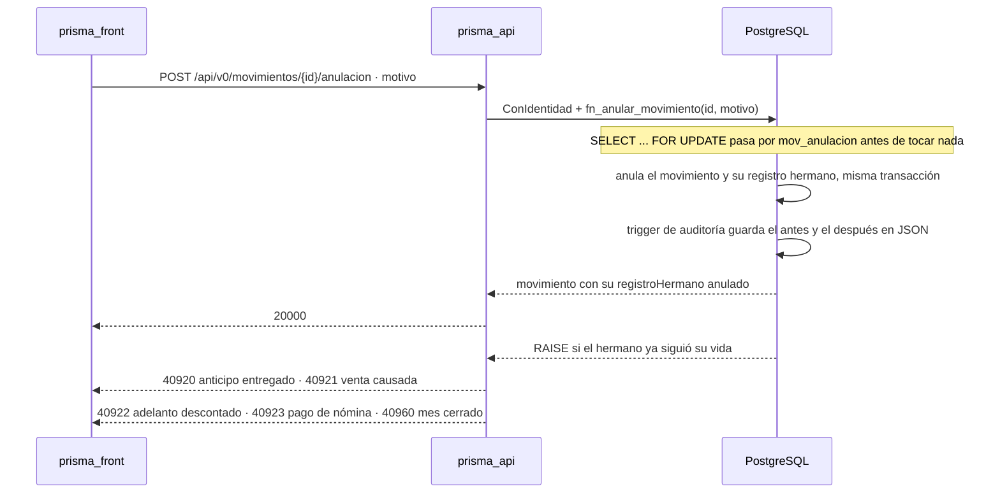
```mermaid
sequenceDiagram
    participant F as prisma_front
    participant A as prisma_api
    participant D as PostgreSQL
    F->>A: POST /api/v0/movimientos/{id}/anulacion · motivo
    A->>D: ConIdentidad + fn_anular_movimiento(id, motivo)
    Note over D: SELECT ... FOR UPDATE pasa por mov_anulacion antes de tocar nada
    D->>D: anula el movimiento y su registro hermano, misma transacción
    D->>D: trigger de auditoría guarda el antes y el después en JSON
    D-->>A: movimiento con su registroHermano anulado
    A-->>F: 20000
    D-->>A: RAISE si el hermano ya siguió su vida
    A-->>F: 40920 anticipo entregado · 40921 venta causada
    A-->>F: 40922 adelanto descontado · 40923 pago de nómina · 40960 mes cerrado
```

### CU-04 · Corregir por contra-asiento

**Negocio**

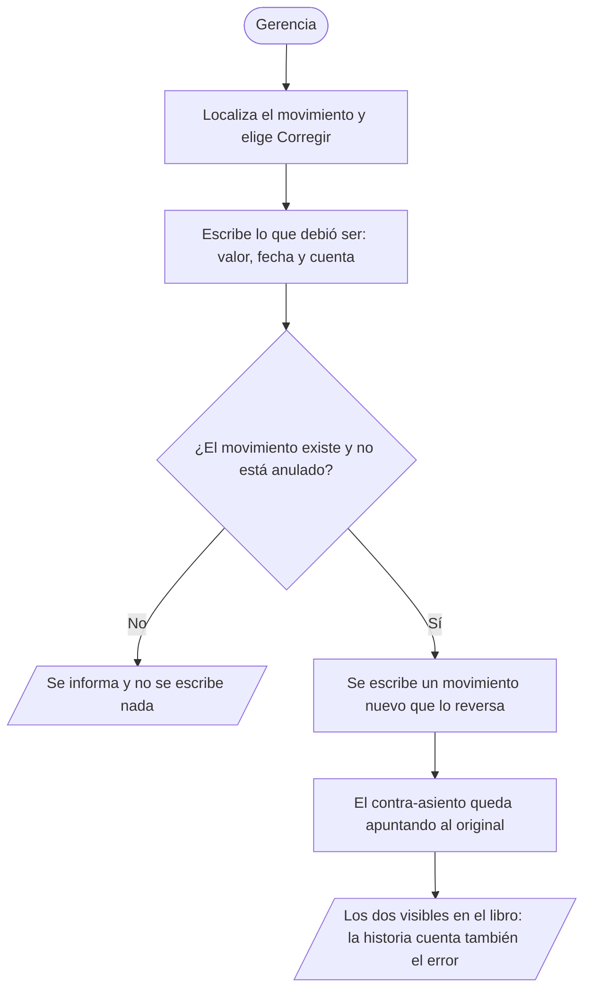
```mermaid
flowchart TD
    A(["Gerencia"]) --> B["Localiza el movimiento y elige Corregir"]
    B --> C["Escribe lo que debió ser: valor, fecha y cuenta"]
    C --> D{"¿El movimiento existe y no está anulado?"}
    D -- No --> D1[/"Se informa y no se escribe nada"/]
    D -- Sí --> E["Se escribe un movimiento nuevo que lo reversa"]
    E --> F["El contra-asiento queda apuntando al original"]
    F --> G[/"Los dos visibles en el libro: la historia cuenta también el error"/]
```

**Técnico**

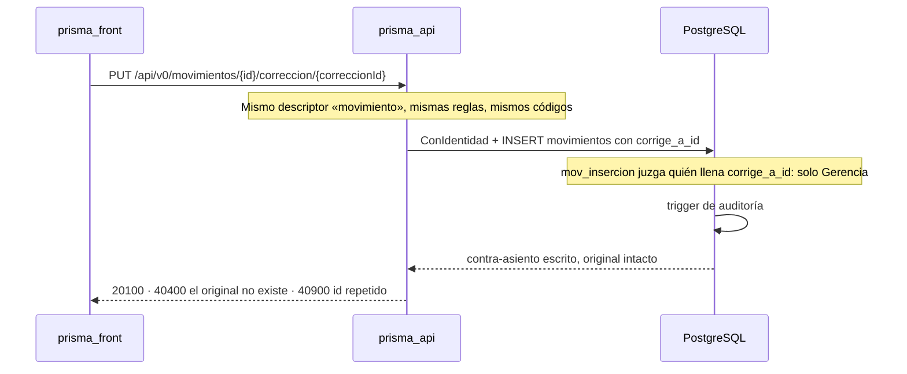
```mermaid
sequenceDiagram
    participant F as prisma_front
    participant A as prisma_api
    participant D as PostgreSQL
    F->>A: PUT /api/v0/movimientos/{id}/correccion/{correccionId}
    Note over A: Mismo descriptor «movimiento», mismas reglas, mismos códigos
    A->>D: ConIdentidad + INSERT movimientos con corrige_a_id
    Note over D: mov_insercion juzga quién llena corrige_a_id: solo Gerencia
    D->>D: trigger de auditoría
    D-->>A: contra-asiento escrito, original intacto
    A-->>F: 20100 · 40400 el original no existe · 40900 id repetido
```

### CU-05 · Registrar pedido de venta

**Negocio**

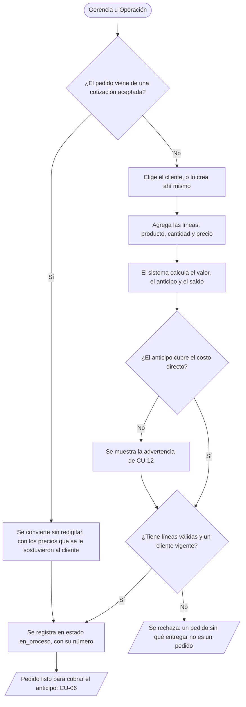
```mermaid
flowchart TD
    A(["Gerencia u Operación"]) --> B{"¿El pedido viene de una cotización aceptada?"}
    B -- Sí --> B1["Se convierte sin redigitar, con los precios que se le sostuvieron al cliente"]
    B1 --> H
    B -- No --> C["Elige el cliente, o lo crea ahí mismo"]
    C --> D["Agrega las líneas: producto, cantidad y precio"]
    D --> E["El sistema calcula el valor, el anticipo y el saldo"]
    E --> F{"¿El anticipo cubre el costo directo?"}
    F -- No --> F1["Se muestra la advertencia de CU-12"]
    F1 --> G
    F -- Sí --> G{"¿Tiene líneas válidas y un cliente vigente?"}
    G -- No --> G1[/"Se rechaza: un pedido sin qué entregar no es un pedido"/]
    G -- Sí --> H["Se registra en estado en_proceso, con su número"]
    H --> I[/"Pedido listo para cobrar el anticipo: CU-06"/]
```

**Técnico**

```mermaid
sequenceDiagram
    participant F as prisma_front
    participant A as prisma_api
    participant D as PostgreSQL
    F->>A: POST /api/v0/consultas/resumen-de-pedido
    A-->>F: valor, anticipo y saldo, calculados por la API
    F->>A: PUT /api/v0/pedidos/{id} · Idempotency-Key
    Note over A: El valor total sale de las líneas: el front no calcula plata
    A->>D: ConIdentidad + INSERT pedidos + pedido_lineas
    D-->>A: pedido en_proceso con su número
    A-->>F: 20100 · 42231 líneas inválidas · 42232 cliente inexistente
    F->>A: POST /api/v0/pedidos/{id}/adjuntos · la factura, opcional
```

### CU-06 · Cobrar anticipo

**Negocio**

```mermaid
flowchart TD
    A(["Gerencia u Operación"]) --> B["Sobre un pedido en proceso, registra el anticipo"]
    B --> C["Indica valor, cuenta de destino y fecha"]
    C --> D{"¿El pedido está en proceso?"}
    D -- No --> D1[/"Se rechaza: en otro estado no se cobra anticipo"/]
    D -- Sí --> E{"¿Supera el valor del pedido?"}
    E -- Sí --> E1[/"Se rechaza"/]
    E -- No --> F["Sube la caja de la cuenta indicada"]
    F --> G["Registra un pasivo por el mismo valor"]
    G --> H[/"No hay ingreso ni utilidad: es una deuda con el cliente"/]
```

**Técnico**

```mermaid
sequenceDiagram
    participant F as prisma_front
    participant A as prisma_api
    participant D as PostgreSQL
    F->>A: POST /api/v0/pedidos/{id}/anticipos · Idempotency-Key
    A->>D: ConIdentidad + INSERT anticipos + movimientos
    Note over D: tipo anticipo_recibido: sube caja, no toca utilidad
    D->>D: el anticipo queda por devengar hasta la entrega
    D-->>A: anticipo y movimiento escritos
    A-->>F: 20100 · 40930 el pedido no está en proceso
    A-->>F: 42230 el anticipo supera el valor del pedido
```

### CU-07 · Entregar pedido y cobrar saldo

**Negocio**

```mermaid
flowchart TD
    A(["Gerencia u Operación"]) --> B["Marca el pedido como entregado y pone la fecha"]
    B --> C{"¿El pedido ya está entregado o cancelado?"}
    C -- Sí --> C1[/"Se rechaza: entregado es final"/]
    C -- No --> D{"¿Se cobra el saldo?"}
    D -- No --> D1["Se causa la venta igual y queda cuenta por cobrar"]
    D -- Sí --> E["Sube la caja por el saldo cobrado"]
    D1 --> F
    E --> F["Se causa el ingreso por el valor total, con la fecha de entrega"]
    F --> G["Se libera el pasivo de anticipos por devengar"]
    G --> H[/"La utilidad del mes de entrega refleja el pedido completo"/]
```

**Técnico**

```mermaid
sequenceDiagram
    participant F as prisma_front
    participant A as prisma_api
    participant D as PostgreSQL
    F->>A: POST /api/v0/pedidos/{id}/entrega · fecha y cuenta
    A->>D: ConIdentidad + fn_entregar_pedido(pedido, fecha, cuenta)
    Note over D: Las cinco cosas en una sola transacción, o ninguna
    D->>D: SELECT ... FOR UPDATE cierra la carrera de dos entregas
    D->>D: estado entregado + fecha_entrega_real
    D->>D: devenga los anticipos vigentes
    D->>D: INSERT movimientos por el saldo, no por el total
    D-->>A: pedido entregado
    A-->>F: 20000 · 40931 ya entregado o cancelado · 42234 fecha futura
```

### CU-08 · Consultar pedidos por fecha

**Negocio**

```mermaid
flowchart TD
    A(["Gerencia u Operación"]) --> B["Abre Pedidos"]
    B --> C["Filtra por estado, cliente o rango de fechas"]
    C --> D["El sistema ordena por fecha, los más recientes primero"]
    D --> E{"¿Hay anticipo cobrado y 15 días o más sin entregar?"}
    E -- Sí --> E1["Se resalta como pendiente crítico"]
    E -- No --> F["Fila normal"]
    E1 --> G[/"Listado con lo anticipado, el saldo y lo estancado a la vista"/]
    F --> G
```

**Técnico**

```mermaid
sequenceDiagram
    participant F as prisma_front
    participant A as prisma_api
    participant D as PostgreSQL
    F->>A: POST /api/v0/consultas/pedidos · filtros
    A->>D: ConIdentidad + SELECT pedidos con sus líneas y anticipos
    D-->>A: filas que la sesión puede ver
    A->>A: calcula lo anticipado, el saldo y si está estancado
    Note over A: El front no calcula plata ni decide qué resaltar
    A-->>F: 20000 · los anulados no salen salvo que se pidan
```

### CU-09 · Costear un producto

**Negocio**

```mermaid
flowchart TD
    A(["Gerencia"]) --> B{"¿Hay pro-labore definido?"}
    B -- No --> B1[/"Se bloquea: sin tarifa por hora el margen mentiría. CU-25"/]
    B -- Sí --> C["Da de alta el producto con su unidad y su precio"]
    C --> D["Escribe el costeo: insumo, consumibles y tiempo"]
    D --> E["El sistema congela la tarifa por hora del pro-labore vigente"]
    E --> F["Pinta en vivo el costo, los tres márgenes y el precio sugerido"]
    F --> G["Confirma: la ficha y su primer costeo caen juntos"]
    G --> H{"¿Después cambia el costo o el precio?"}
    H -- Sí --> H1["Se agrega una fila nueva de costeo con la fecha de hoy"]
    H -- No --> I[/"Producto con su costeo vigente y su historial intacto"/]
    H1 --> I
```

**Técnico**

```mermaid
sequenceDiagram
    participant F as prisma_front
    participant A as prisma_api
    participant D as PostgreSQL
    F->>A: POST /api/v0/consultas/costeo · vista previa, no escribe
    A-->>F: 20000 costo, márgenes y precio sugerido · 40940 sin pro-labore
    F->>A: PUT /api/v0/productos/{id} · Idempotency-Key
    A->>D: ConIdentidad + INSERT productos + costos_producto
    Note over D: Una sola transacción: las dos filas, o ninguna
    D-->>A: producto con su costeo
    A-->>F: 20100 · 42240 decimales del tiempo de trabajo
    F->>A: POST /api/v0/consultas/productos
    Note over D: costos_producto lleva RLS: a Operación no le devuelve esas filas
    A-->>F: 20000 sin costeo ni márgenes para Operación
```

### CU-10 · Costear servicio de bordado

**Negocio**

```mermaid
flowchart TD
    A(["Gerencia"]) --> B["Escribe por separado el tiempo de persona y el de máquina"]
    B --> C["El costo carga solo el tiempo de persona"]
    C --> D{"¿Hay tiempo de máquina?"}
    D -- Sí --> E["El margen por hora se divide entre el tiempo de máquina"]
    D -- No --> F["El margen por hora se divide entre el tiempo de persona"]
    E --> G[/"El servicio se compara con el resto del taller por lo que ocupa"/]
    F --> G
```

**Técnico**

```mermaid
sequenceDiagram
    participant F as prisma_front
    participant A as prisma_api
    participant D as PostgreSQL
    F->>A: POST /api/v0/consultas/costeo · tiempoTrabajo y tiempoMaquina
    Note over A: La máquina no cobra sueldo: su energía ya está en los consumibles
    A-->>F: 20000 costo sin el tiempo de máquina
    A-->>F: 42241 el tiempo de máquina lleva más de dos decimales
    F->>A: PUT /api/v0/productos/{id}
    A->>D: ConIdentidad + INSERT productos + costos_producto con los dos tiempos
    D-->>A: costeo escrito
    A-->>F: 20100
```

### CU-11 · Generar cotización PDF

**Negocio**

```mermaid
flowchart TD
    A(["Gerencia u Operación"]) --> B["Arma las líneas en el Cotizador"]
    B --> C["Indica hasta cuándo vale"]
    C --> D{"¿Tiene líneas y la validez es posterior a hoy?"}
    D -- No --> D1[/"Se rechaza: nacería vacía o vencida"/]
    D -- Sí --> E["Se emite con su número y su valor calculado"]
    E --> F["Se genera el PDF con el logo, sin costos ni márgenes"]
    F --> G[/"Listo para pasarlo por WhatsApp"/]
    G --> H{"¿El cliente la acepta?"}
    H -- Sí --> H1[/"Se convierte en pedido sin redigitar: CU-05 A1"/]
    H -- No --> H2[/"Se vence o se anula; para volver se emite otra"/]
```

**Técnico**

```mermaid
sequenceDiagram
    participant F as prisma_front
    participant A as prisma_api
    participant D as PostgreSQL
    F->>A: PUT /api/v0/cotizaciones/{id} · Idempotency-Key
    A->>D: ConIdentidad + INSERT cotizaciones + cotizacion_lineas
    A-->>F: 20100 · 42280 sin líneas · 42281 validez anterior a la emisión
    F->>A: POST /api/v0/cotizaciones/{id}/documento
    A-->>F: 20000 Documento en base64, dentro del sobre · 40981 anulada
    F->>A: POST /api/v0/cotizaciones/{id}/aceptacion
    A->>D: crea el pedido con las mismas líneas y los mismos precios
    A-->>F: 20100 pedido en_proceso · 40980 ya aceptada
    F->>A: POST /api/v0/pedidos/{id}/remision · al entregar
```

### CU-12 · Validar anticipo mínimo *(automático)*

**Negocio**

```mermaid
flowchart TD
    A(["Sistema"]) --> B["Se dispara al cotizar o al registrar un pedido"]
    B --> C["Calcula el costo directo de las líneas al costo vigente"]
    C --> D{"¿Todos los productos tienen costo registrado?"}
    D -- No --> D1[/"No responde: sin costo la cifra mentiría"/]
    D -- Sí --> E["Lo divide entre el valor total y lo compara con el anticipo"]
    E --> F{"¿El anticipo cubre el costo directo?"}
    F -- Sí --> F1[/"Sin advertencia"/]
    F -- No --> G[/"Avisa el faltante en pesos y sugiere un porcentaje, redondeado a múltiplo de 5"/]
```

**Técnico**

```mermaid
sequenceDiagram
    participant F as prisma_front
    participant A as prisma_api
    participant D as PostgreSQL
    F->>A: POST /api/v0/consultas/anticipo-minimo · líneas y anticipoPct
    A->>D: ConIdentidad + SELECT costos_producto vigentes
    Note over D: A Operación RLS no le devuelve el costo, así que tampoco hay cifra
    D-->>A: costos, o ninguno
    A->>A: costo directo / valor total, con 5 puntos de holgura
    A-->>F: 20000 faltante y porcentaje sugerido
    A-->>F: 40982 un producto de las líneas no tiene costo registrado
```

### CU-13 · Ver utilidad, caja y caja libre

**Negocio**

```mermaid
flowchart TD
    A(["Gerencia"]) --> B["Abre el Inicio"]
    B --> C["El sistema trae el panel entero en una sola consulta"]
    C --> D["Utilidad causada: lo que el negocio ganó"]
    C --> E["Movimiento de caja: la plata que entró y salió"]
    C --> F["Caja libre: lo que de verdad se puede comprometer"]
    F --> G{"¿La caja libre es negativa?"}
    G -- Sí --> G1[/"Alerta roja, aunque el mes sea rentable"/]
    G -- No --> H[/"Las tres cifras conciliadas, con los sobres y los pendientes"/]
    H --> I{"¿Terminó el mes?"}
    I -- Sí --> J["Gerencia lo cierra y el sistema congela el snapshot"]
    J --> K[/"Mes cerrado: de ahí salen sus reportes, y ya no se recalcula"/]
```

**Técnico**

```mermaid
sequenceDiagram
    participant F as prisma_front
    participant A as prisma_api
    participant D as PostgreSQL
    F->>A: POST /api/v0/consultas/tablero · año y mes
    Note over A: Va junto y no en seis llamadas: juntarlas sería que el front decidiera
    A->>D: ConIdentidad + lee movimientos, pedidos, anticipos, sobres
    D-->>A: filas del período
    A->>A: las tres cifras, las alertas y la línea que las concilia
    A-->>F: 20000 · 40300 hoy lo niega la API, no la base · 42260 período inválido
    F->>A: PUT /api/v0/cierres/{id} · al terminar el mes
    A->>D: calcula las once cifras y las escribe en cierres_mensuales
    Note over D: La tabla no admite UPDATE: el snapshot es inmutable
    A-->>F: 20100 · 40960 el mes ya está cerrado · 40961 el mes no ha terminado
```

### CU-14 · Ver promedio de ganancias

**Negocio**

```mermaid
flowchart TD
    A(["Gerencia"]) --> B["Abre Reportes"]
    B --> C["Ve el año mes a mes: ingresos, costos, gastos, utilidad y margen"]
    C --> D{"¿El mes está cerrado?"}
    D -- Sí --> D1["Sale de su snapshot y no se recalcula"]
    D -- No --> D2["Se calcula con lo que hay hasta hoy"]
    D1 --> E{"¿Hay al menos un mes cerrado?"}
    D2 --> E
    E -- No --> E1[/"El promedio falta, y la pantalla explica por qué"/]
    E -- Sí --> F[/"Promedio mensual, proyección anual y punto de equilibrio"/]
```

**Técnico**

```mermaid
sequenceDiagram
    participant F as prisma_front
    participant A as prisma_api
    participant D as PostgreSQL
    F->>A: POST /api/v0/consultas/reporte · año
    A->>D: ConIdentidad + SELECT cierres_mensuales de los meses cerrados
    A->>D: calcula los meses abiertos con el libro
    D-->>A: doce meses
    A->>A: promedio, proyección y equilibrio, y cada mes con y sin pro-labore
    A-->>F: 20000 · el promedio y el equilibrio «faltan» en vez de llegar en cero
    A-->>F: 40300 hoy lo niega la API · 42260 período inválido
```

### CU-15 · Registrar inversión en activo

**Negocio**

```mermaid
flowchart TD
    A(["Gerencia"]) --> B["Registra el equipo: qué es, cuánto costó y la fecha"]
    B --> C{"¿Indica la cuenta de donde salió la plata?"}
    C -- No --> C1["Solo se escribe el activo: es un equipo que el taller ya tenía"]
    C -- Sí --> D["Se escriben el activo y un movimiento de inversión"]
    D --> E["Baja la caja de esa cuenta"]
    E --> F[/"La utilidad no se mueve: se cambió plata por una cosa que vale lo mismo"/]
    C1 --> G[/"El activo suma en el patrimonio"/]
    F --> G
```

**Técnico**

```mermaid
sequenceDiagram
    participant F as prisma_front
    participant A as prisma_api
    participant D as PostgreSQL
    F->>A: PUT /api/v0/activos/{id} · Idempotency-Key
    A->>D: ConIdentidad + INSERT activos (+ movimientos tipo inversion si hay cuenta)
    Note over D: activos_solo_gerencia: a Operación la base le niega escribir y leer
    D-->>A: activo escrito
    A-->>F: 20100 · 42290 fecha futura · 42291 cuenta que no sirve
    F->>A: PUT /api/v0/aportes/{id} · el camino hermano
    Note over D: tipo aporte: sube caja y sube patrimonio, y no es utilidad
    F->>A: POST /api/v0/consultas/activos
    A-->>F: 20000 · a Operación le llega la lista vacía, no un 40300
```

### CU-16 · Registrar retiro

**Negocio**

```mermaid
flowchart TD
    A(["Gerencia"]) --> B["Indica valor, cuenta de origen y fecha"]
    B --> C{"¿Hay pro-labore mensual configurado?"}
    C -- Sí --> C1["El sistema propone la división: pro-labore hasta completar el del mes, el resto distribución"]
    C -- No --> C2["Todo es distribución"]
    C1 --> D{"¿La caja libre alcanza?"}
    C2 --> D
    D -- No --> D1["Avisa que se usaría plata de anticipos y exige confirmación explícita"]
    D1 --> E
    D -- Sí --> E["Registra cada parte con su naturaleza"]
    E --> F["Pro-labore: es gasto y baja la utilidad"]
    E --> G["Distribución: no es gasto y no toca la utilidad"]
    F --> H[/"Las dos bajan la caja y el patrimonio"/]
    G --> H
```

**Técnico**

```mermaid
sequenceDiagram
    participant F as prisma_front
    participant A as prisma_api
    participant D as PostgreSQL
    F->>A: POST /api/v0/consultas/division-de-retiro
    A-->>F: 20000 la propuesta en palabras, más la caja libre de hoy
    F->>A: PUT /api/v0/retiros/{id} · Idempotency-Key
    A->>D: ConIdentidad + INSERT movimientos + aportes_retiros, por cada parte
    Note over D: retiro_prolabore y retiro_distribucion · ret_solo_gerencia
    D-->>A: las dos mitades escritas en una sola transacción
    A-->>F: 20100
    A-->>F: 40990 pasa de la caja libre y no llegó confirmado
    A-->>F: 42292 el pro-labore es mayor que el retiro
```

### CU-17 · Configurar los 4 sobres

**Negocio**

```mermaid
flowchart TD
    A(["Gerencia"]) --> B["Ve los cuatro sobres vigentes"]
    B --> C["Cambia los porcentajes: costo directo, gastos fijos, reserva y retiro"]
    C --> D{"¿Los cuatro suman 100?"}
    D -- No --> D1[/"Se rechaza en la base de datos, no solo en la pantalla"/]
    D -- Sí --> E["Se escribe una definición nueva, vigente desde hoy"]
    E --> F["La anterior queda con su período: el historial no se recorta"]
    F --> G[/"El Inicio reparte las entradas del mes con los porcentajes nuevos"/]
```

**Técnico**

```mermaid
sequenceDiagram
    participant F as prisma_front
    participant A as prisma_api
    participant D as PostgreSQL
    F->>A: PUT /api/v0/sobres/{id} · Idempotency-Key
    A->>D: ConIdentidad + INSERT sobres_config, vigente desde hoy en Bogotá
    Note over D: suma_cien y sobres_solo_gerencia, las dos con nombre propio
    D-->>A: definición escrita, y la anterior no se tocó
    A-->>F: 20100 · 42293 los cuatro no suman 100
    F->>A: POST /api/v0/consultas/sobres
    A-->>F: 20000 los cuatro vigentes
```

### CU-18 · Simular capacidad de pago

**Negocio**

```mermaid
flowchart TD
    A(["Gerencia"]) --> B{"¿Hay pro-labore definido?"}
    B -- No --> B1[/"Se bloquea y se pide definirlo: CU-25"/]
    B -- Sí --> C["Toma la utilidad promedio de los últimos 6 meses, con el pro-labore descontado"]
    C --> D["Resta la reserva de seguridad configurada"]
    D --> E["Presenta el presupuesto mensual para personal"]
    E --> F{"¿El presupuesto alcanza el salario evaluado?"}
    F -- No --> F1[/"Lo declara no viable y propone alternativas: medio tiempo, por obra, crecer primero"/]
    F -- Sí --> G["Calcula las ventas adicionales necesarias"]
    G --> H[/"Las traduce a unidades de cada producto, con los controles en vivo"/]
```

**Técnico**

```mermaid
sequenceDiagram
    participant F as prisma_front
    participant A as prisma_api
    participant D as PostgreSQL
    F->>A: POST /api/v0/consultas/simulacion-de-contratacion
    A->>D: ConIdentidad + SELECT prolabore_config vigente
    Note over D: A Operación RLS le devuelve cero filas: los dos casos son indistinguibles
    D-->>A: pro-labore, o nada
    A->>A: utilidad promedio con pro-labore descontado, menos la reserva
    A->>A: traduce el faltante a unidades con el margen de contribución
    A-->>F: 20000 veredicto y alternativas · 40950 sin pro-labore definido
```

### CU-19 · Liquidar nómina del mes

**Negocio**

```mermaid
flowchart TD
    A(["Gerencia"]) --> B{"¿La empleada tiene ficha?"}
    B -- No --> B1["La da de alta con su salario acordado y su fecha de ingreso"]
    B1 --> C
    B -- Sí --> C["Abre el período del mes, único por año y mes"]
    C --> D["Liquida: días trabajados, horas extra y otros conceptos"]
    D --> E{"¿Hay adelantos pendientes?"}
    E -- Sí --> F["Se descuentan del neto, una sola vez"]
    E -- No --> G
    F --> G{"¿El neto queda negativo?"}
    G -- Sí --> G1[/"La base lo rechaza: no se escribe nada, y partirlo sería inventar una regla"/]
    G -- No --> H["Se escribe la liquidación, se marcan los adelantos y se escribe el pago"]
    H --> I["Gerencia baja el desprendible en PDF"]
    I --> J["Cierra el período: desde ahí no admite más liquidaciones"]
    J --> K[/"El salario sí reduce la utilidad del mes"/]
```

**Técnico**

```mermaid
sequenceDiagram
    participant F as prisma_front
    participant A as prisma_api
    participant D as PostgreSQL
    F->>A: PUT /api/v0/empleados/{id} · si no tiene ficha
    A-->>F: 20100 · 42253 ese usuario ya tiene ficha
    F->>A: PUT /api/v0/nomina/periodos/{id}
    A-->>F: 20100 · 42252 ya hay período para ese año y mes
    F->>A: PUT /api/v0/nomina/liquidaciones/{id}
    A->>D: ConIdentidad + fn_liquidar_nomina(periodo, empleado, ...)
    Note over D: Una transacción: nomina_detalle + descontado_en + el movimiento del pago
    D-->>A: liquidación escrita
    A-->>F: 20100 · 40951 período cerrado · 40952 ya liquidada en ese mes
    F->>A: POST /api/v0/consultas/desprendible
    F->>A: POST /api/v0/nomina/periodos/{id}/cierre
```

### CU-20 · Ver el propio desprendible

**Negocio**

```mermaid
flowchart TD
    A(["Gerencia u Operación"]) --> B["Abre Nómina"]
    B --> C["Ve los períodos en los que tiene desprendible"]
    C --> D["Elige uno"]
    D --> E{"¿El desprendible es suyo?"}
    E -- Sí --> E1[/"PDF con devengados, descuentos, el neto en números y en letras"/]
    E -- No --> F{"¿La sesión es de Gerencia?"}
    F -- Sí --> E1
    F -- No --> F1[/"La base no devuelve la fila: la respuesta es «no existe», no «no puedes»"/]
```

**Técnico**

```mermaid
sequenceDiagram
    participant F as prisma_front
    participant A as prisma_api
    participant D as PostgreSQL
    F->>A: POST /api/v0/consultas/periodos-de-nomina
    Note over D: nom_per_lectura: a cada persona solo los meses con desprendible propio
    A-->>F: 20000 los períodos que la base devolvió
    F->>A: POST /api/v0/consultas/desprendible · liquidación
    A->>D: ConIdentidad + SELECT nomina_detalle
    Note over D: nom_lectura no devuelve la fila de otra persona
    D-->>A: ninguna fila
    A-->>F: 40400 para la API esa liquidación no existe
```

### CU-21 · Importar histórico de Excel

**Negocio**

```mermaid
flowchart TD
    A(["Gerencia"]) --> B["Sube el archivo CSV"]
    B --> C{"¿Pasa de 5 MB o no es un CSV?"}
    C -- Sí --> C1[/"Se rechaza antes de leerlo"/]
    C -- No --> D["El sistema devuelve las columnas del archivo y las que necesita"]
    D --> E["Gerencia las relaciona"]
    E --> F["El sistema devuelve el informe fila por fila, sin escribir nada"]
    F --> G{"¿Hay filas que coinciden con movimientos que ya existen?"}
    G -- Sí --> G1["No se escribe nada hasta que Gerencia acepte los duplicados"]
    G1 --> H
    G -- No --> H{"¿Queda al menos una fila válida?"}
    H -- No --> H1[/"Se rechaza y no se escribe nada"/]
    H -- Sí --> I[/"Se cargan las válidas y se reportan las demás con su motivo"/]
```

**Técnico**

```mermaid
sequenceDiagram
    participant F as prisma_front
    participant A as prisma_api
    participant D as PostgreSQL
    F->>A: POST /api/v0/consultas/importacion · multipart: archivo y mapeo
    Note over A: Esta pasada no escribe ni una fila
    A-->>F: 20000 columnas, o el informe fila por fila
    A-->>F: 40070 pasa de 5 MB · 40071 no es un CSV
    F->>A: PUT /api/v0/importaciones/{id} · el archivo y el mapeo vuelven a viajar
    A->>D: ConIdentidad + INSERT movimientos de las filas válidas
    D-->>A: filas escritas
    A-->>F: 20100 con el informe de lo que entró
    A-->>F: 40970 hay duplicados sin aceptar · 42271 ni una fila válida · 40900 ya confirmado
```

### CU-22 · Exportar respaldo

**Negocio**

```mermaid
flowchart TD
    A(["Gerencia"]) --> B["Pide la exportación con su alcance y su formato"]
    B --> C["La API lee lo que la base le permita leer"]
    C --> D["Arma los archivos y calcula el sha256 de cada uno"]
    D --> E["Escribe el manifiesto con los totales de control"]
    E --> F["Deja constancia de quién sacó qué, y cuándo"]
    F --> G["Gerencia baja el archivo con una acción explícita"]
    G --> H[/"Copia completa y verificable, fuera del sistema"/]
```

**Técnico**

```mermaid
sequenceDiagram
    participant F as prisma_front
    participant A as prisma_api
    participant D as PostgreSQL
    F->>A: POST /api/v0/respaldos · alcance y formato · Idempotency-Key
    A->>D: ConIdentidad: la transacción con la identidad de quien pidió
    Note over D: El alcance por rol lo decide RLS, no un filtro posterior de la API
    D-->>A: lo que la sesión puede leer, con las filas anuladas adentro
    A->>A: arma los archivos, calcula los sha256 y el manifiesto.json
    A->>D: INSERT exportaciones, con su manifiesto
    A-->>F: 20100 · la ficha del respaldo, todavía sin bajar
    F->>A: POST /api/v0/respaldos/{id}/descarga
    A->>D: UPDATE exportaciones: descargado_en y descargado_por
    A-->>F: el archivo, que baja con una acción explícita de la persona
```

### CU-23 · Consultar auditoría

**Negocio**

```mermaid
flowchart TD
    A(["Gerencia"]) --> B["Abre la bitácora y la filtra"]
    B --> C["Cada entrada dice quién, cuándo, desde dónde y qué cambió"]
    C --> D{"¿El cambio fue sobre un usuario o un cargo?"}
    D -- Sí --> D1["Se lee también en la Bitácora de cambios, y desde ahí se puede revertir: CU-35"]
    D -- No --> E["Se lee con el antes y el después del registro"]
    D1 --> F[/"Quién hizo qué, sin depender de la memoria de nadie"/]
    E --> F
```

**Técnico**

```mermaid
sequenceDiagram
    participant F as prisma_front
    participant A as prisma_api
    participant D as PostgreSQL
    F->>A: POST /api/v0/consultas/auditoria · fecha, persona, tabla y acción
    A->>D: ConIdentidad + SELECT sobre auditoria entera
    Note over D: Escrita por triggers, nunca por la aplicación · ninguna fila se edita
    D-->>A: todas las tablas y los tres eventos de acceso, con dispositivo e IP
    A-->>F: 20000 · a Operación la base no le devuelve ninguna fila
    F->>A: POST /api/v0/consultas/bitacora · la vista de usuarios y cargos
    A->>D: ConIdentidad + SELECT sobre la vista del 04
    D-->>A: entradas de usuarios y cargos, con si hoy se pueden revertir
    A-->>F: 20000 · es la misma auditoría, filtrada para Gestión de usuarios
```

### CU-24 · Alertar descapitalización *(automático)*

**Negocio**

```mermaid
flowchart TD
    A(["Sistema"]) --> B["Suma las distribuciones de los últimos 12 meses"]
    B --> C["Suma las utilidades del mismo período"]
    C --> D["Calcula la tasa de retiro"]
    D --> E{"¿Los retiros superan las utilidades?"}
    E -- No --> E1[/"Lectura normal del patrimonio"/]
    E -- Sí --> F[/"Alerta: se está retirando más de lo que el negocio genera, con las dos cifras"/]
```

**Técnico**

```mermaid
sequenceDiagram
    participant F as prisma_front
    participant A as prisma_api
    participant D as PostgreSQL
    F->>A: POST /api/v0/consultas/patrimonio
    A->>D: ConIdentidad + lee aportes_retiros y el libro de 12 meses
    D-->>A: distribuciones y utilidades del período
    A->>A: patrimonio, tasa de retiro y su lectura
    Note over A: El pro-labore no cuenta como distribución: ya bajó la utilidad
    A-->>F: 20000 con la lectura en nivel critica cuando aplica
    F->>A: POST /api/v0/consultas/tablero · la misma alerta en el Inicio
```

### CU-25 · Definir el pro-labore

**Negocio**

```mermaid
flowchart TD
    A(["Gerencia"]) --> B["Define cuánto vale al mes su trabajo y cuántas horas produce"]
    B --> C{"¿Las horas caben en el máximo del mes?"}
    C -- No --> C1[/"Se rechaza: el límite sale de las horas de una semana por 52 entre 12"/]
    C -- Sí --> D["Se escribe una definición nueva, vigente desde hoy"]
    D --> E["Los costeos nuevos toman de aquí su tarifa por hora"]
    D --> F["Cada retiro se parte con el pro-labore vigente en su fecha"]
    D --> G["El simulador de contratación deja de estar bloqueado"]
    E --> H[/"El pro-labore es gasto: baja la utilidad, la caja y el patrimonio"/]
    F --> H
    G --> H
```

**Técnico**

```mermaid
sequenceDiagram
    participant F as prisma_front
    participant A as prisma_api
    participant D as PostgreSQL
    F->>A: POST /api/v0/consultas/limite-de-horas · el máximo vigente
    F->>A: PUT /api/v0/prolabore/{id} · Idempotency-Key
    A->>D: ConIdentidad + INSERT prolabore_config, vigente desde hoy en Bogotá
    Note over D: prolabore_solo_gerencia · la definición anterior no se edita
    D-->>A: definición escrita
    A-->>F: 20100 · 42294 más de dos decimales · 42295 pasa del máximo del mes
    F->>A: POST /api/v0/consultas/prolabore
    A-->>F: 20000 · a Operación la base no le devuelve la fila
```

### CU-26 · Registrar adelanto a la empleada

**Negocio**

```mermaid
flowchart TD
    A(["Gerencia"]) --> B["Registra el adelanto: valor, fecha y cuenta de origen"]
    B --> C["Baja la caja"]
    C --> D["Crea una cuenta por cobrar a nombre de la empleada"]
    D --> E[/"No registra gasto: el gasto se reconoce entero en la liquidación"/]
    E --> F{"¿Se liquida la nómina del mes?"}
    F -- Sí --> G["Se descuenta del neto y la cuenta por cobrar se cancela"]
    G --> H[/"El mismo dinero se contó una sola vez"/]
    F -- No --> I{"¿Se registró por error?"}
    I -- Sí --> I1["Se anula con motivo, junto con su movimiento"]
    I -- No --> I2[/"Sigue pendiente, con su antigüedad a la vista"/]
```

**Técnico**

```mermaid
sequenceDiagram
    participant F as prisma_front
    participant A as prisma_api
    participant D as PostgreSQL
    F->>A: PUT /api/v0/adelantos/{id} · Idempotency-Key
    A->>D: ConIdentidad + INSERT adelantos + movimientos
    Note over D: tipo adelanto_empleada: baja caja, no registra gasto · adelantos_insercion
    D-->>A: adelanto y movimiento escritos
    A-->>F: 20100 · 42223 fecha futura · 42224 cuenta que no sirve
    F->>A: POST /api/v0/consultas/adelantos
    Note over D: adelantos_lectura: a cada persona los suyos, y a Gerencia todos
    F->>A: POST /api/v0/adelantos/{id}/anulacion
    A-->>F: 40900 si ya se descontó en una liquidación
```

### CU-27 · Horas pagadas vs. horas facturadas

**Negocio**

```mermaid
flowchart TD
    A(["Gerencia"]) --> B["Abre productividad"]
    B --> C["El sistema suma las horas pagadas: nómina más pro-labore"]
    C --> D["Suma las horas cargadas a los pedidos entregados del mes"]
    D --> E["Presenta la diferencia y su costo en pesos"]
    E --> F[/"160 pagadas y 104 cargadas: 56 horas sin vender, a precio de hora"/]
```

**Técnico**

```mermaid
sequenceDiagram
    participant F as prisma_front
    participant A as prisma_api
    participant D as PostgreSQL
    F->>A: POST /api/v0/consultas/productividad · año y mes
    A->>D: ConIdentidad + nomina_detalle, prolabore_config y el costeo de lo entregado
    D-->>A: horas pagadas y horas cargadas
    A->>A: la diferencia, y su costo a la tarifa por hora
    A-->>F: 20000 · 40950 sin pro-labore definido, igual que el simulador
```

### CU-28 · Iniciar sesión con usuario y contraseña

**Negocio**

```mermaid
flowchart TD
    A(["Gerencia u Operación"]) --> B["Escribe su usuario y su contraseña"]
    B --> C{"¿El usuario existe y la contraseña es correcta?"}
    C -- No --> C1[/"«Usuario o contraseña incorrectos»: el mismo mensaje en los dos casos"/]
    C -- Sí --> D{"¿El usuario está activo?"}
    D -- No --> D1[/"«Este usuario está desactivado. Habla con Gerencia.»"/]
    D -- Sí --> E{"¿Tiene cambio de clave pendiente?"}
    E -- Sí --> E1[/"En lugar del tablero, «Crea tu contraseña»: no hay forma de saltarla"/]
    E -- No --> F["Carga la sesión con el nombre, el cargo y el tipo"]
    F --> G["El menú se arma según el tipo, nunca según el cargo"]
    G --> H[/"Sesión abierta, último acceso al día y el evento en la auditoría"/]
```

**Técnico**

```mermaid
sequenceDiagram
    participant F as prisma_front
    participant A as prisma_api
    participant P as Proveedor de identidad
    participant D as PostgreSQL
    F->>A: POST /api/v0/sesiones · usuario y contraseña, sin firma ni Idempotency-Key
    A->>A: pasa el usuario a minúsculas y arma el correo sintético
    A->>P: valida la contraseña contra su hash
    Note over A,P: El código propio nunca ve la contraseña, y el correo nunca se muestra
    P-->>A: identidad, o rechazo
    A->>D: lee la ficha y escribe inicio_sesion o inicio_sesion_fallido
    A-->>F: 20100 token, clave de firma y quién entró
    A-->>F: 40104 usuario o contraseña · 40301 desactivado, con la clave correcta
    F->>A: POST /api/v0/consultas/navegacion · lo que esta sesión puede ver
```

### CU-29 · Crear un usuario

**Negocio**

```mermaid
flowchart TD
    A(["Gerencia"]) --> B["Escribe el nombre completo"]
    B --> C["Define el nombre de usuario: 3 a 20 caracteres, minúsculas, números, punto, guion"]
    C --> D["Elige el cargo, solo entre los activos, y el tipo: Gerencia u Operación"]
    D --> E["Escribe una contraseña temporal de al menos 8 caracteres"]
    E --> F{"¿El nombre de usuario ya existe, sin distinguir mayúsculas?"}
    F -- Sí --> F1[/"Se rechaza. No se sugiere una variante automática"/]
    F -- No --> G["Se crea la identidad y la ficha, con cambio de clave obligatorio"]
    G --> H[/"Gerencia entrega la clave en persona: no hay correo por donde mandarla"/]
```

**Técnico**

```mermaid
sequenceDiagram
    participant F as prisma_front
    participant A as prisma_api
    participant P as Proveedor de identidad
    participant D as PostgreSQL
    F->>A: POST /api/v0/consultas/cargos-asignables
    A-->>F: 20000 solo los cargos activos
    F->>A: POST /api/v0/usuarios · con la clave temporal
    A->>P: crea la identidad con el correo sintético
    A->>D: ConIdentidad + INSERT usuarios, debe_cambiar_clave en true
    Note over D: Crear usuario lo rechaza la base a una sesión de Operación
    D->>D: trigger de auditoría escribe usuario_creado
    A-->>F: 20100 · 42211 usuario repetido · 42212 formato · 42213 cargo inactivo
```

### CU-30 · Desactivar un usuario

**Negocio**

```mermaid
flowchart TD
    A(["Gerencia"]) --> B["Localiza a la persona y elige Desactivar"]
    B --> C{"¿Escribió el motivo?"}
    C -- No --> C1[/"No continúa: el motivo es obligatorio"/]
    C -- Sí --> D{"¿Es el último usuario activo de Gerencia?"}
    D -- Sí --> D1[/"Se rechaza: sin Gerencia activa el negocio queda fuera de su propio sistema"/]
    D -- No --> E["Se marca inactivo, con cuándo, quién y por qué"]
    E --> F["La fila baja al grupo de desactivadas, con su fecha a la vista"]
    F --> G[/"Sin acceso, y sus movimientos históricos siguen mostrando su nombre"/]
```

**Técnico**

```mermaid
sequenceDiagram
    participant F as prisma_front
    participant A as prisma_api
    participant D as PostgreSQL
    F->>A: POST /api/v0/usuarios/{id}/desactivacion · motivo
    A->>D: ConIdentidad + UPDATE usuarios: activo, desactivado_en, _por, _motivo
    Note over D: fn_proteger_ultima_gerencia, en un trigger, no en la pantalla
    D->>D: trigger de auditoría escribe usuario_desactivado
    D-->>A: ficha marcada, nunca borrada
    A-->>F: 20000 · 40910 es la última Gerencia · 40900 ya estaba desactivada
    Note over F,A: Degradar de Gerencia a Operación con PUT /usuarios/{id} da el mismo 40910
```

### CU-31 · Restablecer la contraseña de un usuario

**Negocio**

```mermaid
flowchart TD
    A(["Gerencia"]) --> B["La persona le dice que no puede entrar: es una conversación, no un formulario"]
    B --> C{"¿El usuario está activo?"}
    C -- No --> C1[/"No se ofrece: una clave nueva no devuelve el acceso. Lo que toca es reactivar: CU-34"/]
    C -- Sí --> D["Escribe una clave temporal de al menos 8 caracteres"]
    D --> E["El sistema la muestra en claro a propósito: hay que poder dictarla"]
    E --> F["Cambia la contraseña y deja el cambio obligatorio puesto"]
    F --> G["Las sesiones abiertas de esa persona dejan de servir"]
    G --> H[/"Clave entregada en persona, y cambio forzado en el siguiente ingreso"/]
```

**Técnico**

```mermaid
sequenceDiagram
    participant F as prisma_front
    participant A as prisma_api
    participant P as Proveedor de identidad
    participant D as PostgreSQL
    F->>A: PUT /api/v0/usuarios/{id}/clave-temporal
    A->>P: cambia la contraseña
    P-->>A: hecho, o no responde
    A->>D: ConIdentidad + debe_cambiar_clave en true
    D->>D: trigger escribe clave_restablecida, el único cambio no reversible
    A-->>F: 20000 · la respuesta no devuelve la contraseña
    A-->>F: 40900 la persona está desactivada · 50300 el proveedor no responde
    Note over A,P: Si el proveedor falla no se cambia nada: una clave a medias deja sin las dos
```

### CU-32 · Cambiar la propia contraseña

**Negocio**

```mermaid
flowchart TD
    A(["Gerencia u Operación"]) --> B{"¿Por qué puerta entra?"}
    B -- "Cambio obligatorio" --> C["«Crea tu contraseña», en lugar del tablero"]
    B -- "Por decisión propia" --> D["«Cambiar mi contraseña», en el menú de la sesión"]
    C --> E["Escribe la contraseña nueva dos veces. No se le pide la actual"]
    D --> E
    E --> F{"¿Coinciden y tienen al menos 8 caracteres?"}
    F -- No --> F1[/"Se rechaza con el campo señalado"/]
    F -- Sí --> G["Se cambia la contraseña y se apaga el cambio obligatorio"]
    G --> H[/"La sesión sigue en pie: no hay que volver a entrar"/]
```

**Técnico**

```mermaid
sequenceDiagram
    participant F as prisma_front
    participant A as prisma_api
    participant P as Proveedor de identidad
    participant D as PostgreSQL
    F->>A: PUT /api/v0/sesiones/actual/clave
    Note over A: Las dos puertas del mockup son esta misma operación
    A->>P: cambia la contraseña de la sesión
    A->>D: ConIdentidad + debe_cambiar_clave en false
    D->>D: trigger escribe clave_cambiada
    A-->>F: 20000 identidad al día, con el mismo token y la misma clave de firma
    A-->>F: 42210 las dos contraseñas no coinciden
```

### CU-33 · Administrar el catálogo de cargos

**Negocio**

```mermaid
flowchart TD
    A(["Gerencia"]) --> B{"¿Qué hace con el catálogo?"}
    B -- Crear --> C{"¿El nombre ya existe?"}
    C -- Sí --> C1[/"Se rechaza: el catálogo no distingue mayúsculas"/]
    C -- No --> C2["Se agrega al final"]
    B -- Renombrar --> D["Quienes lo tienen pasan a leerse con el nombre nuevo"]
    B -- Reordenar --> E["Cambia el orden en que se ofrece al crear un usuario"]
    B -- Desactivar --> F{"¿Lo tienen personas activas?"}
    F -- Sí --> F1[/"No se desactiva: primero se les cambia el cargo"/]
    F -- No --> G["Sale del catálogo con motivo, y quien lo tuvo lo conserva"]
    C2 --> H[/"El cargo describe el oficio y no cambia ni un permiso"/]
    D --> H
    E --> H
    G --> H
```

**Técnico**

```mermaid
sequenceDiagram
    participant F as prisma_front
    participant A as prisma_api
    participant D as PostgreSQL
    F->>A: POST /api/v0/cargos · crear
    A-->>F: 20100 · 42214 el nombre ya existe
    F->>A: PUT /api/v0/cargos/{id} · renombrar
    F->>A: PUT /api/v0/cargos/orden · reordenar
    F->>A: POST /api/v0/cargos/{id}/desactivacion · con motivo
    A->>D: ConIdentidad + UPDATE cargos
    Note over D: Lo rechaza la base a Operación · 40911 si lo tienen personas activas
    D->>D: trigger de auditoría: cada cambio deja su entrada reversible
    A-->>F: 20000 · POST /api/v0/cargos/{id}/reactivacion para devolverlo
```

### CU-34 · Reactivar un usuario desactivado

**Negocio**

```mermaid
flowchart TD
    A(["Gerencia"]) --> B["Localiza a la persona en el grupo de desactivadas y pulsa su estado"]
    B --> C["El sistema muestra desde cuándo está desactivada y con qué motivo"]
    C --> D{"¿Escribió el motivo de la reactivación?"}
    D -- No --> D1[/"Error visible y no se reactiva"/]
    D -- Sí --> E["Se marca activa y se limpian las tres columnas de desactivación"]
    E --> F["Se pone el cambio de clave obligatorio"]
    F --> G["La bitácora muestra «Reactivado», con quién, cuándo y el motivo"]
    G --> H[/"Vuelve al grupo de activas, y en el siguiente ingreso crea contraseña"/]
```

**Técnico**

```mermaid
sequenceDiagram
    participant F as prisma_front
    participant A as prisma_api
    participant D as PostgreSQL
    F->>A: POST /api/v0/usuarios/{id}/reactivacion · motivo
    A->>D: ConIdentidad + limpia desactivado_en, _por, _motivo
    A->>D: debe_cambiar_clave en true
    Note over D: Limpiar las tres columnas no borra la historia: eso vive en auditoria
    D->>D: trigger escribe usuario_reactivado
    A-->>F: 20000 · 40900 la persona ya estaba activa
```

### CU-35 · Revertir un cambio desde la bitácora

**Negocio**

```mermaid
flowchart TD
    A(["Gerencia"]) --> B["Abre la Bitácora de cambios y localiza la entrada"]
    B --> C{"¿La entrada es reversible y no está ya revertida?"}
    C -- No --> C1[/"El botón está apagado, y la entrada dice en palabras por qué"/]
    C -- Sí --> D["El sistema dice exactamente qué va a pasar"]
    D --> E{"¿Escribió el motivo?"}
    E -- No --> E1[/"Error visible y no se revierte"/]
    E -- Sí --> F{"¿La reversión dejaría el sistema sin Gerencia activa?"}
    F -- Sí --> F1[/"Se rechaza con aviso claro: no se escribe ninguna entrada"/]
    F -- No --> G["Se aplica el valor anterior"]
    G --> H["La entrada original queda marcada como Revertida, y no se borra"]
    H --> I[/"Y una entrada nueva de Reversión dice qué se deshizo y por qué"/]
```

**Técnico**

```mermaid
sequenceDiagram
    participant F as prisma_front
    participant A as prisma_api
    participant D as PostgreSQL
    F->>A: POST /api/v0/bitacora/{id}/reversion · motivo
    A->>D: ConIdentidad + la función SECURITY DEFINER de la auditoría
    Note over D: Una transacción: el UPDATE que deshace y la fila cambio_revertido
    D->>D: marca la original como revertida, con revierte_a
    D-->>A: la entrada nueva, de tipo Reversión
    A-->>F: 20100 · 40912 clave restablecida · 40913 el propio usuario
    A-->>F: 40910 dejaría el sistema sin Gerencia · 40911 cargo con personas activas
```

### CU-36 · Previsualizar el sistema como lo ve Operación

**Negocio**

```mermaid
flowchart TD
    A(["Gerencia"]) --> B["Activa el interruptor Ver como Operación"]
    B --> C["El menú pierde Inversiones, Reportes, Nómina y Gestión de usuarios"]
    C --> D["Los costos y márgenes de Productos desaparecen"]
    D --> E["Una franja fija avisa, y no se puede cerrar"]
    E --> F[/"Esto decide si la pantalla de la empleada tiene sentido"/]
    F --> G[/"No prueba permisos: eso solo lo prueba una sesión real contra la base"/]
    G --> H["Apaga el interruptor y todo vuelve"]
```

**Técnico**

```mermaid
sequenceDiagram
    participant F as prisma_front
    participant A as prisma_api
    participant D as PostgreSQL
    F->>A: POST /api/v0/consultas/navegacion · vista=operacion
    Note over A: Solo lo pide Gerencia, y el tipo real de la sesión no cambia
    A-->>F: 20000 el menú que vería Operación, más el aviso fijo de la vista previa
    F->>F: pinta la interfaz como para Operación
    Note over F,D: Ocultar un menú no es seguridad: los permisos los sigue aplicando RLS
    F->>A: POST /api/v0/consultas/navegacion · al salir, sin vista
```

### CU-37 · Descargar lo que muestra una pantalla

**Negocio**

```mermaid
flowchart TD
    A(["Gerencia"]) --> B["Pulsa Descargar en el encabezado del Inicio"]
    B --> C["Marca qué incluir y en qué formato: CSV, PDF o los dos"]
    C --> D{"¿Marcó al menos una cosa?"}
    D -- No --> D1[/"No se genera archivo: se pide elegir algo"/]
    D -- Sí --> E["El archivo se arma con las cifras que ya están en pantalla"]
    E --> F["Si la pantalla estaba filtrada, el archivo dice qué filtro había"]
    F --> G[/"Archivo sin manifiesto, y la descarga queda registrada"/]
    G --> H[/"Esto no es un respaldo y no lo reemplaza: para eso está CU-22"/]
```

**Técnico**

```mermaid
sequenceDiagram
    participant F as prisma_front
    participant A as prisma_api
    participant D as PostgreSQL
    F->>A: POST /api/v0/consultas/descarga · zonas y mes
    A->>D: ConIdentidad + lee lo mismo que pintó el Inicio
    A->>A: arma el CSV o el PDF con las cifras ya calculadas
    A->>D: INSERT exportaciones · alcance_tipo pantalla, sin manifiesto
    A-->>F: 20000 Documento en base64, dentro del sobre
    A-->>F: 42261 no se marcó ninguna zona · 40300 hoy lo niega la API
```

---
## 5. Anexo técnico: de cada caso a su operación, sus tablas y sus pruebas

**Lo que esta tabla promete es que ningún caso de uso queda sin dónde agarrarlo.** Las rutas son
las de `contrato/openapi.json`, las tablas las del [04 §4](04-modelo-de-datos.md#4-esquema-sql) y los escenarios los del
[03 §4](03-requisitos-y-bdd.md#4-escenarios-bdd).

> **Seis rutas de esta tabla todavía no están en el contrato: las de [CU-22](02-casos-de-uso.md#cu-22) y la de la auditoría
> completa de [CU-23](02-casos-de-uso.md#cu-23).** El [ADR-046](adr/ADR-046-el-respaldo-y-la-auditoria-entran-al-plan.md) las puso en el plan y su diseño está en la tarea [8.13](08-plan-de-desarrollo.md#tarea-8-13), que es la
> que las escribe. La tabla las nombra porque ya están decididas, no porque ya existan.

| Caso | Operación del contrato | Tablas | Función o trigger | Escenarios |
|---|---|---|---|---|
| [CU-01](02-casos-de-uso.md#cu-01) | `PUT /movimientos/{id}` | `movimientos`, `cuentas`, `categorias` | `mov_insercion`, auditoría | [BDD-01-1](03-requisitos-y-bdd.md#bdd-01-1) a [BDD-01-4](03-requisitos-y-bdd.md#bdd-01-4) |
| [CU-02](02-casos-de-uso.md#cu-02) | `PUT /movimientos/{id}` · `POST /movimientos/{id}/adjuntos` | `movimientos`, `adjuntos` | `adjunto_de_tipo_permitido` | [BDD-01-4](03-requisitos-y-bdd.md#bdd-01-4) |
| [CU-03](02-casos-de-uso.md#cu-03) | `POST /movimientos/{id}/anulacion` | `movimientos`, `anticipos`, `activos`, `aportes_retiros`, `adelantos` | `fn_anular_movimiento`, `mov_anulacion` | [BDD-03-1](03-requisitos-y-bdd.md#bdd-03-1) a [BDD-03-4](03-requisitos-y-bdd.md#bdd-03-4) |
| [CU-04](02-casos-de-uso.md#cu-04) | `PUT /movimientos/{id}/correccion/{correccionId}` | `movimientos` | `mov_insercion` sobre `corrige_a_id` | [BDD-04-1](03-requisitos-y-bdd.md#bdd-04-1) |
| [CU-05](02-casos-de-uso.md#cu-05) | `PUT /pedidos/{id}` · `PUT /clientes/{id}` · `POST /consultas/resumen-de-pedido` | `pedidos`, `pedido_lineas`, `clientes`, `adjuntos` | — | [BDD-06-1](03-requisitos-y-bdd.md#bdd-06-1) |
| [CU-06](02-casos-de-uso.md#cu-06) | `POST /pedidos/{id}/anticipos` | `anticipos`, `movimientos` | — | [BDD-06-1](03-requisitos-y-bdd.md#bdd-06-1), [BDD-06-2](03-requisitos-y-bdd.md#bdd-06-2) |
| [CU-07](02-casos-de-uso.md#cu-07) | `POST /pedidos/{id}/entrega` · `POST /pedidos/{id}/cancelacion` | `pedidos`, `anticipos`, `movimientos` | `fn_entregar_pedido` | [BDD-07-1](03-requisitos-y-bdd.md#bdd-07-1), [BDD-07-2](03-requisitos-y-bdd.md#bdd-07-2) |
| [CU-08](02-casos-de-uso.md#cu-08) | `POST /consultas/pedidos` | `pedidos`, `pedido_lineas`, `anticipos` | — | [BDD-08-1](03-requisitos-y-bdd.md#bdd-08-1) |
| [CU-09](02-casos-de-uso.md#cu-09) | `PUT /productos/{id}` · `POST /productos/{id}/edicion` · `POST /consultas/costeo` | `productos`, `costos_producto` | RLS de `costos_producto` | [BDD-02-2](03-requisitos-y-bdd.md#bdd-02-2) |
| [CU-10](02-casos-de-uso.md#cu-10) | `PUT /productos/{id}` · `POST /consultas/costeo` | `productos`, `costos_producto` | — | [BDD-32-2](03-requisitos-y-bdd.md#bdd-32-2) a [BDD-32-4](03-requisitos-y-bdd.md#bdd-32-4) |
| [CU-11](02-casos-de-uso.md#cu-11) | `PUT /cotizaciones/{id}` · `POST /cotizaciones/{id}/documento` · `POST /pedidos/{id}/remision` | `cotizaciones`, `cotizacion_lineas` | — | [BDD-12-1](03-requisitos-y-bdd.md#bdd-12-1) |
| [CU-12](02-casos-de-uso.md#cu-12) | `POST /consultas/anticipo-minimo` | `costos_producto` | RLS de `costos_producto` | [BDD-12-1](03-requisitos-y-bdd.md#bdd-12-1), [BDD-12-2](03-requisitos-y-bdd.md#bdd-12-2) |
| [CU-13](02-casos-de-uso.md#cu-13) | `POST /consultas/tablero` · `PUT /cierres/{id}` | `movimientos`, `cuentas`, `anticipos`, `sobres_config`, `cierres_mensuales` | `cierres_solo_gerencia` | [BDD-13-1](03-requisitos-y-bdd.md#bdd-13-1) a [BDD-13-4](03-requisitos-y-bdd.md#bdd-13-4) |
| [CU-14](02-casos-de-uso.md#cu-14) | `POST /consultas/reporte` | `cierres_mensuales`, `movimientos` | — | [BDD-14-1](03-requisitos-y-bdd.md#bdd-14-1) |
| [CU-15](02-casos-de-uso.md#cu-15) | `PUT /activos/{id}` · `PUT /aportes/{id}` · `POST /consultas/activos` | `activos`, `aportes_retiros`, `movimientos` | `activos_solo_gerencia` | [BDD-15-1](03-requisitos-y-bdd.md#bdd-15-1) |
| [CU-16](02-casos-de-uso.md#cu-16) | `PUT /retiros/{id}` · `POST /consultas/division-de-retiro` | `aportes_retiros`, `movimientos`, `prolabore_config` | `ret_solo_gerencia` | [BDD-16-1](03-requisitos-y-bdd.md#bdd-16-1), [BDD-16-2](03-requisitos-y-bdd.md#bdd-16-2), [BDD-25-1](03-requisitos-y-bdd.md#bdd-25-1) |
| [CU-17](02-casos-de-uso.md#cu-17) | `PUT /sobres/{id}` · `POST /consultas/sobres` | `sobres_config` | `suma_cien`, `sobres_solo_gerencia` | — |
| [CU-18](02-casos-de-uso.md#cu-18) | `POST /consultas/simulacion-de-contratacion` | `prolabore_config`, `movimientos`, `costos_producto` | RLS de `prolabore_config` | [BDD-18-1](03-requisitos-y-bdd.md#bdd-18-1) a [BDD-18-4](03-requisitos-y-bdd.md#bdd-18-4) |
| [CU-19](02-casos-de-uso.md#cu-19) | `PUT /nomina/periodos/{id}` · `PUT /nomina/liquidaciones/{id}` · `POST /nomina/periodos/{id}/cierre` | `nomina_periodos`, `nomina_detalle`, `adelantos`, `empleados`, `movimientos` | `fn_liquidar_nomina`, `nom_escritura` | [BDD-19-1](03-requisitos-y-bdd.md#bdd-19-1), [BDD-26-2](03-requisitos-y-bdd.md#bdd-26-2) |
| [CU-20](02-casos-de-uso.md#cu-20) | `POST /consultas/desprendible` · `POST /consultas/periodos-de-nomina` | `nomina_detalle`, `nomina_periodos` | `nom_lectura`, `nom_per_lectura` | [BDD-02-4](03-requisitos-y-bdd.md#bdd-02-4), [BDD-02-6](03-requisitos-y-bdd.md#bdd-02-6) |
| [CU-21](02-casos-de-uso.md#cu-21) | `POST /consultas/importacion` · `PUT /importaciones/{id}` | `movimientos` | — | [BDD-21-1](03-requisitos-y-bdd.md#bdd-21-1) a [BDD-21-3](03-requisitos-y-bdd.md#bdd-21-3) |
| [CU-22](02-casos-de-uso.md#cu-22) | `POST /respaldos` · `POST /respaldos/{id}/descarga` · `POST /consultas/respaldos` · `PUT /respaldos/programacion` · `POST /consultas/respaldos/programacion`, **las escribe la tarea [8.13](08-plan-de-desarrollo.md#tarea-8-13)** | `exportaciones` ([13 §8](13-respaldo-y-exportacion.md#8-tabla-de-registro)) | RLS de cada tabla leída | [BDD-22-1](03-requisitos-y-bdd.md#bdd-22-1), [BDD-22-2](03-requisitos-y-bdd.md#bdd-22-2), [BDD-02-5](03-requisitos-y-bdd.md#bdd-02-5) |
| [CU-23](02-casos-de-uso.md#cu-23) | `POST /consultas/auditoria`, **la escribe la tarea [8.13](08-plan-de-desarrollo.md#tarea-8-13)** · `POST /consultas/bitacora` | `auditoria` | `fn_auditar`, `fn_auditar_usuarios`, `fn_registrar_evento` | [BDD-23-1](03-requisitos-y-bdd.md#bdd-23-1), [BDD-23-2](03-requisitos-y-bdd.md#bdd-23-2), [BDD-02-6](03-requisitos-y-bdd.md#bdd-02-6) |
| [CU-24](02-casos-de-uso.md#cu-24) | `POST /consultas/patrimonio` · `POST /consultas/tablero` | `aportes_retiros`, `movimientos` | — | [BDD-24-1](03-requisitos-y-bdd.md#bdd-24-1) |
| [CU-25](02-casos-de-uso.md#cu-25) | `PUT /prolabore/{id}` · `POST /consultas/prolabore` | `prolabore_config`, `horas_limite_config` | `prolabore_solo_gerencia` | [BDD-25-1](03-requisitos-y-bdd.md#bdd-25-1), [BDD-25-2](03-requisitos-y-bdd.md#bdd-25-2) |
| [CU-26](02-casos-de-uso.md#cu-26) | `PUT /adelantos/{id}` · `POST /adelantos/{id}/anulacion` · `POST /consultas/adelantos` | `adelantos`, `movimientos` | `adelantos_insercion`, `adelantos_lectura` | [BDD-26-1](03-requisitos-y-bdd.md#bdd-26-1), [BDD-26-2](03-requisitos-y-bdd.md#bdd-26-2) |
| [CU-27](02-casos-de-uso.md#cu-27) | `POST /consultas/productividad` | `nomina_detalle`, `prolabore_config`, `costos_producto` | — | [BDD-27-1](03-requisitos-y-bdd.md#bdd-27-1) |
| [CU-28](02-casos-de-uso.md#cu-28) | `POST /sesiones` · `POST /sesiones/renovacion` · `DELETE /sesiones/actual` | `usuarios`, `sesiones`, `auditoria` | `fn_registrar_evento` | [BDD-28-1](03-requisitos-y-bdd.md#bdd-28-1) a [BDD-28-3](03-requisitos-y-bdd.md#bdd-28-3) |
| [CU-29](02-casos-de-uso.md#cu-29) | `POST /usuarios` · `POST /consultas/cargos-asignables` | `usuarios`, `cargos` | RLS de `usuarios`, auditoría | [BDD-29-1](03-requisitos-y-bdd.md#bdd-29-1), [BDD-29-2](03-requisitos-y-bdd.md#bdd-29-2) |
| [CU-30](02-casos-de-uso.md#cu-30) | `POST /usuarios/{id}/desactivacion` · `PUT /usuarios/{id}` | `usuarios` | `fn_proteger_ultima_gerencia` | [BDD-30-1](03-requisitos-y-bdd.md#bdd-30-1) |
| [CU-31](02-casos-de-uso.md#cu-31) | `PUT /usuarios/{id}/clave-temporal` | `usuarios`, `auditoria` | auditoría de `clave_restablecida` | — |
| [CU-32](02-casos-de-uso.md#cu-32) | `PUT /sesiones/actual/clave` | `usuarios` | auditoría de `clave_cambiada` | [BDD-32-1](03-requisitos-y-bdd.md#bdd-32-1) |
| [CU-33](02-casos-de-uso.md#cu-33) | `POST /cargos` · `PUT /cargos/{id}` · `PUT /cargos/orden` · `POST /cargos/{id}/desactivacion` | `cargos` | `fn_auditar_usuarios` | [BDD-33-1](03-requisitos-y-bdd.md#bdd-33-1) |
| [CU-34](02-casos-de-uso.md#cu-34) | `POST /usuarios/{id}/reactivacion` | `usuarios`, `auditoria` | auditoría de `usuario_reactivado` | [BDD-34-1](03-requisitos-y-bdd.md#bdd-34-1), [BDD-34-2](03-requisitos-y-bdd.md#bdd-34-2) |
| [CU-35](02-casos-de-uso.md#cu-35) | `POST /bitacora/{id}/reversion` | `auditoria`, `usuarios`, `cargos` | la función `SECURITY DEFINER` del [04 §5.4](04-modelo-de-datos.md#54-auditoría-por-triggers) | [BDD-35-1](03-requisitos-y-bdd.md#bdd-35-1) a [BDD-35-3](03-requisitos-y-bdd.md#bdd-35-3) |
| [CU-36](02-casos-de-uso.md#cu-36) | `POST /consultas/navegacion` con `vista=operacion` | ninguna | ninguno: no toca la base | [BDD-36-1](03-requisitos-y-bdd.md#bdd-36-1) |
| [CU-37](02-casos-de-uso.md#cu-37) | `POST /consultas/descarga` | `exportaciones` | — | [BDD-13-4](03-requisitos-y-bdd.md#bdd-13-4) |

**Las rutas van sin el prefijo `/api/v0`**, que lo llevan todas ([ADR-030](adr/ADR-030-contrato-sin-get.md)). **Ninguna operación usa
`GET`**: las lecturas van por `POST` bajo `/consultas/…`, y de las escrituras va por `PUT` la que
trae el id que generó quien registra.

---

## 6. Las negativas que no vienen de la base

**Esto no es una lista de pendientes del proyecto** —esa es [`TODO.md`](../TODO.md)—, sino lo que hay que saber
para no leer un diagrama de más.

**Los dos casos que antes no tenían ruta ya la tienen decidida.** Hasta el [ADR-046](adr/ADR-046-el-respaldo-y-la-auditoria-entran-al-plan.md), el respaldo con
manifiesto de [CU-22](02-casos-de-uso.md#cu-22) no tenía operación ni tarea, y [CU-23](02-casos-de-uso.md#cu-23) solo tenía la mitad administrativa.
Ahora los dos están en el [Sprint 8](08-plan-de-desarrollo.md#sprint-8) y sus diagramas técnicos dibujan la ruta; lo que falta es que la
tarea [8.13](08-plan-de-desarrollo.md#tarea-8-13) la escriba en el contrato.

> **La descarga de pantalla de [CU-37](02-casos-de-uso.md#cu-37) sigue sin ser un respaldo.** Es la frontera que defienden
> el [13 §2.1](13-respaldo-y-exportacion.md#21-la-descarga-del-inicio-es-una-exportación-parcial) y la regla central de [CU-22](02-casos-de-uso.md#cu-22), y el contrato la repite en la descripción de
> `POST /consultas/descarga`: si el archivo puede reconstruir el estado del sistema lleva manifiesto;
> si solo responde una pregunta del momento, no.

**Siete lecturas de Gerencia las niega hoy la API y no la base**, con `40300`: el tablero, el
patrimonio, los saldos por cuenta, el reporte anual, el costeo, la presentación de los tipos y la
descarga de pantalla. No es un descuido: sus cifras salen del libro, que leen los dos tipos de
usuario, así que negarlas en la base pide una decisión que todavía no se ha tomado. **Mientras no
se tome, el diagrama técnico de esos casos muestra la flecha de vuelta saliendo de la API**, y eso
es exactamente lo que significa.

<!-- generado:referenciado-desde · no editar a mano: lo escribe scripts/docs/documentar.mjs -->
**🔗 Referenciado desde:** [02](02-casos-de-uso.md "02 · Casos de uso") · [ADR-046](adr/ADR-046-el-respaldo-y-la-auditoria-entran-al-plan.md "ADR-046 · El respaldo con manifiesto y la auditoría completa entran al Sprint 8")
<!-- /generado:referenciado-desde -->

---

### 🧭 Navegación

**⬅️ Anterior:** [22 · Documentación](22-documentacion.md)  ·  **🗂️ [Índice general](INDICE.md)**  ·  **Siguiente ➡️:** [ADR · Decisiones de arquitectura](adr/)
